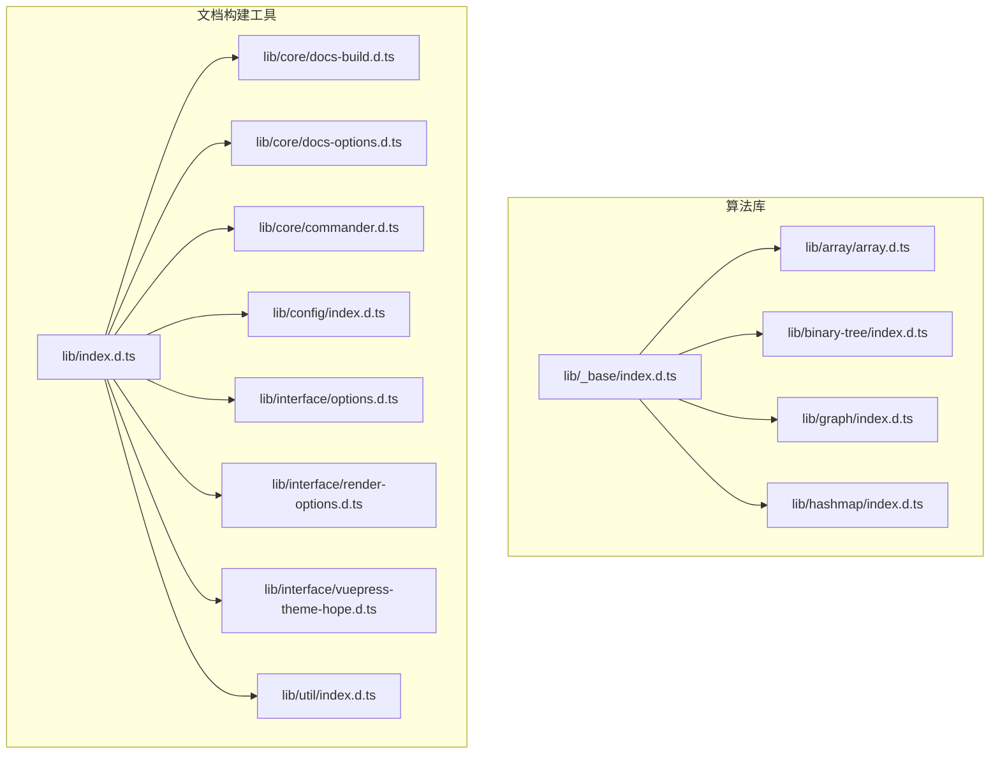
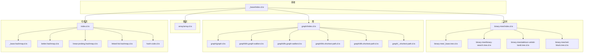
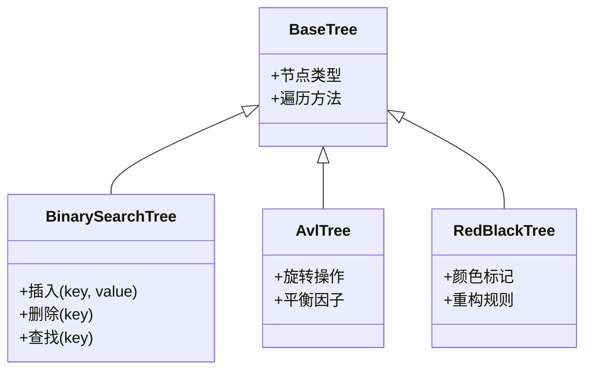
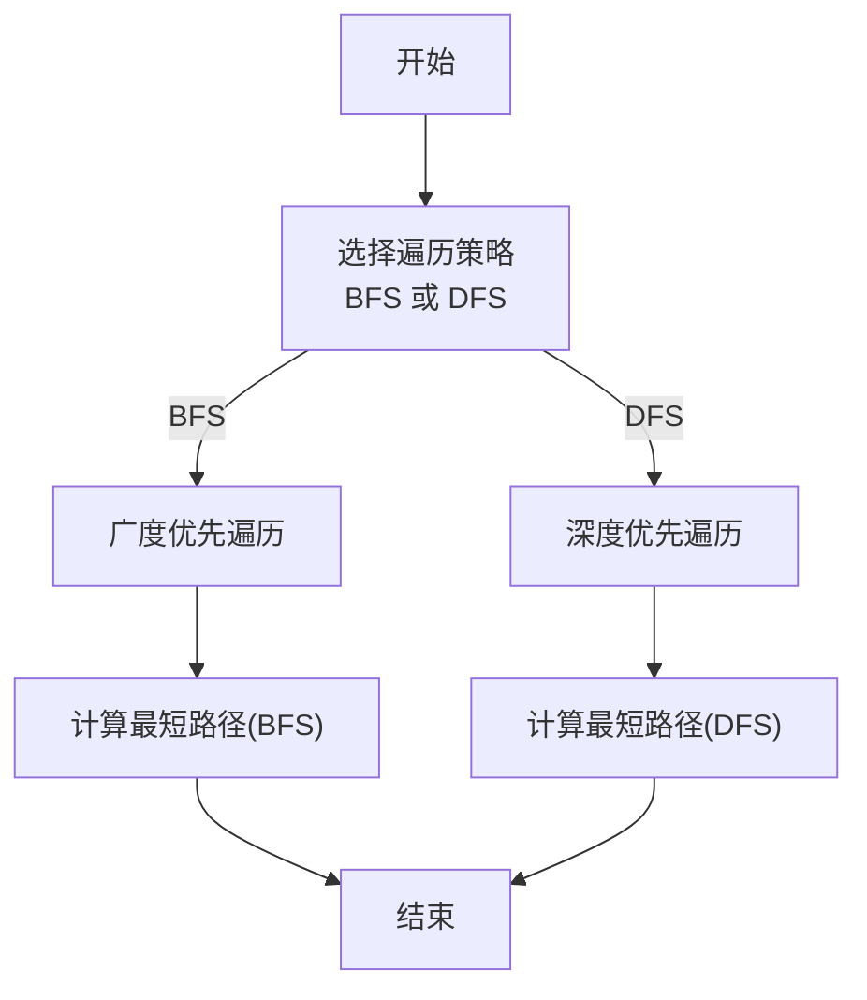
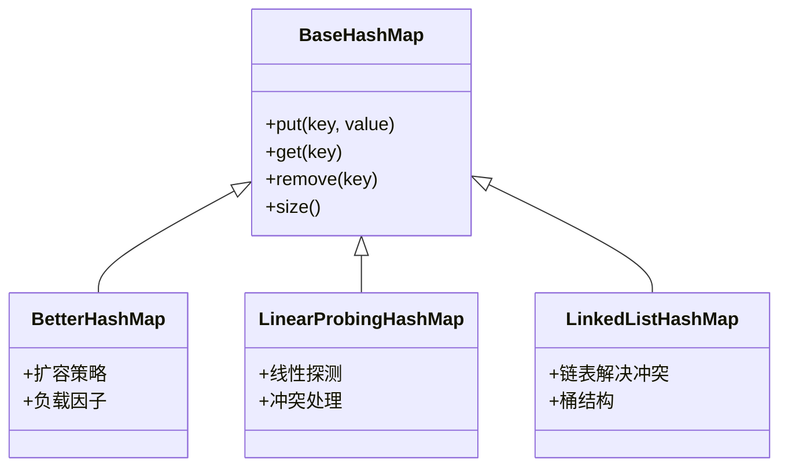
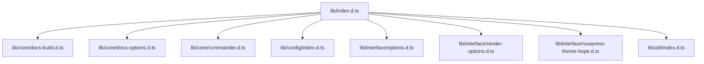
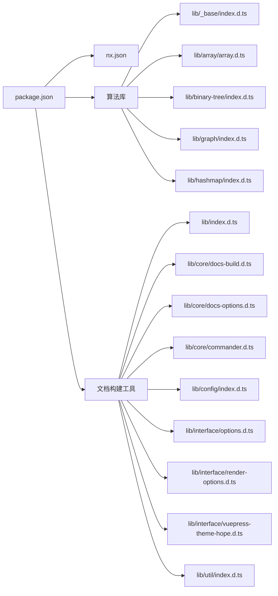

# API参考

<cite>
**本文档引用的文件**
- [packages/algorithm/lib/_base/index.d.ts](file://packages/algorithm/lib/_base/index.d.ts)
- [packages/algorithm/lib/array/array.d.ts](file://packages/algorithm/lib/array/array.d.ts)
- [packages/algorithm/lib/binary-tree/_base.tree.d.ts](file://packages/algorithm/lib/binary-tree/_base.tree.d.ts)
- [packages/algorithm/lib/binary-tree/binary-search.tree.d.ts](file://packages/algorithm/lib/binary-tree/binary-search.tree.d.ts)
- [packages/algorithm/lib/binary-tree/adelson-velskii-landi.tree.d.ts](file://packages/algorithm/lib/binary-tree/adelson-velskii-landi.tree.d.ts)
- [packages/algorithm/lib/binary-tree/red-black.tree.d.ts](file://packages/algorithm/lib/binary-tree/red-black.tree.d.ts)
- [packages/algorithm/lib/binary-tree/index.d.ts](file://packages/algorithm/lib/binary-tree/index.d.ts)
- [packages/algorithm/lib/graph/graph.d.ts](file://packages/algorithm/lib/graph/graph.d.ts)
- [packages/algorithm/lib/graph/bfs.graph-walker.d.ts](file://packages/algorithm/lib/graph/bfs.graph-walker.d.ts)
- [packages/algorithm/lib/graph/dfs.graph-walker.d.ts](file://packages/algorithm/lib/graph/dfs.graph-walker.d.ts)
- [packages/algorithm/lib/graph/bfs.shortest-path.d.ts](file://packages/algorithm/lib/graph/bfs.shortest-path.d.ts)
- [packages/algorithm/lib/graph/dfs.shortest-path.d.ts](file://packages/algorithm/lib/graph/dfs.shortest-path.d.ts)
- [packages/algorithm/lib/graph/_.shortest-path.d.ts](file://packages/algorithm/lib/graph/_.shortest-path.d.ts)
- [packages/algorithm/lib/graph/index.d.ts](file://packages/algorithm/lib/graph/index.d.ts)
- [packages/algorithm/lib/hashmap/_base.hashmap.d.ts](file://packages/algorithm/lib/hashmap/_base.hashmap.d.ts)
- [packages/algorithm/lib/hashmap/better.hashmap.d.ts](file://packages/algorithm/lib/hashmap/better.hashmap.d.ts)
- [packages/algorithm/lib/hashmap/linear-probing.hashmap.d.ts](file://packages/algorithm/lib/hashmap/linear-probing.hashmap.d.ts)
- [packages/algorithm/lib/hashmap/linked-list.hashmap.d.ts](file://packages/algorithm/lib/hashmap/linked-list.hashmap.d.ts)
- [packages/algorithm/lib/hashmap/hash-code.d.ts](file://packages/algorithm/lib/hashmap/hash-code.d.ts)
- [packages/algorithm/lib/hashmap/index.d.ts](file://packages/algorithm/lib/hashmap/index.d.ts)
- [packages/docs-build/lib/index.d.ts](file://packages/docs-build/lib/index.d.ts)
- [packages/docs-build/lib/core/docs-build.d.ts](file://packages/docs-build/lib/core/docs-build.d.ts)
- [packages/docs-build/lib/core/docs-options.d.ts](file://packages/docs-build/lib/core/docs-options.d.ts)
- [packages/docs-build/lib/core/commander.d.ts](file://packages/docs-build/lib/core/commander.d.ts)
- [packages/docs-build/lib/config/index.d.ts](file://packages/docs-build/lib/config/index.d.ts)
- [packages/docs-build/lib/interface/options.d.ts](file://packages/docs-build/lib/interface/options.d.ts)
- [packages/docs-build/lib/interface/render-options.d.ts](file://packages/docs-build/lib/interface/render-options.d.ts)
- [packages/docs-build/lib/interface/vuepress-theme-hope.d.ts](file://packages/docs-build/lib/interface/vuepress-theme-hope.d.ts)
- [packages/docs-build/lib/util/index.d.ts](file://packages/docs-build/lib/util/index.d.ts)
- [packages/docs-build/src/bin/docs-build.ts](file://packages/docs-build/src/bin/docs-build.ts)
- [packages/docs-build/src/core/docs-build.ts](file://packages/docs-build/src/core/docs-build.ts)
- [packages/docs-build/src/core/docs-options.ts](file://packages/docs-build/src/core/docs-options.ts)
- [packages/docs-build/src/core/commander.ts](file://packages/docs-build/src/core/commander.ts)
- [packages/docs-build/src/config/index.ts](file://packages/docs-build/src/config/index.ts)
- [package.json](file://package.json)
- [nx.json](file://nx.json)
- [README.md](file://README.md)
- [README.zh-CN.md](file://README.zh-CN.md)
</cite>

## 目录
1. [简介](#简介)
2. [项目结构](#项目结构)
3. [核心组件](#核心组件)
4. [架构总览](#架构总览)
5. [详细组件分析](#详细组件分析)
6. [依赖分析](#依赖分析)
7. [性能考虑](#性能考虑)
8. [故障排除指南](#故障排除指南)
9. [结论](#结论)
10. [附录](#附录)

## 简介
本API参考面向HZ 9 Tool项目中的算法库与文档构建工具，系统性梳理两类模块的公共接口、类型定义、类与方法签名、参数与返回值约定，并提供使用示例的路径指引、版本兼容性与迁移建议、以及索引与交叉引用说明。读者可据此快速定位所需功能并正确集成到自身项目中。

## 项目结构
项目采用Nx工作区组织，核心模块分为：
- 算法库（packages/algorithm）：提供数组、二叉树、图、哈希表等基础数据结构与算法的类型定义与实现入口。
- 文档构建工具（packages/docs-build）：提供命令行入口、构建流程、配置接口、渲染选项与主题接口等。



图表来源
- [packages/algorithm/lib/_base/index.d.ts:1-200](file://packages/algorithm/lib/_base/index.d.ts#L1-L200)
- [packages/algorithm/lib/array/array.d.ts:1-200](file://packages/algorithm/lib/array/array.d.ts#L1-L200)
- [packages/algorithm/lib/binary-tree/index.d.ts:1-200](file://packages/algorithm/lib/binary-tree/index.d.ts#L1-L200)
- [packages/algorithm/lib/graph/index.d.ts:1-200](file://packages/algorithm/lib/graph/index.d.ts#L1-L200)
- [packages/algorithm/lib/hashmap/index.d.ts:1-200](file://packages/algorithm/lib/hashmap/index.d.ts#L1-L200)
- [packages/docs-build/lib/index.d.ts:1-200](file://packages/docs-build/lib/index.d.ts#L1-L200)
- [packages/docs-build/lib/core/docs-build.d.ts:1-200](file://packages/docs-build/lib/core/docs-build.d.ts#L1-L200)
- [packages/docs-build/lib/core/docs-options.d.ts:1-200](file://packages/docs-build/lib/core/docs-options.d.ts#L1-L200)
- [packages/docs-build/lib/core/commander.d.ts:1-200](file://packages/docs-build/lib/core/commander.d.ts#L1-L200)
- [packages/docs-build/lib/config/index.d.ts:1-200](file://packages/docs-build/lib/config/index.d.ts#L1-L200)
- [packages/docs-build/lib/interface/options.d.ts:1-200](file://packages/docs-build/lib/interface/options.d.ts#L1-L200)
- [packages/docs-build/lib/interface/render-options.d.ts:1-200](file://packages/docs-build/lib/interface/render-options.d.ts#L1-L200)
- [packages/docs-build/lib/interface/vuepress-theme-hope.d.ts:1-200](file://packages/docs-build/lib/interface/vuepress-theme-hope.d.ts#L1-L200)
- [packages/docs-build/lib/util/index.d.ts:1-200](file://packages/docs-build/lib/util/index.d.ts#L1-L200)

章节来源
- [package.json:1-200](file://package.json#L1-L200)
- [nx.json:1-200](file://nx.json#L1-L200)

## 核心组件
本节概述两大模块的公共API与职责边界：
- 算法库：提供数据结构与算法的类型定义与实现入口，便于在上层业务中直接调用。
- 文档构建工具：提供命令行入口、构建流程、配置与渲染选项、主题接口与工具函数。

章节来源
- [packages/algorithm/lib/_base/index.d.ts:1-200](file://packages/algorithm/lib/_base/index.d.ts#L1-L200)
- [packages/docs-build/lib/index.d.ts:1-200](file://packages/docs-build/lib/index.d.ts#L1-L200)

## 架构总览
下图展示了文档构建工具从命令行到核心构建器再到配置与渲染选项的整体调用链：

```mermaid
sequenceDiagram
participant CLI as "命令行入口<br/>src/bin/docs-build.ts"
participant CMD as "命令解析器<br/>src/core/commander.ts"
participant OPT as "构建选项<br/>src/core/docs-options.ts"
participant CORE as "构建器<br/>src/core/docs-build.ts"
participant CFG as "配置加载<br/>src/config/index.ts"
CLI->>CMD : 解析命令行参数
CMD->>OPT : 生成构建选项
OPT->>CORE : 初始化构建器
CORE->>CFG : 加载配置
CFG-->>CORE : 返回配置对象
CORE-->>CLI : 输出构建结果
```

图表来源
- [packages/docs-build/src/bin/docs-build.ts:1-200](file://packages/docs-build/src/bin/docs-build.ts#L1-L200)
- [packages/docs-build/src/core/commander.ts:1-200](file://packages/docs-build/src/core/commander.ts#L1-L200)
- [packages/docs-build/src/core/docs-options.ts:1-200](file://packages/docs-build/src/core/docs-options.ts#L1-L200)
- [packages/docs-build/src/core/docs-build.ts:1-200](file://packages/docs-build/src/core/docs-build.ts#L1-L200)
- [packages/docs-build/src/config/index.ts:1-200](file://packages/docs-build/src/config/index.ts#L1-L200)

## 详细组件分析

### 算法库API总览
算法库以“基础模块 + 功能子模块”的方式组织，基础模块提供通用类型与抽象，各功能模块（数组、二叉树、图、哈希表）在各自目录下提供具体实现与导出入口。



图表来源
- [packages/algorithm/lib/_base/index.d.ts:1-200](file://packages/algorithm/lib/_base/index.d.ts#L1-L200)
- [packages/algorithm/lib/array/array.d.ts:1-200](file://packages/algorithm/lib/array/array.d.ts#L1-L200)
- [packages/algorithm/lib/binary-tree/_base.tree.d.ts:1-200](file://packages/algorithm/lib/binary-tree/_base.tree.d.ts#L1-L200)
- [packages/algorithm/lib/binary-tree/binary-search.tree.d.ts:1-200](file://packages/algorithm/lib/binary-tree/binary-search.tree.d.ts#L1-L200)
- [packages/algorithm/lib/binary-tree/adelson-velskii-landi.tree.d.ts:1-200](file://packages/algorithm/lib/binary-tree/adelson-velskii-landi.tree.d.ts#L1-L200)
- [packages/algorithm/lib/binary-tree/red-black.tree.d.ts:1-200](file://packages/algorithm/lib/binary-tree/red-black.tree.d.ts#L1-L200)
- [packages/algorithm/lib/binary-tree/index.d.ts:1-200](file://packages/algorithm/lib/binary-tree/index.d.ts#L1-L200)
- [packages/algorithm/lib/graph/graph.d.ts:1-200](file://packages/algorithm/lib/graph/graph.d.ts#L1-L200)
- [packages/algorithm/lib/graph/bfs.graph-walker.d.ts:1-200](file://packages/algorithm/lib/graph/bfs.graph-walker.d.ts#L1-L200)
- [packages/algorithm/lib/graph/dfs.graph-walker.d.ts:1-200](file://packages/algorithm/lib/graph/dfs.graph-walker.d.ts#L1-L200)
- [packages/algorithm/lib/graph/bfs.shortest-path.d.ts:1-200](file://packages/algorithm/lib/graph/bfs.shortest-path.d.ts#L1-L200)
- [packages/algorithm/lib/graph/dfs.shortest-path.d.ts:1-200](file://packages/algorithm/lib/graph/dfs.shortest-path.d.ts#L1-L200)
- [packages/algorithm/lib/graph/_.shortest-path.d.ts:1-200](file://packages/algorithm/lib/graph/_.shortest-path.d.ts#L1-L200)
- [packages/algorithm/lib/graph/index.d.ts:1-200](file://packages/algorithm/lib/graph/index.d.ts#L1-L200)
- [packages/algorithm/lib/hashmap/_base.hashmap.d.ts:1-200](file://packages/algorithm/lib/hashmap/_base.hashmap.d.ts#L1-L200)
- [packages/algorithm/lib/hashmap/better.hashmap.d.ts:1-200](file://packages/algorithm/lib/hashmap/better.hashmap.d.ts#L1-L200)
- [packages/algorithm/lib/hashmap/linear-probing.hashmap.d.ts:1-200](file://packages/algorithm/lib/hashmap/linear-probing.hashmap.d.ts#L1-L200)
- [packages/algorithm/lib/hashmap/linked-list.hashmap.d.ts:1-200](file://packages/algorithm/lib/hashmap/linked-list.hashmap.d.ts#L1-L200)
- [packages/algorithm/lib/hashmap/hash-code.d.ts:1-200](file://packages/algorithm/lib/hashmap/hash-code.d.ts#L1-L200)
- [packages/algorithm/lib/hashmap/index.d.ts:1-200](file://packages/algorithm/lib/hashmap/index.d.ts#L1-L200)

#### 数组模块
- 模块入口：[packages/algorithm/lib/array/array.d.ts:1-200](file://packages/algorithm/lib/array/array.d.ts#L1-L200)
- 主要职责：提供数组相关的数据结构与算法操作的类型定义与实现入口。
- 使用示例路径：请参考该文件中的导出项与注释说明，结合上层业务进行调用。

章节来源
- [packages/algorithm/lib/array/array.d.ts:1-200](file://packages/algorithm/lib/array/array.d.ts#L1-L200)

#### 二叉搜索树模块
- 基础树定义：[packages/algorithm/lib/binary-tree/_base.tree.d.ts:1-200](file://packages/algorithm/lib/binary-tree/_base.tree.d.ts#L1-L200)
- 二叉搜索树实现：[packages/algorithm/lib/binary-tree/binary-search.tree.d.ts:1-200](file://packages/algorithm/lib/binary-tree/binary-search.tree.d.ts#L1-L200)
- AVL树实现：[packages/algorithm/lib/binary-tree/adelson-velskii-landi.tree.d.ts:1-200](file://packages/algorithm/lib/binary-tree/adelson-velskii-landi.tree.d.ts#L1-L200)
- 红黑树实现：[packages/algorithm/lib/binary-tree/red-black.tree.d.ts:1-200](file://packages/algorithm/lib/binary-tree/red-black.tree.d.ts#L1-L200)
- 模块入口：[packages/algorithm/lib/binary-tree/index.d.ts:1-200](file://packages/algorithm/lib/binary-tree/index.d.ts#L1-L200)



图表来源
- [packages/algorithm/lib/binary-tree/_base.tree.d.ts:1-200](file://packages/algorithm/lib/binary-tree/_base.tree.d.ts#L1-L200)
- [packages/algorithm/lib/binary-tree/binary-search.tree.d.ts:1-200](file://packages/algorithm/lib/binary-tree/binary-search.tree.d.ts#L1-L200)
- [packages/algorithm/lib/binary-tree/adelson-velskii-landi.tree.d.ts:1-200](file://packages/algorithm/lib/binary-tree/adelson-velskii-landi.tree.d.ts#L1-L200)
- [packages/algorithm/lib/binary-tree/red-black.tree.d.ts:1-200](file://packages/algorithm/lib/binary-tree/red-black.tree.d.ts#L1-L200)

章节来源
- [packages/algorithm/lib/binary-tree/_base.tree.d.ts:1-200](file://packages/algorithm/lib/binary-tree/_base.tree.d.ts#L1-L200)
- [packages/algorithm/lib/binary-tree/binary-search.tree.d.ts:1-200](file://packages/algorithm/lib/binary-tree/binary-search.tree.d.ts#L1-L200)
- [packages/algorithm/lib/binary-tree/adelson-velskii-landi.tree.d.ts:1-200](file://packages/algorithm/lib/binary-tree/adelson-velskii-landi.tree.d.ts#L1-L200)
- [packages/algorithm/lib/binary-tree/red-black.tree.d.ts:1-200](file://packages/algorithm/lib/binary-tree/red-black.tree.d.ts#L1-L200)
- [packages/algorithm/lib/binary-tree/index.d.ts:1-200](file://packages/algorithm/lib/binary-tree/index.d.ts#L1-L200)

#### 图模块
- 图定义：[packages/algorithm/lib/graph/graph.d.ts:1-200](file://packages/algorithm/lib/graph/graph.d.ts#L1-L200)
- 广度优先遍历：[packages/algorithm/lib/graph/bfs.graph-walker.d.ts:1-200](file://packages/algorithm/lib/graph/bfs.graph-walker.d.ts#L1-L200)
- 深度优先遍历：[packages/algorithm/lib/graph/dfs.graph-walker.d.ts:1-200](file://packages/algorithm/lib/graph/dfs.graph-walker.d.ts#L1-L200)
- 最短路径（BFS）：[packages/algorithm/lib/graph/bfs.shortest-path.d.ts:1-200](file://packages/algorithm/lib/graph/bfs.shortest-path.d.ts#L1-L200)
- 最短路径（DFS）：[packages/algorithm/lib/graph/dfs.shortest-path.d.ts:1-200](file://packages/algorithm/lib/graph/dfs.shortest-path.d.ts#L1-L200)
- 最短路径通用接口：[packages/algorithm/lib/graph/_.shortest-path.d.ts:1-200](file://packages/algorithm/lib/graph/_.shortest-path.d.ts#L1-L200)
- 模块入口：[packages/algorithm/lib/graph/index.d.ts:1-200](file://packages/algorithm/lib/graph/index.d.ts#L1-L200)



图表来源
- [packages/algorithm/lib/graph/bfs.graph-walker.d.ts:1-200](file://packages/algorithm/lib/graph/bfs.graph-walker.d.ts#L1-L200)
- [packages/algorithm/lib/graph/dfs.graph-walker.d.ts:1-200](file://packages/algorithm/lib/graph/dfs.graph-walker.d.ts#L1-L200)
- [packages/algorithm/lib/graph/bfs.shortest-path.d.ts:1-200](file://packages/algorithm/lib/graph/bfs.shortest-path.d.ts#L1-L200)
- [packages/algorithm/lib/graph/dfs.shortest-path.d.ts:1-200](file://packages/algorithm/lib/graph/dfs.shortest-path.d.ts#L1-L200)
- [packages/algorithm/lib/graph/_.shortest-path.d.ts:1-200](file://packages/algorithm/lib/graph/_.shortest-path.d.ts#L1-L200)

章节来源
- [packages/algorithm/lib/graph/graph.d.ts:1-200](file://packages/algorithm/lib/graph/graph.d.ts#L1-L200)
- [packages/algorithm/lib/graph/bfs.graph-walker.d.ts:1-200](file://packages/algorithm/lib/graph/bfs.graph-walker.d.ts#L1-L200)
- [packages/algorithm/lib/graph/dfs.graph-walker.d.ts:1-200](file://packages/algorithm/lib/graph/dfs.graph-walker.d.ts#L1-L200)
- [packages/algorithm/lib/graph/bfs.shortest-path.d.ts:1-200](file://packages/algorithm/lib/graph/bfs.shortest-path.d.ts#L1-L200)
- [packages/algorithm/lib/graph/dfs.shortest-path.d.ts:1-200](file://packages/algorithm/lib/graph/dfs.shortest-path.d.ts#L1-L200)
- [packages/algorithm/lib/graph/_.shortest-path.d.ts:1-200](file://packages/algorithm/lib/graph/_.shortest-path.d.ts#L1-L200)
- [packages/algorithm/lib/graph/index.d.ts:1-200](file://packages/algorithm/lib/graph/index.d.ts#L1-L200)

#### 哈希表模块
- 基础哈希表：[packages/algorithm/lib/hashmap/_base.hashmap.d.ts:1-200](file://packages/algorithm/lib/hashmap/_base.hashmap.d.ts#L1-L200)
- 改进实现：[packages/algorithm/lib/hashmap/better.hashmap.d.ts:1-200](file://packages/algorithm/lib/hashmap/better.hashmap.d.ts#L1-L200)
- 线性探测：[packages/algorithm/lib/hashmap/linear-probing.hashmap.d.ts:1-200](file://packages/algorithm/lib/hashmap/linear-probing.hashmap.d.ts#L1-L200)
- 链式地址：[packages/algorithm/lib/hashmap/linked-list.hashmap.d.ts:1-200](file://packages/algorithm/lib/hashmap/linked-list.hashmap.d.ts#L1-L200)
- 哈希函数：[packages/algorithm/lib/hashmap/hash-code.d.ts:1-200](file://packages/algorithm/lib/hashmap/hash-code.d.ts#L1-L200)
- 模块入口：[packages/algorithm/lib/hashmap/index.d.ts:1-200](file://packages/algorithm/lib/hashmap/index.d.ts#L1-L200)



图表来源
- [packages/algorithm/lib/hashmap/_base.hashmap.d.ts:1-200](file://packages/algorithm/lib/hashmap/_base.hashmap.d.ts#L1-L200)
- [packages/algorithm/lib/hashmap/better.hashmap.d.ts:1-200](file://packages/algorithm/lib/hashmap/better.hashmap.d.ts#L1-L200)
- [packages/algorithm/lib/hashmap/linear-probing.hashmap.d.ts:1-200](file://packages/algorithm/lib/hashmap/linear-probing.hashmap.d.ts#L1-L200)
- [packages/algorithm/lib/hashmap/linked-list.hashmap.d.ts:1-200](file://packages/algorithm/lib/hashmap/linked-list.hashmap.d.ts#L1-L200)
- [packages/algorithm/lib/hashmap/hash-code.d.ts:1-200](file://packages/algorithm/lib/hashmap/hash-code.d.ts#L1-L200)

章节来源
- [packages/algorithm/lib/hashmap/_base.hashmap.d.ts:1-200](file://packages/algorithm/lib/hashmap/_base.hashmap.d.ts#L1-L200)
- [packages/algorithm/lib/hashmap/better.hashmap.d.ts:1-200](file://packages/algorithm/lib/hashmap/better.hashmap.d.ts#L1-L200)
- [packages/algorithm/lib/hashmap/linear-probing.hashmap.d.ts:1-200](file://packages/algorithm/lib/hashmap/linear-probing.hashmap.d.ts#L1-L200)
- [packages/algorithm/lib/hashmap/linked-list.hashmap.d.ts:1-200](file://packages/algorithm/lib/hashmap/linked-list.hashmap.d.ts#L1-L200)
- [packages/algorithm/lib/hashmap/hash-code.d.ts:1-200](file://packages/algorithm/lib/hashmap/hash-code.d.ts#L1-L200)
- [packages/algorithm/lib/hashmap/index.d.ts:1-200](file://packages/algorithm/lib/hashmap/index.d.ts#L1-L200)

### 文档构建工具API总览
文档构建工具提供命令行入口、构建器、选项解析、配置加载与渲染选项等模块化能力。



图表来源
- [packages/docs-build/lib/index.d.ts:1-200](file://packages/docs-build/lib/index.d.ts#L1-L200)
- [packages/docs-build/lib/core/docs-build.d.ts:1-200](file://packages/docs-build/lib/core/docs-build.d.ts#L1-L200)
- [packages/docs-build/lib/core/docs-options.d.ts:1-200](file://packages/docs-build/lib/core/docs-options.d.ts#L1-L200)
- [packages/docs-build/lib/core/commander.d.ts:1-200](file://packages/docs-build/lib/core/commander.d.ts#L1-L200)
- [packages/docs-build/lib/config/index.d.ts:1-200](file://packages/docs-build/lib/config/index.d.ts#L1-L200)
- [packages/docs-build/lib/interface/options.d.ts:1-200](file://packages/docs-build/lib/interface/options.d.ts#L1-L200)
- [packages/docs-build/lib/interface/render-options.d.ts:1-200](file://packages/docs-build/lib/interface/render-options.d.ts#L1-L200)
- [packages/docs-build/lib/interface/vuepress-theme-hope.d.ts:1-200](file://packages/docs-build/lib/interface/vuepress-theme-hope.d.ts#L1-L200)
- [packages/docs-build/lib/util/index.d.ts:1-200](file://packages/docs-build/lib/util/index.d.ts#L1-L200)

#### 命令行入口
- 入口文件：[packages/docs-build/src/bin/docs-build.ts:1-200](file://packages/docs-build/src/bin/docs-build.ts#L1-L200)
- 职责：解析用户输入、触发构建流程。

章节来源
- [packages/docs-build/src/bin/docs-build.ts:1-200](file://packages/docs-build/src/bin/docs-build.ts#L1-L200)

#### 命令解析器
- 文件：[packages/docs-build/src/core/commander.ts:1-200](file://packages/docs-build/src/core/commander.ts#L1-L200)
- 职责：将命令行参数转换为内部可执行的指令集。

章节来源
- [packages/docs-build/src/core/commander.ts:1-200](file://packages/docs-build/src/core/commander.ts#L1-L200)

#### 构建选项
- 文件：[packages/docs-build/src/core/docs-options.ts:1-200](file://packages/docs-build/src/core/docs-options.ts#L1-L200)
- 职责：定义构建所需的选项集合与默认值。

章节来源
- [packages/docs-build/src/core/docs-options.ts:1-200](file://packages/docs-build/src/core/docs-options.ts#L1-L200)

#### 构建器
- 文件：[packages/docs-build/src/core/docs-build.ts:1-200](file://packages/docs-build/src/core/docs-build.ts#L1-L200)
- 职责：协调配置加载、渲染与输出。

章节来源
- [packages/docs-build/src/core/docs-build.ts:1-200](file://packages/docs-build/src/core/docs-build.ts#L1-L200)

#### 配置加载
- 文件：[packages/docs-build/src/config/index.ts:1-200](file://packages/docs-build/src/config/index.ts#L1-L200)
- 职责：读取并合并用户配置，提供统一配置对象。

章节来源
- [packages/docs-build/src/config/index.ts:1-200](file://packages/docs-build/src/config/index.ts#L1-L200)

#### 接口定义
- 构建选项接口：[packages/docs-build/lib/interface/options.d.ts:1-200](file://packages/docs-build/lib/interface/options.d.ts#L1-L200)
- 渲染选项接口：[packages/docs-build/lib/interface/render-options.d.ts:1-200](file://packages/docs-build/lib/interface/render-options.d.ts#L1-L200)
- VuePress主题接口：[packages/docs-build/lib/interface/vuepress-theme-hope.d.ts:1-200](file://packages/docs-build/lib/interface/vuepress-theme-hope.d.ts#L1-L200)

章节来源
- [packages/docs-build/lib/interface/options.d.ts:1-200](file://packages/docs-build/lib/interface/options.d.ts#L1-L200)
- [packages/docs-build/lib/interface/render-options.d.ts:1-200](file://packages/docs-build/lib/interface/render-options.d.ts#L1-L200)
- [packages/docs-build/lib/interface/vuepress-theme-hope.d.ts:1-200](file://packages/docs-build/lib/interface/vuepress-theme-hope.d.ts#L1-L200)

#### 工具函数
- 文件：[packages/docs-build/lib/util/index.d.ts:1-200](file://packages/docs-build/lib/util/index.d.ts#L1-L200)
- 职责：提供构建过程中的辅助工具函数。

章节来源
- [packages/docs-build/lib/util/index.d.ts:1-200](file://packages/docs-build/lib/util/index.d.ts#L1-L200)

## 依赖分析
- 算法库内部模块通过基础模块向上聚合，形成清晰的层次结构。
- 文档构建工具内部模块通过入口文件统一导出，便于外部按需引入。
- 工作区通过Nx进行多包管理，确保包间依赖与构建顺序一致。



图表来源
- [package.json:1-200](file://package.json#L1-L200)
- [nx.json:1-200](file://nx.json#L1-L200)
- [packages/algorithm/lib/_base/index.d.ts:1-200](file://packages/algorithm/lib/_base/index.d.ts#L1-L200)
- [packages/algorithm/lib/array/array.d.ts:1-200](file://packages/algorithm/lib/array/array.d.ts#L1-L200)
- [packages/algorithm/lib/binary-tree/index.d.ts:1-200](file://packages/algorithm/lib/binary-tree/index.d.ts#L1-L200)
- [packages/algorithm/lib/graph/index.d.ts:1-200](file://packages/algorithm/lib/graph/index.d.ts#L1-L200)
- [packages/algorithm/lib/hashmap/index.d.ts:1-200](file://packages/algorithm/lib/hashmap/index.d.ts#L1-L200)
- [packages/docs-build/lib/index.d.ts:1-200](file://packages/docs-build/lib/index.d.ts#L1-L200)
- [packages/docs-build/lib/core/docs-build.d.ts:1-200](file://packages/docs-build/lib/core/docs-build.d.ts#L1-L200)
- [packages/docs-build/lib/core/docs-options.d.ts:1-200](file://packages/docs-build/lib/core/docs-options.d.ts#L1-L200)
- [packages/docs-build/lib/core/commander.d.ts:1-200](file://packages/docs-build/lib/core/commander.d.ts#L1-L200)
- [packages/docs-build/lib/config/index.d.ts:1-200](file://packages/docs-build/lib/config/index.d.ts#L1-L200)
- [packages/docs-build/lib/interface/options.d.ts:1-200](file://packages/docs-build/lib/interface/options.d.ts#L1-L200)
- [packages/docs-build/lib/interface/render-options.d.ts:1-200](file://packages/docs-build/lib/interface/render-options.d.ts#L1-L200)
- [packages/docs-build/lib/interface/vuepress-theme-hope.d.ts:1-200](file://packages/docs-build/lib/interface/vuepress-theme-hope.d.ts#L1-L200)
- [packages/docs-build/lib/util/index.d.ts:1-200](file://packages/docs-build/lib/util/index.d.ts#L1-L200)

章节来源
- [package.json:1-200](file://package.json#L1-L200)
- [nx.json:1-200](file://nx.json#L1-L200)

## 性能考虑
- 算法库：优先选择适合场景的数据结构与算法（如二叉搜索树、AVL树、红黑树），根据访问模式选择合适的哈希表实现（线性探测或链式地址），以降低冲突与提升查询效率。
- 文档构建工具：合理设置构建选项与缓存策略，避免重复计算；在大规模文档场景下，分批处理与增量构建可显著减少构建时间。

## 故障排除指南
- 命令行参数错误：检查命令解析器对参数的映射是否正确，确认构建选项与配置文件的兼容性。
- 配置加载失败：核对配置文件格式与键名，确保与接口定义一致。
- 渲染异常：检查渲染选项与主题接口的实现，确保与目标静态站点生成器兼容。

章节来源
- [packages/docs-build/src/core/commander.ts:1-200](file://packages/docs-build/src/core/commander.ts#L1-L200)
- [packages/docs-build/src/core/docs-options.ts:1-200](file://packages/docs-build/src/core/docs-options.ts#L1-L200)
- [packages/docs-build/src/config/index.ts:1-200](file://packages/docs-build/src/config/index.ts#L1-L200)
- [packages/docs-build/lib/interface/render-options.d.ts:1-200](file://packages/docs-build/lib/interface/render-options.d.ts#L1-L200)
- [packages/docs-build/lib/interface/vuepress-theme-hope.d.ts:1-200](file://packages/docs-build/lib/interface/vuepress-theme-hope.d.ts#L1-L200)

## 结论
本API参考系统梳理了HZ 9 Tool项目中算法库与文档构建工具的公共接口与模块关系，提供了类型定义、类与方法的职责说明、参数与返回值约定，以及使用示例的路径指引。建议在实际开发中结合具体文件注释与示例路径进行深入学习与实践。

## 附录
- 版本兼容性与迁移指南：请参考项目根目录下的变更日志与发布脚本，关注主要版本更新时的破坏性变更提示与迁移步骤。
- 索引与交叉引用：算法库与文档构建工具均通过模块入口统一导出，便于在上层业务中按需引入与组合使用。

章节来源
- [README.md:1-200](file://README.md#L1-L200)
- [README.zh-CN.md:1-200](file://README.zh-CN.md#L1-L200)