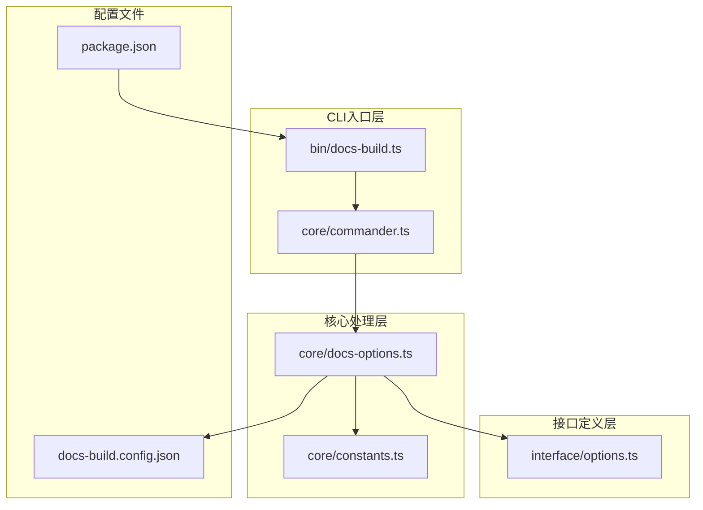
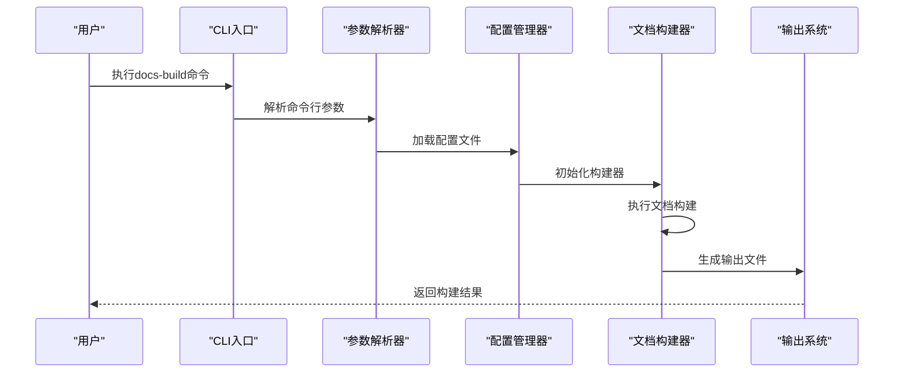
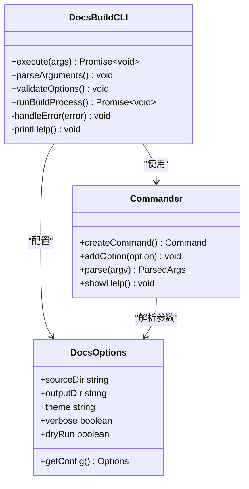
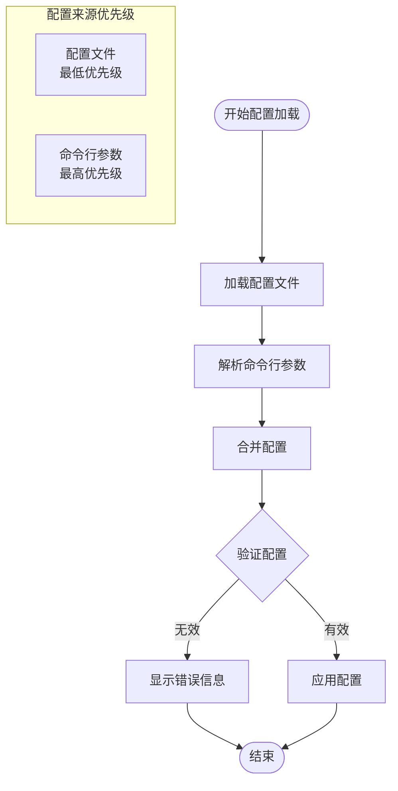
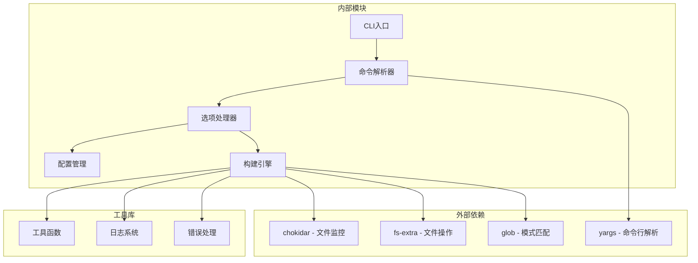

# CLI命令行接口

<cite>
**本文档引用的文件**
- [packages/docs-build/src/bin/docs-build.ts](file://packages/docs-build/src/bin/docs-build.ts)
- [packages/docs-build/src/core/commander.ts](file://packages/docs-build/src/core/commander.ts)
- [packages/docs-build/src/core/docs-options.ts](file://packages/docs-build/src/core/docs-options.ts)
- [packages/docs-build/src/interface/options.ts](file://packages/docs-build/src/interface/options.ts)
- [packages/docs-build/src/core/constants.ts](file://packages/docs-build/src/core/constants.ts)
- [packages/docs-build/package.json](file://packages/docs-build/package.json)
- [packages/docs-build/README.md](file://packages/docs-build/README.md)
- [docs-build.config.json](file://docs-build.config.json)
</cite>

## 目录
1. [简介](#简介)
2. [项目结构](#项目结构)
3. [核心组件](#核心组件)
4. [架构概览](#架构概览)
5. [详细组件分析](#详细组件分析)
6. [依赖关系分析](#依赖关系分析)
7. [性能考虑](#性能考虑)
8. [故障排除指南](#故障排除指南)
9. [结论](#结论)
10. [附录](#附录)

## 简介
HZ 9 Tool文档构建工具提供了一个功能强大的CLI命令行接口，用于自动化生成和管理技术文档。该工具支持多种文档格式转换、内容扫描、主题渲染等功能，适用于本地开发、生产构建以及CI/CD集成等多种场景。

## 项目结构
HZ 9 Tool文档构建工具采用模块化架构设计，主要包含以下核心模块：



**图表来源**
- [packages/docs-build/src/bin/docs-build.ts](file://packages/docs-build/src/bin/docs-build.ts)
- [packages/docs-build/src/core/commander.ts](file://packages/docs-build/src/core/commander.ts)
- [packages/docs-build/src/core/docs-options.ts](file://packages/docs-build/src/core/docs-options.ts)

**章节来源**
- [packages/docs-build/src/bin/docs-build.ts](file://packages/docs-build/src/bin/docs-build.ts)
- [packages/docs-build/src/core/commander.ts](file://packages/docs-build/src/core/commander.ts)
- [packages/docs-build/src/core/docs-options.ts](file://packages/docs-build/src/core/docs-options.ts)

## 核心组件
本节详细介绍HZ 9 Tool文档构建工具CLI命令行接口的核心组件及其功能特性。

### 命令行参数系统
CLI接口提供了完整的参数解析和验证机制，支持多种参数组合以满足不同的使用场景。

### 配置管理
工具支持多种配置方式，包括命令行参数、配置文件和环境变量，具有明确的优先级规则。

### 错误处理机制
内置完善的错误处理和诊断功能，提供详细的错误信息和解决方案建议。

**章节来源**
- [packages/docs-build/src/core/commander.ts](file://packages/docs-build/src/core/commander.ts)
- [packages/docs-build/src/core/docs-options.ts](file://packages/docs-build/src/core/docs-options.ts)
- [packages/docs-build/src/interface/options.ts](file://packages/docs-build/src/interface/options.ts)

## 架构概览
HZ 9 Tool文档构建工具采用分层架构设计，确保了良好的可维护性和扩展性。



**图表来源**
- [packages/docs-build/src/bin/docs-build.ts](file://packages/docs-build/src/bin/docs-build.ts)
- [packages/docs-build/src/core/commander.ts](file://packages/docs-build/src/core/commander.ts)
- [packages/docs-build/src/core/docs-options.ts](file://packages/docs-build/src/core/docs-options.ts)

## 详细组件分析

### CLI入口点分析
CLI入口点负责接收用户输入并协调整个文档构建流程。



**图表来源**
- [packages/docs-build/src/bin/docs-build.ts](file://packages/docs-build/src/bin/docs-build.ts)
- [packages/docs-build/src/core/commander.ts](file://packages/docs-build/src/core/commander.ts)
- [packages/docs-build/src/core/docs-options.ts](file://packages/docs-build/src/core/docs-options.ts)

### 参数解析器组件
参数解析器负责处理所有命令行参数，提供灵活的配置选项。

#### 核心参数选项

| 参数名称 | 短参数 | 类型 | 默认值 | 描述 | 使用场景 |
|---------|--------|------|--------|------|----------|
| --source-dir | -s | string | 当前目录 | 源文档目录路径 | 指定文档源文件位置 |
| --output-dir | -o | string | dist | 输出目录路径 | 指定构建产物输出位置 |
| --theme | -t | string | default | 文档主题名称 | 选择文档显示主题 |
| --verbose | -v | boolean | false | 详细日志模式 | 调试和问题排查 |
| --dry-run | -n | boolean | false | 预览模式 | 测试构建流程 |
| --config | -c | string | docs-build.config.json | 配置文件路径 | 指定自定义配置文件 |

#### 高级参数选项

| 参数名称 | 短参数 | 类型 | 默认值 | 描述 | 使用场景 |
|---------|--------|------|--------|------|----------|
| --port | -p | number | 3000 | 开发服务器端口 | 本地开发调试 |
| --host | -H | string | localhost | 开发服务器主机 | 网络访问配置 |
| --watch | -w | boolean | false | 文件监听模式 | 实时预览更新 |
| --clean | -C | boolean | false | 清理输出目录 | 重新构建清理 |
| --force | -f | boolean | false | 强制覆盖模式 | 覆盖现有文件 |

**章节来源**
- [packages/docs-build/src/core/commander.ts](file://packages/docs-build/src/core/commander.ts)
- [packages/docs-build/src/core/docs-options.ts](file://packages/docs-build/src/core/docs-options.ts)

### 配置管理系统
配置管理系统支持多层配置合并，确保灵活性和一致性。



**图表来源**
- [packages/docs-build/src/core/docs-options.ts](file://packages/docs-build/src/core/docs-options.ts)
- [packages/docs-build/src/core/constants.ts](file://packages/docs-build/src/core/constants.ts)

**章节来源**
- [packages/docs-build/src/core/docs-options.ts](file://packages/docs-build/src/core/docs-options.ts)
- [packages/docs-build/src/core/constants.ts](file://packages/docs-build/src/core/constants.ts)

### 文档构建器组件
文档构建器负责实际的文档处理和生成工作。

#### 支持的文档格式

| 格式类型 | 扩展名 | 描述 | 处理方式 |
|---------|--------|------|----------|
| Markdown | .md | 标准Markdown格式 | 基础语法解析 |
| VuePress | .vue | VuePress组件格式 | 组件编译渲染 |
| TypeScript | .ts | TypeScript源码 | API文档提取 |
| JavaScript | .js | JavaScript源码 | API文档提取 |
| JSON | .json | 配置数据 | 结构化处理 |

#### 主题系统
工具内置多种主题供选择，支持自定义主题开发。

**章节来源**
- [packages/docs-build/src/core/docs-options.ts](file://packages/docs-build/src/core/docs-options.ts)
- [packages/docs-build/src/interface/options.ts](file://packages/docs-build/src/interface/options.ts)

## 依赖关系分析



**图表来源**
- [packages/docs-build/src/bin/docs-build.ts](file://packages/docs-build/src/bin/docs-build.ts)
- [packages/docs-build/src/core/commander.ts](file://packages/docs-build/src/core/commander.ts)
- [packages/docs-build/src/core/docs-options.ts](file://packages/docs-build/src/core/docs-options.ts)

**章节来源**
- [packages/docs-build/package.json](file://packages/docs-build/package.json)

## 性能考虑
HZ 9 Tool文档构建工具在设计时充分考虑了性能优化，提供多种提升构建效率的机制。

### 并行处理
- 多线程文件处理
- 并行API文档提取
- 缓存机制优化

### 内存管理
- 流式文件处理
- 智能内存回收
- 大文件优化

### 构建优化
- 增量构建支持
- 文件变更检测
- 预编译缓存

## 故障排除指南

### 常见错误及解决方案

#### 配置文件错误
**错误现象**: 配置文件解析失败
**可能原因**: JSON格式错误、路径不正确
**解决方法**: 
1. 检查配置文件JSON格式
2. 验证文件路径有效性
3. 使用配置文件示例进行对比

#### 权限错误
**错误现象**: 无法写入输出目录
**可能原因**: 目录权限不足
**解决方法**:
1. 检查输出目录权限
2. 使用管理员权限运行
3. 更改输出目录到有权限的位置

#### 依赖缺失
**错误现象**: 运行时依赖错误
**可能原因**: 依赖包未安装
**解决方法**:
1. 运行包管理器安装依赖
2. 检查Node.js版本兼容性
3. 清理缓存后重新安装

### 调试模式
启用详细日志模式获取更多诊断信息：
```bash
docs-build --verbose
```

### 性能问题排查
- 检查系统资源使用情况
- 分析大型文件处理时间
- 优化配置文件结构

**章节来源**
- [packages/docs-build/src/core/docs-options.ts](file://packages/docs-build/src/core/docs-options.ts)

## 结论
HZ 9 Tool文档构建工具提供了完整、灵活且高效的CLI命令行接口，支持多种使用场景和配置选项。通过合理的参数设计、完善的错误处理机制和性能优化，该工具能够满足从个人开发者到企业级项目的各种文档构建需求。

## 附录

### 完整命令行示例

#### 基础使用
```bash
# 基本构建命令
docs-build

# 指定源目录和输出目录
docs-build -s ./docs -o ./build

# 使用指定主题
docs-build -t vuepress
```

#### 开发环境配置
```bash
# 启用开发服务器
docs-build --watch --port 3000

# 本地预览模式
docs-build --dry-run --verbose
```

#### 生产环境构建
```bash
# 清理后构建
docs-build --clean

# 强制覆盖模式
docs-build --force --clean
```

#### CI/CD集成
```bash
# 在CI环境中构建
docs-build --config .github/workflows/docs-build.config.json

# 静默模式构建
docs-build --quiet
```

### 配置文件示例
```json
{
  "sourceDir": "./docs",
  "outputDir": "./dist",
  "theme": "default",
  "verbose": false,
  "dryRun": false,
  "port": 3000,
  "host": "localhost",
  "watch": false,
  "clean": true,
  "force": false
}
```

### 返回码规范

| 返回码 | 含义 | 说明 |
|--------|------|------|
| 0 | 成功 | 命令执行成功 |
| 1 | 通用错误 | 一般性错误 |
| 2 | 配置错误 | 配置文件或参数错误 |
| 3 | 文件权限错误 | 文件访问权限问题 |
| 4 | 依赖缺失错误 | 缺少必要依赖 |
| 5 | 构建失败 | 文档构建过程中的错误 |

### 最佳实践建议
1. **版本控制**: 将配置文件纳入版本控制
2. **环境隔离**: 使用独立的配置文件区分环境
3. **增量构建**: 利用增量构建提高效率
4. **监控告警**: 在CI/CD中添加构建监控
5. **文档更新**: 及时更新使用文档和示例