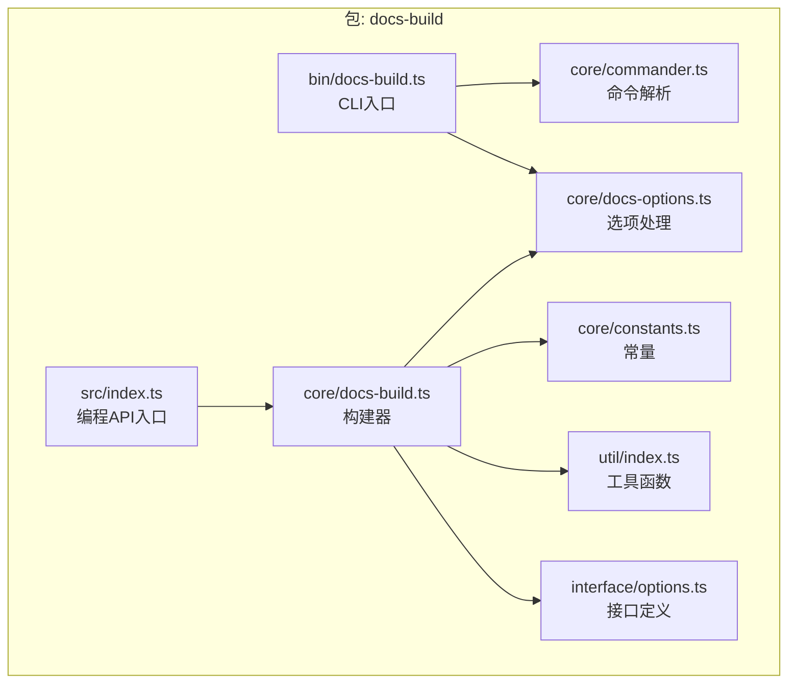
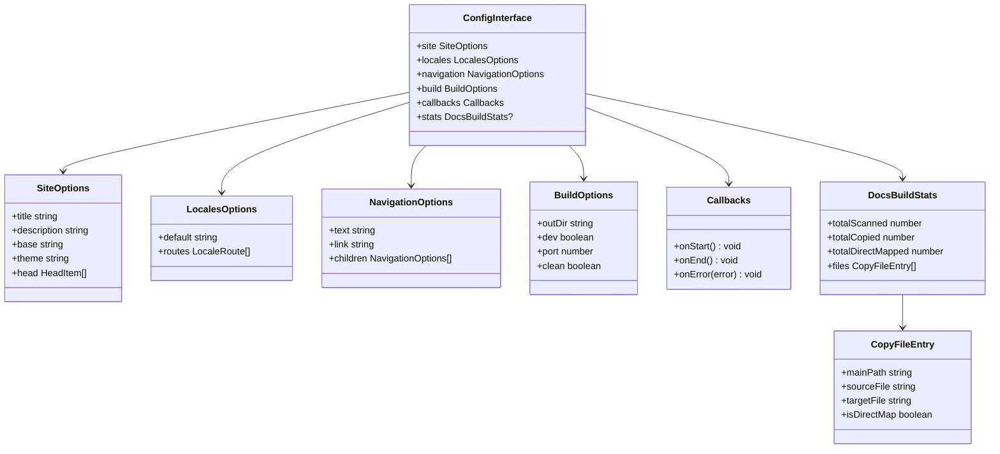
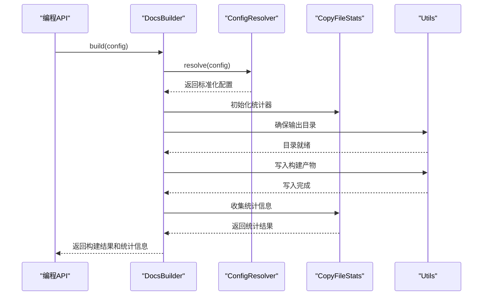
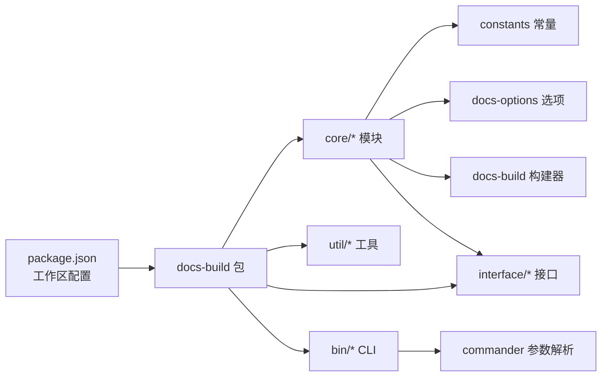

# 文档构建工具API

<cite>
**本文档引用的文件**
- [package.json](file://package.json)
- [nx.json](file://nx.json)
- [packages/docs-build/src/index.ts](file://packages/docs-build/src/index.ts)
- [packages/docs-build/src/bin/docs-build.ts](file://packages/docs-build/src/bin/docs-build.ts)
- [packages/docs-build/src/core/docs-build.ts](file://packages/docs-build/src/core/docs-build.ts)
- [packages/docs-build/src/core/commander.ts](file://packages/docs-build/src/core/commander.ts)
- [packages/docs-build/src/core/docs-options.ts](file://packages/docs-build/src/core/docs-options.ts)
- [packages/docs-build/src/core/constants.ts](file://packages/docs-build/src/core/constants.ts)
- [packages/docs-build/src/util/index.ts](file://packages/docs-build/src/util/index.ts)
- [packages/docs-build/src/interface/options.ts](file://packages/docs-build/src/interface/options.ts)
- [packages/docs-build/docs/api/index.api.json](file://packages/docs-build/docs/api/index.api.json)
- [docs/README.md](file://docs/README.md)
- [docs/README.zh-CN.md](file://docs/README.zh-CN.md)
- [docs/overview/README.md](file://docs/overview/README.md)
- [docs/overview/README.zh-CN.md](file://docs/overview/README.zh-CN.md)
- [docs/overview/to-developer.md](file://docs/overview/to-developer.md)
- [README.md](file://README.md)
- [README.zh-CN.md](file://README.zh-CN.md)
- [docs-build.config.json](file://docs-build.config.json)
</cite>

## 更新摘要
**所做更改**
- 新增 CopyFileEntry 和 DocsBuildStats 接口文档
- 改进文件处理统计信息的详细说明
- 更新核心API的文件复制功能和进度反馈机制
- 增强配置接口中的统计信息字段说明

## 目录
1. [简介](#简介)
2. [项目结构](#项目结构)
3. [核心组件](#核心组件)
4. [架构总览](#架构总览)
5. [详细组件分析](#详细组件分析)
6. [依赖分析](#依赖分析)
7. [性能考虑](#性能考虑)
8. [故障排除指南](#故障排除指南)
9. [结论](#结论)
10. [附录](#附录)

## 简介
本文件为 HZ 9 Tool 文档构建工具的API参考文档，覆盖命令行工具与编程API两大层面。内容包括：
- CLI 工具：命令行参数、选项与使用示例
- 编程式API：配置接口(ConfigInterface)、构建选项(BuildOptions)、回调函数(Callbacks)、核心类方法签名
- 配置对象结构：站点配置(SiteOptions)、导航配置(NavigationOptions)、多语言配置(LocalesOptions)等
- **新增**：文件复制统计接口(CopyFileEntry、DocsBuildStats)及其使用场景
- 类型定义与接口继承关系
- 实际配置示例与代码片段路径
- 版本兼容性与迁移注意事项
- 与 VuePress 的集成方式与扩展机制

## 项目结构
该仓库采用 Nx Workspace 组织结构，核心文档构建工具位于 packages/docs-build 目录下，包含以下关键模块：
- bin：CLI入口
- core：核心逻辑（构建器、命令解析、选项处理）
- util：通用工具函数
- interface：类型定义与接口声明
- src/index.ts：对外编程API入口



**图表来源**
- [packages/docs-build/src/bin/docs-build.ts](file://packages/docs-build/src/bin/docs-build.ts)
- [packages/docs-build/src/core/docs-build.ts](file://packages/docs-build/src/core/docs-build.ts)
- [packages/docs-build/src/core/commander.ts](file://packages/docs-build/src/core/commander.ts)
- [packages/docs-build/src/core/docs-options.ts](file://packages/docs-build/src/core/docs-options.ts)
- [packages/docs-build/src/core/constants.ts](file://packages/docs-build/src/core/constants.ts)
- [packages/docs-build/src/util/index.ts](file://packages/docs-build/src/util/index.ts)
- [packages/docs-build/src/interface/options.ts](file://packages/docs-build/src/interface/options.ts)
- [packages/docs-build/src/index.ts](file://packages/docs-build/src/index.ts)

**章节来源**
- [package.json](file://package.json)
- [nx.json](file://nx.json)

## 核心组件
本节概述CLI与编程API的核心组件及其职责。

- CLI 入口
  - 文件：packages/docs-build/src/bin/docs-build.ts
  - 功能：解析命令行参数，调用核心构建器执行构建流程
  - 关键点：与 commander 模块协作进行参数解析；支持多种构建模式与输出选项

- 核心构建器
  - 文件：packages/docs-build/src/core/docs-build.ts
  - 功能：根据配置生成静态站点或文档产物，协调各子系统（选项、常量、工具、接口）
  - **新增**：集成文件复制统计功能，提供详细的文件处理进度反馈

- 命令解析器
  - 文件：packages/docs-build/src/core/commander.ts
  - 功能：定义CLI参数、选项与帮助信息；校验输入合法性

- 选项处理器
  - 文件：packages/docs-build/src/core/docs-options.ts
  - 功能：解析与合并用户配置，提供默认值与验证逻辑

- 常量定义
  - 文件：packages/docs-build/src/core/constants.ts
  - 功能：集中管理构建相关的常量（如默认端口、输出目录、模板路径等）

- 工具函数
  - 文件：packages/docs-build/src/util/index.ts
  - 功能：提供文件操作、路径处理、日志输出等通用能力

- 接口定义
  - 文件：packages/docs-build/src/interface/options.ts
  - **新增**：定义 CopyFileEntry 和 DocsBuildStats 接口，用于文件复制统计
  - **新增**：扩展 ConfigInterface，增加 stats 字段用于统计信息收集

- 编程API入口
  - 文件：packages/docs-build/src/index.ts
  - 功能：暴露ConfigInterface、BuildOptions、Callbacks等类型与构建方法

**章节来源**
- [packages/docs-build/src/bin/docs-build.ts](file://packages/docs-build/src/bin/docs-build.ts)
- [packages/docs-build/src/core/docs-build.ts](file://packages/docs-build/src/core/docs-build.ts)
- [packages/docs-build/src/core/commander.ts](file://packages/docs-build/src/core/commander.ts)
- [packages/docs-build/src/core/docs-options.ts](file://packages/docs-build/src/core/docs-options.ts)
- [packages/docs-build/src/core/constants.ts](file://packages/docs-build/src/core/constants.ts)
- [packages/docs-build/src/util/index.ts](file://packages/docs-build/src/util/index.ts)
- [packages/docs-build/src/interface/options.ts](file://packages/docs-build/src/interface/options.ts)
- [packages/docs-build/src/index.ts](file://packages/docs-build/src/index.ts)

## 架构总览
下图展示CLI与编程API的调用关系与数据流：

```mermaid
sequenceDiagram
participant User as "用户"
participant CLI as "CLI入口(bin)"
participant Cmd as "命令解析(commander)"
participant Opt as "选项处理(docs-options)"
participant Core as "构建器(docs-build)"
participant Util as "工具(util)"
participant Const as "常量(constants)"
participant Iface as "接口(interface)"
User->>CLI : 执行命令
CLI->>Cmd : 解析参数与选项
Cmd-->>CLI : 返回解析结果
CLI->>Opt : 合并与验证配置
Opt-->>CLI : 返回标准化配置
CLI->>Core : 调用构建器
Core->>Iface : 创建统计接口实例
Core->>Const : 读取常量
Core->>Util : 使用工具函数
Util-->>Core : 返回处理结果
Core-->>CLI : 返回构建状态和统计信息
CLI-->>User : 输出结果/统计信息/错误
```

**图表来源**
- [packages/docs-build/src/bin/docs-build.ts](file://packages/docs-build/src/bin/docs-build.ts)
- [packages/docs-build/src/core/commander.ts](file://packages/docs-build/src/core/commander.ts)
- [packages/docs-build/src/core/docs-options.ts](file://packages/docs-build/src/core/docs-options.ts)
- [packages/docs-build/src/core/docs-build.ts](file://packages/docs-build/src/core/docs-build.ts)
- [packages/docs-build/src/core/constants.ts](file://packages/docs-build/src/core/constants.ts)
- [packages/docs-build/src/util/index.ts](file://packages/docs-build/src/util/index.ts)
- [packages/docs-build/src/interface/options.ts](file://packages/docs-build/src/interface/options.ts)

## 详细组件分析

### CLI 工具
- 入口文件：packages/docs-build/src/bin/docs-build.ts
- 主要职责：作为可执行脚本，接收命令行参数并委派给命令解析器与构建器
- 关键行为：支持多模式构建、输出目录控制、日志级别设置等

使用示例（基于命令行参数）：
- 基本构建：docs-build --config docs-build.config.json
- 指定输出目录：docs-build --outDir ./dist
- 开发模式：docs-build --dev

参数与选项（由命令解析器定义）：
- --config/-c：指定配置文件路径
- --outDir/-o：指定输出目录
- --dev：启用开发模式
- --port/-p：指定本地服务端口
- --help/-h：显示帮助信息

注意：具体参数列表以命令解析器实现为准。

**章节来源**
- [packages/docs-build/src/bin/docs-build.ts](file://packages/docs-build/src/bin/docs-build.ts)
- [packages/docs-build/src/core/commander.ts](file://packages/docs-build/src/core/commander.ts)

### 编程API
- 入口文件：packages/docs-build/src/index.ts
- 主要职责：对外暴露构建API，供第三方集成与二次开发

编程API概览：
- ConfigInterface：配置接口，定义站点、导航、多语言等配置项
- **增强**：ConfigInterface 现包含 stats 字段，用于收集构建过程的统计信息
- BuildOptions：构建选项，控制构建行为（如是否开发模式、输出策略等）
- Callbacks：回调函数集合，用于在构建生命周期中注入自定义逻辑
- **新增**：CopyFileEntry：单个文件复制的详细记录
- **新增**：DocsBuildStats：文件复制阶段的汇总统计信息

类型定义与接口继承关系（示意）：


**图表来源**
- [packages/docs-build/src/index.ts](file://packages/docs-build/src/index.ts)
- [packages/docs-build/src/interface/options.ts](file://packages/docs-build/src/interface/options.ts)

**章节来源**
- [packages/docs-build/src/index.ts](file://packages/docs-build/src/index.ts)
- [packages/docs-build/src/interface/options.ts](file://packages/docs-build/src/interface/options.ts)

### 配置对象结构
- SiteOptions（站点配置）
  - 字段：title、description、base、theme、head
  - 含义：站点标题、描述、基础路径、主题、HTML head 注入项
- NavigationOptions（导航配置）
  - 字段：text、link、children
  - 含义：导航文本、链接、子导航（递归结构）
- LocalesOptions（多语言配置）
  - 字段：default、routes
  - 含义：默认语言、语言路由映射
- BuildOptions（构建选项）
  - 字段：outDir、dev、port、clean
  - 含义：输出目录、开发模式、端口、清理输出目录
- Callbacks（回调函数）
  - 方法：onStart、onEnd、onError
  - 含义：构建开始、结束、错误时的钩子
- **新增**：DocsBuildStats（构建统计信息）
  - 字段：totalScanned、totalCopied、totalDirectMapped、files
  - 含义：扫描文件总数、实际复制文件数、直接映射文件数、文件复制详情数组
- **新增**：CopyFileEntry（单文件复制记录）
  - 字段：mainPath、sourceFile、targetFile、isDirectMap
  - 含义：基础路径、源文件路径、目标文件路径、是否直接映射

配置示例与代码片段路径：
- 完整配置示例：docs-build.config.json
- 站点配置示例：见配置文件中的 site 字段
- 导航配置示例：见配置文件中的 navigation 字段
- 多语言配置示例：见配置文件中的 locales 字段
- **新增**：统计配置示例：见配置文件中的 stats 字段

**章节来源**
- [packages/docs-build/src/core/docs-options.ts](file://packages/docs-build/src/core/docs-options.ts)
- [packages/docs-build/src/core/docs-build.ts](file://packages/docs-build/src/core/docs-build.ts)
- [packages/docs-build/src/interface/options.ts](file://packages/docs-build/src/interface/options.ts)
- [docs-build.config.json](file://docs-build.config.json)

### 核心类与方法签名
- 构建器类（DocsBuilder）
  - 方法：build(config)、watch(config)、clean()
  - 行为：根据配置执行构建、监听变更、清理输出
  - **增强**：build 方法现在返回包含统计信息的构建结果
- 配置解析器（ConfigResolver）
  - 方法：resolve(file)、merge(defaults)
  - 行为：加载配置文件、合并默认值与用户配置
- 工具集（Utils）
  - 方法：ensureDir(path)、writeFile(path, data)、log(level, msg)
  - 行为：确保目录存在、写入文件、统一日志输出
- **新增**：文件复制统计器（CopyFileStats）
  - 方法：createEntry(mainPath, filePaths)、updateStats()
  - 行为：创建单文件复制记录、更新统计信息

方法调用序列（构建流程）：


**图表来源**
- [packages/docs-build/src/core/docs-build.ts](file://packages/docs-build/src/core/docs-build.ts)
- [packages/docs-build/src/core/docs-options.ts](file://packages/docs-build/src/core/docs-options.ts)
- [packages/docs-build/src/util/index.ts](file://packages/docs-build/src/util/index.ts)
- [packages/docs-build/src/interface/options.ts](file://packages/docs-build/src/interface/options.ts)

**章节来源**
- [packages/docs-build/src/core/docs-build.ts](file://packages/docs-build/src/core/docs-build.ts)
- [packages/docs-build/src/core/docs-options.ts](file://packages/docs-build/src/core/docs-options.ts)
- [packages/docs-build/src/util/index.ts](file://packages/docs-build/src/util/index.ts)
- [packages/docs-build/src/interface/options.ts](file://packages/docs-build/src/interface/options.ts)

### 文件复制统计功能
**新增**：文件复制统计功能提供了详细的文件处理监控能力：

- CopyFileEntry 接口
  - mainPath：基础路径（去语言后缀后的相对路径）
  - sourceFile：实际使用的源文件（相对于 baseSourceDir）
  - targetFile：目标文件（相对于输出目录）
  - isDirectMap：是否为直接映射（源即 mainPath，无语言变体）

- DocsBuildStats 接口
  - totalScanned：glob 扫描的文件总数
  - totalCopied：实际复制的文件总数
  - totalDirectMapped：直接映射的文件数（来源恰好为 mainPath）
  - files：每个文件的详细记录数组

使用场景：
- 监控构建过程中的文件处理进度
- 分析文件复制效率和映射关系
- 诊断构建过程中的文件处理问题
- 生成构建报告和性能分析

**章节来源**
- [packages/docs-build/src/interface/options.ts](file://packages/docs-build/src/interface/options.ts)
- [packages/docs-build/src/core/docs-build.ts](file://packages/docs-build/src/core/docs-build.ts)

### 与 VuePress 的集成与扩展
- 集成方式
  - 通过配置接口中的 theme 字段指定 VuePress 主题
  - 利用 callbacks 在构建生命周期中注入 VuePress 插件或自定义逻辑
  - **新增**：利用 stats 字段收集 VuePress 构建过程的文件处理统计
- 扩展机制
  - 自定义回调：在 onStart 中初始化插件，在 onEnd 中生成额外资源
  - 配置扩展：在 site.head 中注入 VuePress 相关 meta 或脚本标签
  - 导航扩展：在 navigation 中添加指向 VuePress 页面的链接
  - **新增**：统计扩展：通过 DocsBuildStats 监控 VuePress 资源的复制和处理

注意：具体集成细节需参考 VuePress 官方文档与本工具的配置解析逻辑。

**章节来源**
- [packages/docs-build/src/core/docs-options.ts](file://packages/docs-build/src/core/docs-options.ts)
- [packages/docs-build/src/core/docs-build.ts](file://packages/docs-build/src/core/docs-build.ts)

## 依赖分析
- 包依赖
  - 顶层 package.json 定义了工作区与依赖管理
  - docs-build 包内部依赖于 core、util、interface 模块
- 运行时依赖
  - CLI 依赖 commander 进行参数解析
  - 构建器依赖工具函数、常量定义、接口定义
- 版本与兼容性
  - 通过 Nx Workspace 管理多包版本
  - 建议遵循语义化版本，避免破坏性变更影响下游集成
  - **新增**：接口变更不影响现有配置，stats 字段为可选



**图表来源**
- [package.json](file://package.json)
- [packages/docs-build/src/core/docs-build.ts](file://packages/docs-build/src/core/docs-build.ts)
- [packages/docs-build/src/core/docs-options.ts](file://packages/docs-build/src/core/docs-options.ts)
- [packages/docs-build/src/core/constants.ts](file://packages/docs-build/src/core/constants.ts)
- [packages/docs-build/src/util/index.ts](file://packages/docs-build/src/util/index.ts)
- [packages/docs-build/src/bin/docs-build.ts](file://packages/docs-build/src/bin/docs-build.ts)
- [packages/docs-build/src/interface/options.ts](file://packages/docs-build/src/interface/options.ts)

**章节来源**
- [package.json](file://package.json)
- [nx.json](file://nx.json)

## 性能考虑
- 构建缓存：在开发模式下启用增量构建，减少重复计算
- 并行处理：对独立页面或资源进行并行处理，提升吞吐量
- 输出优化：压缩与去重，控制输出体积
- I/O 优化：批量写入文件，避免频繁磁盘操作
- **新增**：统计信息优化：合理使用 DocsBuildStats 进行性能监控，避免过度统计影响构建速度

## 故障排除指南
常见问题与解决建议：
- 配置文件路径错误
  - 现象：无法加载配置或构建失败
  - 排查：确认 --config 指向的路径正确，且 JSON 格式合法
- 输出目录权限不足
  - 现象：写入失败或抛出权限异常
  - 排查：检查 outDir 权限，必要时切换到有写权限的目录
- 开发模式端口占用
  - 现象：本地服务启动失败
  - 排查：修改 --port 或释放被占用端口
- 回调未生效
  - 现象：onStart/onEnd/onError 未触发
  - 排查：确认回调函数已正确传入 ConfigInterface.callbacks
- **新增**：统计信息缺失
  - 现象：ConfigInterface.stats 为空或 undefined
  - 排查：确认构建过程中启用了统计功能，检查 DocsBuildStats 接口实现

定位与调试：
- 使用 --verbose 或更高日志级别查看详细输出
- 检查工具函数日志输出与错误堆栈
- **新增**：通过 DocsBuildStats.files 数组分析具体的文件复制情况

**章节来源**
- [packages/docs-build/src/util/index.ts](file://packages/docs-build/src/util/index.ts)
- [packages/docs-build/src/core/docs-build.ts](file://packages/docs-build/src/core/docs-build.ts)

## 结论
本文档提供了 HZ 9 Tool 文档构建工具的完整API参考，涵盖CLI与编程API的使用方式、配置对象结构、类型定义与接口关系、与 VuePress 的集成方案以及故障排除建议。**新增的 CopyFileEntry 和 DocsBuildStats 接口显著增强了文件处理统计能力，为构建过程提供了更详细的监控和分析支持**。建议在生产环境中结合配置示例与回调机制，实现稳定高效的文档构建流程，并充分利用统计信息优化构建性能。

## 附录
- 配置示例文件：docs-build.config.json
- 中文文档：docs/README.zh-CN.md、docs/overview/README.zh-CN.md
- 英文文档：docs/README.md、docs/overview/README.md、docs/overview/to-developer.md
- 顶层说明：README.md、README.zh-CN.md
- **新增**：API文档：packages/docs-build/docs/api/index.api.json
- **新增**：使用指南：packages/docs-build/docs/guide/scan-rule.md

**章节来源**
- [docs-build.config.json](file://docs-build.config.json)
- [docs/README.md](file://docs/README.md)
- [docs/README.zh-CN.md](file://docs/README.zh-CN.md)
- [docs/overview/README.md](file://docs/overview/README.md)
- [docs/overview/README.zh-CN.md](file://docs/overview/README.zh-CN.md)
- [docs/overview/to-developer.md](file://docs/overview/to-developer.md)
- [README.md](file://README.md)
- [README.zh-CN.md](file://README.zh-CN.md)
- [packages/docs-build/docs/api/index.api.json](file://packages/docs-build/docs/api/index.api.json)
- [packages/docs-build/docs/guide/scan-rule.md](file://packages/docs-build/docs/guide/scan-rule.md)