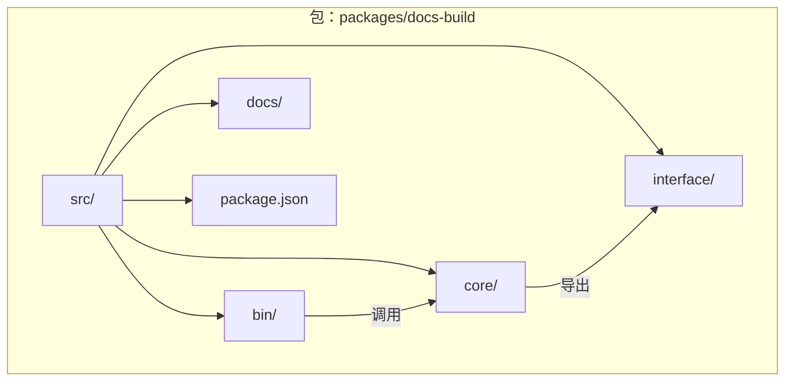
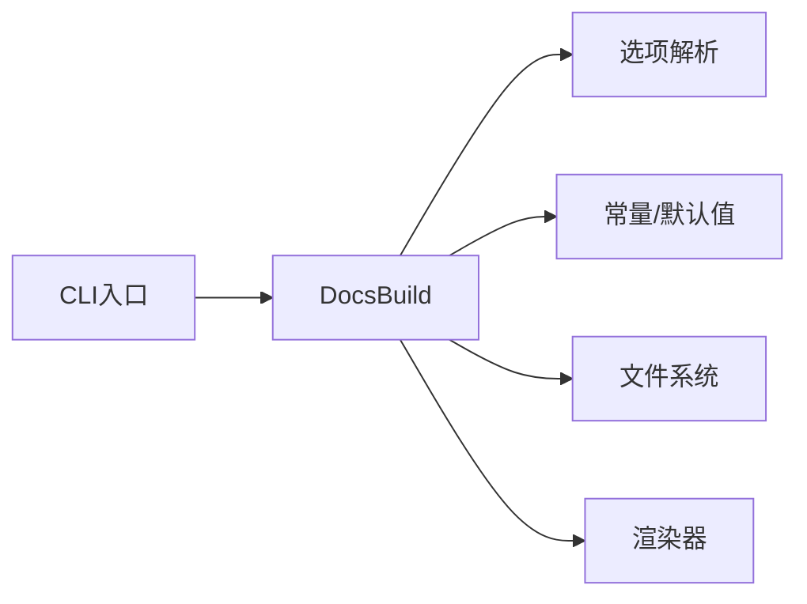

# 核心API

<cite>
**本文引用的文件**
- [packages/docs-build/src/core/docs-build.ts](file://packages/docs-build/src/core/docs-build.ts)
- [packages/docs-build/src/interface/options.ts](file://packages/docs-build/src/interface/options.ts)
- [packages/docs-build/src/interface/render-options.ts](file://packages/docs-build/src/interface/render-options.ts)
- [packages/docs-build/src/interface/vuepress-theme-hope.ts](file://packages/docs-build/src/interface/vuepress-theme-hope.ts)
- [packages/docs-build/src/core/docs-options.ts](file://packages/docs-build/src/core/docs-options.ts)
- [packages/docs-build/src/core/constants.ts](file://packages/docs-build/src/core/constants.ts)
- [packages/docs-build/src/bin/docs-build.ts](file://packages/docs-build/src/bin/docs-build.ts)
- [packages/docs-build/package.json](file://packages/docs-build/package.json)
- [packages/docs-build/README.md](file://packages/docs-build/README.md)
- [packages/docs-build/docs/guide/in-project.md](file://packages/docs-build/docs/guide/in-project.md)
</cite>

## 目录
1. [简介](#简介)
2. [项目结构](#项目结构)
3. [核心组件](#核心组件)
4. [架构总览](#架构总览)
5. [详细组件分析](#详细组件分析)
6. [依赖关系分析](#依赖关系分析)
7. [性能考虑](#性能考虑)
8. [故障排查指南](#故障排查指南)
9. [结论](#结论)
10. [附录](#附录)

## 简介
本文件面向HZ 9 Tool文档构建工具的核心API，聚焦DocsBuild类及其相关接口与配置，系统性梳理其构造函数、构建流程（build）、监听模式（watch）、选项体系、生命周期管理、异步处理与错误处理机制，并提供编程式集成示例、性能优化建议与版本演进建议。

## 项目结构
- 核心实现位于 packages/docs-build/src 下，包含：
  - core：核心逻辑（DocsBuild类、选项解析、常量）
  - interface：类型定义（构建选项、渲染选项、主题配置）
  - bin：CLI入口
  - docs：用户指南与API文档生成指南
- 包装与发布信息位于 packages/docs-build/package.json 中



**章节来源**
- [packages/docs-build/package.json](file://packages/docs-build/package.json)
- [packages/docs-build/README.md](file://packages/docs-build/README.md)

## 核心组件
- DocsBuild 类：文档构建主控制器，负责解析配置、执行构建与监听、资源清理与错误传播
- Options 接口族：构建选项、渲染选项、VuePress主题选项
- CLI 入口：命令行交互，将用户输入映射到 DocsBuild 的调用链
- 常量与默认值：构建行为的默认策略与路径约定

**章节来源**
- [packages/docs-build/src/core/docs-build.ts](file://packages/docs-build/src/core/docs-build.ts)
- [packages/docs-build/src/interface/options.ts](file://packages/docs-build/src/interface/options.ts)
- [packages/docs-build/src/interface/render-options.ts](file://packages/docs-build/src/interface/render-options.ts)
- [packages/docs-build/src/interface/vuepress-theme-hope.ts](file://packages/docs-build/src/interface/vuepress-theme-hope.ts)
- [packages/docs-build/src/core/docs-options.ts](file://packages/docs-build/src/core/docs-options.ts)
- [packages/docs-build/src/core/constants.ts](file://packages/docs-build/src/core/constants.ts)
- [packages/docs-build/src/bin/docs-build.ts](file://packages/docs-build/src/bin/docs-build.ts)

## 架构总览
DocsBuild 通过“配置解析 → 任务调度 → 渲染输出 → 资源清理”的流水线完成文档构建；CLI层负责参数解析与初始化，核心层负责业务逻辑与异常传播。

```mermaid
sequenceDiagram
participant CLI as "CLI入口"
participant DB as "DocsBuild"
participant OPT as "选项解析"
participant FS as "文件系统"
participant RENDER as "渲染器"
CLI->>DB : 初始化并传入配置
DB->>OPT : 解析/合并用户配置
OPT-->>DB : 返回标准化选项
DB->>FS : 读取/扫描源文件
DB->>RENDER : 执行渲染任务
RENDER-->>DB : 输出结果或错误
DB-->>CLI : 返回构建结果/抛出异常
```

**图表来源**
- [packages/docs-build/src/bin/docs-build.ts](file://packages/docs-build/src/bin/docs-build.ts)
- [packages/docs-build/src/core/docs-build.ts](file://packages/docs-build/src/core/docs-build.ts)
- [packages/docs-build/src/core/docs-options.ts](file://packages/docs-build/src/core/docs-options.ts)

## 详细组件分析

### DocsBuild 类
DocsBuild 是文档构建的核心控制器，封装了从配置加载、任务执行到资源清理的完整生命周期。

- 主要职责
  - 配置解析与校验
  - 构建任务调度与执行
  - 监听模式（watch）的启动与事件分发
  - 异常捕获与错误传播
  - 资源清理与生命周期管理

- 关键方法概览
  - 构造函数：接收配置对象，进行基础校验与默认值填充
  - build(options?): 同步/异步执行构建流程，返回结果或抛出异常
  - watch(options?): 启动监听模式，持续响应文件变更
  - dispose(): 显式释放资源（如关闭监听器、清理缓存）

- 参数与返回值
  - 构造函数：接收构建选项对象，返回 DocsBuild 实例
  - build(options?): 可选参数为渲染选项或构建选项；返回 Promise 或同步结果
  - watch(options?): 可选参数为监听相关选项；返回 Promise 或开始监听
  - dispose(): 无返回值，用于释放资源

- 异常处理
  - 对输入参数进行严格校验，不合法时抛出明确错误
  - 构建过程中捕获底层异常并包装为可读错误消息
  - 监听模式下对文件系统事件异常进行隔离与恢复

- 生命周期管理
  - 初始化阶段：加载默认配置、解析用户配置、准备渲染器
  - 运行阶段：执行构建或进入监听循环
  - 结束阶段：调用 dispose() 释放资源，确保进程退出前清理完毕

- 资源清理机制
  - 监听模式下自动注册清理钩子，避免文件句柄泄漏
  - 构建完成后释放临时资源与缓存
  - 提供显式 dispose() 以支持外部控制

- 异步与Promise
  - build()/watch() 支持 Promise 返回，便于链式调用与并发控制
  - 内部采用异步I/O与事件驱动模型，保证高吞吐与低阻塞

- 编程式调用示例（步骤说明）
  - 步骤1：导入 DocsBuild 并创建实例
  - 步骤2：调用 build() 执行一次性构建
  - 步骤3：如需监听，调用 watch() 并处理事件
  - 步骤4：在适当时机调用 dispose() 释放资源

- 版本演进与废弃策略
  - 保持向后兼容的选项字段，新增字段以默认值形式引入
  - 对于废弃字段，保留过渡期并在未来版本移除
  - 通过变更日志与类型声明提示升级路径

**章节来源**
- [packages/docs-build/src/core/docs-build.ts](file://packages/docs-build/src/core/docs-build.ts)
- [packages/docs-build/src/core/docs-options.ts](file://packages/docs-build/src/core/docs-options.ts)
- [packages/docs-build/src/core/constants.ts](file://packages/docs-build/src/core/constants.ts)

### 选项体系与接口
- 构建选项（Options）
  - 定义构建行为的关键参数，如输入路径、输出路径、主题配置、扫描规则等
  - 支持默认值与环境变量覆盖
- 渲染选项（RenderOptions）
  - 控制渲染过程的细节，如模板选择、静态资源处理、缓存策略等
- VuePress主题选项（VuePressThemeHopeOptions）
  - 针对VuePress主题的定制化参数，如导航栏、侧边栏、样式等

- 选项解析与合并
  - 默认值优先，用户配置覆盖默认值
  - 对必填项进行校验，缺失时报错
  - 对非法值进行转换或报错

**章节来源**
- [packages/docs-build/src/interface/options.ts](file://packages/docs-build/src/interface/options.ts)
- [packages/docs-build/src/interface/render-options.ts](file://packages/docs-build/src/interface/render-options.ts)
- [packages/docs-build/src/interface/vuepress-theme-hope.ts](file://packages/docs-build/src/interface/vuepress-theme-hope.ts)
- [packages/docs-build/src/core/docs-options.ts](file://packages/docs-build/src/core/docs-options.ts)

### CLI 入口
- 功能
  - 解析命令行参数，映射到 DocsBuild 的配置对象
  - 处理帮助信息、版本信息与错误输出
  - 将构建结果或异常反馈给终端

- 调用链
  - CLI -> DocsBuild 构造函数 -> build()/watch() -> dispose()

**章节来源**
- [packages/docs-build/src/bin/docs-build.ts](file://packages/docs-build/src/bin/docs-build.ts)

## 依赖关系分析
- DocsBuild 依赖选项解析模块与常量模块，以获得默认行为与约束
- CLI 作为入口，依赖 DocsBuild 以完成实际构建
- 渲染器与文件系统为外部依赖，由 DocsBuild 在运行时使用



**图表来源**
- [packages/docs-build/src/bin/docs-build.ts](file://packages/docs-build/src/bin/docs-build.ts)
- [packages/docs-build/src/core/docs-build.ts](file://packages/docs-build/src/core/docs-build.ts)
- [packages/docs-build/src/core/docs-options.ts](file://packages/docs-build/src/core/docs-options.ts)
- [packages/docs-build/src/core/constants.ts](file://packages/docs-build/src/core/constants.ts)

**章节来源**
- [packages/docs-build/src/core/docs-build.ts](file://packages/docs-build/src/core/docs-build.ts)
- [packages/docs-build/src/core/docs-options.ts](file://packages/docs-build/src/core/docs-options.ts)
- [packages/docs-build/src/core/constants.ts](file://packages/docs-build/src/core/constants.ts)
- [packages/docs-build/src/bin/docs-build.ts](file://packages/docs-build/src/bin/docs-build.ts)

## 性能考虑
- I/O 优化
  - 使用流式读写与批量处理减少磁盘压力
  - 合理设置监听阈值，避免频繁触发重建
- 并发与异步
  - 利用 Promise 串并联控制任务队列，避免阻塞主线程
  - 在监听模式下采用事件去抖与增量更新
- 缓存与复用
  - 缓存解析结果与中间产物，减少重复计算
  - 复用渲染器实例，降低初始化开销
- 资源管理
  - 及时释放文件句柄与内存，防止泄漏
  - 在 watch 模式下定期清理过期缓存

[本节为通用指导，无需列出具体文件来源]

## 故障排查指南
- 常见问题
  - 配置无效：检查必填字段是否齐全，路径是否存在
  - 构建失败：查看错误堆栈与底层异常信息，确认文件权限与编码
  - 监听无响应：确认监听路径与文件系统事件是否正常
- 调试建议
  - 开启详细日志，定位具体阶段
  - 分模块测试：先验证选项解析，再验证构建流程
  - 使用最小化配置复现问题
- 错误处理
  - 对外暴露统一的错误类型与消息格式
  - 在 watch 模式下隔离异常，避免中断监听

**章节来源**
- [packages/docs-build/src/core/docs-build.ts](file://packages/docs-build/src/core/docs-build.ts)
- [packages/docs-build/src/core/docs-options.ts](file://packages/docs-build/src/core/docs-options.ts)

## 结论
DocsBuild 提供了清晰的API边界与完善的生命周期管理，结合严格的选项体系与异步处理机制，能够满足从单次构建到持续监听的多种场景。通过合理的资源清理与错误处理策略，可在复杂工程中稳定运行。建议在生产环境中配合缓存与并发控制策略，进一步提升性能与可靠性。

## 附录

### 编程式调用示例（步骤说明）
- 示例目标：在其他项目中集成文档构建能力
- 步骤
  - 导入 DocsBuild 并创建实例
  - 准备构建选项（输入/输出路径、主题配置等）
  - 调用 build() 执行一次性构建
  - 如需监听，调用 watch() 并处理事件
  - 在适当时机调用 dispose() 释放资源
- 参考文档
  - 用户指南：in-project.md

**章节来源**
- [packages/docs-build/docs/guide/in-project.md](file://packages/docs-build/docs/guide/in-project.md)

### 版本演进与废弃策略
- 保持向后兼容：新增字段以默认值引入，逐步替换旧字段
- 废弃策略：提供过渡期与迁移指引，最终版本移除
- 变更记录：通过变更日志与类型声明提示升级路径

**章节来源**
- [packages/docs-build/package.json](file://packages/docs-build/package.json)