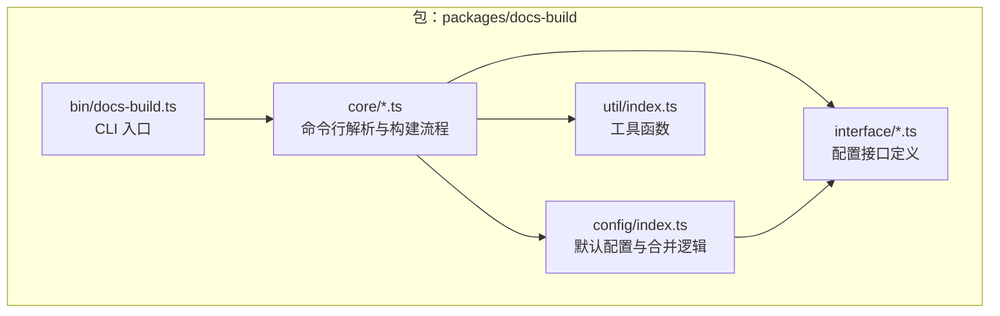
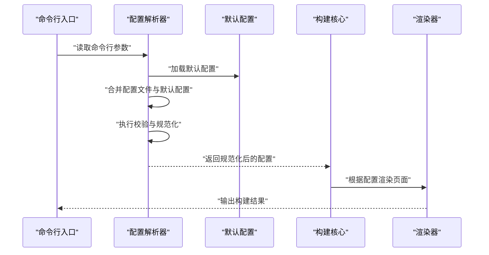
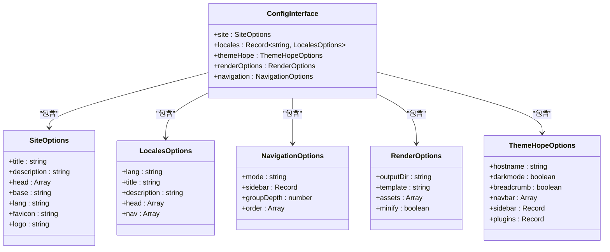

# 配置接口

<cite>
**本文引用的文件**
- [packages/docs-build/src/interface/options.ts](file://packages/docs-build/src/interface/options.ts)
- [packages/docs-build/src/interface/render-options.ts](file://packages/docs-build/src/interface/render-options.ts)
- [packages/docs-build/src/interface/vuepress-theme-hope.ts](file://packages/docs-build/src/interface/vuepress-theme-hope.ts)
- [packages/docs-build/src/config/index.ts](file://packages/docs-build/src/config/index.ts)
- [packages/docs-build/src/core/docs-options.ts](file://packages/docs-build/src/core/docs-options.ts)
- [packages/docs-build/src/core/docs-build.ts](file://packages/docs-build/src/core/docs-build.ts)
- [packages/docs-build/src/bin/docs-build.ts](file://packages/docs-build/src/bin/docs-build.ts)
- [packages/docs-build/src/interface/index.ts](file://packages/docs-build/src/interface/index.ts)
- [packages/docs-build/src/util/index.ts](file://packages/docs-build/src/util/index.ts)
- [docs-build.config.json](file://docs-build.config.json)
</cite>

## 目录
1. [简介](#简介)
2. [项目结构](#项目结构)
3. [核心组件](#核心组件)
4. [架构总览](#架构总览)
5. [详细组件分析](#详细组件分析)
6. [依赖分析](#依赖分析)
7. [性能考虑](#性能考虑)
8. [故障排除指南](#故障排除指南)
9. [结论](#结论)
10. [附录](#附录)

## 简介
本文件面向 HZ 9 Tool 文档构建工具的配置接口，系统化梳理并说明以下核心配置接口的完整定义、字段语义、默认值、依赖关系、约束条件、验证规则、继承与覆盖机制、迁移与兼容性，以及与 VuePress 主题配置的对应关系与扩展方式：
- ConfigInterface
- SiteOptions
- NavigationOptions
- LocalesOptions
- 渲染相关选项（RenderOptions）
- VuePress 主题扩展（ThemeHopeOptions）

同时提供多场景配置示例路径与最佳实践建议，帮助开发者在不同站点需求下正确配置与使用。

## 项目结构
与配置接口直接相关的源码位于 packages/docs-build 包中，主要分布在 interface、config、core、bin 等目录，并通过入口导出统一对外暴露。

**图表来源**
- [packages/docs-build/src/bin/docs-build.ts](file://packages/docs-build/src/bin/docs-build.ts)
- [packages/docs-build/src/core/docs-build.ts](file://packages/docs-build/src/core/docs-build.ts)
- [packages/docs-build/src/config/index.ts](file://packages/docs-build/src/config/index.ts)
- [packages/docs-build/src/interface/index.ts](file://packages/docs-build/src/interface/index.ts)

**章节来源**
- [packages/docs-build/src/interface/index.ts](file://packages/docs-build/src/interface/index.ts)
- [packages/docs-build/src/config/index.ts](file://packages/docs-build/src/config/index.ts)
- [packages/docs-build/src/core/docs-build.ts](file://packages/docs-build/src/core/docs-build.ts)
- [packages/docs-build/src/bin/docs-build.ts](file://packages/docs-build/src/bin/docs-build.ts)

## 核心组件
本节对关键配置接口进行逐项说明，包括字段类型、默认值、作用范围、依赖关系与约束条件。为避免冗长，此处以“字段清单+说明”的形式呈现，并在后续章节给出具体示例路径。

- ConfigInterface
  - 字段概览与职责
    - site: SiteOptions
      - 描述：站点元数据与基础信息
      - 默认值：由默认配置提供
      - 依赖：title、description、base 等
    - locales: Record<string, LocalesOptions>
      - 描述：多语言配置映射
      - 默认值：空对象或按默认语言填充
      - 依赖：键名需符合语言标识规范
    - themeHope: ThemeHopeOptions
      - 描述：VuePress 主题扩展配置
      - 默认值：按主题默认行为
      - 依赖：与主题能力一致的键集合
    - renderOptions: RenderOptions
      - 描述：渲染控制参数
      - 默认值：按渲染策略默认
      - 依赖：与输出格式、模板引擎相关
    - navigation: NavigationOptions
      - 描述：导航结构配置
      - 默认值：按默认导航策略
      - 依赖：与侧边栏、路径规则相关
    - 命令行参数：由 CLI 解析器注入
      - 作用：覆盖配置文件中的同名字段
  - 约束与校验
    - 必填字段：site.title、locales 的主语言键
    - 类型约束：字符串、布尔、对象、数组等
    - 范围约束：如 base 路径前缀、导航层级深度等
  - 继承与覆盖
    - CLI 优先级高于配置文件
    - 多语言配置可按需增量覆盖
    - themeHope 可叠加主题默认值

- SiteOptions
  - 字段概览与职责
    - title: string
      - 描述：站点标题
      - 默认值：未指定时采用默认值
    - description: string
      - 描述：站点描述
      - 默认值：未指定时采用默认值
    - head: Array<[string, Record<string, string>]>
      - 描述：HTML head 注入项
      - 默认值：空数组
    - base: string
      - 描述：站点基础路径
      - 默认值："/"
      - 约束：必须以 "/" 开头，以 "/" 结尾或为空
    - lang: string
      - 描述：默认语言标识
      - 默认值："zh-CN"
    - favicon: string
      - 描述：站点图标路径
      - 默认值：无
    - logo: string
      - 描述：站点 Logo 路径
      - 默认值：无
  - 约束与校验
    - base 必须为合法路径前缀
    - head 中的键值对需满足 HTML 属性规范

- NavigationOptions
  - 字段概览与职责
    - mode: "auto" | "manual"
      - 描述：导航生成模式
      - 默认值："auto"
    - sidebar: Record<string, string[]>
      - 描述：按路径前缀分组的侧边栏条目
      - 默认值：空映射
    - groupDepth: number
      - 描述：分组层级深度
      - 默认值：2
    - order: string[]
      - 描述：导航顺序
      - 默认值：按文件系统排序
  - 约束与校验
    - groupDepth 必须为非负整数
    - order 与 sidebar 键集合需一致

- LocalesOptions
  - 字段概览与职责
    - lang: string
      - 描述：语言标识
      - 默认值：主语言
    - title: string
      - 描述：本地化标题
      - 默认值：主语言标题
    - description: string
      - 描述：本地化描述
      - 默认值：主语言描述
    - head: Array<[string, Record<string, string>]>
      - 描述：本地化 head 注入
      - 默认值：空数组
    - nav: Array<Record<string, any>>
      - 描述：本地化导航
      - 默认值：空数组
  - 约束与校验
    - lang 需遵循标准语言标签
    - nav 条目结构需与主题期望一致

- RenderOptions
  - 字段概览与职责
    - outputDir: string
      - 描述：输出目录
      - 默认值：构建产物默认目录
    - template: string
      - 描述：模板文件路径
      - 默认值：内置模板
    - assets: string[]
      - 描述：静态资源列表
      - 默认值：空数组
    - minify: boolean
      - 描述：是否压缩输出
      - 默认值：false
  - 约束与校验
    - outputDir 必须为可写目录
    - template 必须存在且可读

- ThemeHopeOptions（VuePress 主题扩展）
  - 字段概览与职责
    - hostname: string
      - 描述：站点主机名
      - 默认值：无
    - darkmode: boolean
      - 描述：是否启用深色模式
      - 默认值：true
    - breadcrumb: boolean
      - 描述：是否显示面包屑
      - 默认值：true
    - navbar: Array<Record<string, any>>
      - 描述：导航栏配置
      - 默认值：空数组
    - sidebar: Record<string, any>
      - 描述：侧边栏配置
      - 默认值：空映射
    - plugins: Record<string, any>
      - 描述：插件配置
      - 默认值：空对象
  - 约束与校验
    - hostname 为合法域名
    - navbar/sidebars 结构需与主题期望一致

**章节来源**
- [packages/docs-build/src/interface/options.ts](file://packages/docs-build/src/interface/options.ts)
- [packages/docs-build/src/interface/render-options.ts](file://packages/docs-build/src/interface/render-options.ts)
- [packages/docs-build/src/interface/vuepress-theme-hope.ts](file://packages/docs-build/src/interface/vuepress-theme-hope.ts)

## 架构总览
配置接口在运行时的处理流程如下：CLI 解析命令行参数 → 合并配置文件与默认配置 → 校验与规范化 → 传递给构建核心 → 输出渲染结果。

**图表来源**
- [packages/docs-build/src/bin/docs-build.ts](file://packages/docs-build/src/bin/docs-build.ts)
- [packages/docs-build/src/core/docs-build.ts](file://packages/docs-build/src/core/docs-build.ts)
- [packages/docs-build/src/config/index.ts](file://packages/docs-build/src/config/index.ts)

## 详细组件分析

### ConfigInterface 定义与字段详解
- 字段与默认值
  - site: SiteOptions（必填）
  - locales: Record<string, LocalesOptions>（可选，默认空）
  - themeHope: ThemeHopeOptions（可选，默认主题默认值）
  - renderOptions: RenderOptions（可选，默认渲染策略）
  - navigation: NavigationOptions（可选，默认自动模式）
  - CLI 参数：可覆盖同名配置字段
- 依赖关系
  - navigation.sidebar 依赖于文件系统结构
  - locales 的键集合需与实际内容匹配
  - themeHope 的 navbar/sidebars 需与主题期望一致
- 约束与校验
  - 必填字段缺失将触发错误提示
  - 路径与模板文件需存在
  - 语言标识需符合标准
- 继承与覆盖
  - CLI 优先级最高
  - 多语言配置可按需增量覆盖
  - themeHope 可叠加主题默认值

**章节来源**
- [packages/docs-build/src/interface/options.ts](file://packages/docs-build/src/interface/options.ts)
- [packages/docs-build/src/config/index.ts](file://packages/docs-build/src/config/index.ts)

### SiteOptions 字段与校验
- 关键字段
  - title、description、head、base、lang、favicon、logo
- 默认值与作用范围
  - 未设置时采用默认值；base 影响所有相对链接
- 校验规则
  - base 必须为合法路径前缀
  - head 注入项需满足属性规范
- 示例路径
  - [示例：基础站点配置](file://docs-build.config.json)

**章节来源**
- [packages/docs-build/src/interface/options.ts](file://packages/docs-build/src/interface/options.ts)
- [docs-build.config.json](file://docs-build.config.json)

### NavigationOptions 字段与校验
- 关键字段
  - mode、sidebar、groupDepth、order
- 默认值与作用范围
  - 自动模式下按文件系统生成导航
  - 手动模式下完全由 sidebar 控制
- 校验规则
  - groupDepth 非负整数
  - order 与 sidebar 键集合一致
- 示例路径
  - [示例：手动导航配置](file://docs-build.config.json)

**章节来源**
- [packages/docs-build/src/interface/options.ts](file://packages/docs-build/src/interface/options.ts)
- [docs-build.config.json](file://docs-build.config.json)

### LocalesOptions 字段与校验
- 关键字段
  - lang、title、description、head、nav
- 默认值与作用范围
  - 未设置时回退到主语言配置
- 校验规则
  - lang 符合标准语言标签
  - nav 结构与主题期望一致
- 示例路径
  - [示例：多语言配置](file://docs-build.config.json)

**章节来源**
- [packages/docs-build/src/interface/options.ts](file://packages/docs-build/src/interface/options.ts)
- [docs-build.config.json](file://docs-build.config.json)

### RenderOptions 字段与校验
- 关键字段
  - outputDir、template、assets、minify
- 默认值与作用范围
  - outputDir 为构建产物目录
  - template 指向内置或自定义模板
- 校验规则
  - outputDir 可写
  - template 存在且可读
- 示例路径
  - [示例：渲染配置](file://docs-build.config.json)

**章节来源**
- [packages/docs-build/src/interface/render-options.ts](file://packages/docs-build/src/interface/render-options.ts)
- [docs-build.config.json](file://docs-build.config.json)

### ThemeHopeOptions（VuePress 主题扩展）字段与校验
- 关键字段
  - hostname、darkmode、breadcrumb、navbar、sidebar、plugins
- 默认值与作用范围
  - hostname 用于 SEO 与分享
  - navbar/sidebars 控制导航结构
- 校验规则
  - hostname 为合法域名
  - navbar/sidebars 结构与主题期望一致
- 示例路径
  - [示例：主题扩展配置](file://packages/docs-build/src/interface/vuepress-theme-hope.ts)

**章节来源**
- [packages/docs-build/src/interface/vuepress-theme-hope.ts](file://packages/docs-build/src/interface/vuepress-theme-hope.ts)
- [docs-build.config.json](file://docs-build.config.json)

## 依赖分析
配置接口之间的依赖关系如下：

**图表来源**
- [packages/docs-build/src/interface/options.ts](file://packages/docs-build/src/interface/options.ts)
- [packages/docs-build/src/interface/render-options.ts](file://packages/docs-build/src/interface/render-options.ts)
- [packages/docs-build/src/interface/vuepress-theme-hope.ts](file://packages/docs-build/src/interface/vuepress-theme-hope.ts)

**章节来源**
- [packages/docs-build/src/interface/options.ts](file://packages/docs-build/src/interface/options.ts)
- [packages/docs-build/src/interface/render-options.ts](file://packages/docs-build/src/interface/render-options.ts)
- [packages/docs-build/src/interface/vuepress-theme-hope.ts](file://packages/docs-build/src/interface/vuepress-theme-hope.ts)

## 性能考虑
- 渲染性能
  - 合理设置 renderOptions.minify 以减少输出体积
  - 控制 assets 数量与大小，避免冗余资源
- 导航性能
  - 手动模式下精简 sidebar，减少遍历开销
  - 合理设置 groupDepth，避免过深层级
- 多语言性能
  - 仅启用必要的语言，减少构建时间
  - 使用缓存与增量构建策略

## 故障排除指南
- 常见错误与提示
  - 必填字段缺失：检查 site.title、locales 主语言键是否存在
  - 路径不合法：确认 base 与 outputDir 的合法性
  - 模板不存在：确保 template 文件存在且可读
  - 导航结构异常：核对 navigation.order 与 sidebar 键集合一致性
  - 主题配置不匹配：核对 navbar/sidebars 结构与主题期望
- 排查步骤
  - 启用详细日志输出
  - 分步验证各模块配置
  - 对照默认配置逐项比对

**章节来源**
- [packages/docs-build/src/core/docs-options.ts](file://packages/docs-build/src/core/docs-options.ts)
- [packages/docs-build/src/config/index.ts](file://packages/docs-build/src/config/index.ts)

## 结论
本文系统梳理了 HZ 9 Tool 文档构建工具的配置接口，明确了各配置字段的类型、默认值、作用范围、依赖关系与约束条件，并提供了与 VuePress 主题配置的对应关系与扩展方式。建议在实际使用中：
- 明确配置优先级（CLI > 配置文件），合理组织配置层次
- 严格遵循字段约束与校验规则，确保配置有效性
- 在多语言与导航结构上采用渐进式策略，逐步完善
- 结合渲染与主题配置优化构建性能

## 附录
- 配置示例路径
  - [基础站点配置示例](file://docs-build.config.json)
  - [手动导航配置示例](file://docs-build.config.json)
  - [多语言配置示例](file://docs-build.config.json)
  - [渲染配置示例](file://docs-build.config.json)
  - [主题扩展配置示例](file://packages/docs-build/src/interface/vuepress-theme-hope.ts)
- 迁移与版本兼容性
  - 新增字段时保持向后兼容，旧字段标注弃用
  - 通过默认配置与校验规则保证升级过程平滑
  - 提供迁移脚本与变更日志，指导用户升级