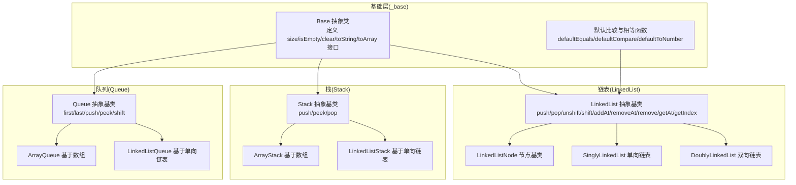
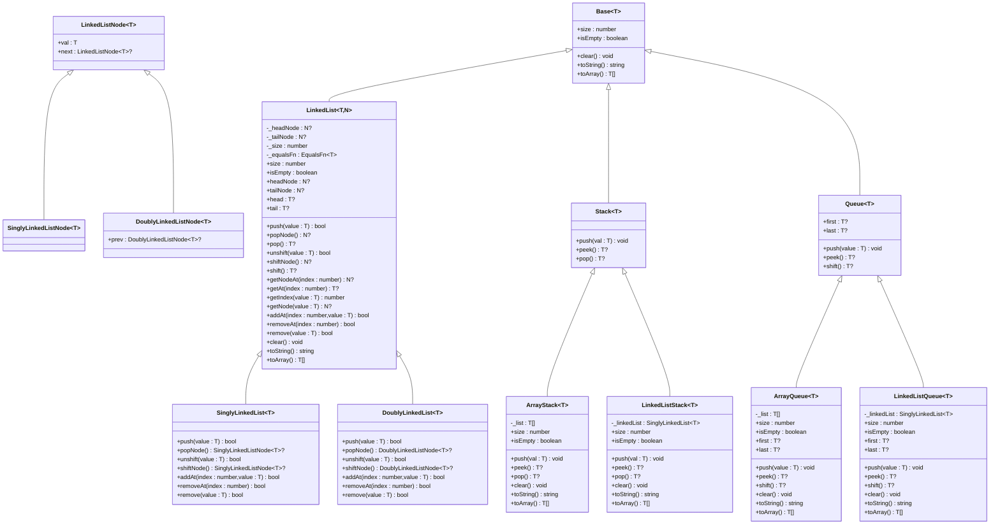
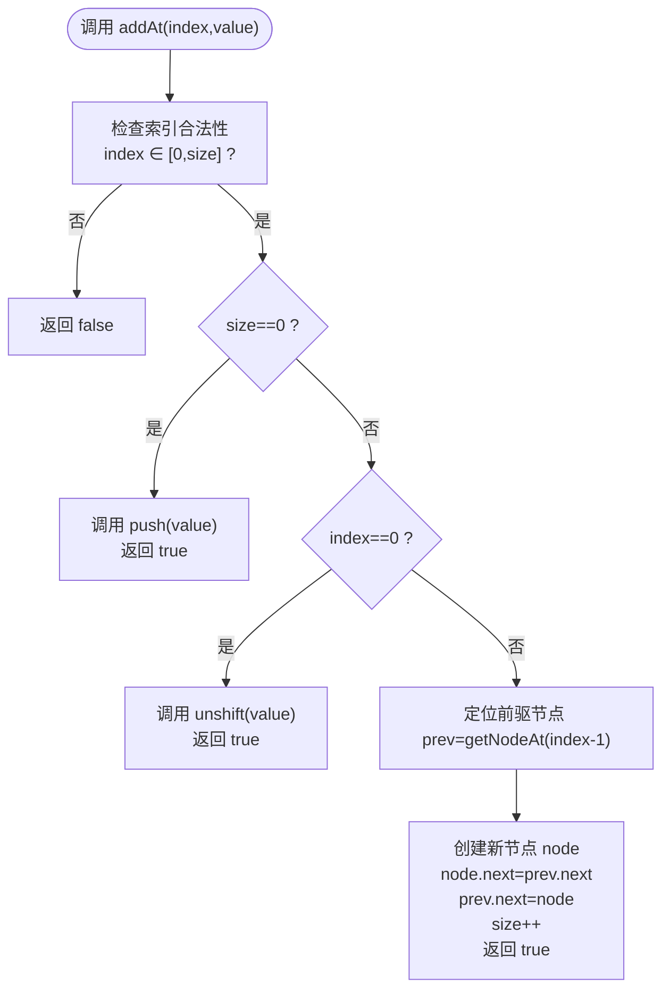
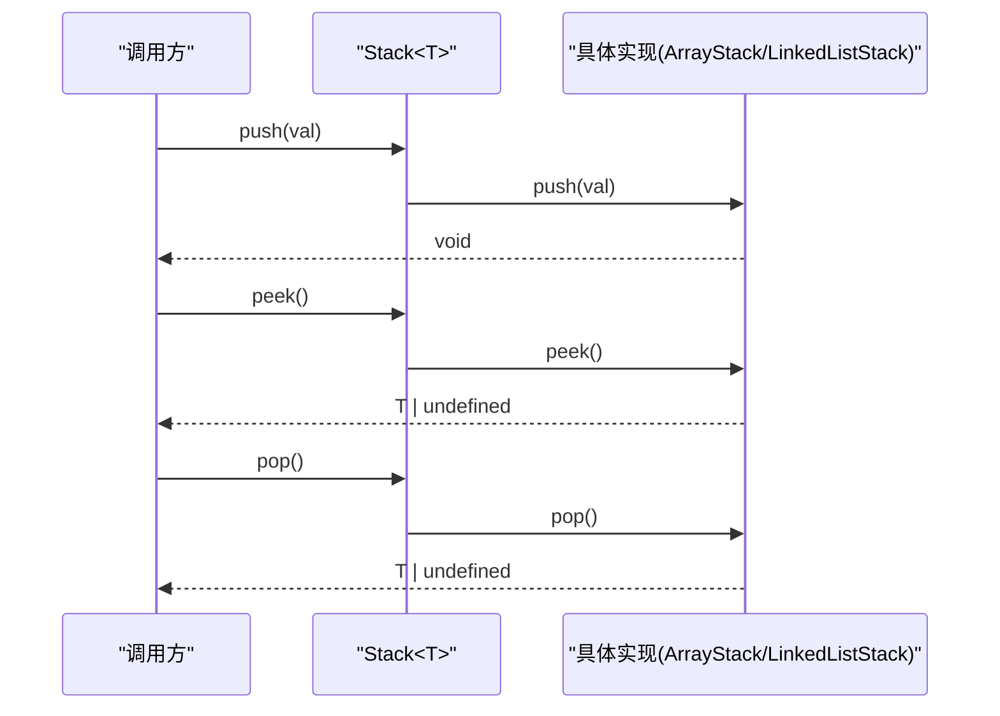
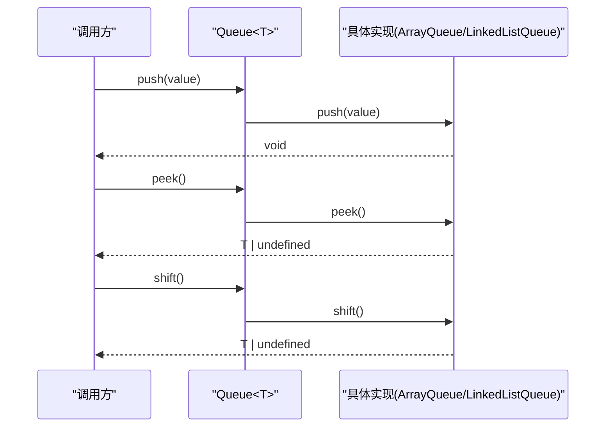
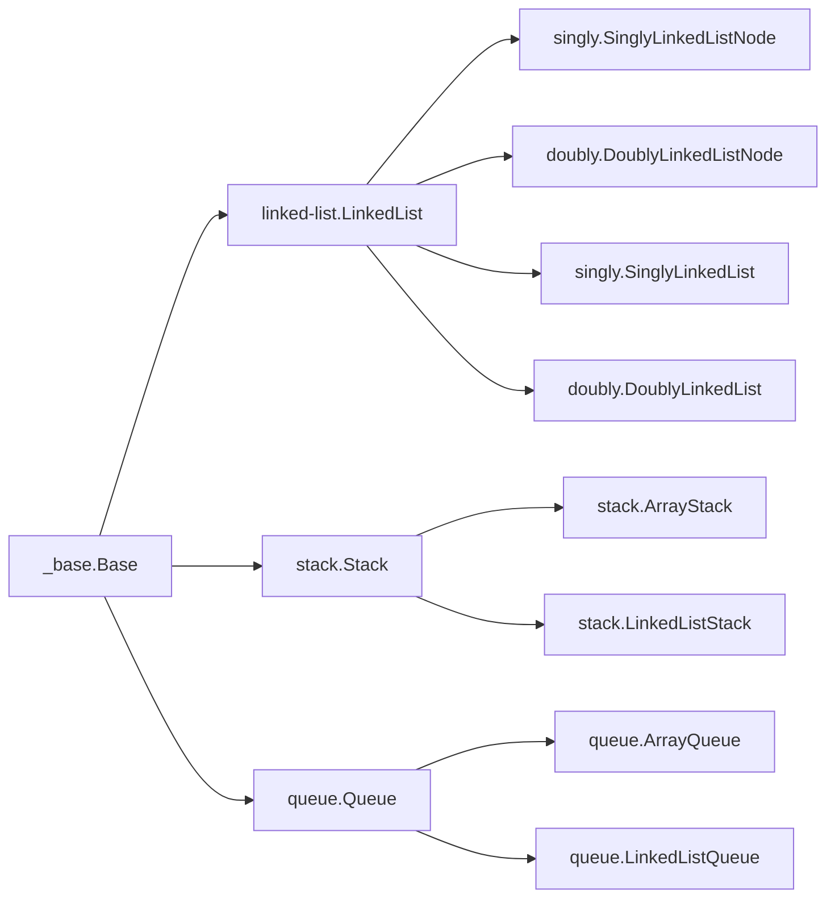

# 基础数据结构

<cite>
**本文引用的文件**
- [packages/algorithm/src/_base/index.ts](file://packages/algorithm/src/_base/index.ts)
- [packages/algorithm/src/array/array.ts](file://packages/algorithm/src/array/array.ts)
- [packages/algorithm/src/linked-list/_base.linked-list.ts](file://packages/algorithm/src/linked-list/_base.linked-list.ts)
- [packages/algorithm/src/linked-list/singly.linked-list.ts](file://packages/algorithm/src/linked-list/singly.linked-list.ts)
- [packages/algorithm/src/linked-list/doubly.linked-list.ts](file://packages/algorithm/src/linked-list/doubly.linked-list.ts)
- [packages/algorithm/src/stack/_base.stack.ts](file://packages/algorithm/src/stack/_base.stack.ts)
- [packages/algorithm/src/stack/array.stack.ts](file://packages/algorithm/src/stack/array.stack.ts)
- [packages/algorithm/src/stack/linked-list.stack.ts](file://packages/algorithm/src/stack/linked-list.stack.ts)
- [packages/algorithm/src/queue/_base.queue.ts](file://packages/algorithm/src/queue/_base.queue.ts)
- [packages/algorithm/src/queue/array.queue.ts](file://packages/algorithm/src/queue/array.queue.ts)
- [packages/algorithm/src/queue/linked-list.queue.ts](file://packages/algorithm/src/queue/linked-list.queue.ts)
- [packages/algorithm/src/test/common.linked-list.spec.ts](file://packages/algorithm/src/test/common.linked-list.spec.ts)
- [packages/algorithm/src/test/stack.spec.ts](file://packages/algorithm/src/test/stack.spec.ts)
- [packages/algorithm/src/test/queue.spec.ts](file://packages/algorithm/src/test/queue.spec.ts)
</cite>

## 目录
1. [简介](#简介)
2. [项目结构](#项目结构)
3. [核心组件](#核心组件)
4. [架构总览](#架构总览)
5. [详细组件分析](#详细组件分析)
6. [依赖分析](#依赖分析)
7. [性能考虑](#性能考虑)
8. [故障排查指南](#故障排查指南)
9. [结论](#结论)
10. [附录](#附录)

## 简介
本文件为“基础数据结构”模块的API参考文档，覆盖数组(Array)、链表(LinkedList)、栈(Stack)、队列(Queue)等常见数据结构的完整API说明。内容包括：
- 类与接口定义、构造函数、公共方法、属性
- 方法签名、参数类型、返回值类型、异常与边界条件
- 泛型使用与类型约束说明
- 基本操作（插入、删除、查找、遍历）与复杂度信息
- 实际用法示例与最佳实践

## 项目结构
该模块位于算法包中，采用按功能分层组织：基础抽象层（_base）、具体实现（array、linked-list、stack、queue）以及配套测试。

图表来源
- [packages/algorithm/src/_base/index.ts:22-70](file://packages/algorithm/src/_base/index.ts#L22-L70)
- [packages/algorithm/src/_base/index.ts:84-101](file://packages/algorithm/src/_base/index.ts#L84-L101)
- [packages/algorithm/src/linked-list/_base.linked-list.ts:38-401](file://packages/algorithm/src/linked-list/_base.linked-list.ts#L38-L401)
- [packages/algorithm/src/linked-list/singly.linked-list.ts:23-179](file://packages/algorithm/src/linked-list/singly.linked-list.ts#L23-L179)
- [packages/algorithm/src/linked-list/doubly.linked-list.ts:34-189](file://packages/algorithm/src/linked-list/doubly.linked-list.ts#L34-L189)
- [packages/algorithm/src/stack/_base.stack.ts:8-51](file://packages/algorithm/src/stack/_base.stack.ts#L8-L51)
- [packages/algorithm/src/stack/array.stack.ts:12-61](file://packages/algorithm/src/stack/array.stack.ts#L12-L61)
- [packages/algorithm/src/stack/linked-list.stack.ts:13-66](file://packages/algorithm/src/stack/linked-list.stack.ts#L13-L66)
- [packages/algorithm/src/queue/_base.queue.ts:10-75](file://packages/algorithm/src/queue/_base.queue.ts#L10-L75)
- [packages/algorithm/src/queue/array.queue.ts:12-67](file://packages/algorithm/src/queue/array.queue.ts#L12-L67)
- [packages/algorithm/src/queue/linked-list.queue.ts:13-74](file://packages/algorithm/src/queue/linked-list.queue.ts#L13-L74)

章节来源
- [packages/algorithm/src/_base/index.ts:1-162](file://packages/algorithm/src/_base/index.ts#L1-L162)
- [packages/algorithm/src/linked-list/_base.linked-list.ts:1-402](file://packages/algorithm/src/linked-list/_base.linked-list.ts#L1-L402)
- [packages/algorithm/src/stack/_base.stack.ts:1-51](file://packages/algorithm/src/stack/_base.stack.ts#L1-L51)
- [packages/algorithm/src/queue/_base.queue.ts:1-75](file://packages/algorithm/src/queue/_base.queue.ts#L1-L75)

## 核心组件
- 基础抽象类 Base<T>：统一定义 size、isEmpty、clear、toString、toArray 等通用能力，便于上层数据结构复用。
- 默认工具函数：defaultEquals、defaultCompare、defaultToNumber 提供默认的相等性与比较逻辑，支持泛型约束。
- 链表基类 LinkedList<T,N>：提供链表通用操作（push/pop/unshift/shift/addAt/removeAt/remove/getAt/getIndex/toString/toArray），并以抽象方法定义插入/删除策略。
- 栈基类 Stack<T>：提供 push、peek、pop 三类操作。
- 队列基类 Queue<T>：提供 first、last、push、peek、shift 五类操作。

章节来源
- [packages/algorithm/src/_base/index.ts:22-70](file://packages/algorithm/src/_base/index.ts#L22-L70)
- [packages/algorithm/src/_base/index.ts:84-101](file://packages/algorithm/src/_base/index.ts#L84-L101)
- [packages/algorithm/src/linked-list/_base.linked-list.ts:38-401](file://packages/algorithm/src/linked-list/_base.linked-list.ts#L38-L401)
- [packages/algorithm/src/stack/_base.stack.ts:8-51](file://packages/algorithm/src/stack/_base.stack.ts#L8-L51)
- [packages/algorithm/src/queue/_base.queue.ts:10-75](file://packages/algorithm/src/queue/_base.queue.ts#L10-L75)

## 架构总览
下图展示各数据结构与抽象基类之间的继承与组合关系：

图表来源
- [packages/algorithm/src/_base/index.ts:22-70](file://packages/algorithm/src/_base/index.ts#L22-L70)
- [packages/algorithm/src/linked-list/_base.linked-list.ts:10-29](file://packages/algorithm/src/linked-list/_base.linked-list.ts#L10-L29)
- [packages/algorithm/src/linked-list/_base.linked-list.ts:38-401](file://packages/algorithm/src/linked-list/_base.linked-list.ts#L38-L401)
- [packages/algorithm/src/linked-list/singly.linked-list.ts:12-179](file://packages/algorithm/src/linked-list/singly.linked-list.ts#L12-L179)
- [packages/algorithm/src/linked-list/doubly.linked-list.ts:12-189](file://packages/algorithm/src/linked-list/doubly.linked-list.ts#L12-L189)
- [packages/algorithm/src/stack/_base.stack.ts:8-51](file://packages/algorithm/src/stack/_base.stack.ts#L8-L51)
- [packages/algorithm/src/stack/array.stack.ts:12-61](file://packages/algorithm/src/stack/array.stack.ts#L12-L61)
- [packages/algorithm/src/stack/linked-list.stack.ts:13-66](file://packages/algorithm/src/stack/linked-list.stack.ts#L13-L66)
- [packages/algorithm/src/queue/_base.queue.ts:10-75](file://packages/algorithm/src/queue/_base.queue.ts#L10-L75)
- [packages/algorithm/src/queue/array.queue.ts:12-67](file://packages/algorithm/src/queue/array.queue.ts#L12-L67)
- [packages/algorithm/src/queue/linked-list.queue.ts:13-74](file://packages/algorithm/src/queue/linked-list.queue.ts#L13-L74)

## 详细组件分析

### 数组(Array)
- 用途：演示原生数组的基本操作（插入、删除、遍历、查找、拼接）。
- 关键点：
  - 插入：末尾追加、开头插入
  - 删除：末尾弹出、开头移除
  - 遍历：索引遍历、forEach
  - 查找：find
  - 扩展：concat
- 复杂度概览（基于原生数组行为）：
  - push/unshift/shift/pop/forEach/find/concat：平均 O(1) 或 O(n)，取决于具体场景
  - 索引访问：O(1)
- 边界与异常：无显式抛错；越界或空数组访问返回 undefined 或空结果。

章节来源
- [packages/algorithm/src/array/array.ts:1-39](file://packages/algorithm/src/array/array.ts#L1-L39)

### 链表(LinkedList)
- 抽象基类 LinkedList<T,N>：
  - 属性：head/tail/headNode/tailNode/size/isEmpty
  - 基本操作：push/pop/unshift/shift（节点级与值级）
  - 定位与查询：getNodeAt/getAt/getIndex/getNode
  - 插入与删除：addAt/removeAt/remove
  - 工具：clear/toString/toArray
  - 复杂度：
    - push/pop/unshift/shift：O(1)
    - addAt/removeAt/remove/getAt/getIndex：O(n)
- 单向链表 SinglyLinkedList<T>：
  - 继承 LinkedList<T,SinglyLinkedListNode<T>>
  - 具体实现遵循 O(1) 时间复杂度的头部/尾部操作
- 双向链表 DoublyLinkedList<T>：
  - 节点含 prev/next 指针
  - 尾删/头删同样为 O(1)，内部维护 prev 指针
- 边界与异常：
  - addAt/removeAt 等对非法索引返回 false
  - 空链表相关操作返回 undefined 或保持不变

图表来源
- [packages/algorithm/src/linked-list/_base.linked-list.ts:341-341](file://packages/algorithm/src/linked-list/_base.linked-list.ts#L341-L341)
- [packages/algorithm/src/linked-list/singly.linked-list.ts:97-123](file://packages/algorithm/src/linked-list/singly.linked-list.ts#L97-L123)
- [packages/algorithm/src/linked-list/doubly.linked-list.ts:112-140](file://packages/algorithm/src/linked-list/doubly.linked-list.ts#L112-L140)

章节来源
- [packages/algorithm/src/linked-list/_base.linked-list.ts:38-401](file://packages/algorithm/src/linked-list/_base.linked-list.ts#L38-L401)
- [packages/algorithm/src/linked-list/singly.linked-list.ts:23-179](file://packages/algorithm/src/linked-list/singly.linked-list.ts#L23-L179)
- [packages/algorithm/src/linked-list/doubly.linked-list.ts:34-189](file://packages/algorithm/src/linked-list/doubly.linked-list.ts#L34-L189)
- [packages/algorithm/src/test/common.linked-list.spec.ts:300-342](file://packages/algorithm/src/test/common.linked-list.spec.ts#L300-L342)

### 栈(Stack)
- 抽象基类 Stack<T>：
  - push(val:T): void
  - peek(): T | undefined
  - pop(): T | undefined
- ArrayStack<T>：
  - 内部使用数组作为存储
  - size/isEmpty/clear/toString/toArray 均基于底层数组
- LinkedListStack<T>：
  - 内部使用 SinglyLinkedList<T>
  - 通过链表尾部实现栈顶操作，时间复杂度 O(1)
- 复杂度：所有操作均为 O(1)

图表来源
- [packages/algorithm/src/stack/_base.stack.ts:21-49](file://packages/algorithm/src/stack/_base.stack.ts#L21-L49)
- [packages/algorithm/src/stack/array.stack.ts:27-39](file://packages/algorithm/src/stack/array.stack.ts#L27-L39)
- [packages/algorithm/src/stack/linked-list.stack.ts:28-38](file://packages/algorithm/src/stack/linked-list.stack.ts#L28-L38)

章节来源
- [packages/algorithm/src/stack/_base.stack.ts:8-51](file://packages/algorithm/src/stack/_base.stack.ts#L8-L51)
- [packages/algorithm/src/stack/array.stack.ts:12-61](file://packages/algorithm/src/stack/array.stack.ts#L12-L61)
- [packages/algorithm/src/stack/linked-list.stack.ts:13-66](file://packages/algorithm/src/stack/linked-list.stack.ts#L13-L66)
- [packages/algorithm/src/test/stack.spec.ts:23-104](file://packages/algorithm/src/test/stack.spec.ts#L23-L104)

### 队列(Queue)
- 抽象基类 Queue<T>：
  - first/last: T | undefined
  - push(value:T): void
  - peek(): T | undefined
  - shift(): T | undefined
- ArrayQueue<T>：
  - 使用数组存储，push 从尾部添加，shift 从头部移除
- LinkedListQueue<T>：
  - 使用 SinglyLinkedList<T>，通过链表头/尾指针实现 O(1) 操作
- 复杂度：所有操作均为 O(1)

图表来源
- [packages/algorithm/src/queue/_base.queue.ts:45-73](file://packages/algorithm/src/queue/_base.queue.ts#L45-L73)
- [packages/algorithm/src/queue/array.queue.ts:35-45](file://packages/algorithm/src/queue/array.queue.ts#L35-L45)
- [packages/algorithm/src/queue/linked-list.queue.ts:36-46](file://packages/algorithm/src/queue/linked-list.queue.ts#L36-L46)

章节来源
- [packages/algorithm/src/queue/_base.queue.ts:10-75](file://packages/algorithm/src/queue/_base.queue.ts#L10-L75)
- [packages/algorithm/src/queue/array.queue.ts:12-67](file://packages/algorithm/src/queue/array.queue.ts#L12-L67)
- [packages/algorithm/src/queue/linked-list.queue.ts:13-74](file://packages/algorithm/src/queue/linked-list.queue.ts#L13-L74)
- [packages/algorithm/src/test/queue.spec.ts:36-248](file://packages/algorithm/src/test/queue.spec.ts#L36-L248)

## 依赖分析
- 抽象依赖：所有具体数据结构均继承自 Base<T>，确保统一的生命周期与输出接口。
- 链表族：LinkedList<T,N> 依赖 LinkedListNode<T>，SinglyLinkedList/DoublyLinkedList 分别扩展单/双向节点语义。
- 栈与队列：Stack<T>/Queue<T> 通过 ArrayStack/LinkedListStack 与 ArrayQueue/LinkedListQueue 实现具体行为。
- 测试依赖：测试文件通过统一的接口验证行为一致性，覆盖边界与异常路径。

图表来源
- [packages/algorithm/src/_base/index.ts:22-70](file://packages/algorithm/src/_base/index.ts#L22-L70)
- [packages/algorithm/src/linked-list/_base.linked-list.ts:38-401](file://packages/algorithm/src/linked-list/_base.linked-list.ts#L38-L401)
- [packages/algorithm/src/linked-list/singly.linked-list.ts:23-179](file://packages/algorithm/src/linked-list/singly.linked-list.ts#L23-L179)
- [packages/algorithm/src/linked-list/doubly.linked-list.ts:34-189](file://packages/algorithm/src/linked-list/doubly.linked-list.ts#L34-L189)
- [packages/algorithm/src/stack/_base.stack.ts:8-51](file://packages/algorithm/src/stack/_base.stack.ts#L8-L51)
- [packages/algorithm/src/stack/array.stack.ts:12-61](file://packages/algorithm/src/stack/array.stack.ts#L12-L61)
- [packages/algorithm/src/stack/linked-list.stack.ts:13-66](file://packages/algorithm/src/stack/linked-list.stack.ts#L13-L66)
- [packages/algorithm/src/queue/_base.queue.ts:10-75](file://packages/algorithm/src/queue/_base.queue.ts#L10-L75)
- [packages/algorithm/src/queue/array.queue.ts:12-67](file://packages/algorithm/src/queue/array.queue.ts#L12-L67)
- [packages/algorithm/src/queue/linked-list.queue.ts:13-74](file://packages/algorithm/src/queue/linked-list.queue.ts#L13-L74)

章节来源
- [packages/algorithm/src/_base/index.ts:1-162](file://packages/algorithm/src/_base/index.ts#L1-L162)
- [packages/algorithm/src/linked-list/_base.linked-list.ts:1-402](file://packages/algorithm/src/linked-list/_base.linked-list.ts#L1-L402)
- [packages/algorithm/src/stack/_base.stack.ts:1-51](file://packages/algorithm/src/stack/_base.stack.ts#L1-L51)
- [packages/algorithm/src/queue/_base.queue.ts:1-75](file://packages/algorithm/src/queue/_base.queue.ts#L1-L75)

## 性能考虑
- 数组(Array)：原生数组操作的时间复杂度取决于具体方法；在频繁头部插入/删除时，LinkedList 更优。
- 链表(LinkedList)：头部/尾部插入/删除为 O(1)，定位/删除中间节点为 O(n)。
- 栈(Stack)：ArrayStack 与 LinkedListStack 均为 O(1)。
- 队列(Queue)：ArrayQueue 在 shift 时可能触发数组重排，LinkedListQueue 保持 O(1)。

## 故障排查指南
- 索引越界：
  - addAt/removeAt 对非法索引直接返回 false；请在调用前校验 index ∈ [0,size]。
- 空容器操作：
  - peek/pop/shift 返回 undefined；调用前需检查 isEmpty。
- 相等性判断：
  - LinkedList 默认使用严格相等；如需自定义，请在构造时传入 equalsFn。
- 类型安全：
  - 所有类为泛型实现，确保传入与声明一致的类型，避免运行期类型错误。

章节来源
- [packages/algorithm/src/linked-list/_base.linked-list.ts:219-231](file://packages/algorithm/src/linked-list/_base.linked-list.ts#L219-L231)
- [packages/algorithm/src/linked-list/_base.linked-list.ts:256-276](file://packages/algorithm/src/linked-list/_base.linked-list.ts#L256-L276)
- [packages/algorithm/src/linked-list/_base.linked-list.ts:341-356](file://packages/algorithm/src/linked-list/_base.linked-list.ts#L341-L356)
- [packages/algorithm/src/linked-list/_base.linked-list.ts:373-377](file://packages/algorithm/src/linked-list/_base.linked-list.ts#L373-L377)
- [packages/algorithm/src/stack/_base.stack.ts:34-49](file://packages/algorithm/src/stack/_base.stack.ts#L34-L49)
- [packages/algorithm/src/queue/_base.queue.ts:20-73](file://packages/algorithm/src/queue/_base.queue.ts#L20-L73)
- [packages/algorithm/src/test/common.linked-list.spec.ts:316-331](file://packages/algorithm/src/test/common.linked-list.spec.ts#L316-L331)
- [packages/algorithm/src/test/stack.spec.ts:79-102](file://packages/algorithm/src/test/stack.spec.ts#L79-L102)
- [packages/algorithm/src/test/queue.spec.ts:97-122](file://packages/algorithm/src/test/queue.spec.ts#L97-L122)

## 结论
本模块提供了完整的数据结构抽象与多种实现，具备良好的可扩展性与一致性。建议：
- 优先选择 LinkedList 用于频繁头部/尾部操作的场景
- 优先选择 Array 实现以获得更简洁的内存布局
- 使用泛型明确类型，结合默认/自定义比较函数提升健壮性
- 在测试中覆盖边界与异常路径，确保行为符合预期

## 附录
- 泛型与类型约束
  - 所有类均以泛型 T 表示元素类型，支持任意类型实例化
  - equalsFn/compareFn/toNumberFn 为可选的类型约束函数，用于定制相等性与比较逻辑
- 常用方法清单
  - 链表：push/pop/unshift/shift/addAt/removeAt/remove/getAt/getIndex/toString/toArray
  - 栈：push/peek/pop
  - 队列：push/peek/shift

章节来源
- [packages/algorithm/src/_base/index.ts:133-162](file://packages/algorithm/src/_base/index.ts#L133-L162)
- [packages/algorithm/src/linked-list/_base.linked-list.ts:131-160](file://packages/algorithm/src/linked-list/_base.linked-list.ts#L131-L160)
- [packages/algorithm/src/linked-list/_base.linked-list.ts:175-204](file://packages/algorithm/src/linked-list/_base.linked-list.ts#L175-L204)
- [packages/algorithm/src/linked-list/_base.linked-list.ts:341-371](file://packages/algorithm/src/linked-list/_base.linked-list.ts#L341-L371)
- [packages/algorithm/src/stack/_base.stack.ts:21-49](file://packages/algorithm/src/stack/_base.stack.ts#L21-L49)
- [packages/algorithm/src/queue/_base.queue.ts:45-73](file://packages/algorithm/src/queue/_base.queue.ts#L45-L73)