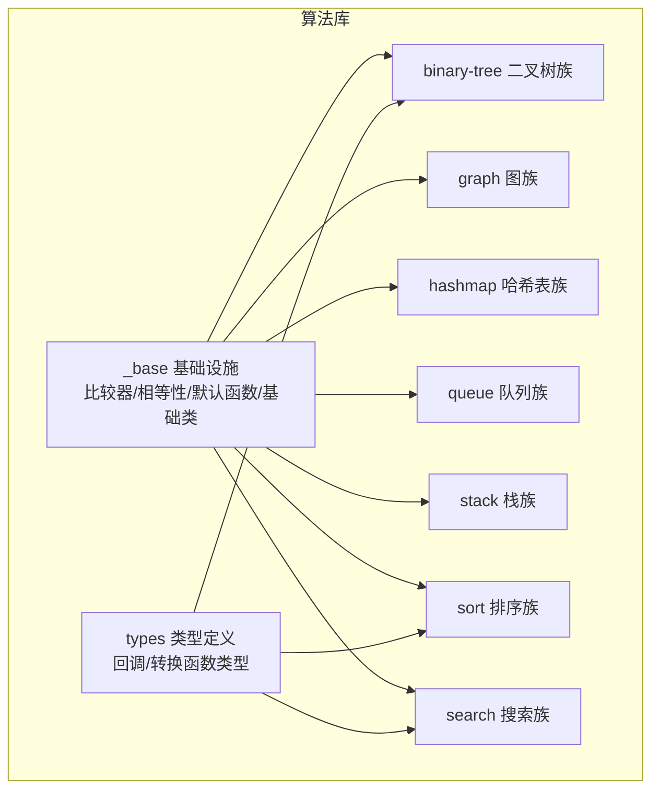
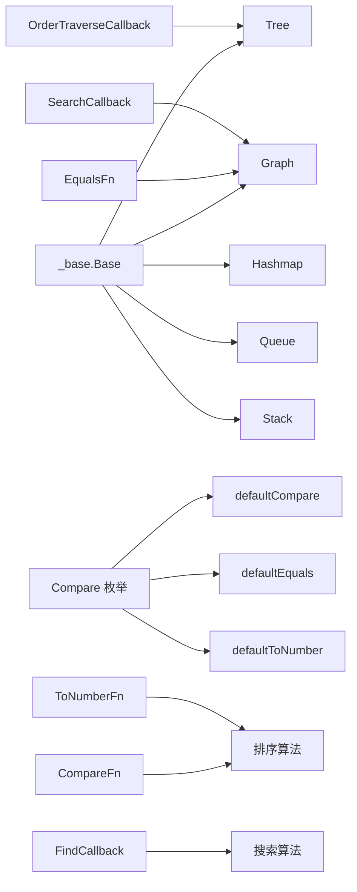
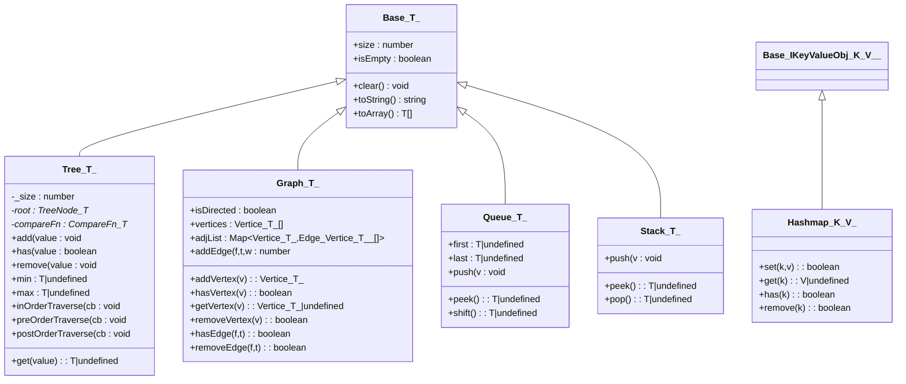
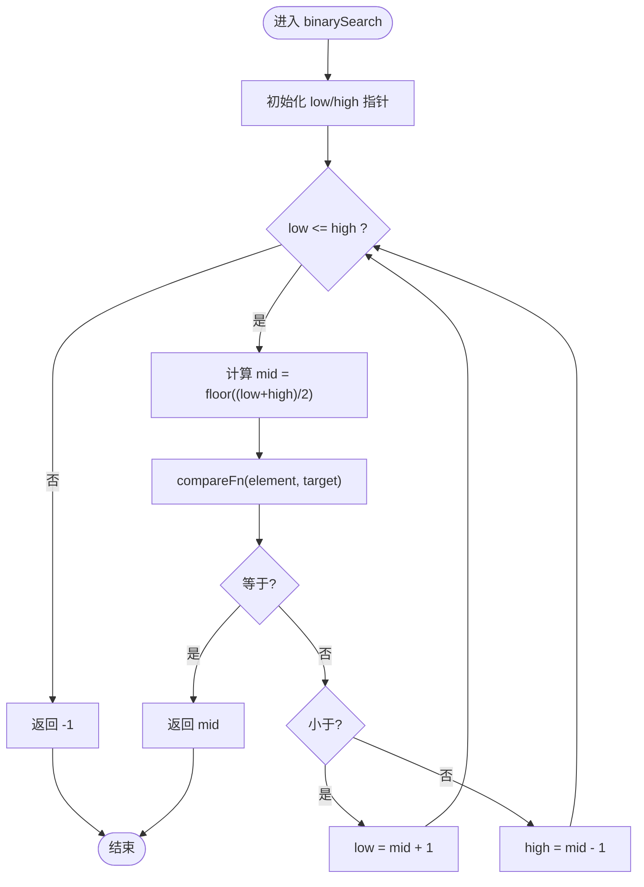
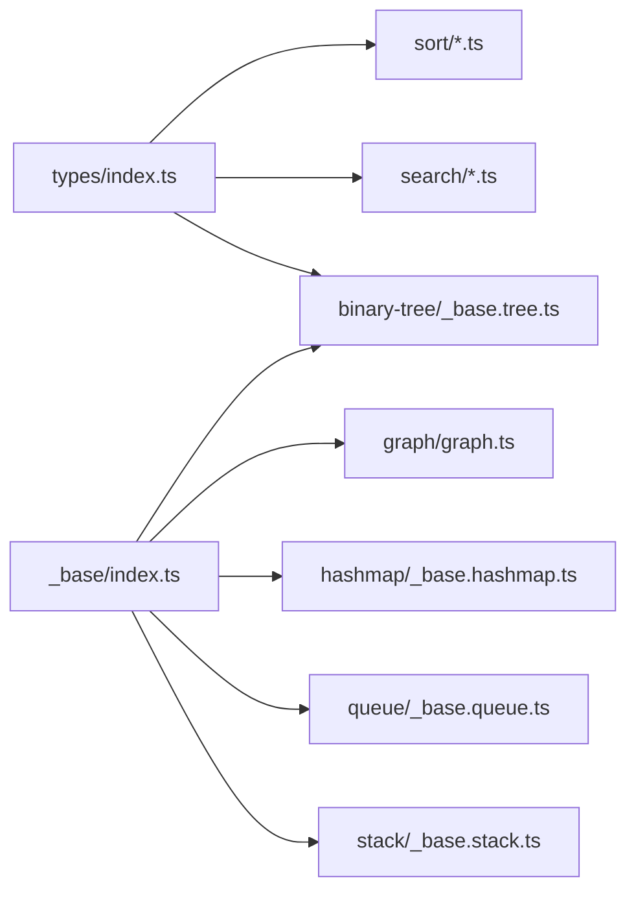

# 工具类型和接口

<cite>
**本文引用的文件**
- [packages/algorithm/src/_base/index.ts](file://packages/algorithm/src/_base/index.ts)
- [packages/algorithm/src/types/index.ts](file://packages/algorithm/src/types/index.ts)
- [packages/algorithm/src/binary-tree/_base.tree.ts](file://packages/algorithm/src/binary-tree/_base.tree.ts)
- [packages/algorithm/src/graph/graph.ts](file://packages/algorithm/src/graph/graph.ts)
- [packages/algorithm/src/hashmap/_base.hashmap.ts](file://packages/algorithm/src/hashmap/_base.hashmap.ts)
- [packages/algorithm/src/queue/_base.queue.ts](file://packages/algorithm/src/queue/_base.queue.ts)
- [packages/algorithm/src/stack/_base.stack.ts](file://packages/algorithm/src/stack/_base.stack.ts)
- [packages/algorithm/src/sort/quick.sort.ts](file://packages/algorithm/src/sort/quick.sort.ts)
- [packages/algorithm/src/search/binary.search.ts](file://packages/algorithm/src/search/binary.search.ts)
- [packages/algorithm/src/index.ts](file://packages/algorithm/src/index.ts)
- [packages/algorithm/src/test/compare.spec.ts](file://packages/algorithm/src/test/compare.spec.ts)
</cite>

## 目录
1. [简介](#简介)
2. [项目结构](#项目结构)
3. [核心组件](#核心组件)
4. [架构总览](#架构总览)
5. [详细组件分析](#详细组件分析)
6. [依赖分析](#依赖分析)
7. [性能考虑](#性能考虑)
8. [故障排查指南](#故障排查指南)
9. [结论](#结论)
10. [附录](#附录)

## 简介
本章节面向“工具类型与接口”模块，系统化梳理算法库中通用的类型别名、接口与基础抽象类，覆盖比较器、相等性判断、类型转换、回调约定以及数据结构与算法的通用接口设计。文档同时给出类型签名、泛型约束、继承关系、使用示例与最佳实践，帮助开发者正确扩展自定义算法。

## 项目结构
算法库采用按功能域划分的组织方式：各数据结构（树、图、堆、队列、栈、哈希表）与算法（排序、搜索）分别位于独立子目录；公共工具与基础类型集中在 _base 与 types 目录，作为上层模块的基础设施。

图表来源
- [packages/algorithm/src/index.ts:1-24](file://packages/algorithm/src/index.ts#L1-L24)
- [packages/algorithm/src/_base/index.ts:1-162](file://packages/algorithm/src/_base/index.ts#L1-L162)
- [packages/algorithm/src/types/index.ts:1-21](file://packages/algorithm/src/types/index.ts#L1-L21)

章节来源
- [packages/algorithm/src/index.ts:1-24](file://packages/algorithm/src/index.ts#L1-L24)

## 核心组件
本节聚焦“工具类型与接口”的核心要素：比较枚举、比较/相等/转换函数类型、默认实现，以及通用回调类型。

- 比较枚举 Compare
  - 定义三值比较结果：小于、等于、大于。
  - 用途：统一排序、搜索、树插入/查找等场景的比较语义。
  - 章节来源
    - [packages/algorithm/src/_base/index.ts:9-13](file://packages/algorithm/src/_base/index.ts#L9-L13)

- 默认相等性 defaultEquals
  - 泛型函数，用于判断两个值是否相等。
  - 章节来源
    - [packages/algorithm/src/_base/index.ts:84-84](file://packages/algorithm/src/_base/index.ts#L84-L84)

- 默认比较 defaultCompare
  - 泛型函数，基于严格大于/小于关系返回 Compare 结果。
  - 章节来源
    - [packages/algorithm/src/_base/index.ts:98-101](file://packages/algorithm/src/_base/index.ts#L98-L101)

- 默认数值转换 defaultToNumber
  - 泛型函数，将任意类型安全地转换为数字，确保不同对象不被映射为相同数字。
  - 章节来源
    - [packages/algorithm/src/_base/index.ts:115-119](file://packages/algorithm/src/_base/index.ts#L115-L119)

- 类型别名
  - EqualsFn<T>: 用于相等性判断的函数类型。
  - CompareFn<T>: 用于比较的函数类型，返回 Compare。
  - ToNumberFn<T>: 任意类型到数字的转换函数类型。
  - 章节来源
    - [packages/algorithm/src/_base/index.ts:133-147](file://packages/algorithm/src/_base/index.ts#L133-L147)
    - [packages/algorithm/src/_base/index.ts:161-161](file://packages/algorithm/src/_base/index.ts#L161-L161)

- 回调类型
  - FindCallback<T>: 查找遍历回调，输入元素，返回布尔。
  - OrderTraverseCallback<T>: 树的中/前/后序遍历回调。
  - SearchCallback<T,E>: 图的广度/深度优先遍历回调，输入节点值与边。
  - 章节来源
    - [packages/algorithm/src/types/index.ts:6-6](file://packages/algorithm/src/types/index.ts#L6-L6)
    - [packages/algorithm/src/types/index.ts:13-13](file://packages/algorithm/src/types/index.ts#L13-L13)
    - [packages/algorithm/src/types/index.ts:20-20](file://packages/algorithm/src/types/index.ts#L20-L20)

- 基础抽象类 Base<T>
  - 抽象属性：size、isEmpty。
  - 抽象方法：clear、toString、toArray。
  - 设计意图：统一算法容器的生命周期与表现形式。
  - 章节来源
    - [packages/algorithm/src/_base/index.ts:22-70](file://packages/algorithm/src/_base/index.ts#L22-L70)

- 错误与异常
  - 本模块未定义专用错误类型；默认比较/相等/转换函数遵循严格类型契约，建议在自定义实现中保持一致性。
  - 章节来源
    - [packages/algorithm/src/_base/index.ts:84-119](file://packages/algorithm/src/_base/index.ts#L84-L119)

- 版本与兼容性
  - 当前仓库未提供明确的版本号或变更日志字段；默认函数与类型别名保持稳定，便于扩展。
  - 章节来源
    - [packages/algorithm/src/_base/index.ts:1-162](file://packages/algorithm/src/_base/index.ts#L1-L162)

## 架构总览
下图展示“工具类型与接口”在算法库中的定位与依赖关系：所有具体数据结构与算法均通过类型别名与默认函数复用统一的比较/相等/转换语义。

图表来源
- [packages/algorithm/src/_base/index.ts:9-161](file://packages/algorithm/src/_base/index.ts#L9-L161)
- [packages/algorithm/src/binary-tree/_base.tree.ts:34-330](file://packages/algorithm/src/binary-tree/_base.tree.ts#L34-L330)
- [packages/algorithm/src/graph/graph.ts:93-329](file://packages/algorithm/src/graph/graph.ts#L93-L329)
- [packages/algorithm/src/hashmap/_base.hashmap.ts:120-177](file://packages/algorithm/src/hashmap/_base.hashmap.ts#L120-L177)
- [packages/algorithm/src/queue/_base.queue.ts:10-74](file://packages/algorithm/src/queue/_base.queue.ts#L10-L74)
- [packages/algorithm/src/stack/_base.stack.ts:8-50](file://packages/algorithm/src/stack/_base.stack.ts#L8-L50)
- [packages/algorithm/src/types/index.ts:6-20](file://packages/algorithm/src/types/index.ts#L6-L20)

## 详细组件分析

### 比较与相等性体系
- Compare 枚举
  - 三值比较结果，用于统一大小关系判定。
  - 章节来源
    - [packages/algorithm/src/_base/index.ts:9-13](file://packages/algorithm/src/_base/index.ts#L9-L13)

- defaultCompare<T>
  - 输入两个同类型值，输出 Compare 结果。
  - 适用场景：排序、搜索、树插入/查找。
  - 章节来源
    - [packages/algorithm/src/_base/index.ts:98-101](file://packages/algorithm/src/_base/index.ts#L98-L101)

- defaultEquals<T>
  - 输入两个可选值，输出布尔结果。
  - 适用场景：集合判重、图顶点/边存在性检查。
  - 章节来源
    - [packages/algorithm/src/_base/index.ts:84-84](file://packages/algorithm/src/_base/index.ts#L84-L84)

- defaultToNumber<T>
  - 将任意类型转换为数字，避免冲突。
  - 适用场景：基数排序、计数排序等非比较排序。
  - 章节来源
    - [packages/algorithm/src/_base/index.ts:115-119](file://packages/algorithm/src/_base/index.ts#L115-L119)

- 类型别名 CompareFn<T>、EqualsFn<T>、ToNumberFn<T>
  - 用于替换默认实现，支持自定义比较/相等/转换逻辑。
  - 章节来源
    - [packages/algorithm/src/_base/index.ts:133-161](file://packages/algorithm/src/_base/index.ts#L133-L161)

- 使用示例与最佳实践
  - 排序：使用 CompareFn<T> 替换 defaultCompare，确保稳定性与可读性。
  - 搜索：二分搜索需保证输入已按 CompareFn<T> 升序排列。
  - 图/集合：使用 EqualsFn<T> 保证顶点/元素唯一性。
  - 章节来源
    - [packages/algorithm/src/sort/quick.sort.ts:61-62](file://packages/algorithm/src/sort/quick.sort.ts#L61-L62)
    - [packages/algorithm/src/search/binary.search.ts:17-37](file://packages/algorithm/src/search/binary.search.ts#L17-L37)
    - [packages/algorithm/src/test/compare.spec.ts:4-13](file://packages/algorithm/src/test/compare.spec.ts#L4-L13)

章节来源
- [packages/algorithm/src/_base/index.ts:9-161](file://packages/algorithm/src/_base/index.ts#L9-L161)
- [packages/algorithm/src/sort/quick.sort.ts:61-62](file://packages/algorithm/src/sort/quick.sort.ts#L61-L62)
- [packages/algorithm/src/search/binary.search.ts:17-37](file://packages/algorithm/src/search/binary.search.ts#L17-L37)
- [packages/algorithm/src/test/compare.spec.ts:4-13](file://packages/algorithm/src/test/compare.spec.ts#L4-L13)

### 数据结构通用接口与基类
- Base<T>
  - 统一抽象：size、isEmpty、clear、toString、toArray。
  - 章节来源
    - [packages/algorithm/src/_base/index.ts:22-70](file://packages/algorithm/src/_base/index.ts#L22-L70)

- Tree<T>
  - 继承 Base<T>，提供树的增删查、最值访问与三种遍历。
  - 关键抽象：_addNode、_hasNode、_getNode、_removeNode、_minNode、_maxNode 及三种遍历的受保护实现。
  - 章节来源
    - [packages/algorithm/src/binary-tree/_base.tree.ts:34-330](file://packages/algorithm/src/binary-tree/_base.tree.ts#L34-L330)

- Graph<T>
  - 继承 Base<IGraphToArrayItem<T>>，封装顶点与邻接表，支持有向/无向图。
  - 关键抽象：顶点/边的增删查、相等性判断。
  - 章节来源
    - [packages/algorithm/src/graph/graph.ts:93-329](file://packages/algorithm/src/graph/graph.ts#L93-L329)

- Hashmap<K,V>
  - 继承 Base<IKeyValueObj<K,V>>，提供 set/get/has/remove。
  - 关键抽象：键值对存储与冲突处理策略（由具体实现类决定）。
  - 章节来源
    - [packages/algorithm/src/hashmap/_base.hashmap.ts:120-177](file://packages/algorithm/src/hashmap/_base.hashmap.ts#L120-L177)

- Queue<T>
  - 继承 Base<T>，提供 first/last、push、peek、shift。
  - 章节来源
    - [packages/algorithm/src/queue/_base.queue.ts:10-74](file://packages/algorithm/src/queue/_base.queue.ts#L10-L74)

- Stack<T>
  - 继承 Base<T>，提供 push、peek、pop。
  - 章节来源
    - [packages/algorithm/src/stack/_base.stack.ts:8-50](file://packages/algorithm/src/stack/_base.stack.ts#L8-L50)

- 类图（基于实际代码）

图表来源
- [packages/algorithm/src/_base/index.ts:22-70](file://packages/algorithm/src/_base/index.ts#L22-L70)
- [packages/algorithm/src/binary-tree/_base.tree.ts:34-330](file://packages/algorithm/src/binary-tree/_base.tree.ts#L34-L330)
- [packages/algorithm/src/graph/graph.ts:93-329](file://packages/algorithm/src/graph/graph.ts#L93-L329)
- [packages/algorithm/src/hashmap/_base.hashmap.ts:120-177](file://packages/algorithm/src/hashmap/_base.hashmap.ts#L120-L177)
- [packages/algorithm/src/queue/_base.queue.ts:10-74](file://packages/algorithm/src/queue/_base.queue.ts#L10-L74)
- [packages/algorithm/src/stack/_base.stack.ts:8-50](file://packages/algorithm/src/stack/_base.stack.ts#L8-L50)

章节来源
- [packages/algorithm/src/_base/index.ts:22-70](file://packages/algorithm/src/_base/index.ts#L22-L70)
- [packages/algorithm/src/binary-tree/_base.tree.ts:34-330](file://packages/algorithm/src/binary-tree/_base.tree.ts#L34-L330)
- [packages/algorithm/src/graph/graph.ts:93-329](file://packages/algorithm/src/graph/graph.ts#L93-L329)
- [packages/algorithm/src/hashmap/_base.hashmap.ts:120-177](file://packages/algorithm/src/hashmap/_base.hashmap.ts#L120-L177)
- [packages/algorithm/src/queue/_base.queue.ts:10-74](file://packages/algorithm/src/queue/_base.queue.ts#L10-L74)
- [packages/algorithm/src/stack/_base.stack.ts:8-50](file://packages/algorithm/src/stack/_base.stack.ts#L8-L50)

### 回调与遍历接口
- FindCallback<T>
  - 用于查找/过滤场景的回调，输入元素，返回布尔。
  - 章节来源
    - [packages/algorithm/src/types/index.ts:6-6](file://packages/algorithm/src/types/index.ts#L6-L6)

- OrderTraverseCallback<T>
  - 用于树的中/前/后序遍历回调。
  - 章节来源
    - [packages/algorithm/src/types/index.ts:13-13](file://packages/algorithm/src/types/index.ts#L13-L13)

- SearchCallback<T,E>
  - 用于图的 BFS/DFS 遍历回调，输入节点值与边。
  - 章节来源
    - [packages/algorithm/src/types/index.ts:20-20](file://packages/algorithm/src/types/index.ts#L20-L20)

- 使用示例
  - 树遍历：传入 OrderTraverseCallback<T> 执行访问/收集。
  - 图遍历：传入 SearchCallback<T,E> 记录路径/权重。
  - 章节来源
    - [packages/algorithm/src/binary-tree/_base.tree.ts:221-295](file://packages/algorithm/src/binary-tree/_base.tree.ts#L221-L295)
    - [packages/algorithm/src/graph/graph.ts:151-301](file://packages/algorithm/src/graph/graph.ts#L151-L301)

章节来源
- [packages/algorithm/src/types/index.ts:6-20](file://packages/algorithm/src/types/index.ts#L6-L20)
- [packages/algorithm/src/binary-tree/_base.tree.ts:221-295](file://packages/algorithm/src/binary-tree/_base.tree.ts#L221-L295)
- [packages/algorithm/src/graph/graph.ts:151-301](file://packages/algorithm/src/graph/graph.ts#L151-L301)

### 算法通用接口与流程
- 排序算法 quickSort
  - 泛型 T 数组，支持自定义 CompareFn<T>。
  - 时间复杂度：平均 O(n log n)，最坏 O(n^2)，空间 O(n log n)。
  - 章节来源
    - [packages/algorithm/src/sort/quick.sort.ts:61-62](file://packages/algorithm/src/sort/quick.sort.ts#L61-L62)

- 二分搜索 binarySearch
  - 要求输入按 CompareFn<T> 升序排列。
  - 时间复杂度：O(log n)。
  - 章节来源
    - [packages/algorithm/src/search/binary.search.ts:17-37](file://packages/algorithm/src/search/binary.search.ts#L17-L37)

- 流程图（二分搜索）

图表来源
- [packages/algorithm/src/search/binary.search.ts:17-37](file://packages/algorithm/src/search/binary.search.ts#L17-L37)

章节来源
- [packages/algorithm/src/sort/quick.sort.ts:61-62](file://packages/algorithm/src/sort/quick.sort.ts#L61-L62)
- [packages/algorithm/src/search/binary.search.ts:17-37](file://packages/algorithm/src/search/binary.search.ts#L17-L37)

## 依赖分析
- 内聚性与耦合
  - _base 提供统一的比较/相等/转换与基础类，其他模块通过类型别名与默认函数进行低耦合复用。
  - types 仅定义回调与转换类型，保持纯类型层面的解耦。
- 外部依赖
  - 无第三方运行时依赖，纯 TypeScript 类型与实现。
- 循环依赖
  - 未发现循环导入；模块间通过导出再导入的方式组织。

图表来源
- [packages/algorithm/src/types/index.ts:1-21](file://packages/algorithm/src/types/index.ts#L1-L21)
- [packages/algorithm/src/_base/index.ts:1-162](file://packages/algorithm/src/_base/index.ts#L1-L162)
- [packages/algorithm/src/binary-tree/_base.tree.ts:1-3](file://packages/algorithm/src/binary-tree/_base.tree.ts#L1-L3)
- [packages/algorithm/src/graph/graph.ts:1-1](file://packages/algorithm/src/graph/graph.ts#L1-L1)
- [packages/algorithm/src/hashmap/_base.hashmap.ts:1-1](file://packages/algorithm/src/hashmap/_base.hashmap.ts#L1-L1)
- [packages/algorithm/src/queue/_base.queue.ts:1-1](file://packages/algorithm/src/queue/_base.queue.ts#L1-L1)
- [packages/algorithm/src/stack/_base.stack.ts:1-1](file://packages/algorithm/src/stack/_base.stack.ts#L1-L1)

章节来源
- [packages/algorithm/src/types/index.ts:1-21](file://packages/algorithm/src/types/index.ts#L1-L21)
- [packages/algorithm/src/_base/index.ts:1-162](file://packages/algorithm/src/_base/index.ts#L1-L162)

## 性能考虑
- 比较/相等/转换函数
  - 自定义 CompareFn<T> 应尽量避免高开销操作（如字符串拼接），确保 O(1) 或 O(log n) 以内。
- 默认转换 defaultToNumber<T>
  - 对于复杂对象，建议提供稳定的 ToNumberFn<T>，避免碰撞导致退化。
- 遍历与回调
  - OrderTraverseCallback<T> 与 SearchCallback<T,E> 的实现应避免在回调中执行阻塞操作，保持 O(1) 访问。

## 故障排查指南
- 比较顺序不一致
  - 现象：二分搜索返回 -1 或排序结果异常。
  - 排查：确认 CompareFn<T> 与数据类型一致，二分搜索前确保数组已按升序排列。
  - 章节来源
    - [packages/algorithm/src/search/binary.search.ts:17-37](file://packages/algorithm/src/search/binary.search.ts#L17-L37)
- 相等性判断失效
  - 现象：图/集合重复元素未去重。
  - 排查：提供 EqualsFn<T> 并确保其满足等价关系（自反、对称、传递）。
  - 章节来源
    - [packages/algorithm/src/graph/graph.ts:122-132](file://packages/algorithm/src/graph/graph.ts#L122-L132)
- 遍历回调副作用
  - 现象：树/图遍历过程中状态错乱。
  - 排查：回调中避免修改底层数据结构，必要时复制状态。
  - 章节来源
    - [packages/algorithm/src/binary-tree/_base.tree.ts:221-295](file://packages/algorithm/src/binary-tree/_base.tree.ts#L221-L295)
    - [packages/algorithm/src/graph/graph.ts:151-301](file://packages/algorithm/src/graph/graph.ts#L151-L301)

## 结论
工具类型与接口模块通过统一的比较/相等/转换与基础抽象类，为算法库提供了清晰、可扩展的基础设施。遵循本文档的类型签名、泛型约束与最佳实践，可高效扩展自定义算法并保持一致的性能与行为预期。

## 附录
- 快速索引
  - 比较/相等/转换：Compare、defaultCompare、defaultEquals、defaultToNumber、CompareFn<T>、EqualsFn<T>、ToNumberFn<T>
  - 回调类型：FindCallback<T>、OrderTraverseCallback<T>、SearchCallback<T,E>
  - 基础类：Base<T>、Tree<T>、Graph<T>、Hashmap<K,V>、Queue<T>、Stack<T>
- 示例参考
  - 排序：[packages/algorithm/src/sort/quick.sort.ts:61-62](file://packages/algorithm/src/sort/quick.sort.ts#L61-L62)
  - 二分搜索：[packages/algorithm/src/search/binary.search.ts:17-37](file://packages/algorithm/src/search/binary.search.ts#L17-L37)
  - 比较函数对比测试：[packages/algorithm/src/test/compare.spec.ts:4-13](file://packages/algorithm/src/test/compare.spec.ts#L4-L13)