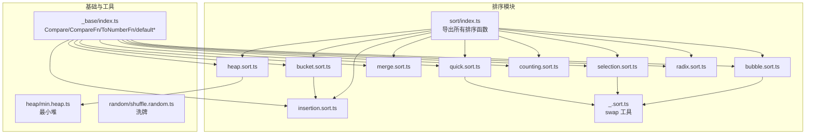
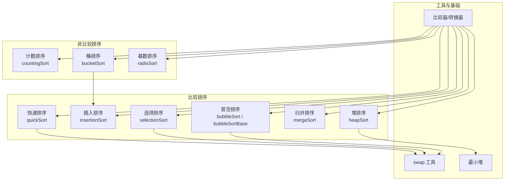
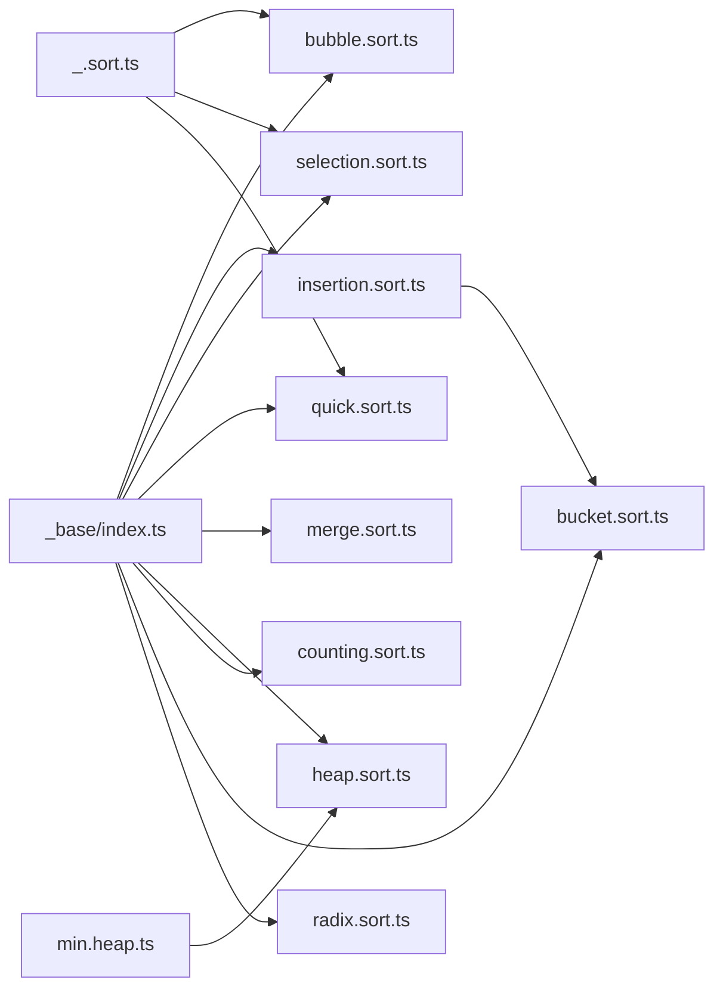
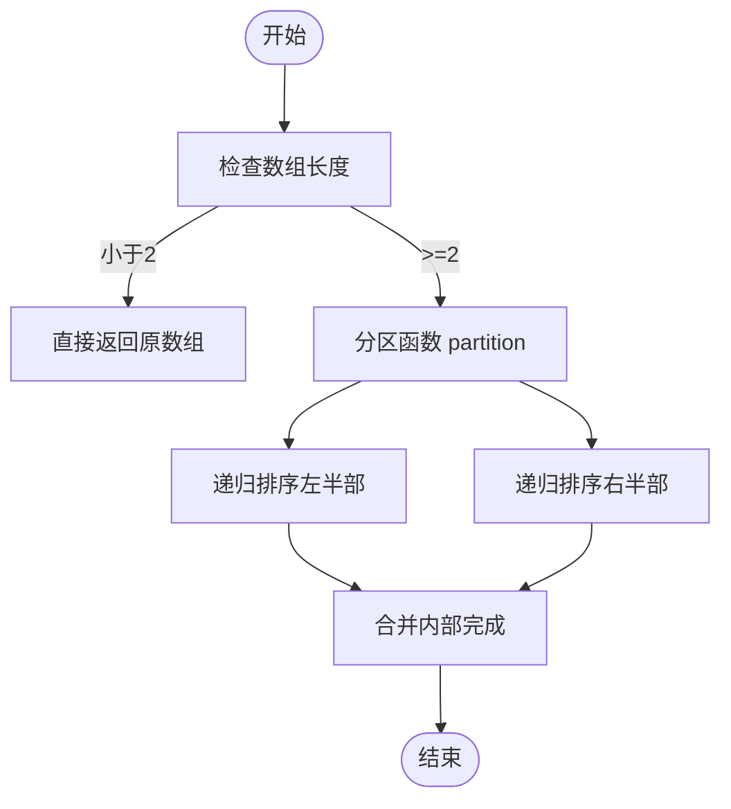
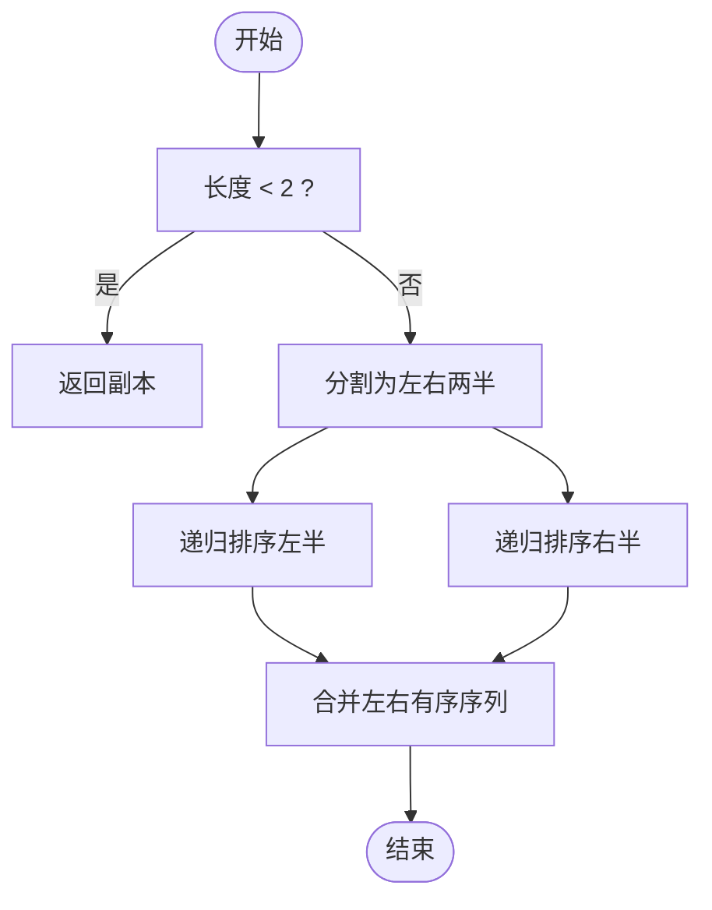
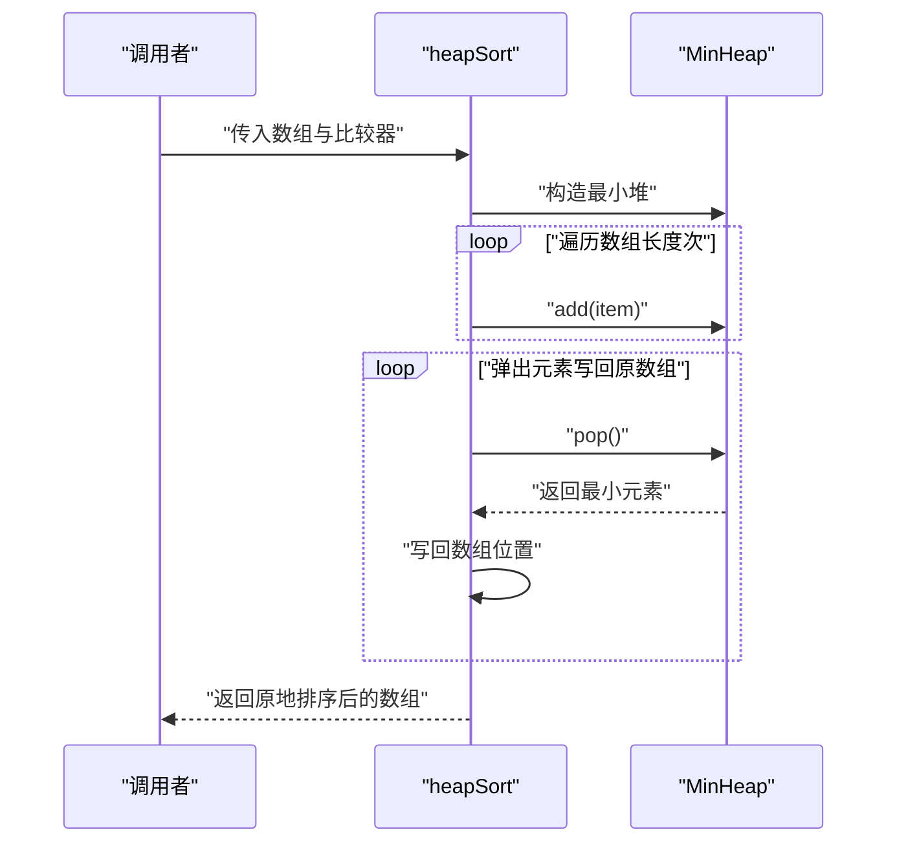

# 排序算法

<cite>
**本文引用的文件**
- [packages/algorithm/src/sort/index.ts](file://packages/algorithm/src/sort/index.ts)
- [packages/algorithm/src/sort/_.sort.ts](file://packages/algorithm/src/sort/_.sort.ts)
- [packages/algorithm/src/sort/bubble.sort.ts](file://packages/algorithm/src/sort/bubble.sort.ts)
- [packages/algorithm/src/sort/insertion.sort.ts](file://packages/algorithm/src/sort/insertion.sort.ts)
- [packages/algorithm/src/sort/selection.sort.ts](file://packages/algorithm/src/sort/selection.sort.ts)
- [packages/algorithm/src/sort/quick.sort.ts](file://packages/algorithm/src/sort/quick.sort.ts)
- [packages/algorithm/src/sort/merge.sort.ts](file://packages/algorithm/src/sort/merge.sort.ts)
- [packages/algorithm/src/sort/heap.sort.ts](file://packages/algorithm/src/sort/heap.sort.ts)
- [packages/algorithm/src/sort/counting.sort.ts](file://packages/algorithm/src/sort/counting.sort.ts)
- [packages/algorithm/src/sort/bucket.sort.ts](file://packages/algorithm/src/sort/bucket.sort.ts)
- [packages/algorithm/src/sort/radix.sort.ts](file://packages/algorithm/src/sort/radix.sort.ts)
- [packages/algorithm/src/random/shuffle.random.ts](file://packages/algorithm/src/random/shuffle.random.ts)
- [packages/algorithm/src/_base/index.ts](file://packages/algorithm/src/_base/index.ts)
- [packages/algorithm/src/heap/min.heap.ts](file://packages/algorithm/src/heap/min.heap.ts)
- [packages/algorithm/src/test/sort.spec.ts](file://packages/algorithm/src/test/sort.spec.ts)
</cite>

## 目录
1. [简介](#简介)
2. [项目结构](#项目结构)
3. [核心组件](#核心组件)
4. [架构总览](#架构总览)
5. [详细组件分析](#详细组件分析)
6. [依赖分析](#依赖分析)
7. [性能考量](#性能考量)
8. [故障排查指南](#故障排查指南)
9. [结论](#结论)
10. [附录](#附录)

## 简介
本文件为排序算法模块的详细API参考与使用说明，覆盖比较排序（冒泡排序、插入排序、选择排序、快速排序、归并排序、堆排序）与非比较排序（计数排序、桶排序、基数排序），以及随机化算法（洗牌算法）。文档逐项给出方法签名、参数类型、返回值类型、时间/空间复杂度、稳定性特征、类型约束与泛型用法，并提供流程图与序列图帮助理解实现细节与调用流程。

## 项目结构
排序相关代码位于 packages/algorithm/src/sort 下，通过统一导出入口聚合；基础类型与比较器在 _base 中定义；随机化算法位于 random；堆实现位于 heap；测试用例位于 test。

图表来源
- [packages/algorithm/src/sort/index.ts:1-18](file://packages/algorithm/src/sort/index.ts#L1-L18)
- [packages/algorithm/src/sort/bubble.sort.ts:1-65](file://packages/algorithm/src/sort/bubble.sort.ts#L1-L65)
- [packages/algorithm/src/sort/insertion.sort.ts:1-40](file://packages/algorithm/src/sort/insertion.sort.ts#L1-L40)
- [packages/algorithm/src/sort/selection.sort.ts:1-40](file://packages/algorithm/src/sort/selection.sort.ts#L1-L40)
- [packages/algorithm/src/sort/quick.sort.ts:1-63](file://packages/algorithm/src/sort/quick.sort.ts#L1-L63)
- [packages/algorithm/src/sort/merge.sort.ts:1-47](file://packages/algorithm/src/sort/merge.sort.ts#L1-L47)
- [packages/algorithm/src/sort/heap.sort.ts:1-37](file://packages/algorithm/src/sort/heap.sort.ts#L1-L37)
- [packages/algorithm/src/sort/counting.sort.ts:1-59](file://packages/algorithm/src/sort/counting.sort.ts#L1-L59)
- [packages/algorithm/src/sort/bucket.sort.ts:1-73](file://packages/algorithm/src/sort/bucket.sort.ts#L1-L73)
- [packages/algorithm/src/sort/radix.sort.ts:1-65](file://packages/algorithm/src/sort/radix.sort.ts#L1-L65)
- [packages/algorithm/src/sort/_.sort.ts:1-17](file://packages/algorithm/src/sort/_.sort.ts#L1-L17)
- [packages/algorithm/src/_base/index.ts:1-162](file://packages/algorithm/src/_base/index.ts#L1-L162)
- [packages/algorithm/src/heap/min.heap.ts:1-44](file://packages/algorithm/src/heap/min.heap.ts#L1-L44)
- [packages/algorithm/src/random/shuffle.random.ts:1-19](file://packages/algorithm/src/random/shuffle.random.ts#L1-L19)

章节来源
- [packages/algorithm/src/sort/index.ts:1-18](file://packages/algorithm/src/sort/index.ts#L1-L18)

## 核心组件
本节概述所有排序与随机化算法的API形态与通用约定。

- 泛型与类型约束
  - 所有排序函数均以泛型 T 表示输入数组元素类型。
  - 比较排序依赖 CompareFn<T>：接收两个元素，返回比较结果枚举 Compare。
  - 非比较排序（计数、桶、基数）依赖 ToNumberFn<T>：将元素转换为可比较的数值。
  - 默认比较 defaultCompare<T> 与默认转换 defaultToNumber<T> 提供开箱即用能力。
- 共同约定
  - 参数顺序：列表在前，比较/转换函数在后，且均有默认实现。
  - 返回值：多数原地排序返回原数组引用；部分非原地排序返回新数组。
  - 异常处理：未见显式 try/catch 或抛错逻辑，建议调用方确保输入合法（如空数组安全、toNumber 不会返回 NaN）。

章节来源
- [packages/algorithm/src/_base/index.ts:9-162](file://packages/algorithm/src/_base/index.ts#L9-L162)
- [packages/algorithm/src/sort/_.sort.ts:9-16](file://packages/algorithm/src/sort/_.sort.ts#L9-L16)

## 架构总览
排序算法按“比较排序”和“非比较排序”两类组织，部分算法复用基础工具与堆结构。

图表来源
- [packages/algorithm/src/sort/bubble.sort.ts:23-33](file://packages/algorithm/src/sort/bubble.sort.ts#L23-L33)
- [packages/algorithm/src/sort/insertion.sort.ts:24-39](file://packages/algorithm/src/sort/insertion.sort.ts#L24-L39)
- [packages/algorithm/src/sort/selection.sort.ts:23-39](file://packages/algorithm/src/sort/selection.sort.ts#L23-L39)
- [packages/algorithm/src/sort/quick.sort.ts:61-62](file://packages/algorithm/src/sort/quick.sort.ts#L61-L62)
- [packages/algorithm/src/sort/merge.sort.ts:36-46](file://packages/algorithm/src/sort/merge.sort.ts#L36-L46)
- [packages/algorithm/src/sort/heap.sort.ts:25-36](file://packages/algorithm/src/sort/heap.sort.ts#L25-L36)
- [packages/algorithm/src/sort/counting.sort.ts:24-58](file://packages/algorithm/src/sort/counting.sort.ts#L24-L58)
- [packages/algorithm/src/sort/bucket.sort.ts:61-72](file://packages/algorithm/src/sort/bucket.sort.ts#L61-L72)
- [packages/algorithm/src/sort/radix.sort.ts:25-64](file://packages/algorithm/src/sort/radix.sort.ts#L25-L64)
- [packages/algorithm/src/sort/_.sort.ts:9-16](file://packages/algorithm/src/sort/_.sort.ts#L9-L16)
- [packages/algorithm/src/_base/index.ts:98-119](file://packages/algorithm/src/_base/index.ts#L98-L119)
- [packages/algorithm/src/heap/min.heap.ts:12-43](file://packages/algorithm/src/heap/min.heap.ts#L12-L43)

## 详细组件分析

### 冒泡排序（bubbleSort / bubbleSortBase）
- 方法签名
  - bubbleSortBase<T>(list: T[], compareFu?: CompareFn<T>): T[]
  - bubbleSort<T>(list: T[], compareFu?: CompareFn<T>): T[]
- 参数与返回
  - list：待排序数组
  - compareFu：比较函数，默认 defaultCompare
  - 返回：原数组引用
- 复杂度与稳定性
  - 时间：平均/最坏 O(n^2)，最好 O(n)
  - 空间：O(1)
  - 稳定性：稳定
- 实现要点
  - bubbleSortBase 无内层循环剪枝；bubbleSort 在每轮减少一次比较范围
- 使用场景
  - 教学演示、极小规模或基本有序数据

章节来源
- [packages/algorithm/src/sort/bubble.sort.ts:23-33](file://packages/algorithm/src/sort/bubble.sort.ts#L23-L33)
- [packages/algorithm/src/sort/bubble.sort.ts:54-64](file://packages/algorithm/src/sort/bubble.sort.ts#L54-L64)

### 插入排序（insertionSort）
- 方法签名
  - insertionSort<T>(list: T[], compareFu?: CompareFn<T>): T[]
- 参数与返回
  - list：待排序数组
  - compareFu：比较函数，默认 defaultCompare
  - 返回：原数组引用
- 复杂度与稳定性
  - 时间：平均/最坏 O(n^2)，最好 O(n)
  - 空间：O(1)
  - 稳定性：稳定
- 实现要点
  - 对已排序前缀进行二分思想的内移，适合小规模或基本有序
- 使用场景
  - 小规模数据、在线插入、作为桶排序子过程

章节来源
- [packages/algorithm/src/sort/insertion.sort.ts:24-39](file://packages/algorithm/src/sort/insertion.sort.ts#L24-L39)

### 选择排序（selectionSort）
- 方法签名
  - selectionSort<T>(list: T[], compareFu?: CompareFn<T>): T[]
- 参数与返回
  - list：待排序数组
  - compareFu：比较函数，默认 defaultCompare
  - 返回：原数组引用
- 复杂度与稳定性
  - 时间：O(n^2)
  - 空间：O(1)
  - 稳定性：不稳定
- 实现要点
  - 每轮选择最小（大）元素与当前位置交换
- 使用场景
  - 内存写入代价高时的交换次数较少需求

章节来源
- [packages/algorithm/src/sort/selection.sort.ts:23-39](file://packages/algorithm/src/sort/selection.sort.ts#L23-L39)

### 快速排序（quickSort）
- 方法签名
  - quickSort<T>(list: T[], compareFu?: CompareFn<T>): T[]
- 参数与返回
  - list：待排序数组
  - compareFu：比较函数，默认 defaultCompare
  - 返回：原数组引用
- 复杂度与稳定性
  - 时间：平均 O(n log n)，最坏 O(n^2)，最好 O(n log n)
  - 空间：O(n log n)
  - 稳定性：不稳定
- 实现要点
  - 分区函数 partition 以中位数为基准，双指针扫描交换
  - 递归对左右区间排序
- 使用场景
  - 一般用途高效排序，注意最坏情况与栈深

章节来源
- [packages/algorithm/src/sort/quick.sort.ts:4-26](file://packages/algorithm/src/sort/quick.sort.ts#L4-L26)
- [packages/algorithm/src/sort/quick.sort.ts:28-40](file://packages/algorithm/src/sort/quick.sort.ts#L28-L40)
- [packages/algorithm/src/sort/quick.sort.ts:61-62](file://packages/algorithm/src/sort/quick.sort.ts#L61-L62)

### 归并排序（mergeSort）
- 方法签名
  - mergeSort<T>(list: T[], compareFu?: CompareFn<T>): T[]
- 参数与返回
  - list：待排序数组
  - compareFu：比较函数，默认 defaultCompare
  - 返回：新数组（非原数组）
- 复杂度与稳定性
  - 时间：O(n log n)
  - 空间：O(n)
  - 稳定性：稳定
- 实现要点
  - 递归分割为左右两半，再合并
  - 合并过程中按比较器选择较小元素
- 使用场景
  - 需要稳定排序或外部排序场景

章节来源
- [packages/algorithm/src/sort/merge.sort.ts:5-15](file://packages/algorithm/src/sort/merge.sort.ts#L5-L15)
- [packages/algorithm/src/sort/merge.sort.ts:36-46](file://packages/algorithm/src/sort/merge.sort.ts#L36-L46)

### 堆排序（heapSort）
- 方法签名
  - heapSort<T>(list: T[], compareFu?: CompareFn<T>): T[]
- 参数与返回
  - list：待排序数组
  - compareFu：比较函数，默认 defaultCompare
  - 返回：原数组引用
- 复杂度与稳定性
  - 时间：O(n log n)
  - 空间：O(1)
  - 稳定性：不稳定
- 实现要点
  - 使用最小堆，依次弹出构建有序序列
- 使用场景
  - 原地排序、内存受限

章节来源
- [packages/algorithm/src/sort/heap.sort.ts:25-36](file://packages/algorithm/src/sort/heap.sort.ts#L25-L36)
- [packages/algorithm/src/heap/min.heap.ts:12-43](file://packages/algorithm/src/heap/min.heap.ts#L12-L43)

### 计数排序（countingSort）
- 方法签名
  - countingSort<T>(list: T[], toNumber?: ToNumberFn<T>): T[]
- 参数与返回
  - list：待排序数组
  - toNumber：元素转数值函数，默认 defaultToNumber
  - 返回：原数组引用
- 复杂度与稳定性
  - 时间：O(n + k)，k 为数值范围
  - 空间：O(n + k)
  - 稳定性：稳定
- 实现要点
  - 统计频次，按序回填
- 使用场景
  - 整数范围有限的数据集

章节来源
- [packages/algorithm/src/sort/counting.sort.ts:24-58](file://packages/algorithm/src/sort/counting.sort.ts#L24-L58)
- [packages/algorithm/src/_base/index.ts:115-119](file://packages/algorithm/src/_base/index.ts#L115-L119)

### 桶排序（bucketSort）
- 方法签名
  - bucketSort<T>(list: T[], compareFu?: CompareFn<number>, bucketSize?: number, toNumber?: ToNumberFn<T>): T[]
- 参数与返回
  - list：待排序数组
  - compareFu：桶内元素比较器（对数值比较），默认 defaultCompare
  - bucketSize：桶容量，默认 5
  - toNumber：元素转数值函数，默认 defaultToNumber
  - 返回：新数组（非原数组）
- 复杂度与稳定性
  - 时间：期望 O(n)，取决于分布
  - 空间：O(n + b)，b 为桶数
  - 稳定性：取决于桶内排序稳定性（此处使用插入排序，稳定）
- 实现要点
  - 计算 min/max，分配到桶，桶内用插入排序，拼接结果
- 使用场景
  - 数据均匀分布在一定范围内的浮点/整数

章节来源
- [packages/algorithm/src/sort/bucket.sort.ts:6-32](file://packages/algorithm/src/sort/bucket.sort.ts#L6-L32)
- [packages/algorithm/src/sort/bucket.sort.ts:34-44](file://packages/algorithm/src/sort/bucket.sort.ts#L34-L44)
- [packages/algorithm/src/sort/bucket.sort.ts:61-72](file://packages/algorithm/src/sort/bucket.sort.ts#L61-L72)
- [packages/algorithm/src/sort/insertion.sort.ts:24-39](file://packages/algorithm/src/sort/insertion.sort.ts#L24-L39)

### 基数排序（radixSort）
- 方法签名
  - radixSort<T>(list: T[], radixBase?: number, toNumber?: ToNumberFn<T>): T[]
- 参数与返回
  - list：待排序数组
  - radixBase：基数，默认 10
  - toNumber：元素转数值函数，默认 defaultToNumber
  - 返回：原数组引用
- 复杂度与稳定性
  - 时间：O(n · m)，m 为最大数的位数
  - 空间：O(m)
  - 稳定性：稳定
- 实现要点
  - 按低位到高位依次收集到桶，再放回原数组
- 使用场景
  - 固定位数或可映射为整数的键集合

章节来源
- [packages/algorithm/src/sort/radix.sort.ts:25-64](file://packages/algorithm/src/sort/radix.sort.ts#L25-L64)

### 洗牌算法（shuffleRandom）
- 方法签名
  - shuffleRandom<T>(array: T[]): T[]
- 参数与返回
  - array：待打乱数组
  - 返回：原数组引用（就地打乱）
- 复杂度与稳定性
  - 时间：O(n)
  - 空间：O(1)
  - 稳定性：不适用（用于随机化）
- 实现要点
  - Fisher-Yates 洗牌
- 使用场景
  - 随机采样、随机化测试数据

章节来源
- [packages/algorithm/src/random/shuffle.random.ts:11-18](file://packages/algorithm/src/random/shuffle.random.ts#L11-L18)

## 依赖分析
- 类型与比较器
  - Compare、CompareFn、ToNumberFn、defaultCompare、defaultToNumber 定义于 _base/index.ts
- 原地交换
  - swap 工具由 _.sort.ts 提供，被冒泡、选择、快速排序复用
- 堆实现
  - heapSort 依赖最小堆 MinHeap，后者继承自堆基类
- 子过程
  - bucketSort 依赖 insertionSort 进行桶内排序
- 导出聚合
  - sort/index.ts 统一导出所有排序函数

图表来源
- [packages/algorithm/src/_base/index.ts:9-162](file://packages/algorithm/src/_base/index.ts#L9-L162)
- [packages/algorithm/src/sort/_.sort.ts:9-16](file://packages/algorithm/src/sort/_.sort.ts#L9-L16)
- [packages/algorithm/src/sort/bubble.sort.ts:1-2](file://packages/algorithm/src/sort/bubble.sort.ts#L1-L2)
- [packages/algorithm/src/sort/selection.sort.ts:1-2](file://packages/algorithm/src/sort/selection.sort.ts#L1-L2)
- [packages/algorithm/src/sort/quick.sort.ts:1-2](file://packages/algorithm/src/sort/quick.sort.ts#L1-L2)
- [packages/algorithm/src/sort/heap.sort.ts:1-2](file://packages/algorithm/src/sort/heap.sort.ts#L1-L2)
- [packages/algorithm/src/sort/bucket.sort.ts:1-2](file://packages/algorithm/src/sort/bucket.sort.ts#L1-L2)
- [packages/algorithm/src/heap/min.heap.ts:1-2](file://packages/algorithm/src/heap/min.heap.ts#L1-L2)

章节来源
- [packages/algorithm/src/sort/index.ts:1-18](file://packages/algorithm/src/sort/index.ts#L1-L18)

## 性能考量
- 比较排序
  - 快速排序在平均情况下最优，但需注意最坏情况与递归深度；归并排序稳定且性能稳定；堆排序空间原地；插入/选择/冒泡适合小规模或教学演示。
- 非比较排序
  - 计数/桶/基数排序在特定数据分布或数值范围内具有线性或近似线性复杂度，但需要额外空间或数值映射。
- 通用建议
  - 小规模或基本有序：插入排序
  - 一般用途：快速排序或归并排序
  - 需要稳定：归并或基数/计数
  - 内存受限：堆排序或快速排序（注意最坏情况）

## 故障排查指南
- 输入为空或单元素
  - 所有算法均能正确处理空数组与单元素数组，无需特殊处理。
- 数值映射问题
  - 非比较排序依赖 ToNumberFn<T>，若 toNumber 无法区分不同对象或返回 NaN，可能导致错误排序或异常行为。
- 比较器一致性
  - CompareFn<T> 必须满足传递性与一致性，否则排序结果不可预期。
- 递归深度与栈溢出
  - 快速排序在最坏情况下递归较深，建议在极端数据上考虑迭代实现或随机化基准策略。
- 测试验证
  - 可参考测试用例对各排序函数进行回归验证，确保在随机数据上的正确性。

章节来源
- [packages/algorithm/src/test/sort.spec.ts:38-62](file://packages/algorithm/src/test/sort.spec.ts#L38-L62)

## 结论
该排序算法模块提供了从教学到生产可用的多种排序方案，配合完善的类型系统与默认工具函数，便于在不同场景下灵活选择与组合。建议根据数据规模、稳定性要求、内存限制与数据分布特征选择合适算法，并在关键路径上结合测试与性能评估。

## 附录

### API 一览表（方法签名与关键属性）
- bubbleSort<T>(list: T[], compareFu?: CompareFn<T>): T[]
- bubbleSortBase<T>(list: T[], compareFu?: CompareFn<T>): T[]
- insertionSort<T>(list: T[], compareFu?: CompareFn<T>): T[]
- selectionSort<T>(list: T[], compareFu?: CompareFn<T>): T[]
- quickSort<T>(list: T[], compareFu?: CompareFn<T>): T[]
- mergeSort<T>(list: T[], compareFu?: CompareFn<T>): T[]
- heapSort<T>(list: T[], compareFu?: CompareFn<T>): T[]
- countingSort<T>(list: T[], toNumber?: ToNumberFn<T>): T[]
- bucketSort<T>(list: T[], compareFu?: CompareFn<number>, bucketSize?: number, toNumber?: ToNumberFn<T>): T[]
- radixSort<T>(list: T[], radixBase?: number, toNumber?: ToNumberFn<T>): T[]
- shuffleRandom<T>(array: T[]): T[]
- swap<T>(arr: T[], i: number, j: number): T[]

章节来源
- [packages/algorithm/src/sort/bubble.sort.ts:23-33](file://packages/algorithm/src/sort/bubble.sort.ts#L23-L33)
- [packages/algorithm/src/sort/bubble.sort.ts:54-64](file://packages/algorithm/src/sort/bubble.sort.ts#L54-L64)
- [packages/algorithm/src/sort/insertion.sort.ts:24-39](file://packages/algorithm/src/sort/insertion.sort.ts#L24-L39)
- [packages/algorithm/src/sort/selection.sort.ts:23-39](file://packages/algorithm/src/sort/selection.sort.ts#L23-L39)
- [packages/algorithm/src/sort/quick.sort.ts:61-62](file://packages/algorithm/src/sort/quick.sort.ts#L61-L62)
- [packages/algorithm/src/sort/merge.sort.ts:36-46](file://packages/algorithm/src/sort/merge.sort.ts#L36-L46)
- [packages/algorithm/src/sort/heap.sort.ts:25-36](file://packages/algorithm/src/sort/heap.sort.ts#L25-L36)
- [packages/algorithm/src/sort/counting.sort.ts:24-58](file://packages/algorithm/src/sort/counting.sort.ts#L24-L58)
- [packages/algorithm/src/sort/bucket.sort.ts:61-72](file://packages/algorithm/src/sort/bucket.sort.ts#L61-L72)
- [packages/algorithm/src/sort/radix.sort.ts:25-64](file://packages/algorithm/src/sort/radix.sort.ts#L25-L64)
- [packages/algorithm/src/random/shuffle.random.ts:11-18](file://packages/algorithm/src/random/shuffle.random.ts#L11-L18)
- [packages/algorithm/src/sort/_.sort.ts:9-16](file://packages/algorithm/src/sort/_.sort.ts#L9-L16)

### 复杂度与稳定性速查
- 冒泡排序：时间 O(n^2)，空间 O(1)，稳定
- 插入排序：时间 O(n^2)，空间 O(1)，稳定
- 选择排序：时间 O(n^2)，空间 O(1)，不稳定
- 快速排序：时间 平均 O(n log n)，最坏 O(n^2)，空间 O(n log n)，不稳定
- 归并排序：时间 O(n log n)，空间 O(n)，稳定
- 堆排序：时间 O(n log n)，空间 O(1)，不稳定
- 计数排序：时间 O(n + k)，空间 O(n + k)，稳定
- 桶排序：期望 O(n)，空间 O(n + b)，稳定
- 基数排序：时间 O(n · m)，空间 O(m)，稳定

章节来源
- [packages/algorithm/src/sort/bubble.sort.ts:11-17](file://packages/algorithm/src/sort/bubble.sort.ts#L11-L17)
- [packages/algorithm/src/sort/insertion.sort.ts:12-18](file://packages/algorithm/src/sort/insertion.sort.ts#L12-L18)
- [packages/algorithm/src/sort/selection.sort.ts:11-17](file://packages/algorithm/src/sort/selection.sort.ts#L11-L17)
- [packages/algorithm/src/sort/quick.sort.ts:49-55](file://packages/algorithm/src/sort/quick.sort.ts#L49-L55)
- [packages/algorithm/src/sort/merge.sort.ts:24-30](file://packages/algorithm/src/sort/merge.sort.ts#L24-L30)
- [packages/algorithm/src/sort/heap.sort.ts:13-19](file://packages/algorithm/src/sort/heap.sort.ts#L13-L19)
- [packages/algorithm/src/sort/counting.sort.ts:12-18](file://packages/algorithm/src/sort/counting.sort.ts#L12-L18)
- [packages/algorithm/src/sort/bucket.sort.ts:53-53](file://packages/algorithm/src/sort/bucket.sort.ts#L53-L53)
- [packages/algorithm/src/sort/radix.sort.ts:12-18](file://packages/algorithm/src/sort/radix.sort.ts#L12-L18)

### 使用示例（步骤说明）
- 基本整数数组排序
  - 准备数组，调用任一排序函数（如 quickSort 或 mergeSort），传入数组与默认比较器即可。
- 自定义比较器
  - 传入 CompareFn<T>，例如按绝对值比较或降序排列。
- 非比较排序
  - 计数/桶/基数排序需提供 ToNumberFn<T>，确保不同元素映射到不同数值。
- 洗牌
  - 调用 shuffleRandom 对数组进行原地随机打乱。

章节来源
- [packages/algorithm/src/test/sort.spec.ts:38-62](file://packages/algorithm/src/test/sort.spec.ts#L38-L62)

### 关键流程图与序列图

#### 快速排序流程图

图表来源
- [packages/algorithm/src/sort/quick.sort.ts:28-40](file://packages/algorithm/src/sort/quick.sort.ts#L28-L40)
- [packages/algorithm/src/sort/quick.sort.ts:4-26](file://packages/algorithm/src/sort/quick.sort.ts#L4-L26)

#### 归并排序流程图

图表来源
- [packages/algorithm/src/sort/merge.sort.ts:36-46](file://packages/algorithm/src/sort/merge.sort.ts#L36-L46)
- [packages/algorithm/src/sort/merge.sort.ts:5-15](file://packages/algorithm/src/sort/merge.sort.ts#L5-L15)

#### 堆排序序列图

图表来源
- [packages/algorithm/src/sort/heap.sort.ts:25-36](file://packages/algorithm/src/sort/heap.sort.ts#L25-L36)
- [packages/algorithm/src/heap/min.heap.ts:12-43](file://packages/algorithm/src/heap/min.heap.ts#L12-L43)