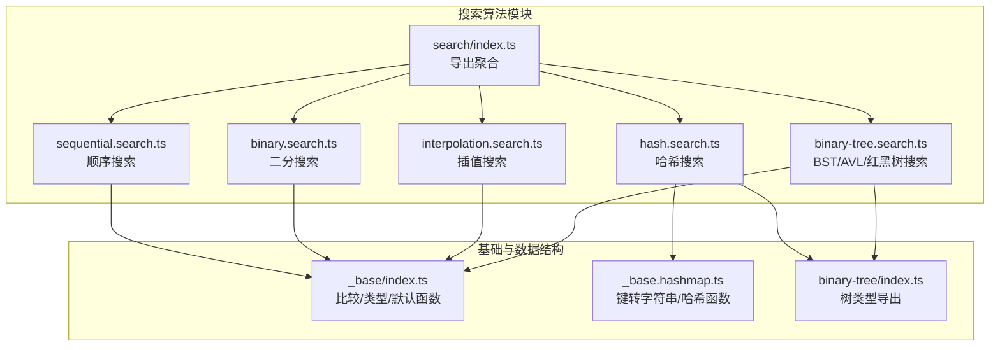
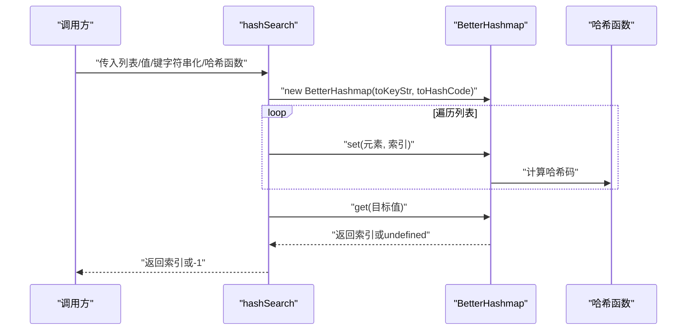
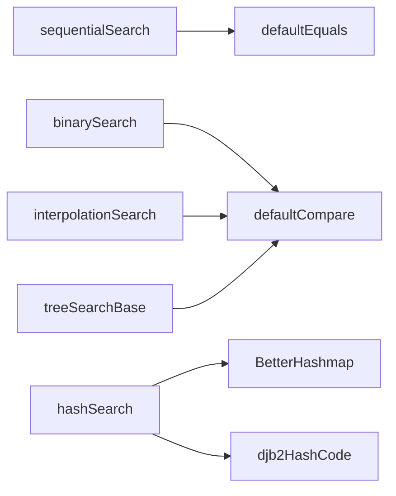

# 搜索算法

<cite>
**本文引用的文件**
- [packages/algorithm/src/search/index.ts](file://packages/algorithm/src/search/index.ts)
- [packages/algorithm/src/search/sequential.search.ts](file://packages/algorithm/src/search/sequential.search.ts)
- [packages/algorithm/src/search/binary.search.ts](file://packages/algorithm/src/search/binary.search.ts)
- [packages/algorithm/src/search/interpolation.search.ts](file://packages/algorithm/src/search/interpolation.search.ts)
- [packages/algorithm/src/search/hash.search.ts](file://packages/algorithm/src/search/hash.search.ts)
- [packages/algorithm/src/search/binary-tree.search.ts](file://packages/algorithm/src/search/binary-tree.search.ts)
- [packages/algorithm/src/_base/index.ts](file://packages/algorithm/src/_base/index.ts)
- [packages/algorithm/src/hashmap/_base.hashmap.ts](file://packages/algorithm/src/hashmap/_base.hashmap.ts)
- [packages/algorithm/src/binary-tree/index.ts](file://packages/algorithm/src/binary-tree/index.ts)
- [packages/algorithm/src/test/search.spec.ts](file://packages/algorithm/src/test/search.spec.ts)
</cite>

## 目录
1. [简介](#简介)
2. [项目结构](#项目结构)
3. [核心组件](#核心组件)
4. [架构总览](#架构总览)
5. [详细组件分析](#详细组件分析)
6. [依赖分析](#依赖分析)
7. [性能考虑](#性能考虑)
8. [故障排查指南](#故障排查指南)
9. [结论](#结论)
10. [附录](#附录)

## 简介
本文件为“搜索算法”模块的详细API参考文档，覆盖顺序搜索、二分搜索、插值搜索、哈希搜索以及基于二叉搜索树（含AVL、红黑树）的搜索方案。文档逐项说明各算法的构造/调用方式、公共方法、类型约束、参数与返回值、异常与边界条件、时间/空间复杂度、适用场景与最佳实践，并通过序列图与流程图展示关键调用链路与决策逻辑。

## 项目结构
搜索算法模块位于 packages/algorithm/src/search/，导出入口统一于 index.ts；各算法以独立文件实现，部分算法复用基础类型与哈希表、二叉搜索树等基础设施。

**图表来源**
- [packages/algorithm/src/search/index.ts:1-10](file://packages/algorithm/src/search/index.ts#L1-L10)
- [packages/algorithm/src/search/sequential.search.ts:1-23](file://packages/algorithm/src/search/sequential.search.ts#L1-L23)
- [packages/algorithm/src/search/binary.search.ts:1-38](file://packages/algorithm/src/search/binary.search.ts#L1-L38)
- [packages/algorithm/src/search/interpolation.search.ts:1-50](file://packages/algorithm/src/search/interpolation.search.ts#L1-L50)
- [packages/algorithm/src/search/hash.search.ts:1-33](file://packages/algorithm/src/search/hash.search.ts#L1-L33)
- [packages/algorithm/src/search/binary-tree.search.ts:1-76](file://packages/algorithm/src/search/binary-tree.search.ts#L1-L76)
- [packages/algorithm/src/_base/index.ts:1-162](file://packages/algorithm/src/_base/index.ts#L1-L162)
- [packages/algorithm/src/hashmap/_base.hashmap.ts:1-178](file://packages/algorithm/src/hashmap/_base.hashmap.ts#L1-L178)
- [packages/algorithm/src/binary-tree/index.ts:1-6](file://packages/algorithm/src/binary-tree/index.ts#L1-L6)

**章节来源**
- [packages/algorithm/src/search/index.ts:1-10](file://packages/algorithm/src/search/index.ts#L1-L10)

## 核心组件
- 顺序搜索：线性扫描列表，支持自定义相等判断函数。
- 二分搜索：在有序数组上折半查找，支持自定义比较函数。
- 插值搜索：在均匀分布的有序数组上按值比例估算位置，支持自定义比较函数。
- 哈希搜索：构建哈希映射以实现近似O(1)查找，支持自定义键字符串化与哈希函数。
- BST/AVL/红黑树搜索：将数组元素插入对应平衡树后查找，返回原索引。

上述组件均以泛型函数形式暴露，便于跨类型使用；默认比较/相等/哈希策略来自基础模块。

**章节来源**
- [packages/algorithm/src/search/sequential.search.ts:17-22](file://packages/algorithm/src/search/sequential.search.ts#L17-L22)
- [packages/algorithm/src/search/binary.search.ts:17-37](file://packages/algorithm/src/search/binary.search.ts#L17-L37)
- [packages/algorithm/src/search/interpolation.search.ts:17-49](file://packages/algorithm/src/search/interpolation.search.ts#L17-L49)
- [packages/algorithm/src/search/hash.search.ts:20-32](file://packages/algorithm/src/search/hash.search.ts#L20-L32)
- [packages/algorithm/src/search/binary-tree.search.ts:37-75](file://packages/algorithm/src/search/binary-tree.search.ts#L37-L75)
- [packages/algorithm/src/_base/index.ts:98-101](file://packages/algorithm/src/_base/index.ts#L98-L101)
- [packages/algorithm/src/_base/index.ts:84-84](file://packages/algorithm/src/_base/index.ts#L84-L84)
- [packages/algorithm/src/hashmap/_base.hashmap.ts:69-78](file://packages/algorithm/src/hashmap/_base.hashmap.ts#L69-L78)

## 架构总览
以下序列图展示“哈希搜索”的典型调用流程：构建哈希映射、填充键值对、查询目标键并返回索引或未命中。

**图表来源**
- [packages/algorithm/src/search/hash.search.ts:20-32](file://packages/algorithm/src/search/hash.search.ts#L20-L32)
- [packages/algorithm/src/hashmap/_base.hashmap.ts:120-177](file://packages/algorithm/src/hashmap/_base.hashmap.ts#L120-L177)

## 详细组件分析

### 顺序搜索（sequentialSearch）
- 功能：线性遍历数组，使用相等函数匹配目标值。
- 泛型与类型约束：
  - 泛型参数 T：数组元素与目标值的类型。
  - equalsFn：可选的相等判断函数，默认使用严格相等。
- 方法签名与参数
  - sequentialSearch<T>(list: T[], value: T, equalsFn?: (a?: T, b?: T) => boolean): number
- 返回值
  - 找到时返回元素索引；未找到返回 -1。
- 异常与边界条件
  - 输入数组为空时直接返回 -1。
  - equalsFn 未提供时使用默认相等函数。
- 复杂度
  - 时间：O(n)，空间：O(1)。
- 适用条件
  - 适用于小规模或未排序数据集；对大规模数据不友好。
- 最佳实践
  - 若数据可能重复，注意返回首个匹配索引；若需多处匹配，改为收集所有索引。

**章节来源**
- [packages/algorithm/src/search/sequential.search.ts:17-22](file://packages/algorithm/src/search/sequential.search.ts#L17-L22)
- [packages/algorithm/src/_base/index.ts:84-84](file://packages/algorithm/src/_base/index.ts#L84-L84)

### 二分搜索（binarySearch）
- 功能：在升序数组中折半查找目标值。
- 泛型与类型约束
  - 泛型参数 T：数组元素与目标值的类型。
  - compareFn：可选的比较函数，默认使用数值/字典序比较。
- 方法签名与参数
  - binarySearch<T>(array: T[], target: T, compareFn?: (a: T, b: T) => Compare): number
- 返回值
  - 找到时返回索引；未找到返回 -1。
- 异常与边界条件
  - 数组为空时直接返回 -1。
  - compareFn 默认实现会根据类型返回比较结果枚举。
- 复杂度
  - 时间：O(log n)，空间：O(1)。
- 适用条件
  - 数据必须已排序；适合静态或频繁查询的有序集合。
- 最佳实践
  - 若存在重复元素，注意返回的索引不固定；需要范围查询时结合其他方法。

**章节来源**
- [packages/algorithm/src/search/binary.search.ts:17-37](file://packages/algorithm/src/search/binary.search.ts#L17-L37)
- [packages/algorithm/src/_base/index.ts:9-13](file://packages/algorithm/src/_base/index.ts#L9-L13)
- [packages/algorithm/src/_base/index.ts:98-101](file://packages/algorithm/src/_base/index.ts#L98-L101)

### 插值搜索（interpolationSearch）
- 功能：在均匀分布的有序数组中按值比例估算位置，提高查找效率。
- 泛型与类型约束
  - 泛型参数 T：数组元素与目标值的类型。
  - compareFn：可选的比较函数，默认使用数值/字典序比较。
- 方法签名与参数
  - interpolationSearch<T>(array: T[], target: T, compareFn?: (a: T, b: T) => Compare): number
- 返回值
  - 找到时返回索引；未找到返回 -1。
- 异常与边界条件
  - 当区间端点比较结果异常（如降序）时返回 -1。
  - 估算位置越界时返回 -1。
- 复杂度
  - 平均：O(log log n)，最坏：O(n)，空间：O(1)。
- 适用条件
  - 数据均匀分布且已排序；对非均匀分布效果不佳。
- 最佳实践
  - 与二分搜索对比测试；在大数据量且分布均匀时优先选择。

**章节来源**
- [packages/algorithm/src/search/interpolation.search.ts:17-49](file://packages/algorithm/src/search/interpolation.search.ts#L17-L49)
- [packages/algorithm/src/_base/index.ts:9-13](file://packages/algorithm/src/_base/index.ts#L9-L13)
- [packages/algorithm/src/_base/index.ts:98-101](file://packages/algorithm/src/_base/index.ts#L98-L101)

### 哈希搜索（hashSearch）
- 功能：将数组元素映射到哈希表，以近似O(1)时间复杂度查找目标值对应的原始索引。
- 泛型与类型约束
  - 泛型参数 T：数组元素与目标值的类型。
  - toKeyStr：可选的键字符串化函数，默认使用通用字符串化。
  - toHashCode：可选的哈希函数，默认使用 djb2 哈希。
- 方法签名与参数
  - hashSearch<T>(list: T[], value: T, toKeyStr?: (key: T) => string, toHashCode?: (keyStr: string) => number): number
- 返回值
  - 找到时返回原数组索引；未找到返回 -1。
- 异常与边界条件
  - 哈希冲突不影响正确性；若 toKeyStr/toHashCode 不当可能导致碰撞增多。
- 复杂度
  - 构建阶段：O(n)；查询阶段：平均 O(1)，最坏 O(n)；空间：O(n)。
- 适用条件
  - 无序数据集；需要频繁随机访问；对内存有额外开销容忍。
- 最佳实践
  - 选择高质量哈希函数；确保 toKeyStr 能区分不同对象；必要时预估负载因子。

**章节来源**
- [packages/algorithm/src/search/hash.search.ts:20-32](file://packages/algorithm/src/search/hash.search.ts#L20-L32)
- [packages/algorithm/src/hashmap/_base.hashmap.ts:69-78](file://packages/algorithm/src/hashmap/_base.hashmap.ts#L69-L78)
- [packages/algorithm/src/hashmap/_base.hashmap.ts:120-177](file://packages/algorithm/src/hashmap/_base.hashmap.ts#L120-L177)

### 二叉搜索树搜索（binaryTreeSearch / adelsonVelskiiLandiTreeSearch / redBlackTreeSearch）
- 功能：将数组元素插入对应平衡树（BST/AVL/红黑树），以树节点值包装原元素与索引，查找目标值并返回原索引。
- 泛型与类型约束
  - 泛型参数 T：数组元素与目标值的类型。
  - compareFn：可选的比较函数，默认使用数值/字典序比较。
- 方法签名与参数
  - binaryTreeSearch<T>(list: T[], value: T, compareFn?: (a: T, b: T) => Compare): number
  - adelsonVelskiiLandiTreeSearch<T>(list: T[], value: T, compareFn?: (a: T, b: T) => Compare): number
  - redBlackTreeSearch<T>(list: T[], value: T, compareFn?: (a: T, b: T) => Compare): number
- 返回值
  - 找到时返回原数组索引；未找到返回 -1。
- 异常与边界条件
  - 空数组返回 -1；重复元素返回任一匹配索引。
- 复杂度
  - 构建阶段：BST O(n^2)、AVL/红黑树 O(n log n)；查询阶段：BST 平均 O(n)、AVL/红黑树 O(log n)；空间：O(n)。
- 适用条件
  - 需要动态维护集合（插入/删除/查找）；对查询性能稳定性有要求。
- 最佳实践
  - AVL/红黑树在频繁插入/删除场景更稳定；仅一次性查询可优先哈希搜索。

**章节来源**
- [packages/algorithm/src/search/binary-tree.search.ts:37-75](file://packages/algorithm/src/search/binary-tree.search.ts#L37-L75)
- [packages/algorithm/src/binary-tree/index.ts:1-6](file://packages/algorithm/src/binary-tree/index.ts#L1-L6)
- [packages/algorithm/src/_base/index.ts:9-13](file://packages/algorithm/src/_base/index.ts#L9-L13)
- [packages/algorithm/src/_base/index.ts:98-101](file://packages/algorithm/src/_base/index.ts#L98-L101)

## 依赖分析
- 模块内依赖
  - 各搜索算法依赖基础比较/相等函数与默认策略。
  - 哈希搜索依赖哈希表基础设施与哈希函数。
  - 树搜索依赖二叉树系列实现。
- 导出聚合
  - search/index.ts 统一导出所有搜索算法，便于按需引入。

**图表来源**
- [packages/algorithm/src/search/sequential.search.ts:1-1](file://packages/algorithm/src/search/sequential.search.ts#L1-L1)
- [packages/algorithm/src/search/binary.search.ts:1-1](file://packages/algorithm/src/search/binary.search.ts#L1-L1)
- [packages/algorithm/src/search/interpolation.search.ts:1-1](file://packages/algorithm/src/search/interpolation.search.ts#L1-L1)
- [packages/algorithm/src/search/binary-tree.search.ts:1-2](file://packages/algorithm/src/search/binary-tree.search.ts#L1-L2)
- [packages/algorithm/src/search/hash.search.ts:1-3](file://packages/algorithm/src/search/hash.search.ts#L1-L3)
- [packages/algorithm/src/_base/index.ts:84-101](file://packages/algorithm/src/_base/index.ts#L84-L101)
- [packages/algorithm/src/hashmap/_base.hashmap.ts:120-177](file://packages/algorithm/src/hashmap/_base.hashmap.ts#L120-L177)

**章节来源**
- [packages/algorithm/src/search/index.ts:1-10](file://packages/algorithm/src/search/index.ts#L1-L10)
- [packages/algorithm/src/_base/index.ts:98-101](file://packages/algorithm/src/_base/index.ts#L98-L101)
- [packages/algorithm/src/hashmap/_base.hashmap.ts:120-177](file://packages/algorithm/src/hashmap/_base.hashmap.ts#L120-L177)

## 性能考虑
- 时间复杂度对比
  - 顺序搜索：O(n)
  - 二分搜索：O(log n)
  - 插值搜索：平均 O(log log n)，最坏 O(n)
  - 哈希搜索：构建 O(n)，查询平均 O(1)
  - 树搜索：构建 BST O(n^2)，AVL/红黑树 O(n log n)，查询 O(log n)
- 空间复杂度
  - 顺序/二分/插值：O(1)
  - 哈希：O(n)
  - 树：O(n)
- 选择建议
  - 一次性查询且无序：优先哈希搜索。
  - 有序静态数据：二分搜索。
  - 有序均匀分布：插值搜索。
  - 需要动态维护：AVL/红黑树。
- 优化要点
  - 自定义比较/相等/哈希函数时，确保一致性与低碰撞。
  - 对重复元素，明确返回规则（首个/最后一个/全部）。
  - 大数据量时避免顺序搜索，优先二分/哈希/树。

## 故障排查指南
- 常见问题与处理
  - 未找到返回 -1：检查输入数组是否为空或目标不存在。
  - 插值搜索异常：确认数组已排序且分布均匀；检查端点比较结果。
  - 哈希搜索性能差：检查哈希函数质量与键字符串化策略。
  - 树搜索不稳定：确认比较函数一致；避免重复插入相同键。
- 单元测试参考
  - 测试覆盖了空数组、单元素、重复元素、边界值与异常输入（如插值搜索的降序区间）。

**章节来源**
- [packages/algorithm/src/test/search.spec.ts:20-44](file://packages/algorithm/src/test/search.spec.ts#L20-L44)

## 结论
本模块提供了多样化的搜索能力：面向静态有序数据的二分与插值搜索、面向无序数据的哈希搜索，以及面向动态维护的树搜索。通过统一的泛型与默认策略，用户可在不同场景下灵活选择最优算法，并依据复杂度与性能建议做出权衡。

## 附录

### API一览与签名路径
- 顺序搜索
  - sequentialSearch<T>(list: T[], value: T, equalsFn?: (a?: T, b?: T) => boolean): number
  - 参考路径：[sequential.search.ts:17-22](file://packages/algorithm/src/search/sequential.search.ts#L17-L22)
- 二分搜索
  - binarySearch<T>(array: T[], target: T, compareFn?: (a: T, b: T) => Compare): number
  - 参考路径：[binary.search.ts:17-37](file://packages/algorithm/src/search/binary.search.ts#L17-L37)
- 插值搜索
  - interpolationSearch<T>(array: T[], target: T, compareFn?: (a: T, b: T) => Compare): number
  - 参考路径：[interpolation.search.ts:17-49](file://packages/algorithm/src/search/interpolation.search.ts#L17-L49)
- 哈希搜索
  - hashSearch<T>(list: T[], value: T, toKeyStr?: (key: T) => string, toHashCode?: (keyStr: string) => number): number
  - 参考路径：[hash.search.ts:20-32](file://packages/algorithm/src/search/hash.search.ts#L20-L32)
- 树搜索（BST）
  - binaryTreeSearch<T>(list: T[], value: T, compareFn?: (a: T, b: T) => Compare): number
  - 参考路径：[binary-tree.search.ts:37-38](file://packages/algorithm/src/search/binary-tree.search.ts#L37-L38)
- 树搜索（AVL）
  - adelsonVelskiiLandiTreeSearch<T>(list: T[], value: T, compareFn?: (a: T, b: T) => Compare): number
  - 参考路径：[binary-tree.search.ts:54-58](file://packages/algorithm/src/search/binary-tree.search.ts#L54-L58)
- 树搜索（红黑树）
  - redBlackTreeSearch<T>(list: T[], value: T, compareFn?: (a: T, b: T) => Compare): number
  - 参考路径：[binary-tree.search.ts:74-75](file://packages/algorithm/src/search/binary-tree.search.ts#L74-L75)

### 类型与接口参考
- 比较结果枚举 Compare
  - 参考路径：[index.ts:9-13](file://packages/algorithm/src/_base/index.ts#L9-L13)
- 比较函数与相等函数类型
  - CompareFn<T>、EqualsFn<T>
  - 参考路径：[index.ts:147-133](file://packages/algorithm/src/_base/index.ts#L147-L133)
- 哈希相关类型
  - ToKeyStr<K>、ToHashCode
  - 参考路径：[hashmap/_base.hashmap.ts:60-78](file://packages/algorithm/src/hashmap/_base.hashmap.ts#L60-L78)

### 使用场景与示例路径
- 哈希搜索（构建+查询）
  - 参考路径：[hash.search.ts:20-32](file://packages/algorithm/src/search/hash.search.ts#L20-L32)
- 树搜索（插入+查找）
  - 参考路径：[binary-tree.search.ts:6-21](file://packages/algorithm/src/search/binary-tree.search.ts#L6-L21)