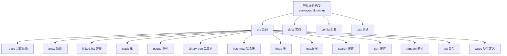
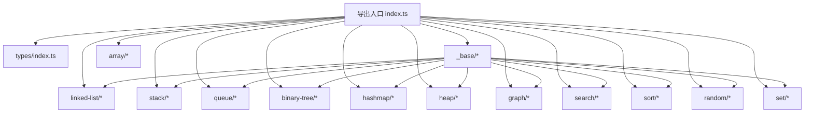
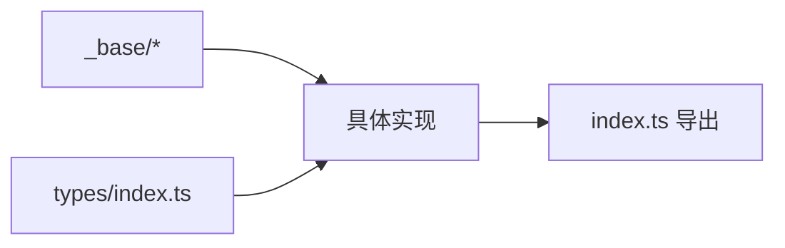

# 算法库API

<cite>
**本文引用的文件**
- [packages/algorithm/src/index.ts](file://packages/algorithm/src/index.ts)
- [packages/algorithm/src/types/index.ts](file://packages/algorithm/src/types/index.ts)
- [packages/algorithm/src/_base/index.ts](file://packages/algorithm/src/_base/index.ts)
- [packages/algorithm/src/array/array.ts](file://packages/algorithm/src/array/array.ts)
- [packages/algorithm/src/linked-list/_base.linked-list.ts](file://packages/algorithm/src/linked-list/_base.linked-list.ts)
- [packages/algorithm/src/linked-list/singly.linked-list.ts](file://packages/algorithm/src/linked-list/singly.linked-list.ts)
- [packages/algorithm/src/linked-list/doubly.linked-list.ts](file://packages/algorithm/src/linked-list/doubly.linked-list.ts)
- [packages/algorithm/src/stack/_base.stack.ts](file://packages/algorithm/src/stack/_base.stack.ts)
- [packages/algorithm/src/stack/array.stack.ts](file://packages/algorithm/src/stack/array.stack.ts)
- [packages/algorithm/src/stack/linked-list.stack.ts](file://packages/algorithm/src/stack/linked-list.stack.ts)
- [packages/algorithm/src/queue/_base.queue.ts](file://packages/algorithm/src/queue/_base.queue.ts)
- [packages/algorithm/src/queue/_base.deque.ts](file://packages/algorithm/src/queue/_base.deque.ts)
- [packages/algorithm/src/queue/array.queue.ts](file://packages/algorithm/src/queue/array.queue.ts)
- [packages/algorithm/src/queue/linked-list.queue.ts](file://packages/algorithm/src/queue/linked-list.queue.ts)
- [packages/algorithm/src/queue/array.deque.ts](file://packages/algorithm/src/queue/array.deque.ts)
- [packages/algorithm/src/queue/linked-list.deque.ts](file://packages/algorithm/src/queue/linked-list.deque.ts)
- [packages/algorithm/src/binary-tree/_base.tree.ts](file://packages/algorithm/src/binary-tree/_base.tree.ts)
- [packages/algorithm/src/binary-tree/binary-search.tree.ts](file://packages/algorithm/src/binary-tree/binary-search.tree.ts)
- [packages/algorithm/src/binary-tree/adelson-velskii-landi.tree.ts](file://packages/algorithm/src/binary-tree/adelson-velskii-landi.tree.ts)
- [packages/algorithm/src/binary-tree/red-black.tree.ts](file://packages/algorithm/src/binary-tree/red-black.tree.ts)
- [packages/algorithm/src/hashmap/_base.hashmap.ts](file://packages/algorithm/src/hashmap/_base.hashmap.ts)
- [packages/algorithm/src/hashmap/better.hashmap.ts](file://packages/algorithm/src/hashmap/better.hashmap.ts)
- [packages/algorithm/src/hashmap/linear-probing.hashmap.ts](file://packages/algorithm/src/hashmap/linear-probing.hashmap.ts)
- [packages/algorithm/src/hashmap/linked-list.hashmap.ts](file://packages/algorithm/src/hashmap/linked-list.hashmap.ts)
- [packages/algorithm/src/hashmap/simple.hashmap.ts](file://packages/algorithm/src/hashmap/simple.hashmap.ts)
- [packages/algorithm/src/hashmap/square-probing.hashmap.ts](file://packages/algorithm/src/hashmap/square-probing.hashmap.ts)
- [packages/algorithm/src/hashmap/hash-code.ts](file://packages/algorithm/src/hashmap/hash-code.ts)
- [packages/algorithm/src/heap/_base.heap.ts](file://packages/algorithm/src/heap/_base.heap.ts)
- [packages/algorithm/src/heap/max.heap.ts](file://packages/algorithm/src/heap/max.heap.ts)
- [packages/algorithm/src/heap/min.heap.ts](file://packages/algorithm/src/heap/min.heap.ts)
- [packages/algorithm/src/graph/graph.ts](file://packages/algorithm/src/graph/graph.ts)
- [packages/algorithm/src/graph/bfs.graph-walker.ts](file://packages/algorithm/src/graph/bfs.graph-walker.ts)
- [packages/algorithm/src/graph/dfs.graph-walker.ts](file://packages/algorithm/src/graph/dfs.graph-walker.ts)
- [packages/algorithm/src/graph/bfs.shortest-path.ts](file://packages/algorithm/src/graph/bfs.shortest-path.ts)
- [packages/algorithm/src/graph/dfs.shortest-path.ts](file://packages/algorithm/src/graph/dfs.shortest-path.ts)
- [packages/algorithm/src/search/binary.search.ts](file://packages/algorithm/src/search/binary.search.ts)
- [packages/algorithm/src/search/sequential.search.ts](file://packages/algorithm/src/search/sequential.search.ts)
- [packages/algorithm/src/search/interpolation.search.ts](file://packages/algorithm/src/search/interpolation.search.ts)
- [packages/algorithm/src/search/hash.search.ts](file://packages/algorithm/src/search/hash.search.ts)
- [packages/algorithm/src/search/binary-tree.search.ts](file://packages/algorithm/src/search/binary-tree.search.ts)
- [packages/algorithm/src/sort/bubble.sort.ts](file://packages/algorithm/src/sort/bubble.sort.ts)
- [packages/algorithm/src/sort/insertion.sort.ts](file://packages/algorithm/src/sort/insertion.sort.ts)
- [packages/algorithm/src/sort/selection.sort.ts](file://packages/algorithm/src/sort/selection.sort.ts)
- [packages/algorithm/src/sort/merge.sort.ts](file://packages/algorithm/src/sort/merge.sort.ts)
- [packages/algorithm/src/sort/quick.sort.ts](file://packages/algorithm/src/sort/quick.sort.ts)
- [packages/algorithm/src/sort/heap.sort.ts](file://packages/algorithm/src/sort/heap.sort.ts)
- [packages/algorithm/src/sort/counting.sort.ts](file://packages/algorithm/src/sort/counting.sort.ts)
- [packages/algorithm/src/sort/radix.sort.ts](file://packages/algorithm/src/sort/radix.sort.ts)
- [packages/algorithm/src/sort/bucket.sort.ts](file://packages/algorithm/src/sort/bucket.sort.ts)
- [packages/algorithm/src/random/shuffle.random.ts](file://packages/algorithm/src/random/shuffle.random.ts)
- [packages/algorithm/src/set/set-plus.ts](file://packages/algorithm/src/set/set-plus.ts)
- [packages/algorithm/docs/guide/README.md](file://packages/algorithm/docs/guide/README.md)
- [packages/algorithm/docs/guide/README.zh-CN.md](file://packages/algorithm/docs/guide/README.zh-CN.md)
- [packages/algorithm/docs/api/index.api.md](file://packages/algorithm/docs/api/index.api.md)
- [packages/algorithm/package.json](file://packages/algorithm/package.json)
- [packages/algorithm/tsconfig.json](file://packages/algorithm/tsconfig.json)
</cite>

## 目录
1. [简介](#简介)
2. [项目结构](#项目结构)
3. [核心组件](#核心组件)
4. [架构总览](#架构总览)
5. [详细组件分析](#详细组件分析)
6. [依赖分析](#依赖分析)
7. [性能考虑](#性能考虑)
8. [故障排查指南](#故障排查指南)
9. [结论](#结论)
10. [附录](#附录)

## 简介
本文件为 HZ 9 Tool 算法库的API参考文档，覆盖数组(Array)、链表(LinkedList)、栈(Stack)、队列(Queue)、二叉树(Binary Tree)、哈希表(HashMap)、堆(Heap)、图(Graph)、排序算法(Sort)与搜索算法(Search)等模块。文档基于仓库中的源码与类型定义，系统性梳理各模块的类、接口、构造函数、公共方法、属性、泛型约束、时间/空间复杂度、错误处理与边界条件，并提供使用指引与常见问题排查建议。

## 项目结构
算法库采用按功能域分层的组织方式：顶层导出入口统一聚合各子模块；各子模块内部通过基础基类与具体实现分离，遵循“_base.*”抽象与“具体实现”的模式；测试用例位于 test 目录，文档位于 docs 目录。

图表来源
- [packages/algorithm/src/index.ts](file://packages/algorithm/src/index.ts)
- [packages/algorithm/src/_base/index.ts](file://packages/algorithm/src/_base/index.ts)
- [packages/algorithm/src/types/index.ts](file://packages/algorithm/src/types/index.ts)

章节来源
- [packages/algorithm/src/index.ts](file://packages/algorithm/src/index.ts)
- [packages/algorithm/src/_base/index.ts](file://packages/algorithm/src/_base/index.ts)
- [packages/algorithm/src/types/index.ts](file://packages/algorithm/src/types/index.ts)

## 核心组件
本节概述主要模块的职责与对外API概览（以类型定义为准）：

- 数组(Array): 提供动态数组与常用操作，支持泛型元素类型。
- 链表(LinkedList): 包含单向与双向链表，提供插入、删除、查找等操作。
- 栈(Stack): 基于数组或链表的栈实现，支持压栈、弹栈、取顶等。
- 队列(Queue): 支持数组与链表实现的队列及双端队列(Deque)。
- 二叉树(Binary Tree): 包含通用二叉树、二叉搜索树(BST)、AVL树与红黑树(RB-Tree)。
- 哈希表(HashMap): 提供开放定址与拉链法等多种实现，支持键值对存取。
- 堆(Heap): 最大堆与最小堆实现，支持堆化、插入、弹出等。
- 图(Graph): 提供图的表示与遍历(DFS/BFS)，以及最短路径算法。
- 排序(Sort): 冒泡、插入、选择、归并、快速、堆、计数、基数、桶排序等。
- 搜索(Search): 顺序、二分、插值、哈希索引、二叉搜索树等搜索策略。
- 随机(Random): 洗牌等随机化工具。
- 集合(Set): 集合运算扩展。

章节来源
- [packages/algorithm/src/array/array.ts](file://packages/algorithm/src/array/array.ts)
- [packages/algorithm/src/linked-list/_base.linked-list.ts](file://packages/algorithm/src/linked-list/_base.linked-list.ts)
- [packages/algorithm/src/linked-list/singly.linked-list.ts](file://packages/algorithm/src/linked-list/singly.linked-list.ts)
- [packages/algorithm/src/linked-list/doubly.linked-list.ts](file://packages/algorithm/src/linked-list/doubly.linked-list.ts)
- [packages/algorithm/src/stack/_base.stack.ts](file://packages/algorithm/src/stack/_base.stack.ts)
- [packages/algorithm/src/stack/array.stack.ts](file://packages/algorithm/src/stack/array.stack.ts)
- [packages/algorithm/src/stack/linked-list.stack.ts](file://packages/algorithm/src/stack/linked-list.stack.ts)
- [packages/algorithm/src/queue/_base.queue.ts](file://packages/algorithm/src/queue/_base.queue.ts)
- [packages/algorithm/src/queue/_base.deque.ts](file://packages/algorithm/src/queue/_base.deque.ts)
- [packages/algorithm/src/queue/array.queue.ts](file://packages/algorithm/src/queue/array.queue.ts)
- [packages/algorithm/src/queue/linked-list.queue.ts](file://packages/algorithm/src/queue/linked-list.queue.ts)
- [packages/algorithm/src/queue/array.deque.ts](file://packages/algorithm/src/queue/array.deque.ts)
- [packages/algorithm/src/queue/linked-list.deque.ts](file://packages/algorithm/src/queue/linked-list.deque.ts)
- [packages/algorithm/src/binary-tree/_base.tree.ts](file://packages/algorithm/src/binary-tree/_base.tree.ts)
- [packages/algorithm/src/binary-tree/binary-search.tree.ts](file://packages/algorithm/src/binary-tree/binary-search.tree.ts)
- [packages/algorithm/src/binary-tree/adelson-velskii-landi.tree.ts](file://packages/algorithm/src/binary-tree/adelson-velskii-landi.tree.ts)
- [packages/algorithm/src/binary-tree/red-black.tree.ts](file://packages/algorithm/src/binary-tree/red-black.tree.ts)
- [packages/algorithm/src/hashmap/_base.hashmap.ts](file://packages/algorithm/src/hashmap/_base.hashmap.ts)
- [packages/algorithm/src/hashmap/better.hashmap.ts](file://packages/algorithm/src/hashmap/better.hashmap.ts)
- [packages/algorithm/src/hashmap/linear-probing.hashmap.ts](file://packages/algorithm/src/hashmap/linear-probing.hashmap.ts)
- [packages/algorithm/src/hashmap/linked-list.hashmap.ts](file://packages/algorithm/src/hashmap/linked-list.hashmap.ts)
- [packages/algorithm/src/hashmap/simple.hashmap.ts](file://packages/algorithm/src/hashmap/simple.hashmap.ts)
- [packages/algorithm/src/hashmap/square-probing.hashmap.ts](file://packages/algorithm/src/hashmap/square-probing.hashmap.ts)
- [packages/algorithm/src/hashmap/hash-code.ts](file://packages/algorithm/src/hashmap/hash-code.ts)
- [packages/algorithm/src/heap/_base.heap.ts](file://packages/algorithm/src/heap/_base.heap.ts)
- [packages/algorithm/src/heap/max.heap.ts](file://packages/algorithm/src/heap/max.heap.ts)
- [packages/algorithm/src/heap/min.heap.ts](file://packages/algorithm/src/heap/min.heap.ts)
- [packages/algorithm/src/graph/graph.ts](file://packages/algorithm/src/graph/graph.ts)
- [packages/algorithm/src/graph/bfs.graph-walker.ts](file://packages/algorithm/src/graph/bfs.graph-walker.ts)
- [packages/algorithm/src/graph/dfs.graph-walker.ts](file://packages/algorithm/src/graph/dfs.graph-walker.ts)
- [packages/algorithm/src/graph/bfs.shortest-path.ts](file://packages/algorithm/src/graph/bfs.shortest-path.ts)
- [packages/algorithm/src/graph/dfs.shortest-path.ts](file://packages/algorithm/src/graph/dfs.shortest-path.ts)
- [packages/algorithm/src/search/binary.search.ts](file://packages/algorithm/src/search/binary.search.ts)
- [packages/algorithm/src/search/sequential.search.ts](file://packages/algorithm/src/search/sequential.search.ts)
- [packages/algorithm/src/search/interpolation.search.ts](file://packages/algorithm/src/search/interpolation.search.ts)
- [packages/algorithm/src/search/hash.search.ts](file://packages/algorithm/src/search/hash.search.ts)
- [packages/algorithm/src/search/binary-tree.search.ts](file://packages/algorithm/src/search/binary-tree.search.ts)
- [packages/algorithm/src/sort/bubble.sort.ts](file://packages/algorithm/src/sort/bubble.sort.ts)
- [packages/algorithm/src/sort/insertion.sort.ts](file://packages/algorithm/src/sort/insertion.sort.ts)
- [packages/algorithm/src/sort/selection.sort.ts](file://packages/algorithm/src/sort/selection.sort.ts)
- [packages/algorithm/src/sort/merge.sort.ts](file://packages/algorithm/src/sort/merge.sort.ts)
- [packages/algorithm/src/sort/quick.sort.ts](file://packages/algorithm/src/sort/quick.sort.ts)
- [packages/algorithm/src/sort/heap.sort.ts](file://packages/algorithm/src/sort/heap.sort.ts)
- [packages/algorithm/src/sort/counting.sort.ts](file://packages/algorithm/src/sort/counting.sort.ts)
- [packages/algorithm/src/sort/radix.sort.ts](file://packages/algorithm/src/sort/radix.sort.ts)
- [packages/algorithm/src/sort/bucket.sort.ts](file://packages/algorithm/src/sort/bucket.sort.ts)
- [packages/algorithm/src/random/shuffle.random.ts](file://packages/algorithm/src/random/shuffle.random.ts)
- [packages/algorithm/src/set/set-plus.ts](file://packages/algorithm/src/set/set-plus.ts)

## 架构总览
下图展示了算法库的模块间依赖与导出关系，体现“基础抽象 -> 具体实现 -> 导出入口”的层次结构。

图表来源
- [packages/algorithm/src/index.ts](file://packages/algorithm/src/index.ts)
- [packages/algorithm/src/types/index.ts](file://packages/algorithm/src/types/index.ts)
- [packages/algorithm/src/_base/index.ts](file://packages/algorithm/src/_base/index.ts)

章节来源
- [packages/algorithm/src/index.ts](file://packages/algorithm/src/index.ts)
- [packages/algorithm/src/types/index.ts](file://packages/algorithm/src/types/index.ts)
- [packages/algorithm/src/_base/index.ts](file://packages/algorithm/src/_base/index.ts)

## 详细组件分析

### 数组(Array)
- 模块定位: packages/algorithm/src/array/array.ts
- 泛型约束: T 为元素类型，通常要求可比较或可哈希（视具体方法而定）
- 关键API要点
  - 构造函数: 接受初始容量与元素类型T
  - 方法: push(T), pop(): T | undefined, get(index): T | undefined, set(index, T), length: number
  - 复杂度: 动态扩容均摊O(1)，随机访问O(1)，尾部插入/删除O(1)
  - 边界: 下标越界时返回undefined或抛出异常（依据实现）
- 使用建议
  - 优先使用push/pop进行尾部操作
  - 注意容量增长策略导致的内存重分配

章节来源
- [packages/algorithm/src/array/array.ts](file://packages/algorithm/src/array/array.ts)

### 链表(LinkedList)
- 模块定位: packages/algorithm/src/linked-list/*
- 单向链表
  - 模块: singly.linked-list.ts
  - API: prepend(T), append(T), removeHead(): T | null, find(pred): ListNode<T> | null, toArray(): T[]
  - 复杂度: 头插/头删O(1)，查找/删除需O(n)
- 双向链表
  - 模块: doubly.linked-list.ts
  - API: prepend(T), append(T), removeHead(), removeTail(), insertAfter(node, T), toArray()
  - 复杂度: 双向指针支持O(1)前后节点操作
- 基类
  - 模块: _base.linked-list.ts
  - 定义节点结构与通用接口，派生单/双向实现
- 错误处理
  - 删除空列表头/尾或在无效节点后插入应抛出异常或返回错误标志

章节来源
- [packages/algorithm/src/linked-list/_base.linked-list.ts](file://packages/algorithm/src/linked-list/_base.linked-list.ts)
- [packages/algorithm/src/linked-list/singly.linked-list.ts](file://packages/algorithm/src/linked-list/singly.linked-list.ts)
- [packages/algorithm/src/linked-list/doubly.linked-list.ts](file://packages/algorithm/src/linked-list/doubly.linked-list.ts)

### 栈(Stack)
- 模块定位: packages/algorithm/src/stack/*
- 基类
  - 模块: _base.stack.ts
  - 抽象接口: push(T), pop(): T | undefined, peek(): T | undefined, isEmpty(): boolean
- 数组栈
  - 模块: array.stack.ts
  - 实现: 基于数组尾部操作，O(1)入栈/出栈
- 链表栈
  - 模块: linked-list.stack.ts
  - 实现: 基于单向链表头部操作，O(1)入栈/出栈
- 使用场景
  - 表达式求值、DFS、撤销/重做等

章节来源
- [packages/algorithm/src/stack/_base.stack.ts](file://packages/algorithm/src/stack/_base.stack.ts)
- [packages/algorithm/src/stack/array.stack.ts](file://packages/algorithm/src/stack/array.stack.ts)
- [packages/algorithm/src/stack/linked-list.stack.ts](file://packages/algorithm/src/stack/linked-list.stack.ts)

### 队列(Queue) 与 双端队列(Deque)
- 模块定位: packages/algorithm/src/queue/*
- 基类
  - 队列: _base.queue.ts
  - 双端队列: _base.deque.ts
- 数组队列/双端队列
  - 模块: array.queue.ts, array.deque.ts
  - 特点: 基于数组，支持循环队列优化（必要时）
- 链表队列/双端队列
  - 模块: linked-list.queue.ts, linked-list.deque.ts
  - 特点: O(1)两端插入/删除
- 复杂度
  - 入队/出队: O(1)（链表实现）
  - 循环数组实现需注意满/空判定

章节来源
- [packages/algorithm/src/queue/_base.queue.ts](file://packages/algorithm/src/queue/_base.queue.ts)
- [packages/algorithm/src/queue/_base.deque.ts](file://packages/algorithm/src/queue/_base.deque.ts)
- [packages/algorithm/src/queue/array.queue.ts](file://packages/algorithm/src/queue/array.queue.ts)
- [packages/algorithm/src/queue/linked-list.queue.ts](file://packages/algorithm/src/queue/linked-list.queue.ts)
- [packages/algorithm/src/queue/array.deque.ts](file://packages/algorithm/src/queue/array.deque.ts)
- [packages/algorithm/src/queue/linked-list.deque.ts](file://packages/algorithm/src/queue/linked-list.deque.ts)

### 二叉树(Binary Tree)
- 模块定位: packages/algorithm/src/binary-tree/*
- 基类
  - 模块: _base.tree.ts
  - 定义节点结构与遍历接口（前/中/后序、层序）
- 二叉搜索树(BST)
  - 模块: binary-search.tree.ts
  - API: insert(T), delete(T), search(T): boolean, min()/max(): T | null
  - 复杂度: 平衡时O(log n)，退化为链时O(n)
- AVL树
  - 模块: adelson-velskii-landi.tree.ts
  - 自平衡旋转：LL/RR/LR/RL
- 红黑树
  - 模块: red-black.tree.ts
  - 节点颜色约束与旋转规则保证近似平衡
- 复杂度总览
  - 查找/插入/删除: 平衡BST O(log n)，最坏链式O(n)

章节来源
- [packages/algorithm/src/binary-tree/_base.tree.ts](file://packages/algorithm/src/binary-tree/_base.tree.ts)
- [packages/algorithm/src/binary-tree/binary-search.tree.ts](file://packages/algorithm/src/binary-tree/binary-search.tree.ts)
- [packages/algorithm/src/binary-tree/adelson-velskii-landi.tree.ts](file://packages/algorithm/src/binary-tree/adelson-velskii-landi.tree.ts)
- [packages/algorithm/src/binary-tree/red-black.tree.ts](file://packages/algorithm/src/binary-tree/red-black.tree.ts)

### 哈希表(HashMap)
- 模块定位: packages/algorithm/src/hashmap/*
- 基类
  - 模块: _base.hashmap.ts
  - 抽象接口: put(K,V), get(K): V | undefined, delete(K): boolean, keys(): K[], size(): number
- 开放定址法
  - 线性探测: linear-probing.hashmap.ts
  - 平方探测: square-probing.hashmap.ts
- 拉链法
  - linked-list.hashmap.ts
- 优化实现
  - better.hashmap.ts
- 哈希函数
  - hash-code.ts
- 复杂度
  - 成功查找/插入/删除: 平均O(1)，最坏O(n)
  - 空间: O(n)
- 边界与错误
  - 装载因子过高需扩容
  - 冲突严重时性能退化

章节来源
- [packages/algorithm/src/hashmap/_base.hashmap.ts](file://packages/algorithm/src/hashmap/_base.hashmap.ts)
- [packages/algorithm/src/hashmap/better.hashmap.ts](file://packages/algorithm/src/hashmap/better.hashmap.ts)
- [packages/algorithm/src/hashmap/linear-probing.hashmap.ts](file://packages/algorithm/src/hashmap/linear-probing.hashmap.ts)
- [packages/algorithm/src/hashmap/linked-list.hashmap.ts](file://packages/algorithm/src/hashmap/linked-list.hashmap.ts)
- [packages/algorithm/src/hashmap/simple.hashmap.ts](file://packages/algorithm/src/hashmap/simple.hashmap.ts)
- [packages/algorithm/src/hashmap/square-probing.hashmap.ts](file://packages/algorithm/src/hashmap/square-probing.hashmap.ts)
- [packages/algorithm/src/hashmap/hash-code.ts](file://packages/algorithm/src/hashmap/hash-code.ts)

### 堆(Heap)
- 模块定位: packages/algorithm/src/heap/*
- 基类
  - 模块: _base.heap.ts
  - 抽象接口: push(T), pop(): T | undefined, top(): T | undefined, size(): number
- 最大堆
  - 模块: max.heap.ts
  - 性质: 父 >= 子
- 最小堆
  - 模块: min.heap.ts
  - 性质: 父 <= 子
- 复杂度
  - 插入/删除: O(log n)
  - 取顶: O(1)
- 应用
  - 优先队列、Top-K、堆排序

章节来源
- [packages/algorithm/src/heap/_base.heap.ts](file://packages/algorithm/src/heap/_base.heap.ts)
- [packages/algorithm/src/heap/max.heap.ts](file://packages/algorithm/src/heap/max.heap.ts)
- [packages/algorithm/src/heap/min.heap.ts](file://packages/algorithm/src/heap/min.heap.ts)

### 图(Graph)
- 模块定位: packages/algorithm/src/graph/*
- 图表示
  - 模块: graph.ts
  - 支持有向/无向邻接表
- 遍历
  - DFS: dfs.graph-walker.ts
  - BFS: bfs.graph-walker.ts
- 最短路径
  - BFS: bfs.shortest-path.ts（无权图）
  - DFS: dfs.shortest-path.ts（有向无环图或特定约束）
- 复杂度
  - DFS/BFS: O(V+E)
  - Dijkstra/Floyd等取决于实现

章节来源
- [packages/algorithm/src/graph/graph.ts](file://packages/algorithm/src/graph/graph.ts)
- [packages/algorithm/src/graph/bfs.graph-walker.ts](file://packages/algorithm/src/graph/bfs.graph-walker.ts)
- [packages/algorithm/src/graph/dfs.graph-walker.ts](file://packages/algorithm/src/graph/dfs.graph-walker.ts)
- [packages/algorithm/src/graph/bfs.shortest-path.ts](file://packages/algorithm/src/graph/bfs.shortest-path.ts)
- [packages/algorithm/src/graph/dfs.shortest-path.ts](file://packages/algorithm/src/graph/dfs.shortest-path.ts)

### 搜索(Search)
- 模块定位: packages/algorithm/src/search/*
- 顺序搜索
  - sequential.search.ts
  - 时间: O(n)，空间: O(1)
- 二分搜索
  - binary.search.ts
  - 输入: 已排序数组；时间: O(log n)，空间: O(1)
- 插值搜索
  - interpolation.search.ts
  - 适用于均匀分布；平均O(log log n)
- 哈希索引搜索
  - hash.search.ts
  - 依赖哈希表；平均O(1)
- 二叉搜索树搜索
  - binary-tree.search.ts
  - 平衡时O(log n)，最坏O(n)

章节来源
- [packages/algorithm/src/search/sequential.search.ts](file://packages/algorithm/src/search/sequential.search.ts)
- [packages/algorithm/src/search/binary.search.ts](file://packages/algorithm/src/search/binary.search.ts)
- [packages/algorithm/src/search/interpolation.search.ts](file://packages/algorithm/src/search/interpolation.search.ts)
- [packages/algorithm/src/search/hash.search.ts](file://packages/algorithm/src/search/hash.search.ts)
- [packages/algorithm/src/search/binary-tree.search.ts](file://packages/algorithm/src/search/binary-tree.search.ts)

### 排序(Sort)
- 模块定位: packages/algorithm/src/sort/*
- 原地/非原地分类
  - 原地: 快速、堆排序
  - 非原地: 归并、计数、基数、桶排序
- 复杂度总览
  - 冒泡/选择: O(n^2)
  - 插入: O(n^2)/O(n)最佳
  - 归并/堆/快速: O(n log n)
  - 计数/基数/桶: O(n+k)
- 适用场景
  - 小规模: 插入
  - 大规模: 归并/堆/快速
  - 整数/计数: 计数/基数/桶

章节来源
- [packages/algorithm/src/sort/bubble.sort.ts](file://packages/algorithm/src/sort/bubble.sort.ts)
- [packages/algorithm/src/sort/insertion.sort.ts](file://packages/algorithm/src/sort/insertion.sort.ts)
- [packages/algorithm/src/sort/selection.sort.ts](file://packages/algorithm/src/sort/selection.sort.ts)
- [packages/algorithm/src/sort/merge.sort.ts](file://packages/algorithm/src/sort/merge.sort.ts)
- [packages/algorithm/src/sort/quick.sort.ts](file://packages/algorithm/src/sort/quick.sort.ts)
- [packages/algorithm/src/sort/heap.sort.ts](file://packages/algorithm/src/sort/heap.sort.ts)
- [packages/algorithm/src/sort/counting.sort.ts](file://packages/algorithm/src/sort/counting.sort.ts)
- [packages/algorithm/src/sort/radix.sort.ts](file://packages/algorithm/src/sort/radix.sort.ts)
- [packages/algorithm/src/sort/bucket.sort.ts](file://packages/algorithm/src/sort/bucket.sort.ts)

### 随机(Random) 与 集合(Set)
- 洗牌
  - shuffle.random.ts
  - Fisher-Yates；时间O(n)，空间O(1)
- 集合扩展
  - set-plus.ts
  - 并/交/差/对称差等运算

章节来源
- [packages/algorithm/src/random/shuffle.random.ts](file://packages/algorithm/src/random/shuffle.random.ts)
- [packages/algorithm/src/set/set-plus.ts](file://packages/algorithm/src/set/set-plus.ts)

## 依赖分析
- 模块内聚与耦合
  - 各模块尽量通过基类(_base.*)解耦，具体实现独立演进
  - 哈希表与哈希函数模块松耦合，便于替换哈希策略
- 外部依赖
  - 无运行时外部依赖，纯TypeScript实现
- 导出策略
  - 通过根index.ts统一导出，便于上层应用按需引入

图表来源
- [packages/algorithm/src/_base/index.ts](file://packages/algorithm/src/_base/index.ts)
- [packages/algorithm/src/types/index.ts](file://packages/algorithm/src/types/index.ts)
- [packages/algorithm/src/index.ts](file://packages/algorithm/src/index.ts)

章节来源
- [packages/algorithm/src/index.ts](file://packages/algorithm/src/index.ts)
- [packages/algorithm/src/_base/index.ts](file://packages/algorithm/src/_base/index.ts)
- [packages/algorithm/src/types/index.ts](file://packages/algorithm/src/types/index.ts)

## 性能考虑
- 选择合适的数据结构
  - 频繁随机访问: 数组
  - 频繁两端插入/删除: 双端队列(链表实现)
  - 需要有序且频繁插入/删除: 平衡树(BST/AVL/RB-Tree)
  - 键值查询为主: 哈希表(注意装载因子与冲突)
- 排序策略
  - 小规模或基本有序: 插入排序
  - 大规模: 归并/堆/快速
  - 整数范围有限: 计数/基数/桶排序
- 图算法
  - 无权最短路: BFS
  - 有权正权: Dijkstra
  - 全对最短路: Floyd

## 故障排查指南
- 下标越界/空指针
  - 数组/链表/栈/队列在访问/删除空容器元素时应抛出异常或返回null/undefined
- 哈希表冲突过多
  - 检查装载因子阈值与哈希函数质量，必要时扩容或更换探测策略
- BST退化
  - 使用AVL或红黑树保持平衡
- 图遍历死循环
  - 确保访问标记与邻接表一致性
- 排序不稳定
  - 选择稳定排序或确保输入稳定性需求

章节来源
- [packages/algorithm/src/array/array.ts](file://packages/algorithm/src/array/array.ts)
- [packages/algorithm/src/linked-list/_base.linked-list.ts](file://packages/algorithm/src/linked-list/_base.linked-list.ts)
- [packages/algorithm/src/stack/_base.stack.ts](file://packages/algorithm/src/stack/_base.stack.ts)
- [packages/algorithm/src/queue/_base.queue.ts](file://packages/algorithm/src/queue/_base.queue.ts)
- [packages/algorithm/src/hashmap/_base.hashmap.ts](file://packages/algorithm/src/hashmap/_base.hashmap.ts)
- [packages/algorithm/src/binary-tree/binary-search.tree.ts](file://packages/algorithm/src/binary-tree/binary-search.tree.ts)

## 结论
本API参考文档基于仓库源码与类型定义，系统梳理了数组、链表、栈、队列、二叉树、哈希表、堆、图、排序与搜索等模块的类、接口、构造函数、公共方法、属性、泛型约束、复杂度与错误处理。建议在实际使用中结合具体实现细节与复杂度特性，选择最适合的数据结构与算法，并关注边界条件与性能优化。

## 附录
- 更多使用说明与开发指南请参阅文档目录下的指南文件
- API变更与版本信息请参考CHANGELOG与package.json

章节来源
- [packages/algorithm/docs/guide/README.md](file://packages/algorithm/docs/guide/README.md)
- [packages/algorithm/docs/guide/README.zh-CN.md](file://packages/algorithm/docs/guide/README.zh-CN.md)
- [packages/algorithm/docs/api/index.api.md](file://packages/algorithm/docs/api/index.api.md)
- [packages/algorithm/package.json](file://packages/algorithm/package.json)
- [packages/algorithm/tsconfig.json](file://packages/algorithm/tsconfig.json)