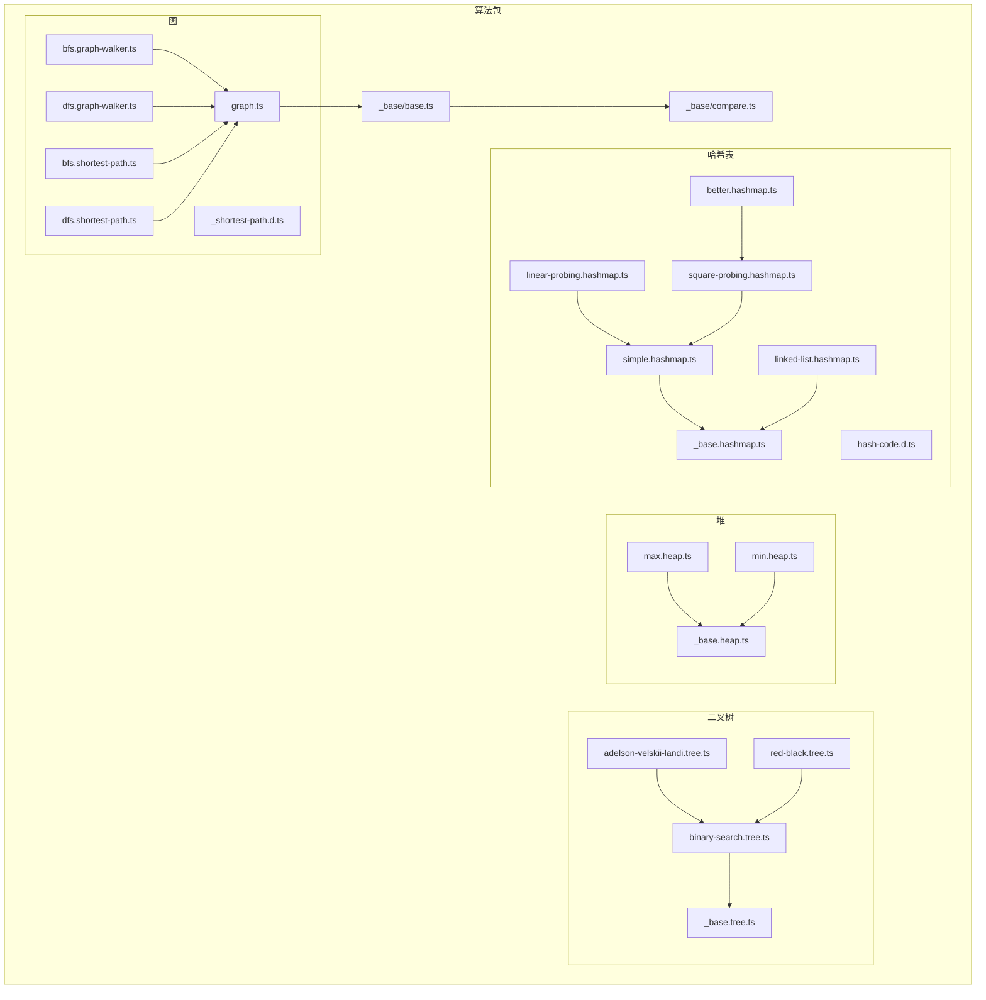
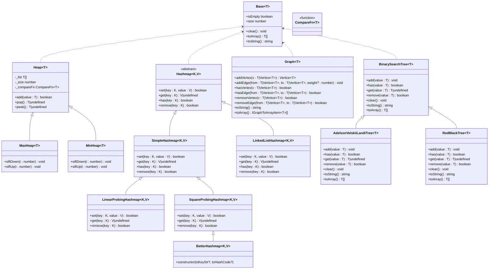
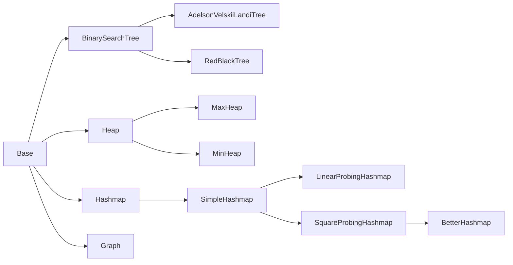

# 高级数据结构

<cite>
**本文引用的文件**
- [packages/algorithm/src/binary-tree/index.ts](file://packages/algorithm/src/binary-tree/index.ts)
- [packages/algorithm/src/binary-tree/binary-search.tree.ts](file://packages/algorithm/src/binary-tree/binary-search.tree.ts)
- [packages/algorithm/src/binary-tree/adelson-velskii-landi.tree.ts](file://packages/algorithm/src/binary-tree/adelson-velskii-landi.tree.ts)
- [packages/algorithm/src/binary-tree/red-black.tree.ts](file://packages/algorithm/src/binary-tree/red-black.tree.ts)
- [packages/algorithm/src/binary-tree/_base.tree.ts](file://packages/algorithm/src/binary-tree/_base.tree.ts)
- [packages/algorithm/src/binary-tree/_base.tree.d.ts](file://packages/algorithm/src/binary-tree/_base.tree.d.ts)
- [packages/algorithm/src/binary-tree/binary-search.tree.d.ts](file://packages/algorithm/src/binary-tree/binary-search.tree.d.ts)
- [packages/algorithm/src/binary-tree/adelson-velskii-landi.tree.d.ts](file://packages/algorithm/src/binary-tree/adelson-velskii-landi.tree.d.ts)
- [packages/algorithm/src/binary-tree/red-black.tree.d.ts](file://packages/algorithm/src/binary-tree/red-black.tree.d.ts)
- [packages/algorithm/src/heap/index.ts](file://packages/algorithm/src/heap/index.ts)
- [packages/algorithm/src/heap/_base.heap.ts](file://packages/algorithm/src/heap/_base.heap.ts)
- [packages/algorithm/src/heap/max.heap.ts](file://packages/algorithm/src/heap/max.heap.ts)
- [packages/algorithm/src/heap/min.heap.ts](file://packages/algorithm/src/heap/min.heap.ts)
- [packages/algorithm/src/hashmap/index.ts](file://packages/algorithm/src/hashmap/index.ts)
- [packages/algorithm/src/hashmap/_base.hashmap.ts](file://packages/algorithm/src/hashmap/_base.hashmap.ts)
- [packages/algorithm/src/hashmap/better.hashmap.ts](file://packages/algorithm/src/hashmap/better.hashmap.ts)
- [packages/algorithm/src/hashmap/linear-probing.hashmap.ts](file://packages/algorithm/src/hashmap/linear-probing.hashmap.ts)
- [packages/algorithm/src/hashmap/linked-list.hashmap.ts](file://packages/algorithm/src/hashmap/linked-list.hashmap.ts)
- [packages/algorithm/src/hashmap/simple.hashmap.ts](file://packages/algorithm/src/hashmap/simple.hashmap.ts)
- [packages/algorithm/src/hashmap/square-probing.hashmap.ts](file://packages/algorithm/src/hashmap/square-probing.hashmap.ts)
- [packages/algorithm/src/hashmap/hash-code.d.ts](file://packages/algorithm/src/hashmap/hash-code.d.ts)
- [packages/algorithm/src/graph/graph.ts](file://packages/algorithm/src/graph/graph.ts)
- [packages/algorithm/src/graph/bfs.graph-walker.ts](file://packages/algorithm/src/graph/bfs.graph-walker.ts)
- [packages/algorithm/src/graph/dfs.graph-walker.ts](file://packages/algorithm/src/graph/dfs.graph-walker.ts)
- [packages/algorithm/src/graph/bfs.shortest-path.ts](file://packages/algorithm/src/graph/bfs.shortest-path.ts)
- [packages/algorithm/src/graph/dfs.shortest-path.ts](file://packages/algorithm/src/graph/dfs.shortest-path.ts)
- [packages/algorithm/src/graph/_shortest-path.d.ts](file://packages/algorithm/src/graph/_shortest-path.d.ts)
- [packages/algorithm/src/graph/index.ts](file://packages/algorithm/src/graph/index.ts)
- [packages/algorithm/src/_base/index.d.ts](file://packages/algorithm/src/_base/index.d.ts)
- [packages/algorithm/src/_base/base.ts](file://packages/algorithm/src/_base/base.ts)
- [packages/algorithm/src/_base/compare.ts](file://packages/algorithm/src/_base/compare.ts)
- [packages/algorithm/src/test/binary-tree.spec.ts](file://packages/algorithm/src/test/binary-tree.spec.ts)
- [packages/algorithm/src/test/heap.spec.ts](file://packages/algorithm/src/test/heap.spec.ts)
- [packages/algorithm/src/test/hashmap.spec.ts](file://packages/algorithm/src/test/hashmap.spec.ts)
- [packages/algorithm/docs/api/index.api.md](file://packages/algorithm/docs/api/index.api.md)
</cite>

## 目录
1. [简介](#简介)
2. [项目结构](#项目结构)
3. [核心组件](#核心组件)
4. [架构总览](#架构总览)
5. [详细组件分析](#详细组件分析)
6. [依赖分析](#依赖分析)
7. [性能考虑](#性能考虑)
8. [故障排查指南](#故障排查指南)
9. [结论](#结论)
10. [附录](#附录)

## 简介
本文件为高级数据结构模块的详细API参考文档，覆盖以下复杂数据结构与其实现变体：
- 二叉树：二叉搜索树（BST）、AVL树、红黑树
- 堆：最大堆、最小堆
- 哈希表：简单哈希表、链式哈希表、线性探测哈希表、平方探测哈希表、优化哈希表
- 图：邻接表表示、广度优先搜索（BFS）、深度优先搜索（DFS）、最短路径算法

文档内容包括：
- 类与接口定义、构造函数、公共方法、属性
- 方法签名、参数类型、返回值类型、异常处理策略
- 泛型使用与类型约束
- 特性与适用场景
- 复杂度分析与性能对比
- 实际使用示例与最佳实践
- 错误处理与边界条件

## 项目结构
算法包采用按功能域分层的组织方式，核心数据结构位于 packages/algorithm/src 下，测试用例位于同目录的 test 子目录，API文档由 docs/api 提供。

图表来源
- [packages/algorithm/src/binary-tree/index.ts:1-5](file://packages/algorithm/src/binary-tree/index.ts#L1-L5)
- [packages/algorithm/src/heap/index.ts:1-3](file://packages/algorithm/src/heap/index.ts#L1-L3)
- [packages/algorithm/src/hashmap/index.ts:1-13](file://packages/algorithm/src/hashmap/index.ts#L1-L13)
- [packages/algorithm/src/graph/index.ts](file://packages/algorithm/src/graph/index.ts)

章节来源
- [packages/algorithm/src/binary-tree/index.ts:1-5](file://packages/algorithm/src/binary-tree/index.ts#L1-L5)
- [packages/algorithm/src/heap/index.ts:1-3](file://packages/algorithm/src/heap/index.ts#L1-L3)
- [packages/algorithm/src/hashmap/index.ts:1-13](file://packages/algorithm/src/hashmap/index.ts#L1-L13)
- [packages/algorithm/src/graph/index.ts](file://packages/algorithm/src/graph/index.ts)

## 核心组件
本节概述各数据结构的公共能力与抽象基类，便于理解继承关系与统一接口。

- 抽象基类 Base<T>
  - 能力：清空、判空、大小、序列化为数组与字符串
  - 公共属性：size、isEmpty
  - 抽象方法：clear()、toArray()、toString()

- 比较器 CompareFn<T>
  - 用于自定义比较逻辑，默认比较器 defaultCompare<T>

章节来源
- [packages/algorithm/src/_base/base.ts](file://packages/algorithm/src/_base/base.ts)
- [packages/algorithm/src/_base/compare.ts](file://packages/algorithm/src/_base/compare.ts)
- [packages/algorithm/src/_base/index.d.ts](file://packages/algorithm/src/_base/index.d.ts)

## 架构总览
下图展示数据结构模块的整体架构与关键依赖：

图表来源
- [packages/algorithm/src/heap/_base.heap.ts:1-64](file://packages/algorithm/src/heap/_base.heap.ts#L1-L64)
- [packages/algorithm/src/heap/max.heap.ts](file://packages/algorithm/src/heap/max.heap.ts)
- [packages/algorithm/src/heap/min.heap.ts](file://packages/algorithm/src/heap/min.heap.ts)
- [packages/algorithm/src/hashmap/_base.hashmap.ts](file://packages/algorithm/src/hashmap/_base.hashmap.ts)
- [packages/algorithm/src/hashmap/simple.hashmap.ts](file://packages/algorithm/src/hashmap/simple.hashmap.ts)
- [packages/algorithm/src/hashmap/linked-list.hashmap.ts](file://packages/algorithm/src/hashmap/linked-list.hashmap.ts)
- [packages/algorithm/src/hashmap/linear-probing.hashmap.ts](file://packages/algorithm/src/hashmap/linear-probing.hashmap.ts)
- [packages/algorithm/src/hashmap/square-probing.hashmap.ts](file://packages/algorithm/src/hashmap/square-probing.hashmap.ts)
- [packages/algorithm/src/hashmap/better.hashmap.ts](file://packages/algorithm/src/hashmap/better.hashmap.ts)
- [packages/algorithm/src/graph/graph.ts](file://packages/algorithm/src/graph/graph.ts)
- [packages/algorithm/src/binary-tree/binary-search.tree.ts](file://packages/algorithm/src/binary-tree/binary-search.tree.ts)
- [packages/algorithm/src/binary-tree/adelson-velskii-landi.tree.ts](file://packages/algorithm/src/binary-tree/adelson-velskii-landi.tree.ts)
- [packages/algorithm/src/binary-tree/red-black.tree.ts](file://packages/algorithm/src/binary-tree/red-black.tree.ts)
- [packages/algorithm/src/_base/base.ts](file://packages/algorithm/src/_base/base.ts)

## 详细组件分析

### 二叉树（Binary Tree）
二叉树模块提供三种实现：二叉搜索树（BST）、AVL树、红黑树。它们共享统一的接口，但内部平衡策略不同。

- 统一接口（来自测试与API文档）
  - add(value: T): void
  - has(value: T): boolean
  - get(value: T): T | undefined
  - remove(value: T): boolean
  - clear(): void
  - toString(): string
  - toArray(): T[]

- 二叉搜索树（BinarySearchTree<T>）
  - 特点：基于有序性质插入/查找；支持中序遍历得到有序序列
  - 复杂度：平均 O(log n)，最坏 O(n)
  - 适用：需要有序访问、范围查询的场景

- AVL树（AdelsonVelskiiLandiTree<T>）
  - 特点：自平衡二叉搜索树，通过旋转保持高度差不超过1
  - 复杂度：所有操作均为 O(log n)
  - 适用：对查询稳定性要求高、频繁查找/删除的场景

- 红黑树（RedBlackTree<T>）
  - 特点：通过颜色约束与旋转维持近似平衡
  - 复杂度：所有操作均为 O(log n)
  - 适用：频繁插入/删除且需稳定性能的场景

- 类与方法概览（基于API文档）
  - BinarySearchTree<T>
    - add(value: T): void
    - has(value: T): boolean
    - get(value: T): T | undefined
    - remove(value: T): boolean
    - clear(): void
    - toString(): string
    - toArray(): T[]
  - AdelsonVelskiiLandiTree<T>
    - add(value: T): void
    - has(value: T): boolean
    - get(value: T): T | undefined
    - remove(value: T): boolean
    - clear(): void
    - toString(): string
    - toArray(): T[]
    - 旋转方法：LL、LR、RL、RR
  - RedBlackTree<T>
    - add(value: T): void
    - has(value: T): boolean
    - get(value: T): T | undefined
    - remove(value: T): boolean
    - clear(): void
    - toString(): string
    - toArray(): T[]
    - 旋转与着色修复

- 测试验证要点
  - 插入重复元素不改变结构
  - 删除不存在元素不影响集合
  - 中序遍历输出有序序列（BST/AVL）
  - AVL旋转后仍满足平衡性质

章节来源
- [packages/algorithm/src/binary-tree/binary-search.tree.ts](file://packages/algorithm/src/binary-tree/binary-search.tree.ts)
- [packages/algorithm/src/binary-tree/adelson-velskii-landi.tree.ts](file://packages/algorithm/src/binary-tree/adelson-velskii-landi.tree.ts)
- [packages/algorithm/src/binary-tree/red-black.tree.ts](file://packages/algorithm/src/binary-tree/red-black.tree.ts)
- [packages/algorithm/src/test/binary-tree.spec.ts:62-322](file://packages/algorithm/src/test/binary-tree.spec.ts#L62-L322)
- [packages/algorithm/docs/api/index.api.md:113-134](file://packages/algorithm/docs/api/index.api.md#L113-L134)
- [packages/algorithm/docs/api/index.api.md:7-22](file://packages/algorithm/docs/api/index.api.md#L7-L22)
- [packages/algorithm/docs/api/index.api.md:534-547](file://packages/algorithm/docs/api/index.api.md#L534-L547)

### 堆（Heap）
堆模块提供最大堆与最小堆，均基于数组存储的完全二叉树结构。

- 抽象基类 Heap<T>
  - 属性：_list（数组）、_size（大小）、_compareFn（比较器）
  - 方法：add(value: T): boolean、pop(): T | undefined、peek(): T | undefined
  - 复杂度：add/pop 均为 O(log n)，peek 为 O(1)

- 最大堆（MaxHeap<T>）
  - 性质：父节点 ≥ 子节点
  - 应用：优先队列、Top-K 问题

- 最小堆（MinHeap<T>）
  - 性质：父节点 ≤ 子节点
  - 应用：优先队列、合并 K 个有序序列

- 类与方法概览（基于API文档）
  - Heap<T>
    - add(value: T): boolean
    - pop(): T | undefined
    - peek(): T | undefined
  - MaxHeap<T>
    - siftDown(index: number): void
    - siftUp(index: number): void
  - MinHeap<T>
    - siftDown(index: number): void
    - siftUp(index: number): void

- 测试验证要点
  - 最小堆插入后 peek 返回最小值
  - 最大堆插入后 peek 返回最大值
  - pop 后堆顶更新并保持堆性质

章节来源
- [packages/algorithm/src/heap/_base.heap.ts:1-64](file://packages/algorithm/src/heap/_base.heap.ts#L1-L64)
- [packages/algorithm/src/heap/max.heap.ts](file://packages/algorithm/src/heap/max.heap.ts)
- [packages/algorithm/src/heap/min.heap.ts](file://packages/algorithm/src/heap/min.heap.ts)
- [packages/algorithm/src/test/heap.spec.ts:21-197](file://packages/algorithm/src/test/heap.spec.ts#L21-L197)
- [packages/algorithm/docs/api/index.api.md:446-462](file://packages/algorithm/docs/api/index.api.md#L446-L462)

### 哈希表（HashMap）
哈希表模块提供多种冲突解决策略与实现变体。

- 抽象基类 Hashmap<K, V>
  - 方法：set(key: K, value: V): boolean、get(key: K): V | undefined、has(key: K): boolean、remove(key: K): boolean

- 简单哈希表（SimpleHashmap<K, V>）
  - 冲突：无内置处理（可能被其他实现替代）
  - 适用：自定义冲突策略或作为基础

- 链式哈希表（LinkedListHashmap<K, V>）
  - 冲突：拉链法（链表）
  - 复杂度：平均 O(1)，最坏 O(n)

- 线性探测哈希表（LinearProbingHashmap<K, V>）
  - 冲突：开放定址法，线性探测
  - 复杂度：平均 O(1)，最坏 O(n)

- 平方探测哈希表（SquareProbingHashmap<K, V>）
  - 冲突：开放定址法，二次探测
  - 复杂度：平均 O(1)，最坏 O(n)

- 优化哈希表（BetterHashmap<K, V>）
  - 继承自平方探测，可能包含容量扩展与更好的散列函数

- 类与方法概览（基于API文档）
  - Hashmap<K, V>
    - set(key: K, value: V): boolean
    - get(key: K): V | undefined
    - has(key: K): boolean
    - remove(key: K): boolean
  - SimpleHashmap<K, V>
    - set/get/has/remove: boolean
  - LinkedListHashmap<K, V>
    - set/get/has/remove: boolean
  - LinearProbingHashmap<K, V>
    - set/get/remove: boolean
  - SquareProbingHashmap<K, V>
    - set/get/remove: boolean
  - BetterHashmap<K, V>
    - 构造函数：constructor(toKeyStr?, toHashCode?)

- 测试验证要点
  - set 后 has 返回 true
  - get 返回对应值或 undefined
  - remove 后 has 返回 false
  - 不同实现对冲突处理结果不同（链表/探测/平方探测）

章节来源
- [packages/algorithm/src/hashmap/_base.hashmap.ts:136-177](file://packages/algorithm/src/hashmap/_base.hashmap.ts#L136-L177)
- [packages/algorithm/src/hashmap/simple.hashmap.ts](file://packages/algorithm/src/hashmap/simple.hashmap.ts)
- [packages/algorithm/src/hashmap/linked-list.hashmap.ts](file://packages/algorithm/src/hashmap/linked-list.hashmap.ts)
- [packages/algorithm/src/hashmap/linear-probing.hashmap.ts](file://packages/algorithm/src/hashmap/linear-probing.hashmap.ts)
- [packages/algorithm/src/hashmap/square-probing.hashmap.ts](file://packages/algorithm/src/hashmap/square-probing.hashmap.ts)
- [packages/algorithm/src/hashmap/better.hashmap.ts](file://packages/algorithm/src/hashmap/better.hashmap.ts)
- [packages/algorithm/src/test/hashmap.spec.ts:43-254](file://packages/algorithm/src/test/hashmap.spec.ts#L43-L254)
- [packages/algorithm/docs/api/index.api.md:274-279](file://packages/algorithm/docs/api/index.api.md#L274-L279)
- [packages/algorithm/docs/api/index.api.md:586-614](file://packages/algorithm/docs/api/index.api.md#L586-L614)
- [packages/algorithm/docs/api/index.api.md:362-390](file://packages/algorithm/docs/api/index.api.md#L362-L390)
- [packages/algorithm/docs/api/index.api.md:337-344](file://packages/algorithm/docs/api/index.api.md#L337-L344)
- [packages/algorithm/docs/api/index.api.md:652-659](file://packages/algorithm/docs/api/index.api.md#L652-L659)
- [packages/algorithm/docs/api/index.api.md:103-105](file://packages/algorithm/docs/api/index.api.md#L103-L105)

### 图（Graph）
图模块提供邻接表表示与常见遍历、最短路径算法。

- 图类 Graph<T>
  - 构造：isDirected?: boolean, equalsFn?: EqualsFn<T>
  - 方法：addVertex/addEdge、hasVertex/hasEdge、removeVertex/removeEdge、toString/toArray
  - 属性：vertices、adjList、isDirected、size、isEmpty

- 遍历与最短路径
  - 广度优先搜索（BFS）：bfs.graph-walker.ts、bfs.shortest-path.ts
  - 深度优先搜索（DFS）：dfs.graph-walker.ts、dfs.shortest-path.ts
  - 最短路径返回结构：IGraphShortestPathReturn<T>

- 类与方法概览（基于API文档）
  - Graph<T>
    - addVertex(vertex: T|Vertice<T>): Vertice<T>
    - addEdge(from: T|Vertice<T>, to: T|Vertice<T>, weight?: number): void
    - hasVertex(vertex: T|Vertice<T>): boolean
    - hasEdge(from: T|Vertice<T>, to: T|Vertice<T>): boolean
    - removeVertex(vertex: T|Vertice<T>): boolean
    - removeEdge(from: T|Vertice<T>, to: T|Vertice<T>): boolean
    - toString(): string
    - toArray(): IGraphToArrayItem<T>[]
  - BFS/DFS Walker 与 Shortest Path 函数
    - breadthFirstSearch(...)
    - breadthFirstSearchShortestPath(...)
    - depthFirstSearch(...)
    - depthFirstSearchShortestPath(...)

- 测试验证要点
  - 添加边后可达性检查
  - 删除顶点/边后的状态一致性
  - 最短路径距离与前驱映射

章节来源
- [packages/algorithm/src/graph/graph.ts](file://packages/algorithm/src/graph/graph.ts)
- [packages/algorithm/src/graph/bfs.graph-walker.ts](file://packages/algorithm/src/graph/bfs.graph-walker.ts)
- [packages/algorithm/src/graph/dfs.graph-walker.ts](file://packages/algorithm/src/graph/dfs.graph-walker.ts)
- [packages/algorithm/src/graph/bfs.shortest-path.ts](file://packages/algorithm/src/graph/bfs.shortest-path.ts)
- [packages/algorithm/src/graph/dfs.shortest-path.ts](file://packages/algorithm/src/graph/dfs.shortest-path.ts)
- [packages/algorithm/src/graph/_shortest-path.d.ts](file://packages/algorithm/src/graph/_shortest-path.d.ts)
- [packages/algorithm/docs/api/index.api.md:248-271](file://packages/algorithm/docs/api/index.api.md#L248-L271)
- [packages/algorithm/docs/api/index.api.md:142-148](file://packages/algorithm/docs/api/index.api.md#L142-L148)
- [packages/algorithm/docs/api/index.api.md:185-191](file://packages/algorithm/docs/api/index.api.md#L185-L191)

## 依赖分析
- 继承关系
  - AdelsonVelskiiLandiTree<T> 继承 BinarySearchTree<T>
  - RedBlackTree<T> 继承 BinarySearchTree<T>
  - MaxHeap<T>、MinHeap<T> 继承 Heap<T>
  - SimpleHashmap<K, V> 为哈希表基础实现
  - LinearProbingHashmap<K, V>、SquareProbingHashmap<K, V> 继承 SimpleHashmap<K, V>
  - BetterHashmap<K, V> 继承 SquareProbingHashmap<K, V>

- 接口契约
  - 所有数据结构均实现 Base<T> 的统一接口
  - 堆使用 CompareFn<T> 控制比较方向
  - 哈希表可注入 toKeyStr 与 toHashCode 自定义键序列化与散列

图表来源
- [packages/algorithm/src/binary-tree/binary-search.tree.ts](file://packages/algorithm/src/binary-tree/binary-search.tree.ts)
- [packages/algorithm/src/binary-tree/adelson-velskii-landi.tree.ts](file://packages/algorithm/src/binary-tree/adelson-velskii-landi.tree.ts)
- [packages/algorithm/src/binary-tree/red-black.tree.ts](file://packages/algorithm/src/binary-tree/red-black.tree.ts)
- [packages/algorithm/src/heap/_base.heap.ts:1-64](file://packages/algorithm/src/heap/_base.heap.ts#L1-L64)
- [packages/algorithm/src/hashmap/_base.hashmap.ts](file://packages/algorithm/src/hashmap/_base.hashmap.ts)
- [packages/algorithm/src/hashmap/simple.hashmap.ts](file://packages/algorithm/src/hashmap/simple.hashmap.ts)
- [packages/algorithm/src/hashmap/linear-probing.hashmap.ts](file://packages/algorithm/src/hashmap/linear-probing.hashmap.ts)
- [packages/algorithm/src/hashmap/square-probing.hashmap.ts](file://packages/algorithm/src/hashmap/square-probing.hashmap.ts)
- [packages/algorithm/src/hashmap/better.hashmap.ts](file://packages/algorithm/src/hashmap/better.hashmap.ts)
- [packages/algorithm/src/_base/base.ts](file://packages/algorithm/src/_base/base.ts)

## 性能考虑
- 二叉树
  - BST：平均 O(log n) 查找/插入/删除，最坏 O(n)（退化为链表）
  - AVL/红黑树：严格 O(log n)，适合对性能稳定性要求高的场景
- 堆
  - 最大/最小堆：O(log n) 插入/删除，O(1) 查看堆顶
- 哈希表
  - 简单/链式：平均 O(1)，链式在冲突多时退化为 O(n)
  - 线性/平方探测：平均 O(1)，探测序列减少聚集
  - BetterHashmap：在平方探测基础上优化，提升缓存与扩容策略
- 图
  - BFS/DFS 时间复杂度 O(V+E)，邻接表空间开销与边数相关

[本节为通用性能讨论，无需特定文件来源]

## 故障排查指南
- 二叉树
  - 插入重复元素：不会改变树结构，测试断言 size 不变
  - 删除不存在元素：不影响集合状态
  - 遍历顺序：中序遍历应为有序序列（BST/AVL）
- 堆
  - pop 后堆顶变化：最小堆返回最小值，最大堆返回最大值
  - 空堆 pop/peek：返回 undefined
- 哈希表
  - 冲突处理差异：链式/探测/平方探测导致最终存储形态不同
  - 自定义键序列化/散列：确保 toKeyStr 与 toHashCode 一致且分布均匀
- 图
  - 添加/删除边后可达性：使用 hasEdge/hasVertex 验证
  - 最短路径：检查距离映射与前驱映射是否一致

章节来源
- [packages/algorithm/src/test/binary-tree.spec.ts:173-321](file://packages/algorithm/src/test/binary-tree.spec.ts#L173-L321)
- [packages/algorithm/src/test/heap.spec.ts:49-196](file://packages/algorithm/src/test/heap.spec.ts#L49-L196)
- [packages/algorithm/src/test/hashmap.spec.ts:218-254](file://packages/algorithm/src/test/hashmap.spec.ts#L218-L254)

## 结论
本模块提供了完整的高级数据结构实现与统一的API设计，覆盖了工程实践中常见的需求：
- 二叉搜索树及其平衡变体，满足稳定的 O(log n) 操作
- 堆结构，适用于优先队列与 Top-K 场景
- 多种哈希表实现，兼顾冲突处理与性能
- 图的邻接表表示与遍历、最短路径工具

建议根据具体场景选择合适的数据结构与实现变体，并结合测试用例与API文档进行集成与调优。

[本节为总结性内容，无需特定文件来源]

## 附录
- API 参考（节选）
  - 二叉树：BinarySearchTree<T>、AdelsonVelskiiLandiTree<T>、RedBlackTree<T>
  - 堆：Heap<T>、MaxHeap<T>、MinHeap<T>
  - 哈希表：Hashmap<K,V>、SimpleHashmap<K,V>、LinkedListHashmap<K,V>、LinearProbingHashmap<K,V>、SquareProbingHashmap<K,V>、BetterHashmap<K,V>
  - 图：Graph<T>、BFS/DFS 遍历与最短路径函数

章节来源
- [packages/algorithm/docs/api/index.api.md:113-134](file://packages/algorithm/docs/api/index.api.md#L113-L134)
- [packages/algorithm/docs/api/index.api.md:7-22](file://packages/algorithm/docs/api/index.api.md#L7-L22)
- [packages/algorithm/docs/api/index.api.md:534-547](file://packages/algorithm/docs/api/index.api.md#L534-L547)
- [packages/algorithm/docs/api/index.api.md:446-462](file://packages/algorithm/docs/api/index.api.md#L446-L462)
- [packages/algorithm/docs/api/index.api.md:274-279](file://packages/algorithm/docs/api/index.api.md#L274-L279)
- [packages/algorithm/docs/api/index.api.md:586-614](file://packages/algorithm/docs/api/index.api.md#L586-L614)
- [packages/algorithm/docs/api/index.api.md:362-390](file://packages/algorithm/docs/api/index.api.md#L362-L390)
- [packages/algorithm/docs/api/index.api.md:337-344](file://packages/algorithm/docs/api/index.api.md#L337-L344)
- [packages/algorithm/docs/api/index.api.md:652-659](file://packages/algorithm/docs/api/index.api.md#L652-L659)
- [packages/algorithm/docs/api/index.api.md:248-271](file://packages/algorithm/docs/api/index.api.md#L248-L271)
- [packages/algorithm/docs/api/index.api.md:142-148](file://packages/algorithm/docs/api/index.api.md#L142-L148)
- [packages/algorithm/docs/api/index.api.md:185-191](file://packages/algorithm/docs/api/index.api.md#L185-L191)