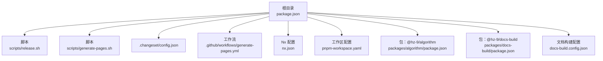
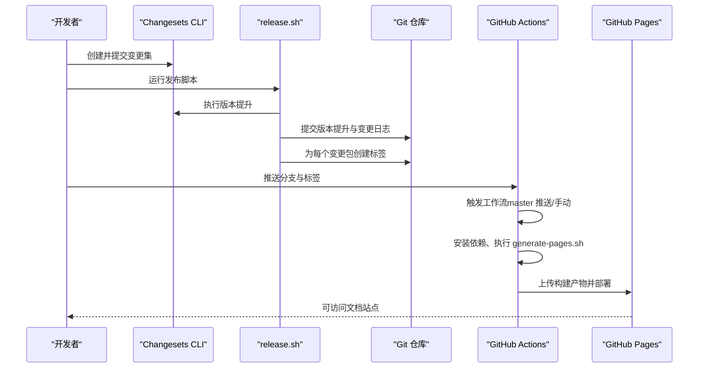
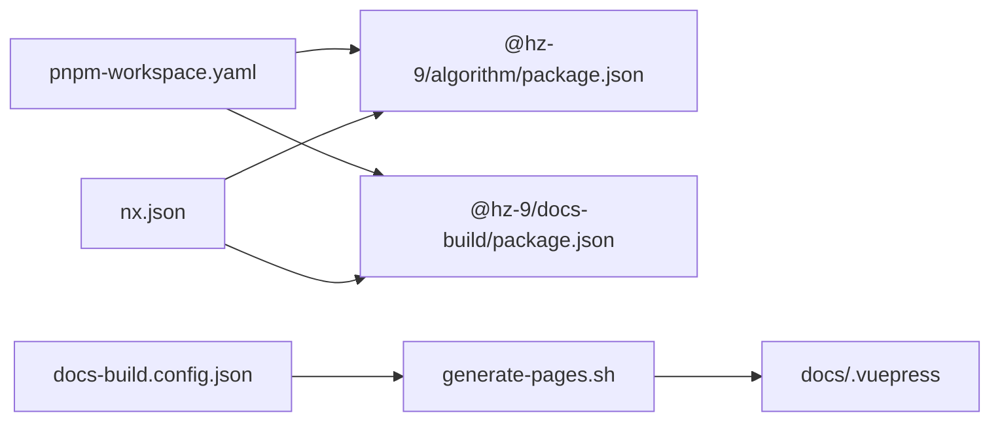

# 发布流程

<cite>
**本文引用的文件**
- [package.json](file://package.json)
- [.changeset/config.json](file://.changeset/config.json)
- [scripts/release.sh](file://scripts/release.sh)
- [scripts/generate-pages.sh](file://scripts/generate-pages.sh)
- [.github/workflows/generate-pages.yml](file://.github/workflows/generate-pages.yml)
- [nx.json](file://nx.json)
- [pnpm-workspace.yaml](file://pnpm-workspace.yaml)
- [packages/algorithm/package.json](file://packages/algorithm/package.json)
- [packages/docs-build/package.json](file://packages/docs-build/package.json)
- [docs-build.config.json](file://docs-build.config.json)
- [README.md](file://README.md)
</cite>

## 目录
1. [简介](#简介)
2. [项目结构](#项目结构)
3. [核心组件](#核心组件)
4. [架构总览](#架构总览)
5. [详细组件分析](#详细组件分析)
6. [依赖关系分析](#依赖关系分析)
7. [性能与稳定性考量](#性能与稳定性考量)
8. [故障排查指南](#故障排查指南)
9. [结论](#结论)
10. [附录](#附录)

## 简介
本指南面向 HZ 9 Tool 项目的维护者与贡献者，系统化阐述从版本管理到自动化发布的完整流程。内容覆盖 Changeset 的版本号规则与变更集创建、版本发布流程、自动化发布阶段（构建、测试、打包、发布）、发布脚本功能与参数、GitHub Pages 自动部署配置与触发机制、发布前准备、回滚与紧急修复、发布监控与通知建议，以及多渠道发布（npm、GitHub Releases）的配置思路。

## 项目结构
本仓库采用 Nx 多包工作区，使用 pnpm 管理依赖，通过 Changesets 统一进行版本与变更日志管理，并以 GitHub Actions 实现文档站点的自动构建与部署。

图表来源
- [package.json:1-42](file://package.json#L1-L42)
- [scripts/release.sh:1-73](file://scripts/release.sh#L1-L73)
- [scripts/generate-pages.sh:1-76](file://scripts/generate-pages.sh#L1-L76)
- [.changeset/config.json:1-12](file://.changeset/config.json#L1-L12)
- [.github/workflows/generate-pages.yml:1-71](file://.github/workflows/generate-pages.yml#L1-L71)
- [nx.json:1-32](file://nx.json#L1-L32)
- [pnpm-workspace.yaml:1-3](file://pnpm-workspace.yaml#L1-L3)
- [packages/algorithm/package.json:1-46](file://packages/algorithm/package.json#L1-L46)
- [packages/docs-build/package.json:1-64](file://packages/docs-build/package.json#L1-L64)
- [docs-build.config.json:1-184](file://docs-build.config.json#L1-L184)

章节来源
- [package.json:1-42](file://package.json#L1-L42)
- [nx.json:1-32](file://nx.json#L1-L32)
- [pnpm-workspace.yaml:1-3](file://pnpm-workspace.yaml#L1-L3)

## 核心组件
- 版本与变更日志管理：基于 Changesets，配置位于 .changeset/config.json，支持自动生成变更日志、控制访问级别与内部依赖更新策略。
- 发布流水线：通过根目录脚本 scripts/release.sh 执行版本提升、锁文件更新、打标签、提交等步骤；npm 发布命令通过 scripts/release.sh 中的注释保留，便于按需启用。
- 文档生成与部署：scripts/generate-pages.sh 负责格式化、构建、测试、API 报告生成，同步各包的指南、API 与变更日志至 docs 目录，再由 docs-build.config.json 驱动 docs-build 构建 VuePress 站点；GitHub Actions 工作流在 master 分支推送或手动触发时自动部署到 GitHub Pages。
- 工作区与构建：nx.json 定义了 build/test/api-report 等目标的默认行为与输入输出；pnpm-workspace.yaml 指定包路径；各子包的 package.json 定义了构建脚本与发布配置。

章节来源
- [.changeset/config.json:1-12](file://.changeset/config.json#L1-L12)
- [scripts/release.sh:1-73](file://scripts/release.sh#L1-L73)
- [scripts/generate-pages.sh:1-76](file://scripts/generate-pages.sh#L1-L76)
- [nx.json:1-32](file://nx.json#L1-L32)
- [pnpm-workspace.yaml:1-3](file://pnpm-workspace.yaml#L1-L3)
- [packages/algorithm/package.json:1-46](file://packages/algorithm/package.json#L1-L46)
- [packages/docs-build/package.json:1-64](file://packages/docs-build/package.json#L1-L64)
- [docs-build.config.json:1-184](file://docs-build.config.json#L1-L184)

## 架构总览
下图展示了从本地版本提升到 GitHub Pages 自动部署的整体流程。

图表来源
- [scripts/release.sh:1-73](file://scripts/release.sh#L1-L73)
- [.changeset/config.json:1-12](file://.changeset/config.json#L1-L12)
- [.github/workflows/generate-pages.yml:1-71](file://.github/workflows/generate-pages.yml#L1-L71)

## 详细组件分析

### 版本管理与 Changeset 使用
- 版本号规则与策略
  - Changesets 默认遵循语义化版本（SemVer），根据变更类型（major/minor/patch）与包内依赖关系决定版本提升层级。
  - 内部依赖更新策略：updateInternalDependencies 设为 patch，表示内部包之间的依赖升级以补丁为主，降低破坏性升级风险。
  - 基准分支：baseBranch 为 master，确保与主干保持一致的版本基线。
- 变更集创建与提交
  - 使用 pnpm changeset 在本地创建变更集，描述本次变更类型与影响范围。
  - 提交变更集后，运行 pnpm changeset version 生成统一的版本提升与变更日志。
- 变更日志生成
  - changelog 采用 @changesets/changelog-git，基于 Git 提交记录生成变更日志，确保可追溯性。

章节来源
- [.changeset/config.json:1-12](file://.changeset/config.json#L1-L12)
- [package.json:13-15](file://package.json#L13-L15)
- [README.md:37-44](file://README.md#L37-L44)

### 自动化发布流水线（构建、测试、打包、发布）
- 流水线阶段
  - 版本提升：pnpm changeset version 更新所有受影响包的版本与变更日志。
  - 锁文件更新：pnpm install --lockfile-only 同步依赖锁定文件。
  - 变更包识别：遍历 packages 目录，对比版本快照，确定需要发布的包并生成标签名。
  - 提交与打标签：git add/commit 与 git tag 为每个发布包创建对应标签。
  - 发布（可选）：脚本中保留了发布到 npm 的注释步骤，便于在 CI 或本地安全地启用。
- 脚本入口
  - 根目录通过 pnpm publish 调用 scripts/release.sh，实现一键式发布流程。

章节来源
- [scripts/release.sh:1-73](file://scripts/release.sh#L1-L73)
- [package.json:15](file://package.json#L15)

### 发布脚本功能与使用说明（release.sh）
- 功能概览
  - 记录当前各包版本，生成临时快照。
  - 执行版本提升与锁文件更新。
  - 识别发生版本变化的包，生成标签列表。
  - 提交变更并为每个变更包打上形如 包名@版本 的标签。
  - 保留 npm 发布与远程推送步骤，便于后续启用。
- 使用建议
  - 在本地完成变更集评审与自测后，运行发布脚本。
  - 若需发布到 npm，请解除注释相应步骤并确保已登录 npm。
  - 发布完成后，推送分支与标签至远端仓库。

章节来源
- [scripts/release.sh:1-73](file://scripts/release.sh#L1-L73)
- [package.json:15](file://package.json#L15)

### 文档生成与 GitHub Pages 自动部署（generate-pages.sh 与 generate-pages.yml）
- 文档生成脚本
  - 预处理：格式化、静态检查、构建、测试、生成 API 报告。
  - 清理历史：移除 docs/guide、docs/api、docs/changelog 下的历史内容。
  - 同步内容：从各包复制 docs/guide、docs/.markdowns、CHANGELOG.md 到 docs 对应位置。
  - 构建站点：调用 docs-build 构建 VuePress 站点。
- GitHub Pages 工作流
  - 触发条件：master 分支推送或手动触发 workflow_dispatch。
  - 步骤：安装 Node 与 pnpm、安装依赖、执行 generate-pages.sh、安装 VuePress 依赖并构建、上传工件并部署到 GitHub Pages。
  - 权限：赋予 GITHUB_TOKEN 读写 Pages 与部署权限。

章节来源
- [scripts/generate-pages.sh:1-76](file://scripts/generate-pages.sh#L1-L76)
- [.github/workflows/generate-pages.yml:1-71](file://.github/workflows/generate-pages.yml#L1-L71)
- [docs-build.config.json:1-184](file://docs-build.config.json#L1-L184)

### 发布前准备清单
- 版本检查
  - 确认已创建并提交变更集，且 pnpm changeset version 已成功生成版本提升与变更日志。
  - 核对各包版本是否符合预期，必要时回退变更集或调整版本策略。
- 变更日志更新
  - 确保每个包的 CHANGELOG.md 已随版本提升更新，避免发布后文档缺失。
- 文档同步
  - 确认 generate-pages.sh 已正确同步各包的指南、API 与变更日志到 docs 目录。
- 本地验证
  - 在本地执行 pnpm build、pnpm test、pnpm api-report，确保无异常后再进行发布。

章节来源
- [scripts/generate-pages.sh:18-76](file://scripts/generate-pages.sh#L18-L76)
- [README.md:37-44](file://README.md#L37-L44)

### 发布回滚与紧急修复
- 回滚策略
  - Git 标签回滚：若发布后发现问题，可通过删除并重新创建标签的方式回滚版本；注意团队协作中需同步删除远端标签。
  - 版本回退：在本地执行版本回退与重新打标签，然后推送新标签。
- 紧急修复
  - 优先修复并创建新的变更集，随后运行版本提升与发布流程，确保用户尽快获得修复版本。
- 注意事项
  - 回滚可能影响下游依赖，需评估兼容性并及时通知使用者。

章节来源
- [scripts/release.sh:30-68](file://scripts/release.sh#L30-L68)

### 发布监控与通知
- 监控建议
  - 关注 GitHub Actions 工作流状态与日志，确保每一步均成功完成。
  - 在发布脚本中增加失败退出（set -e）与阶段性输出，便于定位问题。
- 通知建议
  - 在 CI 中集成通知（如邮件、IM 机器人），在发布完成后发送结果通知。
  - 对于重大版本发布，建议在团队群组中同步消息。

章节来源
- [.github/workflows/generate-pages.yml:1-71](file://.github/workflows/generate-pages.yml#L1-L71)
- [scripts/release.sh:1-73](file://scripts/release.sh#L1-L73)

### 多渠道发布（npm、GitHub Releases）
- npm 发布
  - 当前发布脚本保留了发布到 npm 的步骤（注释形式），可在 CI 或本地安全启用。
  - 各包的 publishConfig.access 设置为 public，确保公开发布。
- GitHub Releases
  - 可结合发布脚本生成的 Git 标签，在 GitHub 上创建 Release，附带变更日志与二进制产物（如需）。
  - 也可在 CI 中使用 GitHub CLI 或第三方工具自动创建 Release。

章节来源
- [scripts/release.sh:61-68](file://scripts/release.sh#L61-L68)
- [packages/algorithm/package.json:42-44](file://packages/algorithm/package.json#L42-L44)
- [packages/docs-build/package.json:60-62](file://packages/docs-build/package.json#L60-L62)

## 依赖关系分析
- 工作区与包
  - pnpm-workspace.yaml 指定 packages/* 为工作区包集合。
  - 各包独立定义构建、测试、API 报告脚本与发布配置。
- 构建与测试
  - nx.json 为 build/test/api-report 目标设置依赖链与缓存策略，保证构建顺序与复用。
- 文档构建
  - docs-build.config.json 定义站点语言、导航与侧边栏，generate-pages.sh 将各包内容同步到 docs 并驱动构建。

图表来源
- [pnpm-workspace.yaml:1-3](file://pnpm-workspace.yaml#L1-L3)
- [packages/algorithm/package.json:1-46](file://packages/algorithm/package.json#L1-L46)
- [packages/docs-build/package.json:1-64](file://packages/docs-build/package.json#L1-L64)
- [nx.json:7-25](file://nx.json#L7-L25)
- [docs-build.config.json:1-184](file://docs-build.config.json#L1-L184)
- [scripts/generate-pages.sh:73-76](file://scripts/generate-pages.sh#L73-L76)

章节来源
- [pnpm-workspace.yaml:1-3](file://pnpm-workspace.yaml#L1-L3)
- [nx.json:1-32](file://nx.json#L1-L32)
- [docs-build.config.json:1-184](file://docs-build.config.json#L1-L184)

## 性能与稳定性考量
- 构建缓存
  - nx.json 为 api-report 与 lint 目标开启缓存，减少重复计算时间。
- 依赖锁定
  - 发布流程中先执行版本提升，再更新锁文件，确保依赖一致性。
- 文档生成
  - generate-pages.sh 先清理旧内容，避免历史残留影响最终站点。

章节来源
- [nx.json:17-24](file://nx.json#L17-L24)
- [scripts/release.sh:25-26](file://scripts/release.sh#L25-L26)
- [scripts/generate-pages.sh:19-23](file://scripts/generate-pages.sh#L19-L23)

## 故障排查指南
- Changesets 未生效
  - 确认已创建并提交变更集，且执行了 pnpm changeset version。
- 发布脚本无变更包
  - 检查是否存在真正的版本变化；若无变更，脚本会提示“Nothing to do”并退出。
- GitHub Pages 部署失败
  - 检查工作流日志中的依赖安装、脚本执行与构建步骤；确认 docs-build.config.json 导航与侧边栏配置正确。
- npm 发布失败
  - 确认已登录 npm，且各包 publishConfig.access 为 public；如需启用发布步骤，请解除 release.sh 中的注释并安全运行。

章节来源
- [scripts/release.sh:43-46](file://scripts/release.sh#L43-L46)
- [.github/workflows/generate-pages.yml:48-63](file://.github/workflows/generate-pages.yml#L48-L63)
- [scripts/release.sh:61-68](file://scripts/release.sh#L61-L68)

## 结论
本指南提供了 HZ 9 Tool 项目的完整发布流程：以 Changesets 为核心的版本与变更日志管理、本地与 CI 的自动化发布脚本、以及 GitHub Pages 的自动部署配置。通过严格的发布前准备、清晰的回滚与紧急修复策略、以及可观测的监控与通知机制，可有效保障发布质量与效率。

## 附录
- 常用命令参考
  - 创建变更集：pnpm changeset
  - 版本提升与生成变更日志：pnpm changeset version
  - 发布到 npm（如启用）：pnpm publish
  - 生成文档站点：bash ./scripts/generate-pages.sh
- 参考文件
  - 根目录脚本与配置：scripts/release.sh、scripts/generate-pages.sh、.changeset/config.json、package.json
  - CI 配置：.github/workflows/generate-pages.yml
  - 工作区与构建：nx.json、pnpm-workspace.yaml
  - 包配置：packages/algorithm/package.json、packages/docs-build/package.json
  - 文档构建配置：docs-build.config.json

章节来源
- [README.md:37-44](file://README.md#L37-L44)
- [scripts/release.sh:1-73](file://scripts/release.sh#L1-L73)
- [scripts/generate-pages.sh:1-76](file://scripts/generate-pages.sh#L1-L76)
- [.changeset/config.json:1-12](file://.changeset/config.json#L1-L12)
- [.github/workflows/generate-pages.yml:1-71](file://.github/workflows/generate-pages.yml#L1-L71)
- [nx.json:1-32](file://nx.json#L1-L32)
- [pnpm-workspace.yaml:1-3](file://pnpm-workspace.yaml#L1-L3)
- [packages/algorithm/package.json:1-46](file://packages/algorithm/package.json#L1-L46)
- [packages/docs-build/package.json:1-64](file://packages/docs-build/package.json#L1-L64)
- [docs-build.config.json:1-184](file://docs-build.config.json#L1-L184)