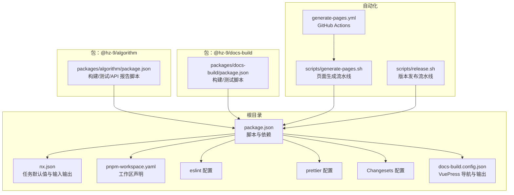
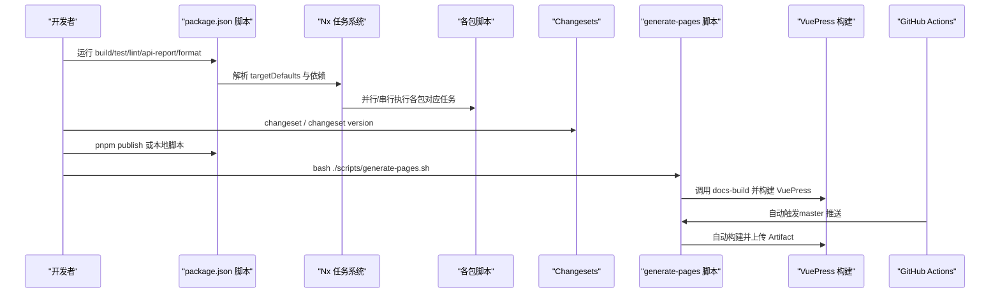
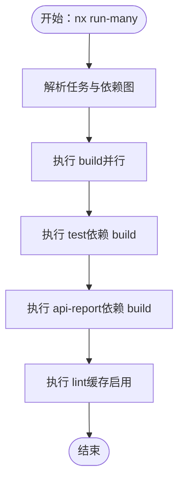
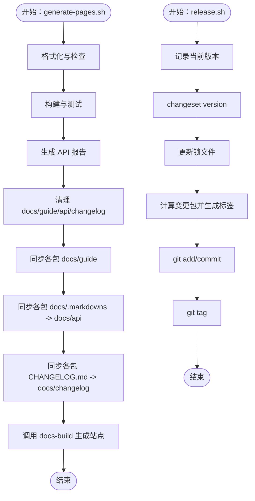
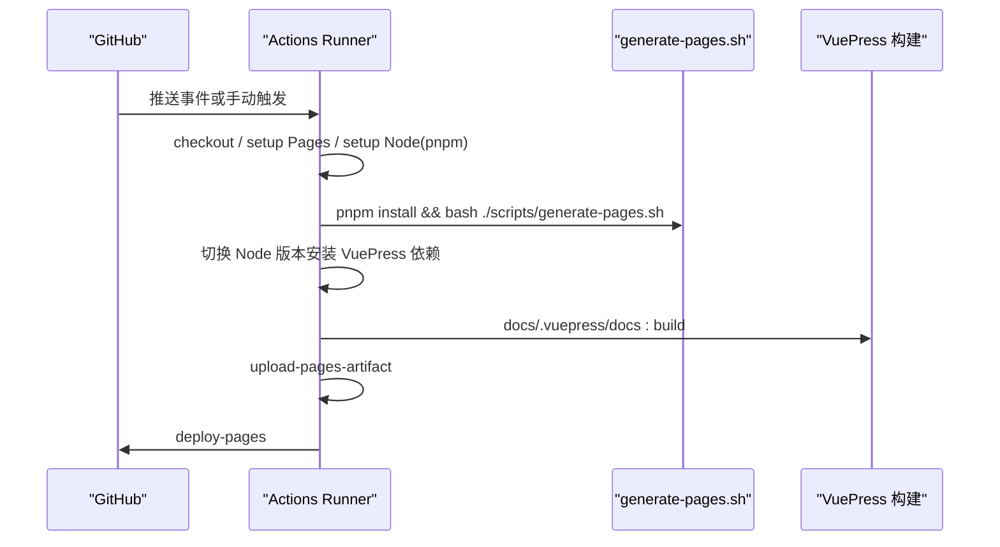
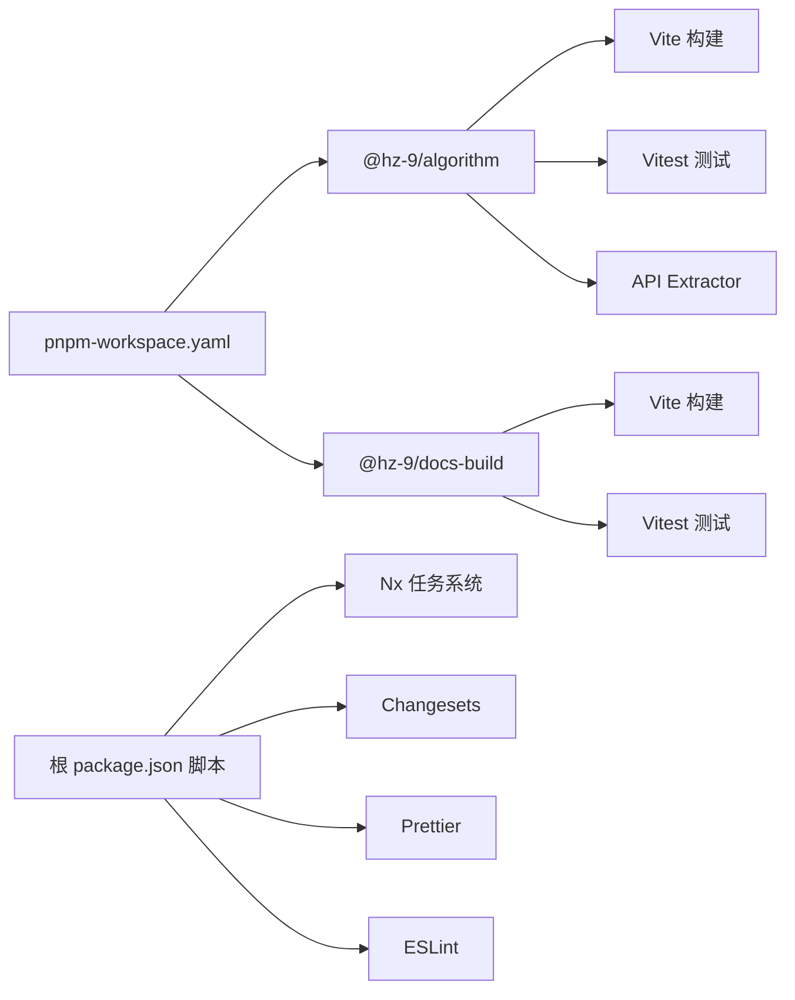

# 开发流程

<cite>
**本文引用的文件**
- [package.json](file://package.json)
- [nx.json](file://nx.json)
- [pnpm-workspace.yaml](file://pnpm-workspace.yaml)
- [README.md](file://README.md)
- [scripts/generate-pages.sh](file://scripts/generate-pages.sh)
- [scripts/release.sh](file://scripts/release.sh)
- [.github/workflows/generate-pages.yml](file://.github/workflows/generate-pages.yml)
- [.eslintrc.js](file://.eslintrc.js)
- [.prettierrc.js](file://.prettierrc.js)
- [.changeset/config.json](file://.changeset/config.json)
- [packages/algorithm/package.json](file://packages/algorithm/package.json)
- [packages/docs-build/package.json](file://packages/docs-build/package.json)
- [docs-build.config.json](file://docs-build.config.json)
- [.husky/_/husky.sh](file://.husky/_/husky.sh)
</cite>

## 目录
1. [简介](#简介)
2. [项目结构](#项目结构)
3. [核心组件](#核心组件)
4. [架构总览](#架构总览)
5. [详细组件分析](#详细组件分析)
6. [依赖分析](#依赖分析)
7. [性能与缓存特性](#性能与缓存特性)
8. [故障排查指南](#故障排查指南)
9. [结论](#结论)
10. [附录：开发最佳实践与效率提升](#附录开发最佳实践与效率提升)

## 简介
本指南面向 HZ 9 Tool 项目的开发者，系统性地说明从日常开发到发布的完整流程，涵盖代码编写、本地测试、格式化与检查、Nx 任务系统、自动化脚本、Git 工作流与分支策略、CI/CD（GitHub Actions）以及开发工具与 IDE 配置建议。目标是帮助团队在统一规范下高效协作，确保质量与一致性。

## 项目结构
仓库采用 Nx 多包工作区，使用 pnpm 管理依赖，通过 Nx 的 targetDefaults 和 namedInputs 统一构建、测试、检查与 API 报告的输入输出与缓存策略。根目录提供统一的 npm 脚本入口，配合 Changesets 进行版本与变更日志管理；两个核心包分别为算法库与文档生成工具；GitHub Actions 负责将各包文档同步并构建静态站点发布至 GitHub Pages。

图表来源
- [package.json:1-42](file://package.json#L1-L42)
- [nx.json:1-32](file://nx.json#L1-L32)
- [pnpm-workspace.yaml:1-3](file://pnpm-workspace.yaml#L1-L3)
- [.eslintrc.js:1-8](file://.eslintrc.js#L1-L8)
- [.prettierrc.js:1-4](file://.prettierrc.js#L1-L4)
- [.changeset/config.json:1-12](file://.changeset/config.json#L1-L12)
- [docs-build.config.json:1-184](file://docs-build.config.json#L1-L184)
- [packages/algorithm/package.json:1-46](file://packages/algorithm/package.json#L1-L46)
- [packages/docs-build/package.json:1-64](file://packages/docs-build/package.json#L1-L64)
- [scripts/generate-pages.sh:1-76](file://scripts/generate-pages.sh#L1-L76)
- [.github/workflows/generate-pages.yml:1-71](file://.github/workflows/generate-pages.yml#L1-L71)

章节来源
- [README.md:1-53](file://README.md#L1-L53)
- [pnpm-workspace.yaml:1-3](file://pnpm-workspace.yaml#L1-L3)

## 核心组件
- 任务编排与缓存：通过 Nx 的 targetDefaults 定义构建、测试、lint、api-report 的依赖链与输入输出，结合 namedInputs 实现增量构建与缓存。
- 代码质量：ESLint 使用统一的 AirBnB TypeScript 规则集；Prettier 使用统一配置；husky 提供 Git hooks（当前提示已弃用旧写法）。
- 版本与发布：Changesets 负责版本号与变更日志管理；release 脚本完成版本快照、锁定文件更新、打标签与提交；generate-pages 脚本负责文档同步与站点构建。
- 文档站点：docs-build 将各包的指南、API 与变更日志同步到 docs 目录，并由 VuePress 构建静态站点。

章节来源
- [nx.json:7-30](file://nx.json#L7-L30)
- [.eslintrc.js:1-8](file://.eslintrc.js#L1-L8)
- [.prettierrc.js:1-4](file://.prettierrc.js#L1-L4)
- [.changeset/config.json:1-12](file://.changeset/config.json#L1-L12)
- [scripts/generate-pages.sh:1-76](file://scripts/generate-pages.sh#L1-L76)
- [scripts/release.sh:1-73](file://scripts/release.sh#L1-L73)
- [docs-build.config.json:1-184](file://docs-build.config.json#L1-L184)

## 架构总览
下图展示从本地开发到 CI 发布的关键路径：本地通过 npm 脚本调用 Nx 执行多包任务；Changesets 参与版本与变更日志；generate-pages 脚本将各包文档同步到 docs 并交由 docs-build 生成站点；GitHub Actions 在 master 推送时自动部署。

图表来源
- [package.json:4-16](file://package.json#L4-L16)
- [nx.json:7-25](file://nx.json#L7-L25)
- [scripts/generate-pages.sh:1-76](file://scripts/generate-pages.sh#L1-L76)
- [.github/workflows/generate-pages.yml:1-71](file://.github/workflows/generate-pages.yml#L1-L71)

## 详细组件分析

### Nx 任务系统与并行策略
- 任务定义与依赖
  - 构建：依赖上游包构建（dependsOn: ["^build"]），输出 lib 与 dist，输入 production 与 ^production。
  - 测试：依赖构建，输入 default 与 ^production。
  - API 报告：依赖构建，启用缓存，输入 production 与 ^production。
  - Lint：启用缓存。
- 输入与输出
  - namedInputs 中 default 与 production 指向相同，便于增量构建。
- 并行与串行
  - Nx 基于项目依赖图自动并行执行可并行的任务，同时保证构建顺序满足 dependsOn 约束。

图表来源
- [nx.json:7-25](file://nx.json#L7-L25)

章节来源
- [nx.json:7-30](file://nx.json#L7-L30)

### 自动化脚本：页面生成与发布
- 页面生成脚本
  - 步骤：格式化、检查、构建、测试、API 报告 → 清理历史 docs 目录 → 同步各包的 guide、API markdown 与 changelog → 调用 docs-build 生成站点。
  - 适用场景：本地预览或 CI 构建文档站点。
- 发布脚本
  - 步骤：记录当前版本 → changeset version → 更新锁文件 → 计算变更包 → 打标签 → 提交版本号变更。
  - 注意：发布与推送步骤被注释，便于安全核对后再执行。

图表来源
- [scripts/generate-pages.sh:1-76](file://scripts/generate-pages.sh#L1-L76)
- [scripts/release.sh:1-73](file://scripts/release.sh#L1-L73)

章节来源
- [scripts/generate-pages.sh:1-76](file://scripts/generate-pages.sh#L1-L76)
- [scripts/release.sh:1-73](file://scripts/release.sh#L1-L73)

### CI/CD：GitHub Actions 工作流
- 触发条件：推送到 master 分支或手动触发。
- 步骤概览：检出代码 → 设置 Pages → 安装 Node 与 pnpm → 安装依赖 → 运行 generate-pages 脚本 → 切换 Node 版本安装 VuePress 依赖 → 构建 VuePress → 上传 Artifact → 部署到 GitHub Pages。
- 权限与并发：授予 Pages 写入权限与部署 ID；同一部署组内串行，避免竞争。

图表来源
- [.github/workflows/generate-pages.yml:1-71](file://.github/workflows/generate-pages.yml#L1-L71)
- [scripts/generate-pages.sh:1-76](file://scripts/generate-pages.sh#L1-L76)

章节来源
- [.github/workflows/generate-pages.yml:1-71](file://.github/workflows/generate-pages.yml#L1-L71)

### 包与任务映射
- @hz-9/algorithm
  - 构建：vite build
  - 测试：vitest run
  - API 报告：api-extractor run --local
- @hz-9/docs-build
  - 构建：vite build
  - 测试：vitest run
  - CLI：bin/docs-build.js

章节来源
- [packages/algorithm/package.json:25-31](file://packages/algorithm/package.json#L25-L31)
- [packages/docs-build/package.json:31-36](file://packages/docs-build/package.json#L31-L36)

## 依赖分析
- 工作区与包发现
  - pnpm-workspace.yaml 声明 packages/* 为工作区包集合。
- 任务耦合
  - 构建任务依赖上游包构建；测试依赖构建；API 报告依赖构建；lint 可独立执行。
- 外部依赖
  - ESLint/AirBnB TS 规则、Prettier 统一配置、husky、Changesets、Vite/Vitest、API Extractor、VuePress 生态等。

图表来源
- [pnpm-workspace.yaml:1-3](file://pnpm-workspace.yaml#L1-L3)
- [packages/algorithm/package.json:25-31](file://packages/algorithm/package.json#L25-L31)
- [packages/docs-build/package.json:31-36](file://packages/docs-build/package.json#L31-L36)
- [package.json:4-16](file://package.json#L4-L16)

章节来源
- [pnpm-workspace.yaml:1-3](file://pnpm-workspace.yaml#L1-L3)
- [nx.json:7-25](file://nx.json#L7-L25)

## 性能与缓存特性
- 缓存策略
  - lint 与 api-report 启用缓存，减少重复执行成本。
  - build 与 api-report 的输入包含生产相关输入，有助于精准增量构建。
- 并行执行
  - Nx 基于 dependsOn 与项目依赖图自动并行执行可并行的任务，缩短整体耗时。
- 锁文件与版本
  - release 流程中更新锁文件以确保依赖一致性；Changesets 控制版本与变更日志，避免冲突。

章节来源
- [nx.json:17-24](file://nx.json#L17-L24)
- [scripts/release.sh:25-26](file://scripts/release.sh#L25-L26)
- [.changeset/config.json:1-12](file://.changeset/config.json#L1-L12)

## 故障排查指南
- husky 弃用提示
  - 当前 husky 脚本提示使用新方式，建议按提示移除旧两行后重新初始化 husky。
- Node 版本不匹配
  - 根与包的 engines 字段限制不同，需确保本地与 CI 使用符合要求的 Node 版本。
- Changesets 未生成变更日志
  - 确认已执行 changeset 并且 baseBranch 与默认分支一致。
- 文档生成失败
  - 检查 generate-pages 脚本是否成功同步 guide/api/changelog，确认 docs-build.config.json 导航与输出路径正确。
- CI 部署失败
  - 查看 Actions 日志中的 Node/pnpm 版本、依赖安装与 VuePress 构建阶段，确认 Artifact 上传与 Pages 部署步骤。

章节来源
- [.husky/_/husky.sh:1-9](file://.husky/_/husky.sh#L1-L9)
- [packages/algorithm/package.json:39-41](file://packages/algorithm/package.json#L39-L41)
- [packages/docs-build/package.json:57-59](file://packages/docs-build/package.json#L57-L59)
- [.changeset/config.json:8](file://.changeset/config.json#L8)
- [scripts/generate-pages.sh:25-74](file://scripts/generate-pages.sh#L25-L74)
- [.github/workflows/generate-pages.yml:40-63](file://.github/workflows/generate-pages.yml#L40-L63)

## 结论
本指南提供了从本地开发到 CI 发布的全链路流程说明。通过 Nx 的任务默认值与缓存策略、统一的代码质量工具、Changesets 的版本管理以及 generate-pages 的文档流水线，团队可以在保证质量的同时显著提升开发与发布效率。建议在实际使用中结合本指南的实践与最佳实践，持续优化工作流。

## 附录：开发最佳实践与效率提升
- 日常开发工作流
  - 代码编写：遵循 ESLint 与 Prettier 规范，提交前执行格式化与检查。
  - 本地测试：优先使用受影响任务（affected）进行快速验证。
  - 构建与报告：先构建再生成 API 报告，确保类型与导出稳定。
- Nx 任务系统使用
  - 查看依赖图：使用可视化依赖图定位瓶颈。
  - 选择性执行：仅对受影响包执行 lint/build/test。
  - 并行策略：保持合理的 dependsOn，避免不必要的串行。
- 自动化脚本
  - 页面生成：在本地或 CI 前先执行 generate-pages 脚本，确保文档与 API 最新。
  - 发布流程：先执行版本提升与锁文件更新，核对变更后再打标签与推送。
- Git 工作流与分支管理
  - feature 分支：从 master 拉取最新代码创建功能分支，命名清晰。
  - 合并请求：提交 PR 前确保通过 lint、build、test、API 报告；至少一次代码审查。
  - 代码审查标准：关注设计一致性、边界条件、错误处理与性能影响。
- CI/CD 最佳实践
  - 保持 Actions 与本地环境一致的 Node/pnpm 版本。
  - 将耗时步骤（如 VuePress 构建）放在单独步骤中，便于重试与调试。
  - 对部署阶段增加健康检查与回滚预案。
- 开发工具与 IDE 配置建议
  - VS Code 插件：ESLint、Prettier、TypeScript TSServer、EditorConfig。
  - 自动保存：开启保存时格式化与 ESLint 修复。
  - 终端集成：在 IDE 内集成 npm 脚本面板，便于一键执行常用命令。
  - Husky：按提示升级至新写法，确保 pre-commit 钩子生效。

章节来源
- [README.md:7-45](file://README.md#L7-L45)
- [nx.json:7-25](file://nx.json#L7-L25)
- [.eslintrc.js:1-8](file://.eslintrc.js#L1-L8)
- [.prettierrc.js:1-4](file://.prettierrc.js#L1-L4)
- [.changeset/config.json:8](file://.changeset/config.json#L8)
- [scripts/generate-pages.sh:1-76](file://scripts/generate-pages.sh#L1-L76)
- [.github/workflows/generate-pages.yml:40-63](file://.github/workflows/generate-pages.yml#L40-L63)