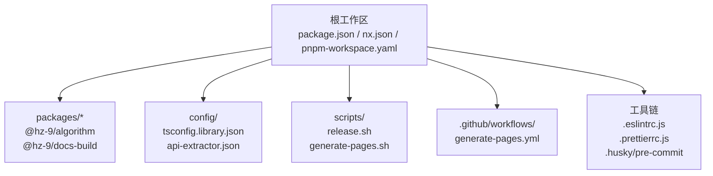
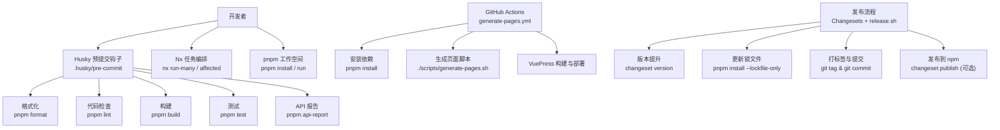
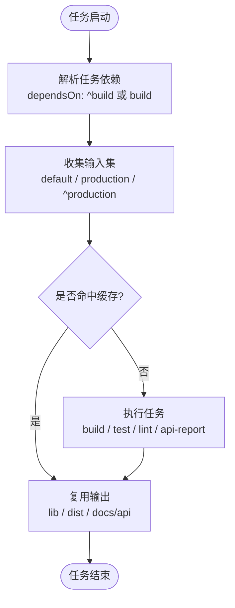
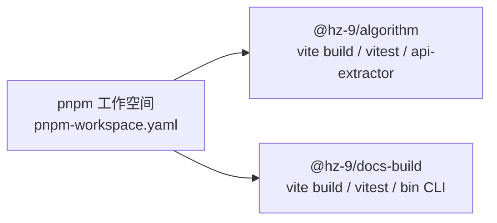
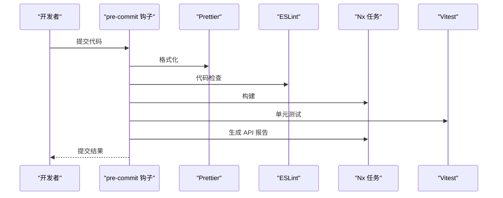
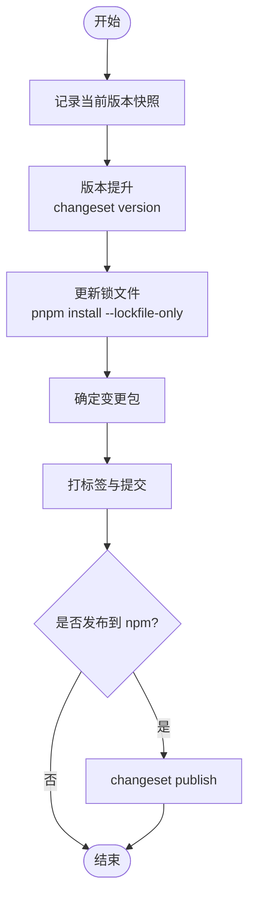
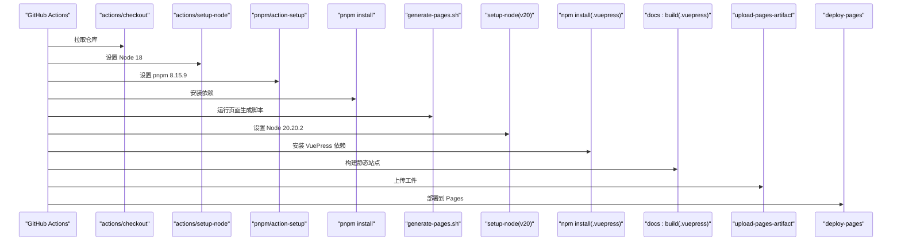
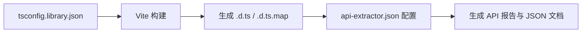
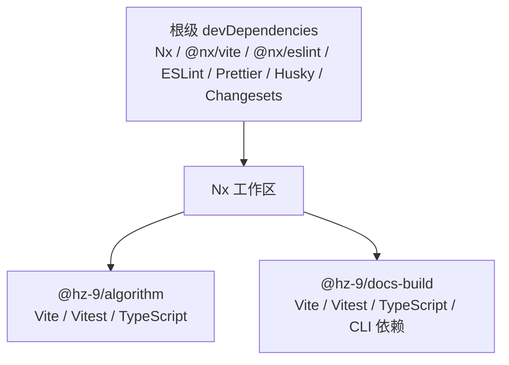

# 开发者指南

<cite>
**本文引用的文件**
- [package.json](file://package.json)
- [nx.json](file://nx.json)
- [pnpm-workspace.yaml](file://pnpm-workspace.yaml)
- [README.md](file://README.zh-CN.md)
- [.eslintrc.js](file://.eslintrc.js)
- [.prettierrc.js](file://.prettierrc.js)
- [.husky/pre-commit](file://.husky/pre-commit)
- [scripts/release.sh](file://scripts/release.sh)
- [.github/workflows/generate-pages.yml](file://.github/workflows/generate-pages.yml)
- [packages/algorithm/package.json](file://packages/algorithm/package.json)
- [packages/docs-build/package.json](file://packages/docs-build/package.json)
- [config/tsconfig.library.json](file://config/tsconfig.library.json)
- [config/api-extractor.json](file://config/api-extractor.json)
</cite>

## 目录
1. [简介](#简介)
2. [项目结构](#项目结构)
3. [核心组件](#核心组件)
4. [架构总览](#架构总览)
5. [详细组件分析](#详细组件分析)
6. [依赖分析](#依赖分析)
7. [性能考虑](#性能考虑)
8. [故障排除指南](#故障排除指南)
9. [结论](#结论)
10. [附录](#附录)

## 简介
HZ 9 Tool 是一个基于 Nx 工作区与 pnpm 工作空间的多包 Node.js 工具库项目，采用 Vite 进行构建、Vitest 进行单元测试、API Extractor 生成类型文档报告，并通过 Changesets 实现版本与发布流程。项目提供统一的开发脚本、代码格式化与检查、Git 钩子以及 GitHub Actions 自动化流水线，帮助团队高效协作与交付。

## 项目结构
项目采用“根级工作区 + 多包”的组织方式：
- 根工作区：集中管理 Nx、pnpm、ESLint、Prettier、Commitlint、Husky 等工具配置与脚本
- 包目录：packages 下包含具体业务包，如算法库与文档生成工具
- 配置目录：config 存放共享的 TypeScript、API Extractor 等配置
- 脚本与工作流：scripts 提供发布与页面生成脚本；.github/workflows 提供 CI 部署

图表来源
- [package.json:1-42](file://package.json#L1-L42)
- [nx.json:1-32](file://nx.json#L1-L32)
- [pnpm-workspace.yaml:1-3](file://pnpm-workspace.yaml#L1-L3)
- [packages/algorithm/package.json:1-46](file://packages/algorithm/package.json#L1-L46)
- [packages/docs-build/package.json:1-64](file://packages/docs-build/package.json#L1-L64)
- [config/tsconfig.library.json:1-27](file://config/tsconfig.library.json#L1-L27)
- [config/api-extractor.json:1-52](file://config/api-extractor.json#L1-L52)
- [.eslintrc.js:1-8](file://.eslintrc.js#L1-L8)
- [.prettierrc.js:1-4](file://.prettierrc.js#L1-L4)
- [.husky/pre-commit:1-6](file://.husky/pre-commit#L1-L6)
- [.github/workflows/generate-pages.yml:1-71](file://.github/workflows/generate-pages.yml#L1-L71)

章节来源
- [README.zh-CN.md:1-53](file://README.zh-CN.md#L1-L53)
- [package.json:1-42](file://package.json#L1-L42)
- [nx.json:1-32](file://nx.json#L1-L32)
- [pnpm-workspace.yaml:1-3](file://pnpm-workspace.yaml#L1-L3)

## 核心组件
- Nx 工作区与任务编排
  - 通过 targetDefaults 统一定义 build/test/lint/api-report 的依赖、输入输出与缓存策略
  - namedInputs 定义默认与生产输入集，提升增量构建与受影响检测效率
- pnpm 工作空间与包管理
  - pnpm-workspace.yaml 声明 packages/* 为工作空间范围，确保跨包依赖解析与安装一致性
- 代码质量与格式化
  - ESLint 使用 @hz-9/eslint-config-airbnb-ts 规则；Prettier 使用 @hz-9/prettier-config
  - Husky 在 pre-commit 阶段自动执行格式化、检查、构建、测试与 API 报告
- 版本与发布
  - Changesets 负责版本号提升与变更日志生成；release.sh 脚本完成版本快照、锁文件更新、打标签与提交
- 文档与 CI
  - generate-pages.yml 在 GitHub Actions 上完成页面生成与部署

章节来源
- [nx.json:7-30](file://nx.json#L7-L30)
- [pnpm-workspace.yaml:1-3](file://pnpm-workspace.yaml#L1-L3)
- [.eslintrc.js:1-8](file://.eslintrc.js#L1-L8)
- [.prettierrc.js:1-4](file://.prettierrc.js#L1-L4)
- [.husky/pre-commit:1-6](file://.husky/pre-commit#L1-L6)
- [scripts/release.sh:1-73](file://scripts/release.sh#L1-L73)
- [.github/workflows/generate-pages.yml:1-71](file://.github/workflows/generate-pages.yml#L1-L71)

## 架构总览
下图展示从本地开发到 CI 部署的关键流程与组件交互：

图表来源
- [.husky/pre-commit:1-6](file://.husky/pre-commit#L1-L6)
- [package.json:4-16](file://package.json#L4-L16)
- [nx.json:7-25](file://nx.json#L7-L25)
- [.github/workflows/generate-pages.yml:44-67](file://.github/workflows/generate-pages.yml#L44-L67)
- [scripts/release.sh:21-68](file://scripts/release.sh#L21-L68)

## 详细组件分析

### Nx 工作区配置与任务编排
- 任务依赖与输入输出
  - build 依赖上游包构建，输入包含当前与上游生产态产物，输出 lib/dist，便于增量构建与缓存命中
  - test 依赖 build，输入包含默认与上游生产态产物
  - api-report 依赖 build，启用缓存，输入包含生产态产物
  - lint 启用缓存
- 输入集命名
  - default 与 production 输入集用于控制任务输入范围，提升受影响检测与缓存命中率

图表来源
- [nx.json:7-25](file://nx.json#L7-L25)

章节来源
- [nx.json:1-32](file://nx.json#L1-L32)

### pnpm 工作空间与包管理策略
- 工作空间范围
  - packages/* 声明为工作空间包集合，确保跨包引用与安装一致性
- 包清单与脚本
  - packages/algorithm 与 packages/docs-build 分别定义构建、测试、API 报告等脚本
  - 两包均使用 Vite 构建、Vitest 测试、TypeScript 类型声明

图表来源
- [pnpm-workspace.yaml:1-3](file://pnpm-workspace.yaml#L1-L3)
- [packages/algorithm/package.json:25-31](file://packages/algorithm/package.json#L25-L31)
- [packages/docs-build/package.json:31-36](file://packages/docs-build/package.json#L31-L36)

章节来源
- [pnpm-workspace.yaml:1-3](file://pnpm-workspace.yaml#L1-L3)
- [packages/algorithm/package.json:1-46](file://packages/algorithm/package.json#L1-L46)
- [packages/docs-build/package.json:1-64](file://packages/docs-build/package.json#L1-L64)

### 代码质量与格式化
- ESLint 配置
  - 使用 @hz-9/eslint-config-airbnb-ts，根目录配置 extends 与 tsconfigRootDir
- Prettier 配置
  - 引用 @hz-9/prettier-config，统一代码风格
- Git 钩子
  - pre-commit 自动执行格式化、检查、构建、测试与 API 报告，保证提交质量

图表来源
- [.husky/pre-commit:1-6](file://.husky/pre-commit#L1-L6)
- [.eslintrc.js:1-8](file://.eslintrc.js#L1-L8)
- [.prettierrc.js:1-4](file://.prettierrc.js#L1-L4)
- [package.json:4-16](file://package.json#L4-L16)

章节来源
- [.eslintrc.js:1-8](file://.eslintrc.js#L1-L8)
- [.prettierrc.js:1-4](file://.prettierrc.js#L1-L4)
- [.husky/pre-commit:1-6](file://.husky/pre-commit#L1-L6)

### 版本与发布流程
- Changesets 版本管理
  - 通过 changeset 与 changeset version 管理版本与变更日志
- 发布脚本 release.sh
  - 记录当前版本 → 版本提升 → 锁文件更新 → 确定变更包 → 打标签与提交 → 可选发布到 npm
- 脚本行为
  - 以临时目录记录版本快照，遍历包目录读取 name/version，比较差异后生成标签字符串

图表来源
- [scripts/release.sh:12-68](file://scripts/release.sh#L12-L68)

章节来源
- [scripts/release.sh:1-73](file://scripts/release.sh#L1-L73)

### CI/CD 流程（GitHub Actions）
- 触发条件
  - 推送至 master 分支或手动触发
- 步骤概览
  - 检出代码、设置 Node 与 pnpm、安装依赖、执行页面生成脚本、安装 VuePress 依赖、构建静态站点、上传工件并部署到 GitHub Pages

图表来源
- [.github/workflows/generate-pages.yml:37-71](file://.github/workflows/generate-pages.yml#L37-L71)

章节来源
- [.github/workflows/generate-pages.yml:1-71](file://.github/workflows/generate-pages.yml#L1-L71)

### TypeScript 与 API 抽取配置
- 共享 tsconfig
  - tsconfig.library.json 统一目标、模块系统、严格模式与声明生成策略
- API Extractor
  - api-extractor.json 配置主入口、报告输出、JSON 文档与 d.ts 汇总路径，开启 TSDoc 元数据

图表来源
- [config/tsconfig.library.json:1-27](file://config/tsconfig.library.json#L1-L27)
- [config/api-extractor.json:1-52](file://config/api-extractor.json#L1-L52)

章节来源
- [config/tsconfig.library.json:1-27](file://config/tsconfig.library.json#L1-L27)
- [config/api-extractor.json:1-52](file://config/api-extractor.json#L1-L52)

## 依赖分析
- 根级依赖与工具链
  - Nx、@nx/vite、@nx/eslint 提供工作区与构建/检查能力
  - ESLint、Prettier、@hz-9/eslint-config-airbnb-ts、@hz-9/prettier-config 统一质量标准
  - Husky、pretty-quick、commitlint 提供 Git 钩子与提交规范
  - Changesets 管理版本与发布
- 包级依赖
  - @hz-9/algorithm 与 @hz-9/docs-build 均使用 Vite、Vitest、TypeScript，前者无运行时依赖，后者包含命令行与文件处理相关依赖

图表来源
- [package.json:17-36](file://package.json#L17-L36)
- [packages/algorithm/package.json:32-38](file://packages/algorithm/package.json#L32-L38)
- [packages/docs-build/package.json:46-56](file://packages/docs-build/package.json#L46-L56)

章节来源
- [package.json:17-36](file://package.json#L17-L36)
- [packages/algorithm/package.json:1-46](file://packages/algorithm/package.json#L1-L46)
- [packages/docs-build/package.json:1-64](file://packages/docs-build/package.json#L1-L64)

## 性能考虑
- 任务缓存与增量构建
  - 通过 targetDefaults 的 cache 与 inputs/outputs 精准控制缓存命中，减少重复执行
- 影响检测
  - 使用 affected 命令仅对变更项目执行 lint 等任务，缩短开发循环
- 并行与串行
  - 通过 dependsOn 控制任务串行依赖，避免资源竞争；利用 Nx 并行能力提升整体吞吐
- 构建与测试隔离
  - 将构建、测试、检查拆分为独立任务，便于缓存与重用

## 故障排除指南
- Node 版本不匹配
  - 根工作区 engines 限制了 Node 版本范围；请按要求安装符合范围的 Node 版本
- pnpm 版本不匹配
  - packageManager 指定 pnpm@8.15.9；请使用对应版本以避免锁文件与安装差异
- Husky 钩子未生效
  - 确保执行 prepare 初始化钩子；pre-commit 顺序包含格式化、检查、构建、测试与 API 报告
- Changesets 发布失败
  - 检查版本提升与变更日志生成是否成功；确认锁文件已更新后再进行打标签与提交
- CI 页面构建失败
  - 确认 Node 版本与 pnpm 版本一致；检查 generate-pages.sh 是否正确执行；验证 VuePress 依赖安装与构建命令

章节来源
- [package.json:37-41](file://package.json#L37-L41)
- [package.json](file://package.json#L40)
- [.husky/pre-commit:1-6](file://.husky/pre-commit#L1-L6)
- [scripts/release.sh:25-26](file://scripts/release.sh#L25-L26)
- [.github/workflows/generate-pages.yml:40-59](file://.github/workflows/generate-pages.yml#L40-L59)

## 结论
本指南围绕 HZ 9 Tool 的开发环境、Nx 工作区与 pnpm 工作空间、代码质量与格式化、版本与发布、CI/CD 流水线等方面进行了系统性说明。建议新开发者优先完成 Node/pnpm 版本校验与依赖安装，理解 Nx 任务依赖与缓存策略，掌握 Husky 钩子与 Changesets 发布流程，并结合 CI 流水线验证本地改动。

## 附录

### 开发环境设置与本地开发流程
- 安装依赖
  - 使用 pnpm 安装根工作区与包内依赖
- 构建与测试
  - 构建全部包或单个包；运行测试与 API 报告
- 代码检查与格式化
  - 统一使用 ESLint 与 Prettier；提交前由 Husky 自动执行
- 变更检测
  - 使用 affected 对变更项目执行 lint 等任务
- 文档与可视化
  - 使用 nx graph 查看项目依赖关系

章节来源
- [README.zh-CN.md:9-45](file://README.zh-CN.md#L9-L45)
- [package.json:4-16](file://package.json#L4-L16)
- [.husky/pre-commit:1-6](file://.husky/pre-commit#L1-L6)

### 贡献指南与提交规范
- 提交信息
  - 使用 Commitlint 配合 conventional 规范，确保消息结构清晰
- 代码风格
  - 遵循 @hz-9/eslint-config-airbnb-ts 与 @hz-9/prettier-config
- 提交流程
  - 本地执行格式化、检查、构建、测试与 API 报告；通过 Husky 钩子拦截问题

章节来源
- [.eslintrc.js:1-8](file://.eslintrc.js#L1-L8)
- [.prettierrc.js:1-4](file://.prettierrc.js#L1-L4)
- [.husky/pre-commit:1-6](file://.husky/pre-commit#L1-L6)

### 自动化脚本与 CI/CD
- 发布脚本
  - release.sh 完成版本快照、版本提升、锁文件更新、变更包识别、打标签与提交
- 页面生成
  - generate-pages.yml 在 Actions 上完成页面生成与部署

章节来源
- [scripts/release.sh:1-73](file://scripts/release.sh#L1-L73)
- [.github/workflows/generate-pages.yml:1-71](file://.github/workflows/generate-pages.yml#L1-L71)