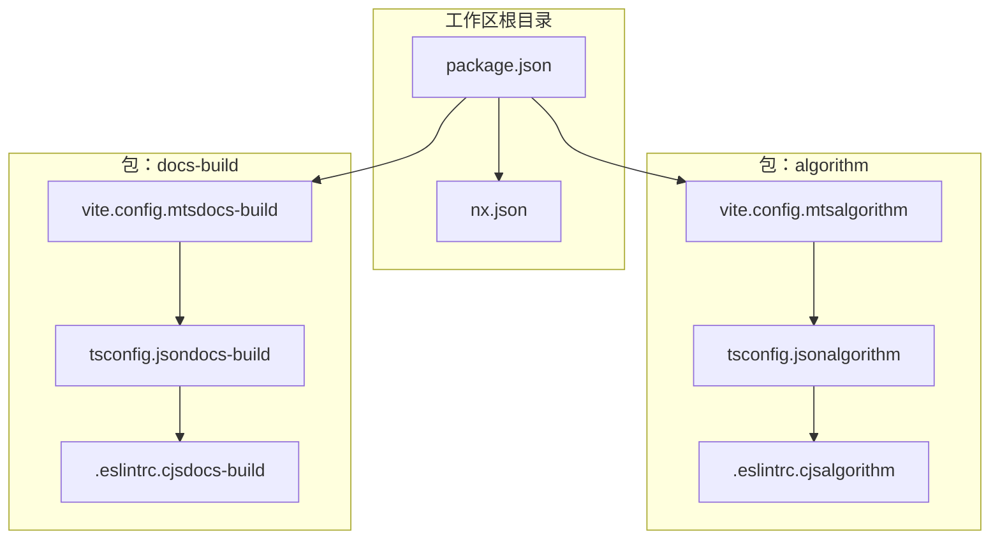
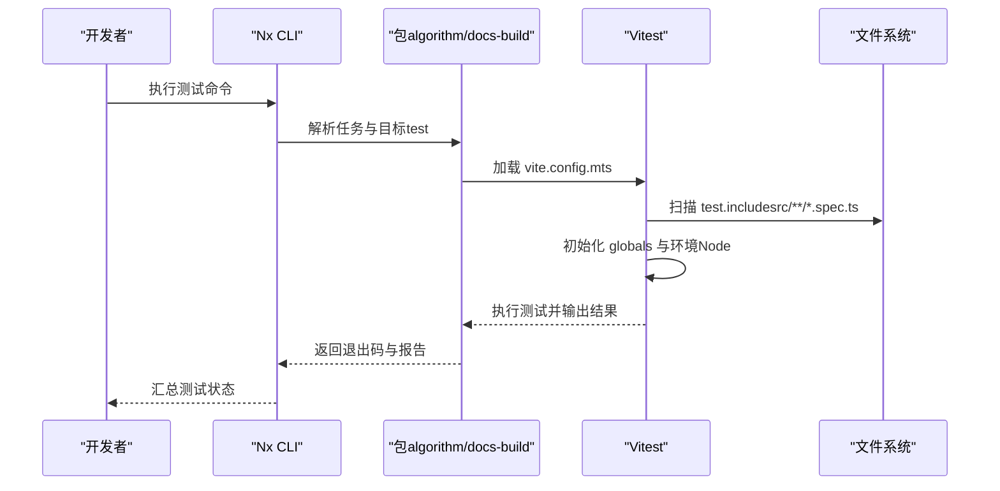
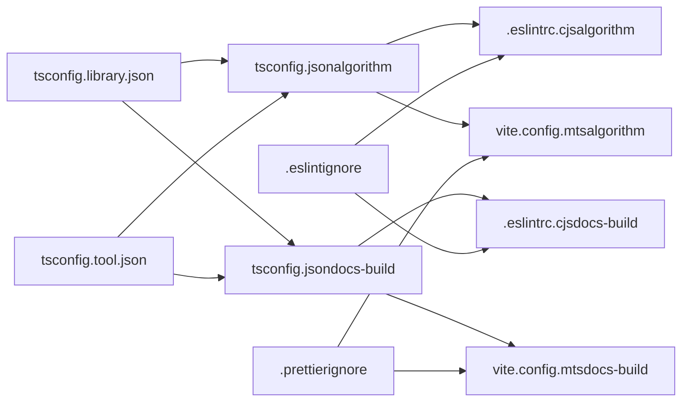

# 测试指南

<cite>
**本文引用的文件**
- [package.json](file://package.json)
- [nx.json](file://nx.json)
- [vite.config.mts（docs-build）](file://packages/docs-build/vite.config.mts)
- [vite.config.mts（algorithm）](file://packages/algorithm/vite.config.mts)
- [tsconfig.library.json](file://config/tsconfig.library.json)
- [tsconfig.tool.json](file://config/tsconfig.tool.json)
- [.eslintrc.cjs（algorithm）](file://packages/algorithm/.eslintrc.cjs)
- [.eslintrc.cjs（docs-build）](file://packages/docs-build/.eslintrc.cjs)
- [tsconfig.json（algorithm）](file://packages/algorithm/tsconfig.json)
- [tsconfig.json（docs-build）](file://packages/docs-build/tsconfig.json)
- [tsconfig.config.json（algorithm）](file://packages/algorithm/tsconfig.config.json)
- [tsconfig.config.json（docs-build）](file://packages/docs-build/tsconfig.config.json)
- [.eslintignore](file://.eslintignore)
- [.prettierignore](file://.prettierignore)
</cite>

## 目录
1. [引言](#引言)
2. [项目结构](#项目结构)
3. [核心组件](#核心组件)
4. [架构总览](#架构总览)
5. [详细组件分析](#详细组件分析)
6. [依赖分析](#依赖分析)
7. [性能考虑](#性能考虑)
8. [故障排查指南](#故障排查指南)
9. [结论](#结论)
10. [附录](#附录)

## 引言
本测试指南面向 HZ 9 Tool 项目，聚焦于基于 Vitest 的测试策略与实践，结合 Nx 工作区的测试执行方式，帮助团队建立统一的测试规范、覆盖质量门禁与调试流程。本文涵盖测试框架配置、测试文件组织、断言与模拟、覆盖率统计、不同层级测试（单元/集成/端到端）的编写思路、调试技巧与性能优化建议。

## 项目结构
- 项目采用 Nx 工作区管理多包，当前仓库包含两个包：algorithm 与 docs-build。
- 每个包内通过各自的 vite.config.mts 配置 Vitest，使用 src/**/*.spec.ts 作为测试入口。
- TypeScript 编译配置在 config 下提供通用 tsconfig，各包再按需扩展并在 tsconfig.json 中声明 vitest/globals 类型。

图表来源
- [nx.json:1-200](file://nx.json#L1-L200)
- [package.json:1-200](file://package.json#L1-L200)
- [vite.config.mts（algorithm）:1-53](file://packages/algorithm/vite.config.mts#L1-L53)
- [vite.config.mts（docs-build）:1-61](file://packages/docs-build/vite.config.mts#L1-L61)
- [tsconfig.json（algorithm）:1-14](file://packages/algorithm/tsconfig.json#L1-L14)
- [tsconfig.json（docs-build）:1-14](file://packages/docs-build/tsconfig.json#L1-L14)
- [.eslintrc.cjs（algorithm）:1-22](file://packages/algorithm/.eslintrc.cjs#L1-L22)
- [.eslintrc.cjs（docs-build）:1-22](file://packages/docs-build/.eslintrc.cjs#L1-L22)

章节来源
- [nx.json:1-200](file://nx.json#L1-L200)
- [package.json:1-200](file://package.json#L1-L200)

## 核心组件
- Vitest 配置与运行
  - 各包的 vite.config.mts 中定义了 test.globals、test.environment、test.include 等关键项，确保测试在 Node 环境下以全局 API 运行，并仅扫描 src/**/*.spec.ts。
  - 通过 package.json 的 test 脚本可一次性对所有包执行测试。
- TypeScript 类型支持
  - 各包 tsconfig.json 在 compilerOptions.types 中显式声明 vitest/globals 与 node，保证测试文件具备断言、describe、it 等类型提示。
- ESLint 规则
  - 各包 .eslintrc.cjs 对 *.ts 文件启用解析器 project 指向各自 tsconfig.json；对 vite.config.mts 使用 tsconfig.config.json，避免配置文件被错误解析。
- Nx 工作区任务
  - nx.json 中定义了 test 任务模板，便于在 Nx 中统一调度测试执行。

章节来源
- [vite.config.mts（algorithm）:47-53](file://packages/algorithm/vite.config.mts#L47-L53)
- [vite.config.mts（docs-build）:55-61](file://packages/docs-build/vite.config.mts#L55-L61)
- [tsconfig.json（algorithm）:7-13](file://packages/algorithm/tsconfig.json#L7-L13)
- [tsconfig.json（docs-build）:7-13](file://packages/docs-build/tsconfig.json#L7-L13)
- [.eslintrc.cjs（algorithm）:1-22](file://packages/algorithm/.eslintrc.cjs#L1-L22)
- [.eslintrc.cjs（docs-build）:1-22](file://packages/docs-build/.eslintrc.cjs#L1-L22)
- [nx.json:1-200](file://nx.json#L1-L200)
- [package.json:1-200](file://package.json#L1-L200)

## 架构总览
下图展示了 Nx 与 Vitest 在本项目中的协作关系：Nx 通过任务定义触发各包的 Vitest 执行，Vitest 依据各包的配置加载测试文件并运行。

图表来源
- [package.json:1-200](file://package.json#L1-L200)
- [vite.config.mts（algorithm）:47-53](file://packages/algorithm/vite.config.mts#L47-L53)
- [vite.config.mts（docs-build）:55-61](file://packages/docs-build/vite.config.mts#L55-L61)
- [nx.json:1-200](file://nx.json#L1-L200)

## 详细组件分析

### Vitest 配置与测试文件组织
- 测试入口与扫描规则
  - algorithm 与 docs-build 均在 vite.config.mts 的 test.include 中指定 src/**/*.spec.ts，确保以 .spec.ts 结尾的文件被识别为测试文件。
- 全局 API 与运行环境
  - test.globals 设置为 true，允许直接使用 describe、it、expect 等全局 API。
  - test.environment 设为 node，适配服务端逻辑与工具函数测试。
- 类型支持
  - 各包 tsconfig.json 的 types 显式包含 vitest/globals 与 node，保障类型推断与 IDE 提示。
- 外部依赖处理
  - vite.config.mts 中通过 external 逻辑排除 Node 内置模块与包依赖，避免打包时将外部模块纳入测试产物。

章节来源
- [vite.config.mts（algorithm）:47-53](file://packages/algorithm/vite.config.mts#L47-L53)
- [vite.config.mts（docs-build）:55-61](file://packages/docs-build/vite.config.mts#L55-L61)
- [tsconfig.json（algorithm）:7-13](file://packages/algorithm/tsconfig.json#L7-L13)
- [tsconfig.json（docs-build）:7-13](file://packages/docs-build/tsconfig.json#L7-L13)

### Nx 工作区中的测试执行
- 单包测试
  - 使用 Nx 任务名定位具体包，例如：nx test 包名。
- 全工作区测试
  - 通过 package.json 的 test 脚本或 Nx run-many 统一对所有包执行测试。
- 测试报告与覆盖率
  - 可在各包 vite.config.mts 的 test 配置中添加覆盖率相关选项（如 reporters、coverage），并结合 Nx 输出进行聚合。

章节来源
- [package.json:1-200](file://package.json#L1-L200)
- [nx.json:1-200](file://nx.json#L1-L200)

### 断言与模拟对象
- 断言
  - 使用 Vitest 默认断言 API（如 expect）。建议在测试文件顶部引入断言命名空间，保持一致性。
- 模拟对象
  - 使用 Vitest 提供的 mock/spy 工具对函数、模块或外部依赖进行替换与行为验证。
- 测试上下文
  - 使用 beforeEach/afterEach 等钩子组织测试前置条件与清理逻辑，确保测试隔离性。

章节来源
- [vite.config.mts（algorithm）:47-53](file://packages/algorithm/vite.config.mts#L47-L53)
- [vite.config.mts（docs-build）:55-61](file://packages/docs-build/vite.config.mts#L55-L61)

### 不同类型测试的编写示例（思路与规范）
- 单元测试
  - 针对纯函数、工具方法与独立模块进行测试，关注输入输出与边界条件。
  - 使用模拟对象隔离外部依赖，集中验证业务逻辑。
- 集成测试
  - 关注模块间交互、异步流程与副作用（如文件读写、网络请求），在 Node 环境下通过 Vitest 运行。
- 端到端测试
  - 若涉及 CLI 或浏览器场景，可在各包内新增 e2e 目录与相应配置；本仓库当前以 Vitest 驱动 Node 环境测试为主，e2e 配置需按需补充。

章节来源
- [vite.config.mts（algorithm）:47-53](file://packages/algorithm/vite.config.mts#L47-L53)
- [vite.config.mts（docs-build）:55-61](file://packages/docs-build/vite.config.mts#L55-L61)

### 测试数据准备与模拟策略
- 固定数据集
  - 将测试用例所需的数据封装为常量或工厂函数，提升可读性与复用性。
- Mock 与 Stub
  - 对外部依赖（如文件系统、HTTP 客户端）进行 Mock，避免真实 I/O 干扰测试稳定性。
- 环境变量与临时目录
  - 在测试前设置必要环境变量，在测试后清理临时目录，确保可重复性。

章节来源
- [vite.config.mts（algorithm）:47-53](file://packages/algorithm/vite.config.mts#L47-L53)
- [vite.config.mts（docs-build）:55-61](file://packages/docs-build/vite.config.mts#L55-L61)

### 覆盖率要求与质量门禁
- 覆盖率统计
  - 在各包 vite.config.mts 的 test.coverage 下配置 reporter 与阈值，确保关键路径得到覆盖。
- 质量门禁
  - 在 CI 中设置覆盖率阈值失败策略，未达标时阻止合并请求。
- 报告聚合
  - 利用 Nx 的汇总能力，将多个包的覆盖率报告合并展示，形成整体质量视图。

章节来源
- [vite.config.mts（algorithm）:47-53](file://packages/algorithm/vite.config.mts#L47-L53)
- [vite.config.mts（docs-build）:55-61](file://packages/docs-build/vite.config.mts#L55-L61)

### 调试技巧与常见问题
- 常见问题
  - 类型缺失：确认各包 tsconfig.json 的 types 包含 vitest/globals 与 node。
  - ESLint 解析异常：确保 .eslintrc.cjs 对 vite.config.mts 使用 tsconfig.config.json。
  - 外部依赖导致打包：在 vite.config.mts 的 external 中排除 Node 内置与包依赖。
- 调试建议
  - 使用 Vitest 的 --reporter=verbose 与 --inspect-brk 查看详细日志与断点调试。
  - 将复杂测试拆分为更小用例，配合 describe/it 分层组织，便于定位问题。

章节来源
- [tsconfig.json（algorithm）:7-13](file://packages/algorithm/tsconfig.json#L7-L13)
- [tsconfig.json（docs-build）:7-13](file://packages/docs-build/tsconfig.json#L7-L13)
- [.eslintrc.cjs（algorithm）:1-22](file://packages/algorithm/.eslintrc.cjs#L1-L22)
- [.eslintrc.cjs（docs-build）:1-22](file://packages/docs-build/.eslintrc.cjs#L1-L22)
- [vite.config.mts（algorithm）:25-40](file://packages/algorithm/vite.config.mts#L25-L40)
- [vite.config.mts（docs-build）:38-48](file://packages/docs-build/vite.config.mts#L38-L48)

## 依赖分析
- 配置依赖链
  - tsconfig.library.json/tsconfig.tool.json 为各包提供基础编译选项，各包 tsconfig.json 继承并在 types 中声明 vitest/globals。
  - 各包 .eslintrc.cjs 为 *.ts 指定 project，为 vite.config.mts 指定 tsconfig.config.json，避免解析冲突。
  - vite.config.mts 依赖 tsconfig.json 的 types 与外部依赖排除逻辑，决定测试运行与打包行为。
- 外部依赖与忽略
  - .eslintignore 与 .prettierignore 排除构建输出与临时目录，减少无关文件干扰。

图表来源
- [tsconfig.library.json:1-26](file://config/tsconfig.library.json#L1-L26)
- [tsconfig.tool.json:1-26](file://config/tsconfig.tool.json#L1-L26)
- [tsconfig.json（algorithm）:1-14](file://packages/algorithm/tsconfig.json#L1-L14)
- [tsconfig.json（docs-build）:1-14](file://packages/docs-build/tsconfig.json#L1-L14)
- [.eslintrc.cjs（algorithm）:1-22](file://packages/algorithm/.eslintrc.cjs#L1-L22)
- [.eslintrc.cjs（docs-build）:1-22](file://packages/docs-build/.eslintrc.cjs#L1-L22)
- [vite.config.mts（algorithm）:1-53](file://packages/algorithm/vite.config.mts#L1-L53)
- [vite.config.mts（docs-build）:1-61](file://packages/docs-build/vite.config.mts#L1-L61)
- [.eslintignore:1-81](file://.eslintignore#L1-L81)
- [.prettierignore:1-81](file://.prettierignore#L1-L81)

章节来源
- [tsconfig.library.json:1-26](file://config/tsconfig.library.json#L1-L26)
- [tsconfig.tool.json:1-26](file://config/tsconfig.tool.json#L1-L26)
- [tsconfig.json（algorithm）:1-14](file://packages/algorithm/tsconfig.json#L1-L14)
- [tsconfig.json（docs-build）:1-14](file://packages/docs-build/tsconfig.json#L1-L14)
- [.eslintrc.cjs（algorithm）:1-22](file://packages/algorithm/.eslintrc.cjs#L1-L22)
- [.eslintrc.cjs（docs-build）:1-22](file://packages/docs-build/.eslintrc.cjs#L1-L22)
- [vite.config.mts（algorithm）:1-53](file://packages/algorithm/vite.config.mts#L1-L53)
- [vite.config.mts（docs-build）:1-61](file://packages/docs-build/vite.config.mts#L1-L61)
- [.eslintignore:1-81](file://.eslintignore#L1-L81)
- [.prettierignore:1-81](file://.prettierignore#L1-L81)

## 性能考虑
- 测试隔离与并发
  - 使用 Vitest 的并发执行能力，合理拆分测试文件，避免共享状态引发竞争。
- 外部依赖排除
  - 在 vite.config.mts 的 external 中排除 Node 内置与包依赖，减少不必要的打包与 I/O。
- 覆盖率与报告
  - 控制覆盖率 reporter 数量与阈值，避免在 CI 中产生过重的计算负担。
- 缓存与增量
  - 利用 Nx 的缓存机制，加速重复测试执行；仅对变更包运行测试。

章节来源
- [vite.config.mts（algorithm）:25-40](file://packages/algorithm/vite.config.mts#L25-L40)
- [vite.config.mts（docs-build）:38-48](file://packages/docs-build/vite.config.mts#L38-L48)
- [nx.json:1-200](file://nx.json#L1-L200)

## 故障排查指南
- 类型提示缺失
  - 检查各包 tsconfig.json 的 types 是否包含 vitest/globals 与 node。
- ESLint 报错
  - 确认 .eslintrc.cjs 对 vite.config.mts 使用 tsconfig.config.json，避免 project 解析错误。
- 外部依赖导致测试失败
  - 在 vite.config.mts 的 external 中增加排除规则，确保 Node 内置与包依赖不被纳入测试。
- 覆盖率统计异常
  - 在 vite.config.mts 的 test.coverage 中检查 reporter 与阈值配置，确保与 CI 一致。

章节来源
- [tsconfig.json（algorithm）:7-13](file://packages/algorithm/tsconfig.json#L7-L13)
- [tsconfig.json（docs-build）:7-13](file://packages/docs-build/tsconfig.json#L7-L13)
- [.eslintrc.cjs（algorithm）:1-22](file://packages/algorithm/.eslintrc.cjs#L1-L22)
- [.eslintrc.cjs（docs-build）:1-22](file://packages/docs-build/.eslintrc.cjs#L1-L22)
- [vite.config.mts（algorithm）:25-40](file://packages/algorithm/vite.config.mts#L25-L40)
- [vite.config.mts（docs-build）:38-48](file://packages/docs-build/vite.config.mts#L38-L48)

## 结论
本指南总结了 HZ 9 Tool 项目在 Nx 工作区中使用 Vitest 的测试策略与实施要点：通过标准化的配置与类型声明，确保测试在 Node 环境下稳定运行；借助 Nx 的任务编排实现单包与全工作区测试；结合覆盖率与质量门禁保障代码质量；最后提供调试与性能优化建议，帮助团队持续改进测试效率与可靠性。

## 附录
- 最佳实践清单
  - 统一测试文件命名与组织（src/**/*.spec.ts）。
  - 明确断言风格与模拟策略，保持测试可读性。
  - 为关键模块设置覆盖率阈值，并在 CI 中强制执行。
  - 使用 Nx 任务与缓存机制提升测试执行效率。
- 参考文件索引
  - [package.json:1-200](file://package.json#L1-L200)
  - [nx.json:1-200](file://nx.json#L1-L200)
  - [vite.config.mts（algorithm）:1-53](file://packages/algorithm/vite.config.mts#L1-L53)
  - [vite.config.mts（docs-build）:1-61](file://packages/docs-build/vite.config.mts#L1-L61)
  - [tsconfig.library.json:1-26](file://config/tsconfig.library.json#L1-L26)
  - [tsconfig.tool.json:1-26](file://config/tsconfig.tool.json#L1-L26)
  - [tsconfig.json（algorithm）:1-14](file://packages/algorithm/tsconfig.json#L1-L14)
  - [tsconfig.json（docs-build）:1-14](file://packages/docs-build/tsconfig.json#L1-L14)
  - [.eslintrc.cjs（algorithm）:1-22](file://packages/algorithm/.eslintrc.cjs#L1-L22)
  - [.eslintrc.cjs（docs-build）:1-22](file://packages/docs-build/.eslintrc.cjs#L1-L22)
  - [.eslintignore:1-81](file://.eslintignore#L1-L81)
  - [.prettierignore:1-81](file://.prettierignore#L1-L81)