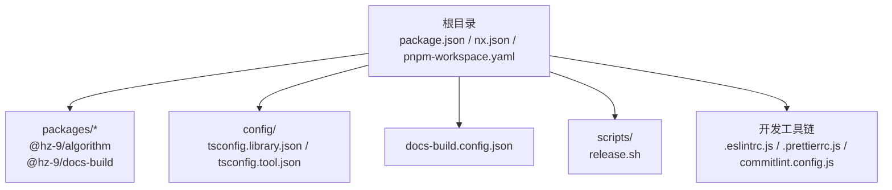
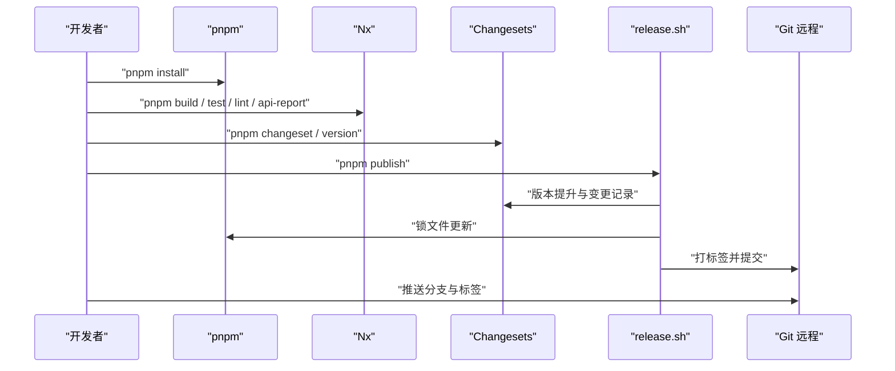
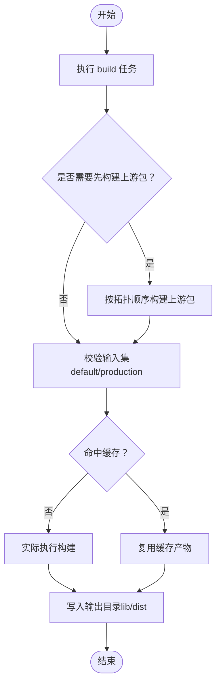
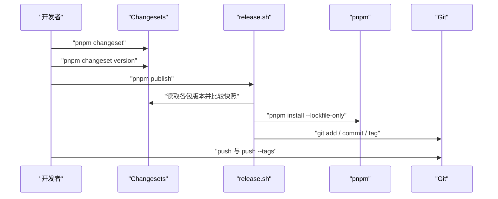
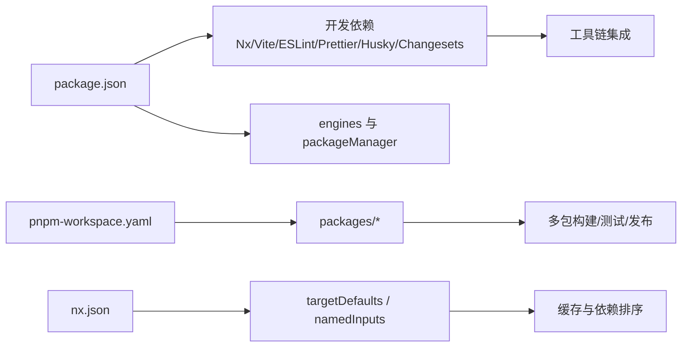

# 项目设置

<cite>
**本文引用的文件**
- [package.json](file://package.json)
- [nx.json](file://nx.json)
- [pnpm-workspace.yaml](file://pnpm-workspace.yaml)
- [README.md](file://README.md)
- [README.zh-CN.md](file://README.zh-CN.md)
- [.eslintrc.js](file://.eslintrc.js)
- [.prettierrc.js](file://.prettierrc.js)
- [commitlint.config.js](file://commitlint.config.js)
- [scripts/release.sh](file://scripts/release.sh)
- [config/tsconfig.library.json](file://config/tsconfig.library.json)
- [config/tsconfig.tool.json](file://config/tsconfig.tool.json)
- [docs-build.config.json](file://docs-build.config.json)
- [packages/algorithm/tsconfig.json](file://packages/algorithm/tsconfig.json)
</cite>

## 目录
1. [简介](#简介)
2. [项目结构](#项目结构)
3. [核心组件](#核心组件)
4. [架构总览](#架构总览)
5. [详细组件分析](#详细组件分析)
6. [依赖分析](#依赖分析)
7. [性能考虑](#性能考虑)
8. [故障排除指南](#故障排除指南)
9. [结论](#结论)
10. [附录](#附录)

## 简介
本指南面向新加入的开发者，提供 HZ 9 Tool 项目的完整设置与使用说明。内容涵盖开发环境前置条件（Node.js 版本、包管理器版本）、项目初始化步骤（克隆、安装、构建、测试、格式化、提交规范与发布流程）、Nx 工作区与 pnpm 工作空间的配置与使用方法，并给出常见问题的排查建议。文档同时提供多语言版本的快速开始示例，帮助你在不同操作系统下顺利上手。

## 项目结构
该仓库采用 Nx 多包工作区 + pnpm 工作空间的组织方式，根目录通过 nx.json 和 pnpm-workspace.yaml 管理任务与包范围；packages 目录下包含具体业务包；config 目录提供共享的 TypeScript 配置；docs-build.config.json 用于文档站点生成；根脚本提供一键命令入口。

图表来源
- [package.json:1-42](file://package.json#L1-L42)
- [nx.json:1-32](file://nx.json#L1-L32)
- [pnpm-workspace.yaml:1-3](file://pnpm-workspace.yaml#L1-L3)
- [docs-build.config.json:1-184](file://docs-build.config.json#L1-L184)

章节来源
- [package.json:1-42](file://package.json#L1-L42)
- [nx.json:1-32](file://nx.json#L1-L32)
- [pnpm-workspace.yaml:1-3](file://pnpm-workspace.yaml#L1-L3)
- [README.md:1-53](file://README.md#L1-L53)
- [README.zh-CN.md:1-53](file://README.zh-CN.md#L1-L53)

## 核心组件
- 开发环境与工具链
  - Node.js 版本约束：由根 package.json 的 engines 字段定义，需满足指定范围。
  - 包管理器：pnpm，版本由根 package.json 的 packageManager 字段声明。
  - 质量工具：ESLint、Prettier、Commitlint、Husky、Changesets。
- Nx 工作区
  - 通过 nx.json 声明插件、目标默认行为、输入输出与缓存策略。
  - 通过 package.json 的 scripts 统一调用 nx run-many 或 nx affected 等命令。
- pnpm 工作空间
  - 通过 pnpm-workspace.yaml 声明包范围，实现跨包依赖与统一安装。
- TypeScript 配置
  - config 下提供 library 与 tool 两类 tsconfig，供各包继承复用。
- 文档与站点
  - docs-build.config.json 定义文档站点的语言、导航、侧边栏与输出路径。

章节来源
- [package.json:37-41](file://package.json#L37-L41)
- [nx.json:5-31](file://nx.json#L5-L31)
- [pnpm-workspace.yaml:1-3](file://pnpm-workspace.yaml#L1-L3)
- [config/tsconfig.library.json:1-27](file://config/tsconfig.library.json#L1-L27)
- [config/tsconfig.tool.json:1-27](file://config/tsconfig.tool.json#L1-L27)
- [docs-build.config.json:1-184](file://docs-build.config.json#L1-L184)

## 架构总览
下图展示了从本地开发到发布的关键流程：安装依赖 → 构建/测试/格式化 → 变更集版本管理 → 发布脚本执行 → 推送标签与远程。

图表来源
- [package.json:4-16](file://package.json#L4-L16)
- [scripts/release.sh:1-73](file://scripts/release.sh#L1-L73)

章节来源
- [package.json:4-16](file://package.json#L4-L16)
- [scripts/release.sh:1-73](file://scripts/release.sh#L1-L73)

## 详细组件分析

### Node.js 与包管理器版本要求
- Node.js 版本范围：由根 package.json 的 engines 字段声明，确保与当前 LTS 保持一致。
- 包管理器版本：由根 package.json 的 packageManager 字段声明，推荐使用对应版本以避免锁定文件差异。
- 建议在 CI 与本地均使用相同版本，避免因版本差异导致的构建不一致。

章节来源
- [package.json:37-41](file://package.json#L37-L41)

### pnpm 工作空间配置与包管理策略
- 包范围：pnpm-workspace.yaml 指定 packages/* 为工作空间包集合，便于统一安装与跨包链接。
- 包链接机制：pnpm 会基于依赖声明进行去重与符号链接，减少磁盘占用并加速安装。
- 锁定文件：pnpm-lock.yaml 记录精确版本，保证团队一致性。

章节来源
- [pnpm-workspace.yaml:1-3](file://pnpm-workspace.yaml#L1-L3)
- [package.json:17-36](file://package.json#L17-L36)

### Nx 工作区配置与任务编排
- 插件启用：nx.json 启用了 @nx/eslint 与 @nx/vite 插件，支持 ESLint 与 Vite 构建集成。
- 目标默认行为：
  - build：自动按依赖顺序构建上游包，输出至 lib/dist；生产输入与产物路径已预设。
  - test：依赖 build，输入为默认与上游生产态。
  - api-report：依赖 build，开启缓存，输入为生产态。
  - lint：开启缓存。
- 输入与缓存：
  - namedInputs 定义 default 与 production 输入集，targetDefaults 中的任务可引用这些输入参与缓存判定。
- 任务依赖关系：通过 dependsOn 在任务间建立拓扑顺序，确保构建链路稳定。

图表来源
- [nx.json:7-31](file://nx.json#L7-L31)

章节来源
- [nx.json:1-32](file://nx.json#L1-L32)

### TypeScript 配置与包继承
- 共享配置：
  - config/tsconfig.library.json：面向库类型项目，启用严格模式、声明文件与 SourceMap。
  - config/tsconfig.tool.json：面向工具型项目，与 library 配置类似，便于统一风格。
- 包内继承：
  - packages/algorithm/tsconfig.json 继承 library 配置，并在 compilerOptions 中设置 rootDir/outDir/declarationDir/types 等，确保测试与构建路径清晰。

章节来源
- [config/tsconfig.library.json:1-27](file://config/tsconfig.library.json#L1-L27)
- [config/tsconfig.tool.json:1-27](file://config/tsconfig.tool.json#L1-L27)
- [packages/algorithm/tsconfig.json:1-15](file://packages/algorithm/tsconfig.json#L1-L15)

### 代码质量与提交规范
- ESLint：根 .eslintrc.js 使用 @hz-9/eslint-config-airbnb-ts 规则集，解析器指向项目根目录。
- Prettier：根 .prettierrc.js 导出 @hz-9/prettier-config，统一格式化风格。
- Commitlint：commitlint.config.js 扩展 conventional 规范，并限定 scope 枚举范围，配合 Husky 在提交前校验。

章节来源
- [.eslintrc.js:1-8](file://.eslintrc.js#L1-L8)
- [.prettierrc.js:1-4](file://.prettierrc.js#L1-L4)
- [commitlint.config.js:1-7](file://commitlint.config.js#L1-L7)
- [package.json:12-31](file://package.json#L12-L31)

### 文档站点与导航配置
- docs-build.config.json 定义站点基础信息、语言、输出目录、导航与侧边栏结构，覆盖 overview、guide、changelog、api 等模块。
- 该配置用于驱动文档生成与部署，确保多语言导航一致。

章节来源
- [docs-build.config.json:1-184](file://docs-build.config.json#L1-L184)

### 发布流程与变更集
- Changesets：通过 pnpm changeset 与 pnpm changeset version 管理版本号与变更日志。
- 发布脚本：scripts/release.sh 实现“版本提升 → 锁文件更新 → 确定变更包 → 提交与打标签”的流水线；当前发布命令被注释，便于按需启用。
- 一键命令：根 package.json 提供 publish 脚本，直接调用 release.sh。

图表来源
- [scripts/release.sh:1-73](file://scripts/release.sh#L1-L73)
- [package.json:15](file://package.json#L15)

章节来源
- [scripts/release.sh:1-73](file://scripts/release.sh#L1-L73)
- [package.json:14-16](file://package.json#L14-L16)

## 依赖分析
- 根 package.json 声明了 Nx、Vite、ESLint、Prettier、Husky、Changesets 等开发依赖，作为工作区统一工具链。
- pnpm 工作空间通过 pnpm-workspace.yaml 将 packages/* 纳入管理，形成多包协作生态。
- Nx targetDefaults 与 namedInputs 形成任务依赖与缓存决策依据，降低重复计算成本。

图表来源
- [package.json:17-41](file://package.json#L17-L41)
- [pnpm-workspace.yaml:1-3](file://pnpm-workspace.yaml#L1-L3)
- [nx.json:7-31](file://nx.json#L7-L31)

章节来源
- [package.json:17-41](file://package.json#L17-L41)
- [pnpm-workspace.yaml:1-3](file://pnpm-workspace.yaml#L1-L3)
- [nx.json:7-31](file://nx.json#L7-L31)

## 性能考虑
- 利用 Nx 缓存：lint 与 api-report 默认开启缓存；build 任务通过 dependsOn 与 namedInputs 的生产态输入，减少不必要的重建。
- 并行与增量：run-many 与 affected 命令结合，可在大规模包集合中按需执行任务，缩短开发等待时间。
- 锁定文件一致性：固定 pnpm 版本与 Node 版本，避免因版本漂移导致的缓存失效与安装差异。

章节来源
- [nx.json:7-31](file://nx.json#L7-L31)
- [package.json:6-16](file://package.json#L6-L16)

## 故障排除指南
- Node 版本不匹配
  - 现象：安装或构建报错，提示版本不兼容。
  - 处理：使用 nvm 或 fnm 切换到符合 engines 要求的 Node 版本；确认 packageManager 版本一致。
  - 参考
    - [package.json:37-41](file://package.json#L37-L41)
- pnpm 版本不一致
  - 现象：pnpm-lock.yaml 与本地版本不兼容，导致安装失败或产物不一致。
  - 处理：使用 packageManager 指定的 pnpm 版本；必要时删除锁文件后重新安装。
  - 参考
    - [package.json:40](file://package.json#L40)
- Nx 任务缓存未生效
  - 现象：频繁重建，耗时较长。
  - 处理：检查 targetDefaults 的 inputs 与 namedInputs 是否正确；确保生产态输入一致；清理缓存后重试。
  - 参考
    - [nx.json:27-31](file://nx.json#L27-L31)
- ESLint/Prettier 规则冲突
  - 现象：编辑器提示规则冲突或格式化结果异常。
  - 处理：确认 .eslintrc.js 与 .prettierrc.js 引用的配置包版本一致；在 IDE 中启用对应扩展。
  - 参考
    - [.eslintrc.js:1-8](file://.eslintrc.js#L1-L8)
    - [.prettierrc.js:1-4](file://.prettierrc.js#L1-L4)
- Changesets 发布流程卡住
  - 现象：版本提升后无变更包，或发布脚本未执行。
  - 处理：确认 changeset 文件存在且 scope 正确；查看 release.sh 的版本快照与标签逻辑；按需取消注释发布命令。
  - 参考
    - [scripts/release.sh:12-73](file://scripts/release.sh#L12-L73)
    - [package.json:14-16](file://package.json#L14-L16)

## 结论
通过明确的 Node 与 pnpm 版本约束、Nx 任务与缓存策略、pnpm 工作空间的包管理以及统一的代码质量工具链，HZ 9 Tool 项目实现了高效、可维护的多包协作开发体验。建议新开发者在本地严格遵循本文档的设置步骤，并在日常开发中充分利用 affected、run-many 与缓存能力，以获得最佳效率。

## 附录

### 快速开始（多语言）
- 英文版快速开始命令参考
  - [README.md:7-45](file://README.md#L7-L45)
- 中文版快速开始命令参考
  - [README.zh-CN.md:7-45](file://README.zh-CN.md#L7-L45)

### 常用命令清单
- 安装依赖：pnpm install
- 构建全部包：pnpm build
- 测试全部包：pnpm test
- Lint 全部包：pnpm lint
- 生成 API 报告：pnpm api-report
- 格式化代码：pnpm format
- 检查格式：pnpm format:check
- 查看依赖图：pnpm nx graph
- 对变更项目执行 Lint：pnpm nx affected --target=lint
- 创建变更集：pnpm changeset
- 版本提升与生成变更日志：pnpm changeset version
- 发布到 npm：pnpm publish

章节来源
- [README.md:7-45](file://README.md#L7-L45)
- [README.zh-CN.md:7-45](file://README.zh-CN.md#L7-L45)
- [package.json:4-16](file://package.json#L4-L16)