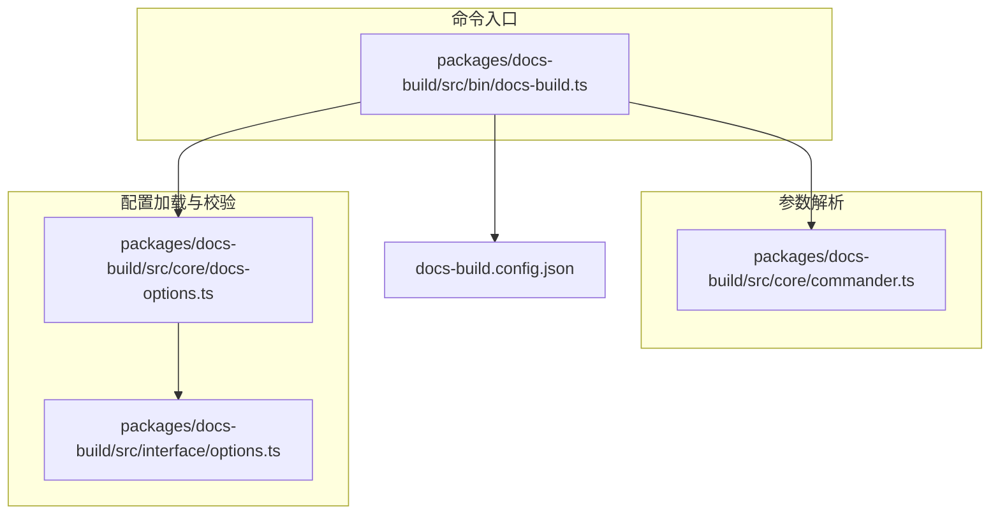
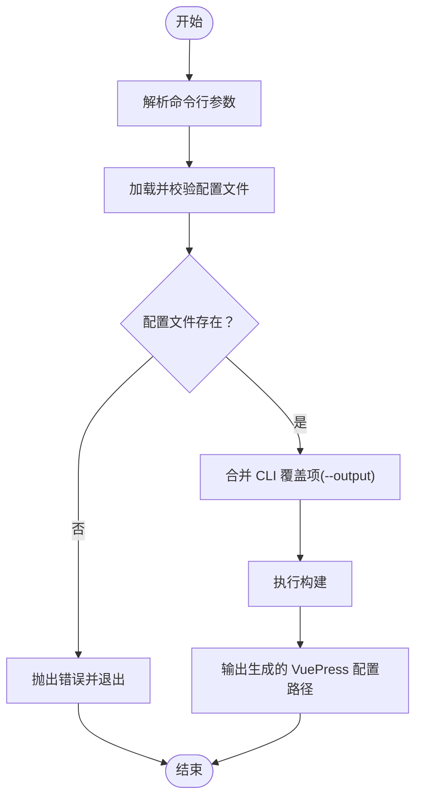
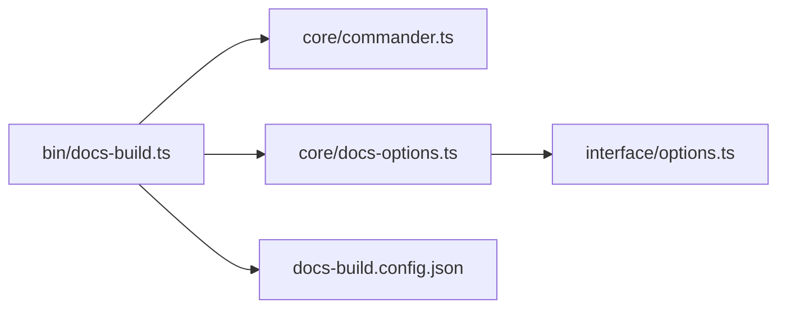

# CLI参考

<cite>
**本文引用的文件**
- [packages/docs-build/src/bin/docs-build.ts](file://packages/docs-build/src/bin/docs-build.ts)
- [packages/docs-build/src/core/commander.ts](file://packages/docs-build/src/core/commander.ts)
- [packages/docs-build/src/core/docs-options.ts](file://packages/docs-build/src/core/docs-options.ts)
- [packages/docs-build/src/interface/options.ts](file://packages/docs-build/src/interface/options.ts)
- [packages/docs-build/package.json](file://packages/docs-build/package.json)
- [docs-build.config.json](file://docs-build.config.json)
- [README.md](file://README.md)
- [README.zh-CN.md](file://README.zh-CN.md)
</cite>

## 目录
1. [简介](#简介)
2. [项目结构](#项目结构)
3. [核心组件](#核心组件)
4. [架构总览](#架构总览)
5. [详细组件分析](#详细组件分析)
6. [依赖分析](#依赖分析)
7. [性能考虑](#性能考虑)
8. [故障排查指南](#故障排查指南)
9. [结论](#结论)
10. [附录](#附录)

## 简介
本文件为文档构建工具的命令行参考，面向使用者与维护者，系统性说明 CLI 的命令、参数、选项、执行流程、参数组合规则、常见用法、错误处理与调试方法，并提供自动补全与别名配置建议。该工具基于 Node.js 与 commander 实现，入口命令为 docs-build，负责读取配置文件并生成 VuePress 配置。

## 项目结构
- 命令入口位于 docs-build 包的二进制脚本，解析命令行参数后加载配置并执行构建。
- 参数解析由 Commander 类完成，支持短/长选项与版本/描述展示。
- 配置文件加载与校验由 DocsOptions 负责，确保必要字段存在且类型正确。
- 配置接口定义在 interface 层，明确各配置项的含义与约束。
- 默认配置文件为根目录下的 docs-build.config.json，可在命令行中指定。



图表来源
- [packages/docs-build/src/bin/docs-build.ts:1-29](file://packages/docs-build/src/bin/docs-build.ts#L1-L29)
- [packages/docs-build/src/core/commander.ts:1-40](file://packages/docs-build/src/core/commander.ts#L1-L40)
- [packages/docs-build/src/core/docs-options.ts:1-68](file://packages/docs-build/src/core/docs-options.ts#L1-L68)
- [packages/docs-build/src/interface/options.ts:1-98](file://packages/docs-build/src/interface/options.ts#L1-L98)
- [docs-build.config.json:1-184](file://docs-build.config.json#L1-L184)

章节来源
- [packages/docs-build/src/bin/docs-build.ts:1-29](file://packages/docs-build/src/bin/docs-build.ts#L1-L29)
- [packages/docs-build/src/core/commander.ts:1-40](file://packages/docs-build/src/core/commander.ts#L1-L40)
- [packages/docs-build/src/core/docs-options.ts:1-68](file://packages/docs-build/src/core/docs-options.ts#L1-L68)
- [packages/docs-build/src/interface/options.ts:1-98](file://packages/docs-build/src/interface/options.ts#L1-L98)
- [docs-build.config.json:1-184](file://docs-build.config.json#L1-L184)

## 核心组件
- 命令入口：解析 argv，定位配置文件路径，合并 CLI 覆盖项，执行构建并输出结果路径。
- 参数解析器：基于 commander 注册选项，支持 -c/--config 与 -o/--output；自动读取包名/版本/描述作为帮助信息。
- 配置加载器：读取并校验配置文件，确保关键字段存在且类型正确。
- 配置接口：定义完整的配置结构与必填项，便于类型约束与文档生成。

章节来源
- [packages/docs-build/src/bin/docs-build.ts:1-29](file://packages/docs-build/src/bin/docs-build.ts#L1-L29)
- [packages/docs-build/src/core/commander.ts:1-40](file://packages/docs-build/src/core/commander.ts#L1-L40)
- [packages/docs-build/src/core/docs-options.ts:1-68](file://packages/docs-build/src/core/docs-options.ts#L1-L68)
- [packages/docs-build/src/interface/options.ts:1-98](file://packages/docs-build/src/interface/options.ts#L1-L98)

## 架构总览
以下序列图展示了 CLI 的典型执行流程：用户输入命令 → 解析参数 → 加载配置 → 合并 CLI 覆盖项 → 执行构建 → 输出结果路径。

```mermaid
sequenceDiagram
participant U as "用户"
participant BIN as "命令入口<br/>docs-build.ts"
participant CMD as "参数解析器<br/>commander.ts"
participant OPT as "配置加载器<br/>docs-options.ts"
participant CFG as "配置文件<br/>docs-build.config.json"
U->>BIN : 运行 docs-build [参数]
BIN->>CMD : parse()
CMD-->>BIN : 返回解析后的选项
BIN->>OPT : load(配置文件绝对路径)
OPT->>CFG : 读取并校验
OPT-->>BIN : 返回校验通过的配置
BIN->>BIN : 合并 CLI 覆盖项(--output)
BIN->>BIN : resolve(配置)
BIN-->>U : 输出生成的 VuePress 配置路径
```

图表来源
- [packages/docs-build/src/bin/docs-build.ts:1-29](file://packages/docs-build/src/bin/docs-build.ts#L1-L29)
- [packages/docs-build/src/core/commander.ts:1-40](file://packages/docs-build/src/core/commander.ts#L1-L40)
- [packages/docs-build/src/core/docs-options.ts:1-68](file://packages/docs-build/src/core/docs-options.ts#L1-L68)
- [docs-build.config.json:1-184](file://docs-build.config.json#L1-L184)

## 详细组件分析

### 命令与语法
- 命令名称：docs-build
- 入口脚本：packages/docs-build/lib/bin/docs-build.js（由包内 bin 字段注册）
- 使用方式：docs-build [选项]
- 退出码：成功时正常退出；发生错误时打印错误信息并以非零退出

章节来源
- [packages/docs-build/package.json:23-25](file://packages/docs-build/package.json#L23-L25)
- [packages/docs-build/src/bin/docs-build.ts:1-29](file://packages/docs-build/src/bin/docs-build.ts#L1-L29)

### 命令行参数与选项
- -c, --config <路径>
  - 说明：指定 docs-build.config.json 的路径
  - 默认值：./docs-build.config.json
  - 行为：解析为绝对路径后加载配置
- -o, --output <路径>
  - 说明：覆盖配置中的输出目录
  - 行为：若提供，则将配置中的 output 字段替换为该值
  - 注意：仅影响最终输出目录，不影响生成的 VuePress 配置文件路径

章节来源
- [packages/docs-build/src/core/commander.ts:32-34](file://packages/docs-build/src/core/commander.ts#L32-L34)
- [packages/docs-build/src/bin/docs-build.ts:17-20](file://packages/docs-build/src/bin/docs-build.ts#L17-L20)

### 配置文件与必填项
- 配置文件：docs-build.config.json（默认位于项目根目录）
- 必填字段（缺失将报错）：
  - baseSourceDir：源 Markdown 路径前缀
  - site：对象，包含
    - base：站点 base 路径
    - lang：主语言
  - navigation：对象，包含
    - navbar：数组
    - sidebar：对象
- 其他可选字段：
  - appearance.styleDir：自定义样式目录
  - locales.languages：多语言列表
  - output：输出目录（默认 ./docs/.vuepress）

章节来源
- [packages/docs-build/src/core/docs-options.ts:32-66](file://packages/docs-build/src/core/docs-options.ts#L32-L66)
- [packages/docs-build/src/interface/options.ts:63-84](file://packages/docs-build/src/interface/options.ts#L63-L84)
- [docs-build.config.json:1-184](file://docs-build.config.json#L1-L184)

### 执行流程与参数组合规则
- 参数解析
  - 读取包信息（名称/版本/描述），用于帮助与版本输出
  - 注册 -c/--config 与 -o/--output 选项
  - 解析 process.argv 并返回选项对象
- 配置加载与校验
  - 若配置文件不存在，抛出错误
  - 读取 JSON 并进行字段完整性与类型校验
- CLI 覆盖
  - 若提供了 --output，则覆盖配置中的 output 字段
- 构建执行
  - 基于校验通过的配置执行构建
  - 输出生成的 VuePress 配置文件路径



图表来源
- [packages/docs-build/src/core/commander.ts:24-38](file://packages/docs-build/src/core/commander.ts#L24-L38)
- [packages/docs-build/src/core/docs-options.ts:17-27](file://packages/docs-build/src/core/docs-options.ts#L17-L27)
- [packages/docs-build/src/bin/docs-build.ts:17-25](file://packages/docs-build/src/bin/docs-build.ts#L17-L25)

章节来源
- [packages/docs-build/src/core/commander.ts:24-38](file://packages/docs-build/src/core/commander.ts#L24-L38)
- [packages/docs-build/src/core/docs-options.ts:17-27](file://packages/docs-build/src/core/docs-options.ts#L17-L27)
- [packages/docs-build/src/bin/docs-build.ts:17-25](file://packages/docs-build/src/bin/docs-build.ts#L17-L25)

### 使用示例
- 基本用法
  - docs-build
  - 说明：使用默认配置文件路径 ./docs-build.config.json
- 指定配置文件
  - docs-build -c ./custom/path/docs-build.config.json
  - 说明：指定自定义配置文件路径
- 覆盖输出目录
  - docs-build -o ./dist/docs
  - 说明：将输出目录覆盖为 ./dist/docs
- 组合使用
  - docs-build -c ./config/docs-build.config.json -o ./out
  - 说明：同时指定配置文件与输出目录

章节来源
- [packages/docs-build/src/core/commander.ts:32-34](file://packages/docs-build/src/core/commander.ts#L32-L34)
- [packages/docs-build/src/bin/docs-build.ts:17-20](file://packages/docs-build/src/bin/docs-build.ts#L17-L20)

### 常见命令组合与批量操作
- 在工作区统一执行
  - 可结合项目脚本或工作流批量运行：例如在 CI 中先安装依赖，再执行构建
- 与版本管理配合
  - 可在生成文档后，结合 changeset 或发布脚本进行版本与发布流程
- 本地开发调试
  - 使用 -o 覆盖输出目录，便于预览不同输出位置的结果

章节来源
- [README.md:9-45](file://README.md#L9-L45)
- [README.zh-CN.md:9-45](file://README.zh-CN.md#L9-L45)

### 错误处理与调试
- 常见错误
  - 配置文件不存在：提示找不到配置文件
  - 配置格式不合法：提示必须为 JSON 对象
  - 缺失必填字段：提示缺少 baseSourceDir、site、navigation 等关键字段
- 调试建议
  - 使用 -c 指定配置文件路径，确认路径正确
  - 使用 -o 覆盖输出目录，验证输出行为
  - 查看控制台输出的生成路径，确认 VuePress 配置已生成

章节来源
- [packages/docs-build/src/core/docs-options.ts:18-20](file://packages/docs-build/src/core/docs-options.ts#L18-L20)
- [packages/docs-build/src/core/docs-options.ts:33-66](file://packages/docs-build/src/core/docs-options.ts#L33-L66)
- [packages/docs-build/src/bin/docs-build.ts:25-28](file://packages/docs-build/src/bin/docs-build.ts#L25-L28)

### 自动补全与别名配置
- 自动补全
  - 可基于 commander 的内置能力或第三方库（如 bash/zsh 补全脚本）为 docs-build 命令生成补全
- 别名配置
  - 可在 shell 中为 docs-build 设置别名，简化常用命令组合
  - 示例（bash/zsh）：alias db='docs-build'

章节来源
- [packages/docs-build/src/core/commander.ts:27-38](file://packages/docs-build/src/core/commander.ts#L27-L38)

## 依赖分析
- 外部依赖
  - commander：命令行参数解析
  - fs-extra：文件系统读写
  - upath：跨平台路径处理
  - glob、lodash、simple-git、git-url-parse：辅助功能（模板渲染、匹配、Git 信息等）
- 内部模块耦合
  - 命令入口依赖参数解析器与配置加载器
  - 配置加载器依赖接口定义进行类型校验
  - 配置接口定义与配置文件结构保持一致



图表来源
- [packages/docs-build/src/bin/docs-build.ts:1-29](file://packages/docs-build/src/bin/docs-build.ts#L1-L29)
- [packages/docs-build/src/core/commander.ts:1-40](file://packages/docs-build/src/core/commander.ts#L1-L40)
- [packages/docs-build/src/core/docs-options.ts:1-68](file://packages/docs-build/src/core/docs-options.ts#L1-L68)
- [packages/docs-build/src/interface/options.ts:1-98](file://packages/docs-build/src/interface/options.ts#L1-L98)
- [docs-build.config.json:1-184](file://docs-build.config.json#L1-L184)

章节来源
- [packages/docs-build/package.json:37-63](file://packages/docs-build/package.json#L37-L63)

## 性能考虑
- 文件读取
  - 配置文件读取与 JSON 解析为轻量操作，通常不会成为瓶颈
- 路径处理
  - 使用 upath 进行跨平台路径处理，避免路径拼接问题
- 建议
  - 将配置文件放置在项目根目录，减少路径解析开销
  - 合理设置输出目录，避免在大体积项目中产生不必要的 IO

## 故障排查指南
- “找不到配置文件”
  - 确认 -c 指定的路径是否正确，或当前目录下是否存在默认文件
- “缺少必填字段”
  - 检查配置文件中 baseSourceDir、site、navigation 等字段是否齐全
- “生成路径不符合预期”
  - 确认是否使用了 -o 覆盖输出目录，以及输出目录权限是否正确
- “版本/帮助信息未显示”
  - 确认包信息是否正确写入 package.json，以便自动注入名称/版本/描述

章节来源
- [packages/docs-build/src/core/docs-options.ts:18-20](file://packages/docs-build/src/core/docs-options.ts#L18-L20)
- [packages/docs-build/src/core/docs-options.ts:39-66](file://packages/docs-build/src/core/docs-options.ts#L39-L66)
- [packages/docs-build/src/core/commander.ts:27-31](file://packages/docs-build/src/core/commander.ts#L27-L31)

## 结论
本文档对文档构建工具的 CLI 进行了全面梳理，涵盖命令、参数、配置、执行流程、错误处理与调试方法，并提供了常见用法与最佳实践建议。建议在实际使用中结合配置文件与 CLI 覆盖项，确保生成的 VuePress 配置满足项目需求。

## 附录
- 快速开始与脚本参考
  - 可参考项目根目录的 README 获取更多脚本与工作流示例

章节来源
- [README.md:9-45](file://README.md#L9-L45)
- [README.zh-CN.md:9-45](file://README.zh-CN.md#L9-L45)