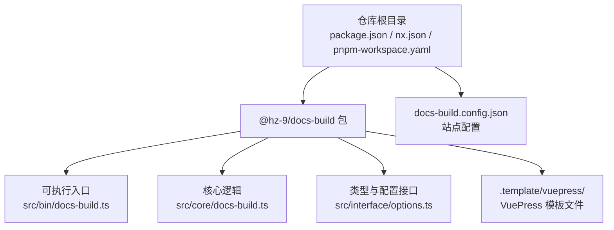
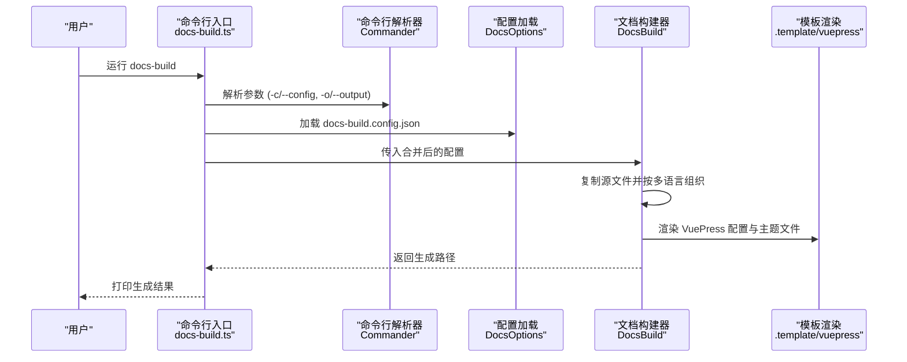
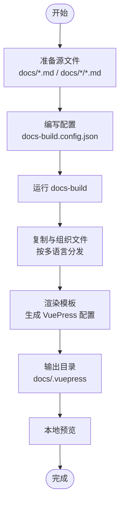
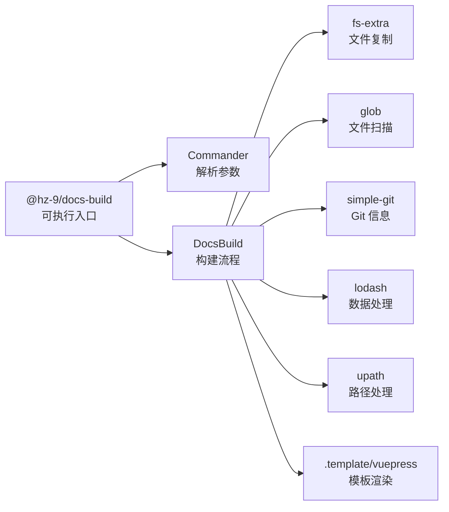

# 快速开始

<cite>
**本文引用的文件**
- [package.json](file://package.json)
- [README.md](file://README.md)
- [@hz-9/docs-build 包说明](file://packages/docs-build/README.md)
- [docs-build.config.json](file://docs-build.config.json)
- [docs-build 可执行入口](file://packages/docs-build/src/bin/docs-build.ts)
- [命令行解析器](file://packages/docs-build/src/core/commander.ts)
- [文档构建器](file://packages/docs-build/src/core/docs-build.ts)
- [配置接口定义](file://packages/docs-build/src/interface/options.ts)
- [VuePress 模板配置](file://packages/docs-build/.template/vuepress/src/.vuepress/config.ts)
</cite>

## 目录
1. [简介](#简介)
2. [项目结构](#项目结构)
3. [核心组件](#核心组件)
4. [架构总览](#架构总览)
5. [详细组件分析](#详细组件分析)
6. [依赖关系分析](#依赖关系分析)
7. [性能考虑](#性能考虑)
8. [故障排除指南](#故障排除指南)
9. [结论](#结论)
10. [附录](#附录)

## 简介
本“快速开始”旨在帮助你从零搭建一个基于 VuePress 主题的文档站点，并通过 @hz-9/docs-build 工具完成自动化生成与本地预览。你将学到：
- 安装与全局使用
- 初始化配置文件与基础项目结构
- 第一个文档站点的完整工作流
- CLI 常用命令与参数
- 常见初始配置与故障排除

## 项目结构
该仓库采用 Nx 多包管理，核心与文档构建工具位于 packages/docs-build。根目录提供统一的脚本与工程化配置，便于在 monorepo 中统一管理。

图示来源
- [package.json:1-42](file://package.json#L1-L42)
- [docs-build.config.json:1-184](file://docs-build.config.json#L1-L184)
- [docs-build 可执行入口:1-29](file://packages/docs-build/src/bin/docs-build.ts#L1-L29)
- [文档构建器:1-361](file://packages/docs-build/src/core/docs-build.ts#L1-L361)
- [配置接口定义:1-98](file://packages/docs-build/src/interface/options.ts#L1-L98)

章节来源
- [package.json:1-42](file://package.json#L1-L42)
- [README.md:1-53](file://README.md#L1-L53)

## 核心组件
- 文档构建器 DocsBuild：负责扫描源 Markdown、复制文件、生成多语言结构、渲染 VuePress 模板并输出最终配置。
- 命令行解析器 Commander：解析 CLI 参数（配置路径与输出覆盖），并注入版本与描述信息。
- 配置接口 DocsBuildOptions：定义站点元信息、导航、外观、多语言与输出等完整配置项。
- 可执行入口：读取 CLI 参数，加载配置，合并输出路径，调用 DocsBuild.resolve 并打印生成结果路径。

章节来源
- [命令行解析器:1-40](file://packages/docs-build/src/core/commander.ts#L1-L40)
- [文档构建器:1-361](file://packages/docs-build/src/core/docs-build.ts#L1-L361)
- [配置接口定义:1-98](file://packages/docs-build/src/interface/options.ts#L1-L98)
- [docs-build 可执行入口:1-29](file://packages/docs-build/src/bin/docs-build.ts#L1-L29)

## 架构总览
下图展示了从 CLI 到最终生成 VuePress 配置的端到端流程：

图示来源
- [docs-build 可执行入口:1-29](file://packages/docs-build/src/bin/docs-build.ts#L1-L29)
- [命令行解析器:1-40](file://packages/docs-build/src/core/commander.ts#L1-L40)
- [文档构建器:1-361](file://packages/docs-build/src/core/docs-build.ts#L1-L361)
- [VuePress 模板配置:1-32](file://packages/docs-build/.template/vuepress/src/.vuepress/config.ts#L1-L32)

## 详细组件分析

### 安装与全局使用
- 全局安装：通过 npm 将 @hz-9/docs-build 安装为全局可执行命令，以便在任意项目中直接运行。
- 本地开发：也可在项目内安装后通过 npm scripts 或 npx 使用。

章节来源
- [@hz-9/docs-build 包说明:25-30](file://packages/docs-build/README.md#L25-L30)

### 初始化配置文件与基础项目结构
- 创建配置文件：在项目根目录创建 docs-build.config.json，定义站点元信息、多语言、导航与输出目录等。
- 基础结构建议：
  - docs/：存放所有 Markdown 源文件
  - docs-build.config.json：文档构建配置
  - docs/.vuepress/：输出目录（由工具生成）

章节来源
- [docs-build.config.json:1-184](file://docs-build.config.json#L1-L184)
- [@hz-9/docs-build 包说明:35-68](file://packages/docs-build/README.md#L35-L68)

### 第一个文档站点的完整工作流
- 步骤一：准备源文件
  - 在 docs/ 下创建你的文档，例如 overview/README.md、guide/README.md 等。
  - 支持多语言：若需要 zh-CN，请在文件名后添加 .zh-CN.md，工具会自动组织到对应语言目录。
- 步骤二：编写配置
  - 在 docs-build.config.json 中设置 baseSourceDir、site、locales、navigation 与 output。
- 步骤三：生成站点
  - 运行 docs-build，工具将复制文件、生成多语言目录并渲染 VuePress 配置。
- 步骤四：本地预览
  - 在生成的 docs/.vuepress 目录中使用 VuePress 提供的开发服务器进行预览与调试。

图示来源
- [文档构建器:123-222](file://packages/docs-build/src/core/docs-build.ts#L123-L222)
- [VuePress 模板配置:1-32](file://packages/docs-build/.template/vuepress/src/.vuepress/config.ts#L1-L32)

章节来源
- [docs-build 可执行入口:1-29](file://packages/docs-build/src/bin/docs-build.ts#L1-L29)
- [文档构建器:1-361](file://packages/docs-build/src/core/docs-build.ts#L1-L361)

### CLI 命令与常用参数
- 基本用法
  - docs-build：使用默认配置路径 ./docs-build.config.json 生成站点
- 常用参数
  - -c, --config <path>：指定配置文件路径（默认当前目录）
  - -o, --output <path>：覆盖配置中的 output 路径
- 版本与描述
  - 命令行会读取包信息显示名称与版本，便于确认使用的工具版本

章节来源
- [命令行解析器:24-38](file://packages/docs-build/src/core/commander.ts#L24-L38)
- [@hz-9/docs-build 包说明:76-82](file://packages/docs-build/README.md#L76-L82)

### 配置项详解与最佳实践
- 站点元信息（site）
  - base：VuePress 的部署路径前缀
  - lang：主语言（如 en-US）
  - title/description：站点标题与描述，未提供时可从 package.json 推断
- 多语言（locales）
  - languages：启用的语言列表；主语言文件无需额外后缀，其他语言需以 .xx-XX.md 结尾
- 导航（navigation）
  - navbar：顶部导航条，支持多语言文本与分组
  - sidebar：按路由前缀映射的侧边栏结构，支持多语言文本
- 输出（output）
  - 默认 docs/.vuepress；可通过 -o 覆盖
- 源目录（baseSourceDir）
  - 默认 docs；用于将 docs/guide/README.md 映射到 /guide/

章节来源
- [配置接口定义:21-84](file://packages/docs-build/src/interface/options.ts#L21-L84)
- [docs-build.config.json:1-184](file://docs-build.config.json#L1-L184)

### 从零开始的完整工作流（示例步骤）
- 准备环境
  - 安装 Node.js（满足引擎要求）
  - 全局安装 @hz-9/docs-build
- 新建项目
  - 创建 docs/ 目录与若干 Markdown 文档
  - 在项目根创建 docs-build.config.json，填写 site、locales、navigation、output、baseSourceDir
- 生成站点
  - 在项目根运行 docs-build
  - 查看控制台输出的生成路径
- 本地预览
  - 在 docs/.vuepress 目录启动 VuePress 开发服务器进行预览

章节来源
- [package.json:37-40](file://package.json#L37-L40)
- [@hz-9/docs-build 包说明:25-82](file://packages/docs-build/README.md#L25-L82)
- [docs-build 可执行入口:1-29](file://packages/docs-build/src/bin/docs-build.ts#L1-L29)

## 依赖关系分析
- CLI 依赖
  - commander：解析命令行参数
  - fs-extra：文件系统操作
  - glob/simple-git/lodash/upath：文件扫描、Git 信息获取、工具函数与路径处理
- 模板与主题
  - VuePress 配置模板来自 .template/vuepress，工具将其渲染到输出目录

图示来源
- [docs-build 可执行入口:1-29](file://packages/docs-build/src/bin/docs-build.ts#L1-L29)
- [文档构建器:1-361](file://packages/docs-build/src/core/docs-build.ts#L1-L361)
- [命令行解析器:1-40](file://packages/docs-build/src/core/commander.ts#L1-L40)

章节来源
- [package.json:37-63](file://packages/docs-build/package.json#L37-L63)

## 性能考虑
- 文件扫描与复制
  - 使用 glob 同步扫描与 fs-extra 复制，建议避免在超大目录中频繁触发构建
- 模板渲染
  - 模板渲染为一次性操作，注意不要在每次增量构建中重复全量渲染
- 多语言处理
  - 按语言分发文件时会进行多次复制，建议合理规划文件数量与层级

## 故障排除指南
- Node 版本不匹配
  - 确认 Node.js 版本满足 engines 要求
- 未找到配置文件
  - 检查 -c/--config 指定的路径是否正确；默认使用 ./docs-build.config.json
- 输出路径被覆盖
  - 使用 -o/--output 可临时覆盖配置中的 output，确认生成位置
- Git 信息缺失
  - 工具会尝试从 Git remote.origin.url 解析仓库地址，若无 Git 仓库或权限不足，将静默失败
- 本地预览异常
  - 确保已生成 docs/.vuepress 并使用 VuePress 开发服务器启动

章节来源
- [package.json:37-40](file://package.json#L37-L40)
- [docs-build 可执行入口:15-28](file://packages/docs-build/src/bin/docs-build.ts#L15-L28)
- [文档构建器:338-359](file://packages/docs-build/src/core/docs-build.ts#L338-L359)

## 结论
通过本“快速开始”，你已经掌握了：
- 全局安装与 CLI 使用
- 初始化配置与基础项目结构
- 从零到一生成并预览文档站点的完整流程
- 常用参数与常见问题排查

建议在正式项目中结合 CI/CD 流水线自动化生成与发布，以提升效率与一致性。

## 附录

### 常用命令速查
- 全局安装：npm install --global @hz-9/docs-build
- 生成站点：docs-build
- 指定配置：docs-build -c ./docs-build.config.json
- 覆盖输出：docs-build -o ./docs/.vuepress

章节来源
- [@hz-9/docs-build 包说明:25-82](file://packages/docs-build/README.md#L25-L82)