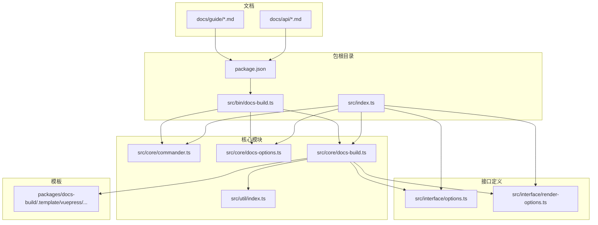
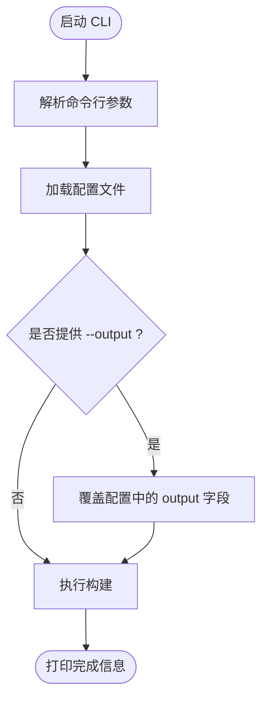
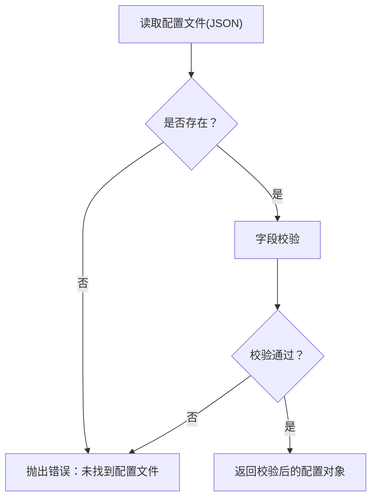
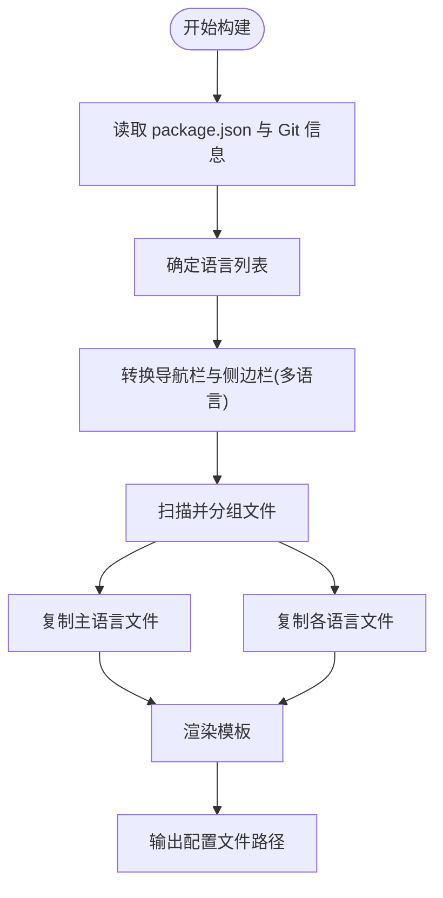
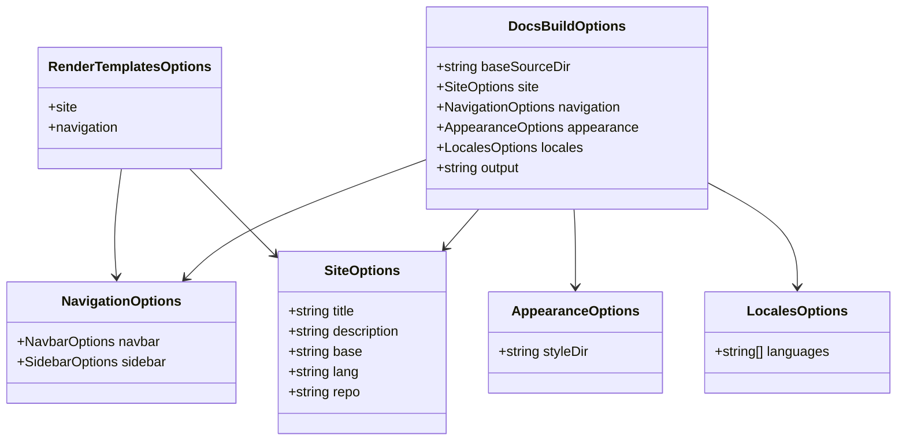
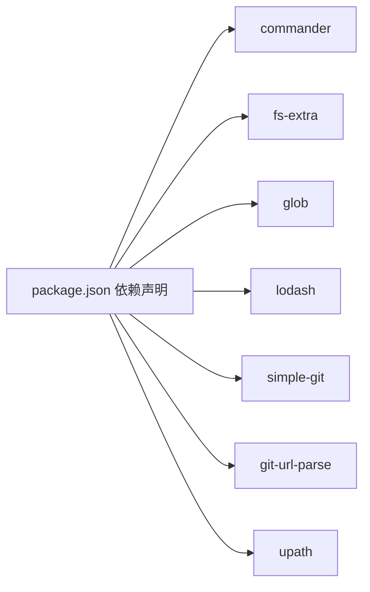

# 文档构建工具(@hz-9/docs-build)

<cite>
**本文引用的文件**
- [packages/docs-build/package.json](file://packages/docs-build/package.json)
- [packages/docs-build/src/index.ts](file://packages/docs-build/src/index.ts)
- [packages/docs-build/src/bin/docs-build.ts](file://packages/docs-build/src/bin/docs-build.ts)
- [packages/docs-build/src/core/commander.ts](file://packages/docs-build/src/core/commander.ts)
- [packages/docs-build/src/core/docs-options.ts](file://packages/docs-build/src/core/docs-options.ts)
- [packages/docs-build/src/core/docs-build.ts](file://packages/docs-build/src/core/docs-build.ts)
- [packages/docs-build/src/interface/options.ts](file://packages/docs-build/src/interface/options.ts)
- [packages/docs-build/src/interface/render-options.ts](file://packages/docs-build/src/interface/render-options.ts)
- [packages/docs-build/src/util/index.ts](file://packages/docs-build/src/util/index.ts)
- [packages/docs-build/.template/vuepress/src/.vuepress/config.ts](file://packages/docs-build/.template/vuepress/src/.vuepress/config.ts)
- [packages/docs-build/.template/vuepress/src/.vuepress/navbar.ts](file://packages/docs-build/.template/vuepress/src/.vuepress/navbar.ts)
- [packages/docs-build/.template/vuepress/src/.vuepress/sidebar.ts](file://packages/docs-build/.template/vuepress/src/.vuepress/sidebar.ts)
- [packages/docs-build/.template/vuepress/src/.vuepress/theme.ts](file://packages/docs-build/.template/vuepress/src/.vuepress/theme.ts)
- [packages/docs-build/.template/vuepress/package.json](file://packages/docs-build/.template/vuepress/package.json)
- [packages/docs-build/docs/guide/README.md](file://packages/docs-build/docs/guide/README.md)
- [packages/docs-build/docs/guide/in-project.md](file://packages/docs-build/docs/guide/in-project.md)
- [packages/docs-build/docs/guide/scan-rule.md](file://packages/docs-build/docs/guide/scan-rule.md)
- [packages/docs-build/docs/api/index.api.md](file://packages/docs-build/docs/api/index.api.md)
- [packages/docs-build/README.md](file://packages/docs-build/README.md)
- [.github/workflows/generate-pages.yml](file://.github/workflows/generate-pages.yml)
- [scripts/generate-pages.sh](file://scripts/generate-pages.sh)
</cite>

## 目录
1. [简介](#简介)
2. [项目结构](#项目结构)
3. [核心组件](#核心组件)
4. [架构总览](#架构总览)
5. [详细组件分析](#详细组件分析)
6. [依赖关系分析](#依赖关系分析)
7. [性能考量](#性能考量)
8. [故障排查指南](#故障排查指南)
9. [结论](#结论)
10. [附录](#附录)

## 简介
@hz-9/docs-build 是一个基于 VuePress 主题（vuepress-theme-hope）的文档生成与发布工具。它通过读取配置文件与 Markdown 源文件，自动完成站点元信息注入、导航与侧边栏多语言转换、静态资源复制以及 VuePress 配置模板渲染，并最终输出可直接用于部署的 VuePress 配置与源文件。

该工具面向文档作者与开发者，提供从安装、配置到 CI/CD 集成的完整链路支持，核心能力包括：
- 配置管理：加载与校验 JSON 配置文件，支持 CLI 参数覆盖
- 文件处理：扫描与分组多语言 Markdown，按语言规则复制到目标目录
- 模板渲染：以 Lodash 模板引擎渲染 VuePress 配置与主题文件
- 输出生成：生成 VuePress 配置文件与源码目录，便于后续构建与部署

## 项目结构
该包位于 packages/docs-build 目录下，包含以下关键部分：
- 源代码：src 目录，包含 CLI 入口、命令解析、配置加载、构建流程、接口定义与工具函数
- 模板：.template/vuepress 目录，包含 VuePress 项目模板（配置、导航、侧边栏、主题等）
- 文档：docs 目录，包含使用指南、扫描规则与 API 文档
- 脚本与工作流：scripts 与 .github/workflows，提供页面生成脚本与 GitHub Actions 工作流



**图表来源**
- [packages/docs-build/package.json:1-64](file://packages/docs-build/package.json#L1-L64)
- [packages/docs-build/src/bin/docs-build.ts:1-29](file://packages/docs-build/src/bin/docs-build.ts#L1-L29)
- [packages/docs-build/src/index.ts:1-10](file://packages/docs-build/src/index.ts#L1-L10)
- [packages/docs-build/src/core/commander.ts:1-40](file://packages/docs-build/src/core/commander.ts#L1-L40)
- [packages/docs-build/src/core/docs-options.ts:1-68](file://packages/docs-build/src/core/docs-options.ts#L1-L68)
- [packages/docs-build/src/core/docs-build.ts:1-361](file://packages/docs-build/src/core/docs-build.ts#L1-L361)
- [packages/docs-build/src/util/index.ts:1-30](file://packages/docs-build/src/util/index.ts#L1-L30)
- [packages/docs-build/src/interface/options.ts:1-98](file://packages/docs-build/src/interface/options.ts#L1-L98)
- [packages/docs-build/src/interface/render-options.ts:1-19](file://packages/docs-build/src/interface/render-options.ts#L1-L19)

**章节来源**
- [packages/docs-build/package.json:1-64](file://packages/docs-build/package.json#L1-L64)
- [packages/docs-build/src/index.ts:1-10](file://packages/docs-build/src/index.ts#L1-L10)

## 核心组件
- CLI 入口与参数解析：负责解析命令行参数（配置文件路径、输出目录），并驱动构建流程
- 配置加载与校验：从指定路径读取 JSON 配置，进行字段完整性校验
- 构建器：执行站点元信息解析、多语言导航与侧边栏转换、文件复制与模板渲染
- 接口定义：统一配置项、渲染数据结构与返回结果类型
- 工具函数：向上查找 package.json，供站点标题与描述回退使用

**章节来源**
- [packages/docs-build/src/bin/docs-build.ts:1-29](file://packages/docs-build/src/bin/docs-build.ts#L1-L29)
- [packages/docs-build/src/core/commander.ts:1-40](file://packages/docs-build/src/core/commander.ts#L1-L40)
- [packages/docs-build/src/core/docs-options.ts:1-68](file://packages/docs-build/src/core/docs-options.ts#L1-L68)
- [packages/docs-build/src/core/docs-build.ts:1-361](file://packages/docs-build/src/core/docs-build.ts#L1-L361)
- [packages/docs-build/src/interface/options.ts:1-98](file://packages/docs-build/src/interface/options.ts#L1-L98)
- [packages/docs-build/src/interface/render-options.ts:1-19](file://packages/docs-build/src/interface/render-options.ts#L1-L19)
- [packages/docs-build/src/util/index.ts:1-30](file://packages/docs-build/src/util/index.ts#L1-L30)

## 架构总览
整体流程从 CLI 入口开始，解析参数后加载配置；随后根据配置执行构建器，构建器内部完成站点信息、导航与侧边栏的多语言处理、文件复制与模板渲染；最后输出 VuePress 配置文件路径，供后续构建与部署使用。

```mermaid
sequenceDiagram
participant U as "用户"
participant CLI as "CLI 入口"
participant CMD as "命令解析"
participant OPT as "配置加载"
participant DB as "构建器"
participant FS as "文件系统"
participant TPL as "模板引擎"
U->>CLI : 运行 docs-build 命令
CLI->>CMD : 解析参数(--config, --output)
CLI->>OPT : 加载配置文件
OPT-->>CLI : 返回校验后的配置
CLI->>DB : 调用 DocsBuild.resolve()
DB->>FS : 读取 package.json 与 Git 信息
DB->>DB : 处理多语言导航/侧边栏
DB->>FS : 复制源文件到输出目录
DB->>TPL : 渲染 VuePress 模板
TPL-->>DB : 写入渲染后的文件
DB-->>CLI : 返回输出路径与配置文件路径
CLI-->>U : 打印完成信息
```

**图表来源**
- [packages/docs-build/src/bin/docs-build.ts:1-29](file://packages/docs-build/src/bin/docs-build.ts#L1-L29)
- [packages/docs-build/src/core/commander.ts:1-40](file://packages/docs-build/src/core/commander.ts#L1-L40)
- [packages/docs-build/src/core/docs-options.ts:1-68](file://packages/docs-build/src/core/docs-options.ts#L1-L68)
- [packages/docs-build/src/core/docs-build.ts:1-361](file://packages/docs-build/src/core/docs-build.ts#L1-L361)

## 详细组件分析

### CLI 工具与参数
- 功能：解析命令行参数，加载配置文件，支持覆盖输出目录
- 关键点：
  - 支持 --config 指定配置文件路径（默认当前目录下的 docs-build.config.json）
  - 支持 --output 覆盖配置中的 output 字段
  - 输出执行日志与最终生成的 VuePress 配置文件路径



**图表来源**
- [packages/docs-build/src/bin/docs-build.ts:1-29](file://packages/docs-build/src/bin/docs-build.ts#L1-L29)
- [packages/docs-build/src/core/commander.ts:1-40](file://packages/docs-build/src/core/commander.ts#L1-L40)

**章节来源**
- [packages/docs-build/src/bin/docs-build.ts:1-29](file://packages/docs-build/src/bin/docs-build.ts#L1-L29)
- [packages/docs-build/src/core/commander.ts:1-40](file://packages/docs-build/src/core/commander.ts#L1-L40)

### 配置管理与校验
- 功能：从指定路径读取 JSON 配置并进行字段校验
- 必需字段：
  - baseSourceDir：源 Markdown 目录前缀
  - site：对象，包含 base、lang 等
  - navigation：对象，包含 navbar（数组）与 sidebar（对象或布尔）
- 校验失败时抛出错误，确保配置完整性



**图表来源**
- [packages/docs-build/src/core/docs-options.ts:1-68](file://packages/docs-build/src/core/docs-options.ts#L1-L68)

**章节来源**
- [packages/docs-build/src/core/docs-options.ts:1-68](file://packages/docs-build/src/core/docs-options.ts#L1-L68)

### 构建器：文件处理与模板渲染
- 站点信息解析：优先使用配置中的 site.title/description，否则回退至 package.json 的 name/description
- Git 信息：尝试从本地 Git 配置中提取仓库 URL 并标准化为 HTTPS
- 多语言处理：
  - 导航栏与侧边栏支持字符串或对象形式，支持嵌套分组
  - 支持多语言文本（键值对）在不同语言间解析
- 文件复制：
  - 扫描 baseSourceDir 下所有文件，忽略特定模式
  - 对于 Markdown 文件，按语言后缀（如 .zh-CN.md）进行分组与映射
  - 主语言与非主语言分别复制到对应目录
- 模板渲染：
  - 递归遍历模板目录，对 JS/TS/JSON/YAML/MD 等文本文件进行 Lodash 模板渲染
  - 非文本文件直接复制
  - 渲染数据包含站点基础信息与多语言导航/侧边栏



**图表来源**
- [packages/docs-build/src/core/docs-build.ts:1-361](file://packages/docs-build/src/core/docs-build.ts#L1-L361)
- [packages/docs-build/src/util/index.ts:1-30](file://packages/docs-build/src/util/index.ts#L1-L30)

**章节来源**
- [packages/docs-build/src/core/docs-build.ts:1-361](file://packages/docs-build/src/core/docs-build.ts#L1-L361)
- [packages/docs-build/src/util/index.ts:1-30](file://packages/docs-build/src/util/index.ts#L1-L30)

### 接口与数据模型
- DocsBuildOptions：完整配置对象，包含 baseSourceDir、site、navigation、appearance、locales、output
- NavigationOptions：navbar 与 sidebar 的配置集合
- SiteOptions：站点元信息（title/description/base/lang/repo）
- AppearanceOptions：外观定制（如自定义样式目录）
- LocalesOptions：多语言配置（languages 数组）
- RenderTemplatesOptions：渲染模板所需的数据结构（site 与 navigation）



**图表来源**
- [packages/docs-build/src/interface/options.ts:1-98](file://packages/docs-build/src/interface/options.ts#L1-L98)
- [packages/docs-build/src/interface/render-options.ts:1-19](file://packages/docs-build/src/interface/render-options.ts#L1-L19)

**章节来源**
- [packages/docs-build/src/interface/options.ts:1-98](file://packages/docs-build/src/interface/options.ts#L1-L98)
- [packages/docs-build/src/interface/render-options.ts:1-19](file://packages/docs-build/src/interface/render-options.ts#L1-L19)

### 模板与主题
- 模板位置：packages/docs-build/.template/vuepress
- 包含文件：
  - src/.vuepress/config.ts：VuePress 配置入口
  - src/.vuepress/navbar.ts / sidebar.ts：导航与侧边栏配置
  - src/.vuepress/theme.ts：主题相关配置
  - package.json：模板项目的依赖声明
- 渲染机制：构建器将上述模板文件复制到输出目录，并对文本类文件进行模板渲染，注入站点与导航数据

**章节来源**
- [packages/docs-build/.template/vuepress/src/.vuepress/config.ts](file://packages/docs-build/.template/vuepress/src/.vuepress/config.ts)
- [packages/docs-build/.template/vuepress/src/.vuepress/navbar.ts](file://packages/docs-build/.template/vuepress/src/.vuepress/navbar.ts)
- [packages/docs-build/.template/vuepress/src/.vuepress/sidebar.ts](file://packages/docs-build/.template/vuepress/src/.vuepress/sidebar.ts)
- [packages/docs-build/.template/vuepress/src/.vuepress/theme.ts](file://packages/docs-build/.template/vuepress/src/.vuepress/theme.ts)
- [packages/docs-build/.template/vuepress/package.json](file://packages/docs-build/.template/vuepress/package.json)

## 依赖关系分析
- 运行时依赖：
  - commander：命令行参数解析
  - fs-extra：文件系统操作
  - glob：文件匹配与扫描
  - lodash：模板渲染
  - simple-git / git-url-parse：Git 仓库信息提取与 URL 规范化
  - upath：跨平台路径处理
- 开发依赖：TypeScript、Vite、DTS 插件、测试框架等



**图表来源**
- [packages/docs-build/package.json:37-45](file://packages/docs-build/package.json#L37-L45)

**章节来源**
- [packages/docs-build/package.json:1-64](file://packages/docs-build/package.json#L1-L64)

## 性能考量
- 文件扫描与复制：采用同步扫描与逐文件复制策略，建议在大型仓库中合理组织目录结构，减少无关文件参与扫描
- 模板渲染：仅对文本类文件进行模板替换，二进制文件直接复制，避免不必要的 I/O
- 多语言处理：按语言分组复制，主语言与非主语言目录分离，降低路径映射复杂度
- Git 信息：作为可选功能，失败时静默处理，不影响构建主流程

[本节为通用性能建议，无需特定文件引用]

## 故障排查指南
- 配置文件缺失：当配置文件不存在时会抛出错误，请确认 --config 指向正确路径
- 配置字段缺失：缺少 baseSourceDir、site、navigation.navbar 或 navigation.sidebar 会导致校验失败
- Git 信息不可用：若本地无 Git 或无法读取远程 URL，将回退为 null，不影响构建
- 输出路径权限：请确保输出目录具有写入权限
- 模板渲染异常：检查模板中使用的变量是否与渲染数据一致

**章节来源**
- [packages/docs-build/src/core/docs-options.ts:1-68](file://packages/docs-build/src/core/docs-options.ts#L1-L68)
- [packages/docs-build/src/core/docs-build.ts:338-359](file://packages/docs-build/src/core/docs-build.ts#L338-L359)

## 结论
@hz-9/docs-build 提供了从配置到输出的完整文档构建链路，具备良好的可扩展性与可维护性。通过清晰的接口定义、严格的配置校验与灵活的模板渲染机制，能够满足多语言文档站点的生成需求，并可无缝接入 CI/CD 流水线实现自动化发布。

[本节为总结性内容，无需特定文件引用]

## 附录

### 安装与使用
- 安装：通过包管理器安装 @hz-9/docs-build
- 使用：运行 docs-build 命令，指定配置文件路径与可选输出目录
- 输出：工具会在控制台打印生成的 VuePress 配置文件路径，随后可进行 VuePress 构建与部署

**章节来源**
- [packages/docs-build/package.json:31-36](file://packages/docs-build/package.json#L31-L36)
- [packages/docs-build/src/bin/docs-build.ts:12-24](file://packages/docs-build/src/bin/docs-build.ts#L12-L24)

### 配置参考
- 站点配置（site）：title、description、base、lang、repo
- 导航配置（navigation）：navbar（数组）、sidebar（对象或布尔）
- 外观配置（appearance）：styleDir（自定义样式目录）
- 多语言配置（locales）：languages（语言列表）
- 其他：baseSourceDir（源目录前缀）、output（输出目录）

**章节来源**
- [packages/docs-build/src/interface/options.ts:21-84](file://packages/docs-build/src/interface/options.ts#L21-L84)

### CLI 参数
- --config/-c：配置文件路径（默认 ./docs-build.config.json）
- --output/-o：输出目录覆盖（覆盖配置中的 output）

**章节来源**
- [packages/docs-build/src/core/commander.ts:32-34](file://packages/docs-build/src/core/commander.ts#L32-L34)

### 模板与主题定制
- 模板位置：packages/docs-build/.template/vuepress
- 可修改文件：config.ts、navbar.ts、sidebar.ts、theme.ts
- 定制样式：通过 appearance.styleDir 指定自定义样式目录，与内置样式同名文件将被覆盖

**章节来源**
- [packages/docs-build/.template/vuepress/src/.vuepress/config.ts](file://packages/docs-build/.template/vuepress/src/.vuepress/config.ts)
- [packages/docs-build/.template/vuepress/src/.vuepress/navbar.ts](file://packages/docs-build/.template/vuepress/src/.vuepress/navbar.ts)
- [packages/docs-build/.template/vuepress/src/.vuepress/sidebar.ts](file://packages/docs-build/.template/vuepress/src/.vuepress/sidebar.ts)
- [packages/docs-build/.template/vuepress/src/.vuepress/theme.ts](file://packages/docs-build/.template/vuepress/src/.vuepress/theme.ts)
- [packages/docs-build/src/interface/options.ts:43-46](file://packages/docs-build/src/interface/options.ts#L43-L46)

### CI/CD 集成
- GitHub Actions 工作流：.github/workflows/generate-pages.yml
- 页面生成脚本：scripts/generate-pages.sh
- 建议流程：拉取代码 → 安装依赖 → 运行 docs-build → 构建 VuePress → 部署到 Pages

**章节来源**
- [.github/workflows/generate-pages.yml](file://.github/workflows/generate-pages.yml)
- [scripts/generate-pages.sh](file://scripts/generate-pages.sh)

### 实际使用示例与最佳实践
- 示例文档：packages/docs-build/docs/guide 与 docs/api
- 最佳实践：
  - 将 Markdown 源文件按模块组织在 baseSourceDir 下
  - 使用多语言后缀区分不同语言版本
  - 在 navigation 中明确 navbar 与 sidebar 的结构
  - 通过 appearance.styleDir 提供统一的样式覆盖
  - 在 CI/CD 中固定 Node 版本与依赖锁文件

**章节来源**
- [packages/docs-build/docs/guide/README.md](file://packages/docs-build/docs/guide/README.md)
- [packages/docs-build/docs/guide/in-project.md](file://packages/docs-build/docs/guide/in-project.md)
- [packages/docs-build/docs/guide/scan-rule.md](file://packages/docs-build/docs/guide/scan-rule.md)
- [packages/docs-build/docs/api/index.api.md](file://packages/docs-build/docs/api/index.api.md)