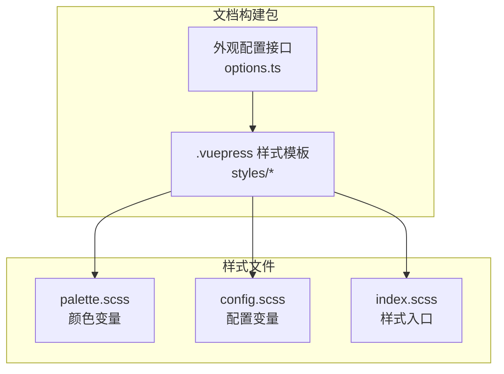
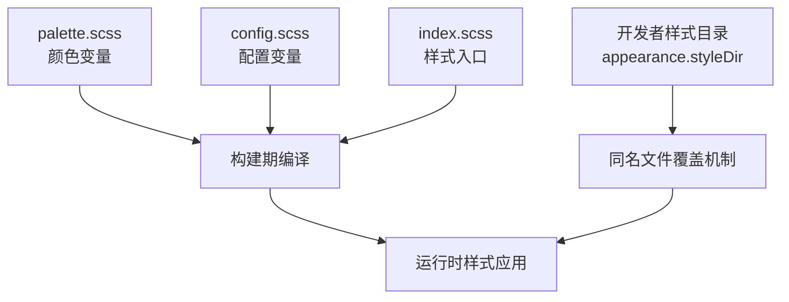
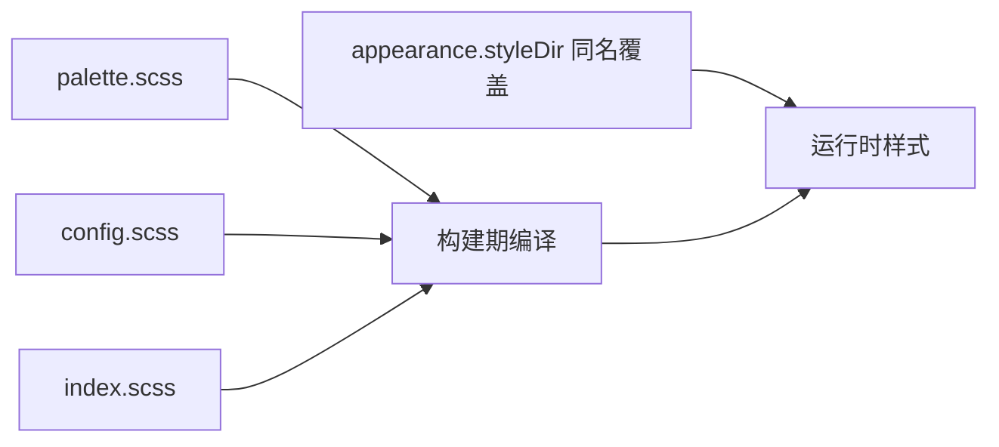

# 外观定制

<cite>
**本文引用的文件**
- [packages/docs-build/src/interface/options.ts](file://packages/docs-build/src/interface/options.ts)
- [packages/docs-build/.template/vuepress/src/.vuepress/styles/palette.scss](file://packages/docs-build/.template/vuepress/src/.vuepress/styles/palette.scss)
- [packages/docs-build/.template/vuepress/src/.vuepress/styles/config.scss](file://packages/docs-build/.template/vuepress/src/.vuepress/styles/config.scss)
- [packages/docs-build/.template/vuepress/src/.vuepress/styles/index.scss](file://packages/docs-build/.template/vuepress/src/.vuepress/styles/index.scss)
</cite>

## 目录
1. [简介](#简介)
2. [项目结构](#项目结构)
3. [核心组件](#核心组件)
4. [架构总览](#架构总览)
5. [详细组件分析](#详细组件分析)
6. [依赖分析](#依赖分析)
7. [性能考虑](#性能考虑)
8. [故障排查指南](#故障排查指南)
9. [结论](#结论)
10. [附录](#附录)

## 简介
本章节面向使用 VuePress Theme Hope 的团队与个人，系统化讲解外观定制的完整流程与最佳实践。内容涵盖颜色方案、字体与排版、布局与断点、动画与过渡、CSS 自定义属性与变量覆盖、组件样式穿透、响应式与移动端适配，以及性能优化与可维护性建议。通过本指南，您将能够快速搭建品牌化、一致且高性能的文档站点。

## 项目结构
本项目的外观定制能力由一个可复用的文档构建包提供，其模板中包含样式入口与变量文件，便于在不修改主题源码的前提下进行深度定制。关键位置如下：
- 样式入口：用于全局注入与覆盖默认样式
- 颜色变量：集中管理主题主色与辅助色
- 配置变量：集中管理调色板与布局参数
- 外观配置接口：对外暴露外观相关配置项

**图表来源**
- [packages/docs-build/src/interface/options.ts:43-46](file://packages/docs-build/src/interface/options.ts#L43-L46)
- [packages/docs-build/.template/vuepress/src/.vuepress/styles/palette.scss:1-2](file://packages/docs-build/.template/vuepress/src/.vuepress/styles/palette.scss#L1-L2)
- [packages/docs-build/.template/vuepress/src/.vuepress/styles/config.scss:1-2](file://packages/docs-build/.template/vuepress/src/.vuepress/styles/config.scss#L1-L2)
- [packages/docs-build/.template/vuepress/src/.vuepress/styles/index.scss:1-14](file://packages/docs-build/.template/vuepress/src/.vuepress/styles/index.scss#L1-L14)

**章节来源**
- [packages/docs-build/src/interface/options.ts:43-46](file://packages/docs-build/src/interface/options.ts#L43-L46)
- [packages/docs-build/.template/vuepress/src/.vuepress/styles/palette.scss:1-2](file://packages/docs-build/.template/vuepress/src/.vuepress/styles/palette.scss#L1-L2)
- [packages/docs-build/.template/vuepress/src/.vuepress/styles/config.scss:1-2](file://packages/docs-build/.template/vuepress/src/.vuepress/styles/config.scss#L1-L2)
- [packages/docs-build/.template/vuepress/src/.vuepress/styles/index.scss:1-14](file://packages/docs-build/.template/vuepress/src/.vuepress/styles/index.scss#L1-L14)

## 核心组件
- 外观配置接口（AppearanceOptions）
  - 提供用户自定义样式目录字段，允许通过同名文件覆盖内置默认样式，实现零侵入的外观定制。
  - 该接口位于外观配置命名空间下，作为整体配置的一部分被消费。

- 样式模板（.vuepress/styles）
  - palette.scss：集中定义主题主色等颜色变量，便于统一风格。
  - config.scss：集中定义调色板与布局相关配置变量。
  - index.scss：全局样式入口，支持媒体查询、CSS 自定义属性与选择器覆盖。

- 配置接口（DocsBuildOptions）
  - appearance 字段用于启用或传递外观配置，使外观层与构建层解耦。

**章节来源**
- [packages/docs-build/src/interface/options.ts:43-46](file://packages/docs-build/src/interface/options.ts#L43-L46)
- [packages/docs-build/src/interface/options.ts:63-77](file://packages/docs-build/src/interface/options.ts#L63-L77)

## 架构总览
外观定制的运行时架构围绕“变量—入口—覆盖”三要素展开：通过变量文件集中管理颜色与配置；通过样式入口统一注入与声明 CSS 自定义属性；通过同名文件机制实现对内置样式的覆盖。

**图表来源**
- [packages/docs-build/src/interface/options.ts:43-46](file://packages/docs-build/src/interface/options.ts#L43-L46)
- [packages/docs-build/.template/vuepress/src/.vuepress/styles/palette.scss:1-2](file://packages/docs-build/.template/vuepress/src/.vuepress/styles/palette.scss#L1-L2)
- [packages/docs-build/.template/vuepress/src/.vuepress/styles/config.scss:1-2](file://packages/docs-build/.template/vuepress/src/.vuepress/styles/config.scss#L1-L2)
- [packages/docs-build/.template/vuepress/src/.vuepress/styles/index.scss:1-14](file://packages/docs-build/.template/vuepress/src/.vuepress/styles/index.scss#L1-L14)

## 详细组件分析

### 颜色方案定制
- 使用方式
  - 在 palette.scss 中集中定义主题主色与辅助色，确保品牌一致性。
  - 通过 Sass 变量与 CSS 自定义属性配合，实现跨组件的颜色复用。
- 实践要点
  - 将主色与强调色分离，避免在多处硬编码颜色值。
  - 为浅色/深色模式分别提供语义化变量，保证对比度与可读性。
- 示例参考
  - 颜色变量文件路径：[palette.scss:1-2](file://packages/docs-build/.template/vuepress/src/.vuepress/styles/palette.scss#L1-L2)

**章节来源**
- [packages/docs-build/.template/vuepress/src/.vuepress/styles/palette.scss:1-2](file://packages/docs-build/.template/vuepress/src/.vuepress/styles/palette.scss#L1-L2)

### 字体与排版设置
- 使用方式
  - 在 index.scss 中声明全局字体族、字号、行高与字重，确保正文与标题层级的一致性。
  - 通过 CSS 自定义属性控制字号与行高，便于在不同断点下动态调整。
- 实践要点
  - 优先使用系统字体栈，提升加载性能与可读性。
  - 为代码块与内联代码单独设置字体族，增强可读性。
- 示例参考
  - 样式入口文件路径：[index.scss:1-14](file://packages/docs-build/.template/vuepress/src/.vuepress/styles/index.scss#L1-L14)

**章节来源**
- [packages/docs-build/.template/vuepress/src/.vuepress/styles/index.scss:1-14](file://packages/docs-build/.template/vuepress/src/.vuepress/styles/index.scss#L1-L14)

### 布局与断点调整
- 使用方式
  - 在 index.scss 中结合媒体查询与 CSS 自定义属性，按设备宽度动态调整内容区宽度与间距。
  - 利用模板中已有的断点变量，统一管理 PC/平板/手机 的布局差异。
- 实践要点
  - 将断点阈值抽象为变量，减少重复计算与维护成本。
  - 控制最大内容宽度，避免长行降低可读性。
- 示例参考
  - 断点与内容宽度示例路径：[index.scss:4-7](file://packages/docs-build/.template/vuepress/src/.vuepress/styles/index.scss#L4-L7)

**章节来源**
- [packages/docs-build/.template/vuepress/src/.vuepress/styles/index.scss:4-7](file://packages/docs-build/.template/vuepress/src/.vuepress/styles/index.scss#L4-L7)

### 动画与过渡效果
- 使用方式
  - 在 index.scss 中为导航、按钮、卡片等组件添加过渡与悬停效果，提升交互体验。
  - 使用 CSS 变换与缓动函数，保持动画性能与流畅度。
- 实践要点
  - 为高阶动画（如页面切换）预留钩子类名，避免与第三方组件冲突。
  - 控制动画时长与延迟，兼顾性能与感知速度。
- 示例参考
  - 样式入口文件路径：[index.scss:1-14](file://packages/docs-build/.template/vuepress/src/.vuepress/styles/index.scss#L1-L14)

**章节来源**
- [packages/docs-build/.template/vuepress/src/.vuepress/styles/index.scss:1-14](file://packages/docs-build/.template/vuepress/src/.vuepress/styles/index.scss#L1-L14)

### 主题变量与 CSS 自定义属性
- 使用方式
  - 在 config.scss 中集中管理调色板与布局配置变量，形成统一的变量库。
  - 在 index.scss 中声明并导出 CSS 自定义属性，供组件与页面按需使用。
- 实践要点
  - 将变量命名语义化，避免与主题默认变量冲突。
  - 为变量提供默认值与降级方案，增强可移植性。
- 示例参考
  - 配置变量文件路径：[config.scss:1-2](file://packages/docs-build/.template/vuepress/src/.vuepress/styles/config.scss#L1-L2)
  - CSS 自定义属性示例路径：[index.scss:5-7](file://packages/docs-build/.template/vuepress/src/.vuepress/styles/index.scss#L5-L7)

**章节来源**
- [packages/docs-build/.template/vuepress/src/.vuepress/styles/config.scss:1-2](file://packages/docs-build/.template/vuepress/src/.vuepress/styles/config.scss#L1-L2)
- [packages/docs-build/.template/vuepress/src/.vuepress/styles/index.scss:5-7](file://packages/docs-build/.template/vuepress/src/.vuepress/styles/index.scss#L5-L7)

### 组件样式覆盖技巧
- 使用方式
  - 通过 appearance.styleDir 指定自定义样式目录，利用同名文件覆盖机制实现对内置组件样式的局部替换。
  - 在 index.scss 中使用更具体的选择器或作用域类名，确保覆盖生效且不破坏主题结构。
- 实践要点
  - 优先使用属性选择器与伪类，减少对 DOM 结构的耦合。
  - 对复杂组件（如导航、侧边栏）采用模块化覆盖，避免全局污染。
- 示例参考
  - 外观配置接口路径：[options.ts:43-46](file://packages/docs-build/src/interface/options.ts#L43-L46)
  - 样式入口文件路径：[index.scss:10-14](file://packages/docs-build/.template/vuepress/src/.vuepress/styles/index.scss#L10-L14)

**章节来源**
- [packages/docs-build/src/interface/options.ts:43-46](file://packages/docs-build/src/interface/options.ts#L43-L46)
- [packages/docs-build/.template/vuepress/src/.vuepress/styles/index.scss:10-14](file://packages/docs-build/.template/vuepress/src/.vuepress/styles/index.scss#L10-L14)

### 响应式设计与移动端适配
- 使用方式
  - 在 index.scss 中结合断点变量与媒体查询，针对小屏设备调整字号、行高、间距与布局密度。
  - 为移动端导航与侧边栏提供专用样式，确保触控友好与信息可读。
- 实践要点
  - 以内容优先原则设计移动端布局，避免过度压缩导致阅读困难。
  - 使用相对单位（如 rem/em/%）提升缩放一致性。
- 示例参考
  - 断点与媒体查询示例路径：[index.scss:4-7](file://packages/docs-build/.template/vuepress/src/.vuepress/styles/index.scss#L4-L7)

**章节来源**
- [packages/docs-build/.template/vuepress/src/.vuepress/styles/index.scss:4-7](file://packages/docs-build/.template/vuepress/src/.vuepress/styles/index.scss#L4-L7)

### 实际示例：品牌化文档站点
- 步骤概览
  - 在 palette.scss 中定义品牌主色与强调色，确保与企业视觉规范一致。
  - 在 config.scss 中定义调色板与断点阈值，形成统一的变量库。
  - 在 index.scss 中声明 CSS 自定义属性与媒体查询，控制全局排版与布局。
  - 通过 appearance.styleDir 提供覆盖文件，对导航、侧边栏与内容区进行品牌化微调。
- 效果预期
  - 全站风格统一、加载性能稳定、移动端体验流畅、可维护性强。

**章节来源**
- [packages/docs-build/src/interface/options.ts:43-46](file://packages/docs-build/src/interface/options.ts#L43-L46)
- [packages/docs-build/.template/vuepress/src/.vuepress/styles/palette.scss:1-2](file://packages/docs-build/.template/vuepress/src/.vuepress/styles/palette.scss#L1-L2)
- [packages/docs-build/.template/vuepress/src/.vuepress/styles/config.scss:1-2](file://packages/docs-build/.template/vuepress/src/.vuepress/styles/config.scss#L1-L2)
- [packages/docs-build/.template/vuepress/src/.vuepress/styles/index.scss:1-14](file://packages/docs-build/.template/vuepress/src/.vuepress/styles/index.scss#L1-L14)

## 依赖分析
外观定制的依赖关系围绕“变量—入口—覆盖”展开，构建期将变量与入口编译为最终样式，运行时由覆盖文件进一步微调。

**图表来源**
- [packages/docs-build/.template/vuepress/src/.vuepress/styles/palette.scss:1-2](file://packages/docs-build/.template/vuepress/src/.vuepress/styles/palette.scss#L1-L2)
- [packages/docs-build/.template/vuepress/src/.vuepress/styles/config.scss:1-2](file://packages/docs-build/.template/vuepress/src/.vuepress/styles/config.scss#L1-L2)
- [packages/docs-build/.template/vuepress/src/.vuepress/styles/index.scss:1-14](file://packages/docs-build/.template/vuepress/src/.vuepress/styles/index.scss#L1-L14)
- [packages/docs-build/src/interface/options.ts:43-46](file://packages/docs-build/src/interface/options.ts#L43-L46)

**章节来源**
- [packages/docs-build/src/interface/options.ts:43-46](file://packages/docs-build/src/interface/options.ts#L43-L46)
- [packages/docs-build/.template/vuepress/src/.vuepress/styles/palette.scss:1-2](file://packages/docs-build/.template/vuepress/src/.vuepress/styles/palette.scss#L1-L2)
- [packages/docs-build/.template/vuepress/src/.vuepress/styles/config.scss:1-2](file://packages/docs-build/.template/vuepress/src/.vuepress/styles/config.scss#L1-L2)
- [packages/docs-build/.template/vuepress/src/.vuepress/styles/index.scss:1-14](file://packages/docs-build/.template/vuepress/src/.vuepress/styles/index.scss#L1-L14)

## 性能考虑
- 优先使用系统字体与轻量级图标，减少网络请求与渲染开销。
- 控制 CSS 自定义属性数量与层级，避免深层选择器带来的匹配成本。
- 将动画时长与缓动函数限制在合理范围，避免卡顿与掉帧。
- 在移动端禁用不必要的阴影与模糊效果，提升滚动性能。
- 使用媒体查询按需加载样式，缩短首屏渲染时间。

## 故障排查指南
- 样式未生效
  - 检查是否正确配置 appearance.styleDir 并提供同名覆盖文件。
  - 确认 index.scss 中的选择器优先级高于内置样式。
- 颜色不一致
  - 统一在 palette.scss 中定义主色与辅助色，并在组件中引用变量而非硬编码。
- 移动端显示异常
  - 检查断点阈值与媒体查询条件，确保在目标设备上触发。
- 构建报错
  - 确保 Sass 变量与 CSS 自定义属性命名不与主题默认变量冲突。

## 结论
通过变量集中管理、样式入口统一注入与同名文件覆盖机制，VuePress Theme Hope 的外观定制具备高度灵活性与可维护性。遵循本指南的实践建议，可在保证性能与体验的前提下，快速完成品牌化文档站点的外观定制。

## 附录
- 关键文件定位
  - 外观配置接口：[options.ts:43-46](file://packages/docs-build/src/interface/options.ts#L43-L46)
  - 颜色变量文件：[palette.scss:1-2](file://packages/docs-build/.template/vuepress/src/.vuepress/styles/palette.scss#L1-L2)
  - 配置变量文件：[config.scss:1-2](file://packages/docs-build/.template/vuepress/src/.vuepress/styles/config.scss#L1-L2)
  - 样式入口文件：[index.scss:1-14](file://packages/docs-build/.template/vuepress/src/.vuepress/styles/index.scss#L1-L14)