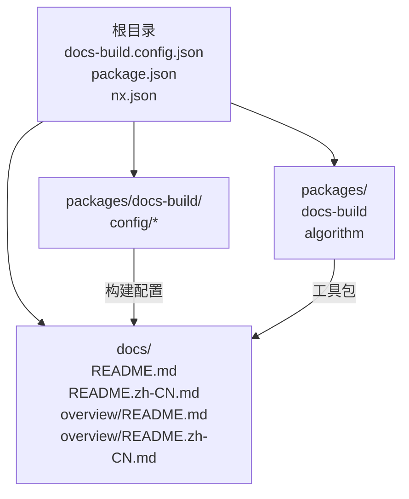
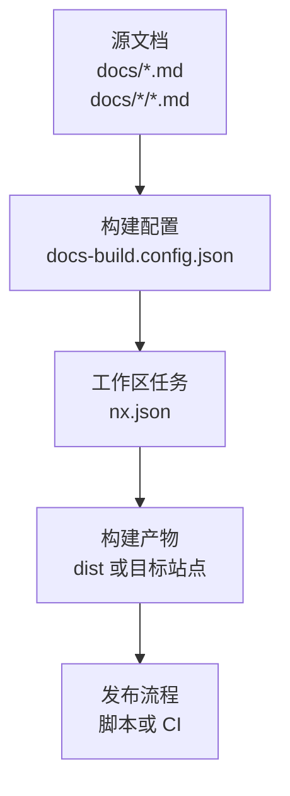
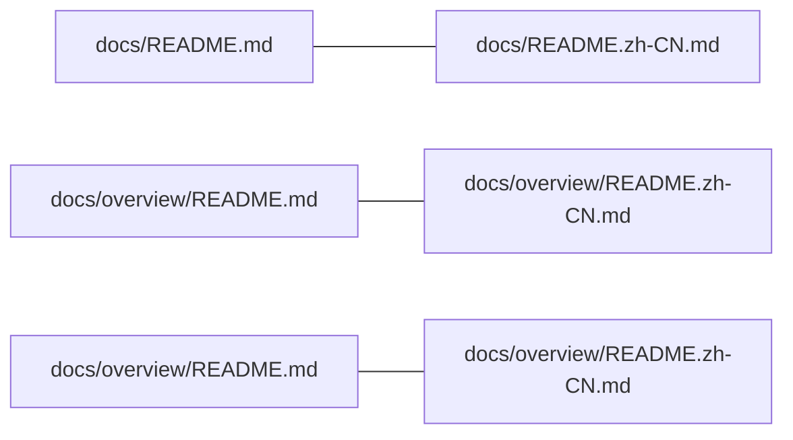
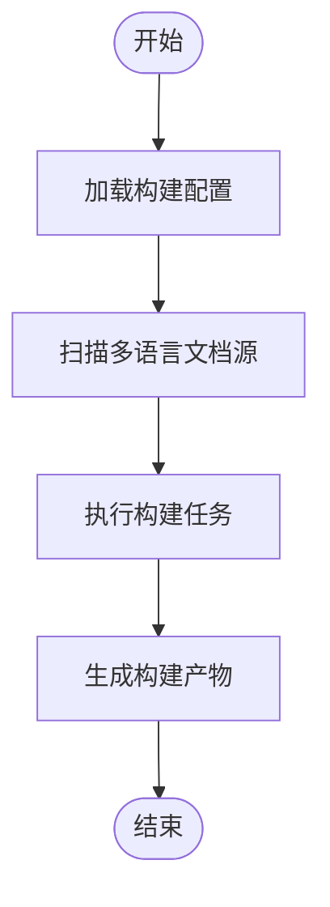
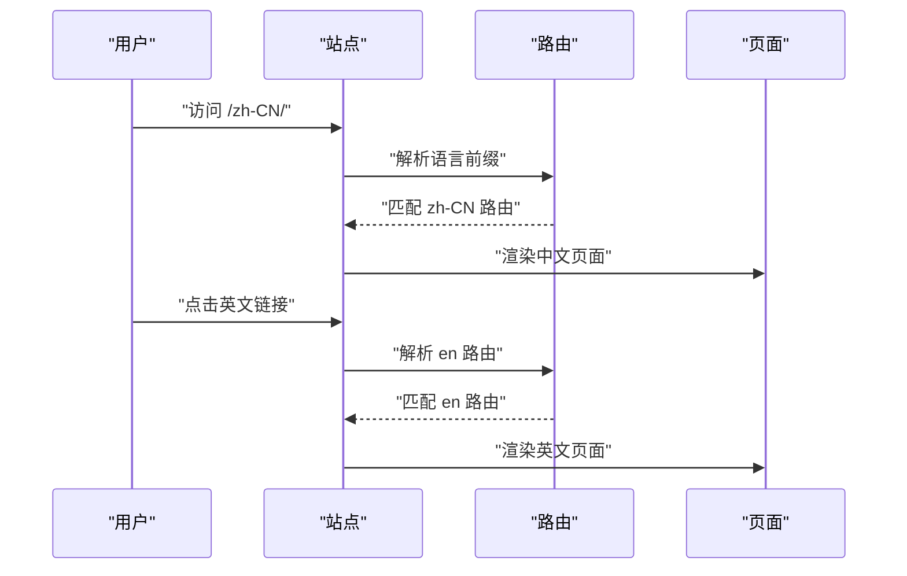
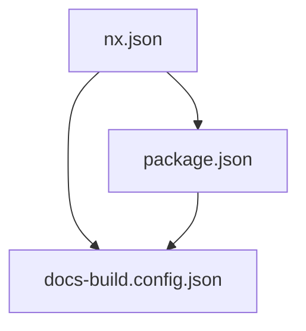

# 多语言配置

<cite>
**本文引用的文件**
- [docs-build.config.json](file://docs-build.config.json)
- [package.json](file://package.json)
- [nx.json](file://nx.json)
- [README.md](file://README.md)
- [README.zh-CN.md](file://README.zh-CN.md)
- [docs/overview/README.md](file://docs/overview/README.md)
- [docs/overview/README.zh-CN.md](file://docs/overview/README.zh-CN.md)
- [docs/README.md](file://docs/README.md)
- [docs/README.zh-CN.md](file://docs/README.zh-CN.md)
</cite>

## 目录
1. [简介](#简介)
2. [项目结构](#项目结构)
3. [核心组件](#核心组件)
4. [架构总览](#架构总览)
5. [详细组件分析](#详细组件分析)
6. [依赖分析](#依赖分析)
7. [性能考虑](#性能考虑)
8. [故障排查指南](#故障排查指南)
9. [结论](#结论)
10. [附录](#附录)

## 简介
本文件围绕文档构建工具的多语言配置进行系统化说明，重点解释多语言站点的配置思路与落地方式，涵盖语言切换设置、本地化资源管理、国际化路由配置等主题。当前仓库采用“多语言文件并存”的静态文档组织方式，通过在不同路径下维护同名但语言不同的 Markdown 文件实现多语言内容管理。本文将基于现有仓库结构，给出可操作的配置建议与最佳实践。

## 项目结构
仓库采用 Monorepo 结构，核心与文档构建相关的配置集中在根目录与 packages/docs-build 目录中；文档内容分布在 docs 及其子目录中，并以语言后缀区分（如 .zh-CN.md）。整体结构如下图所示：

图表来源
- [docs-build.config.json](file://docs-build.config.json)
- [README.md](file://README.md)
- [README.zh-CN.md](file://README.zh-CN.md)
- [docs/overview/README.md](file://docs/overview/README.md)
- [docs/overview/README.zh-CN.md](file://docs/overview/README.zh-CN.md)

章节来源
- [docs-build.config.json](file://docs-build.config.json)
- [README.md](file://README.md)
- [README.zh-CN.md](file://README.zh-CN.md)
- [docs/overview/README.md](file://docs/overview/README.md)
- [docs/overview/README.zh-CN.md](file://docs/overview/README.zh-CN.md)

## 核心组件
- 文档构建配置：通过根目录的配置文件定义构建行为、输出路径、语言相关参数等。
- 多语言文档源：在 docs 及子目录中按语言后缀维护同名文件，形成“同名多语言”布局。
- 工作空间与任务编排：通过工作区配置与任务定义，协调多语言内容的生成与发布流程。

章节来源
- [docs-build.config.json](file://docs-build.config.json)
- [package.json](file://package.json)
- [nx.json](file://nx.json)

## 架构总览
下图展示了多语言文档从源文件到构建产物的整体流程，以及与工作区任务的关系：

图表来源
- [docs-build.config.json](file://docs-build.config.json)
- [nx.json](file://nx.json)

## 详细组件分析

### 多语言文档组织与命名规范
- 同名多语言文件：在 docs 与 docs/overview 下分别提供英文与中文版本的 README 文件，形成清晰的对照关系。
- 命名约定：以 .zh-CN.md 结尾表示简体中文版本，其余为英文版本。
- 维护策略：新增或修改内容时，需同步更新所有语言版本，确保一致性。

图表来源
- [docs/README.md](file://docs/README.md)
- [docs/README.zh-CN.md](file://docs/README.zh-CN.md)
- [docs/overview/README.md](file://docs/overview/README.md)
- [docs/overview/README.zh-CN.md](file://docs/overview/README.zh-CN.md)

章节来源
- [docs/README.md](file://docs/README.md)
- [docs/README.zh-CN.md](file://docs/README.zh-CN.md)
- [docs/overview/README.md](file://docs/overview/README.md)
- [docs/overview/README.zh-CN.md](file://docs/overview/README.zh-CN.md)

### 文档构建配置要点
- 配置入口：通过根目录的构建配置文件集中定义构建规则与语言相关参数。
- 输出路径：明确构建产物的输出位置，便于后续发布或集成。
- 任务编排：结合工作区任务定义，实现多语言内容的批量处理与发布。

图表来源
- [docs-build.config.json](file://docs-build.config.json)
- [nx.json](file://nx.json)

章节来源
- [docs-build.config.json](file://docs-build.config.json)
- [nx.json](file://nx.json)

### 国际化路由与语言切换（概念性说明）
- 路由设计：在多语言站点中，通常通过路径前缀或域名分域区分语言版本。例如 /zh-CN/... 与 /en/...。
- 语言切换：提供语言选择器，点击后跳转至对应语言的同名页面或首页。
- 内容映射：确保每个语言版本的页面与导航菜单项一一对应，避免内容错位。

（本图为概念性流程示意，不直接映射具体源文件）

### 多语言内容组织与维护策略
- 分层组织：将通用内容与语言特定内容分离，减少重复维护成本。
- 版本控制：使用分支或标签管理不同语言版本的变更历史。
- 自动化校验：在 CI 中增加一致性检查，确保各语言版本的标题、链接与结构保持一致。

（本节为通用策略说明，不直接分析具体文件）

## 依赖分析
- 工作区与任务：通过工作区配置统一管理多包与任务，便于在多语言场景下批量执行构建与发布。
- 包依赖：各包的依赖关系影响构建顺序与产物生成，需在多语言环境下保持一致。

图表来源
- [nx.json](file://nx.json)
- [package.json](file://package.json)
- [docs-build.config.json](file://docs-build.config.json)

章节来源
- [nx.json](file://nx.json)
- [package.json](file://package.json)
- [docs-build.config.json](file://docs-build.config.json)

## 性能考虑
- 构建缓存：利用工作区缓存机制减少重复构建时间，提升多语言站点的迭代效率。
- 资源压缩：对构建产物进行压缩与去重，降低带宽占用。
- 懒加载：对非首屏内容采用懒加载策略，改善页面加载速度。

（本节为通用指导，不直接分析具体文件）

## 故障排查指南
- 内容不一致：若发现某语言版本缺失或标题不一致，应检查对应文件是否存在且命名是否正确。
- 构建失败：查看构建日志中的错误信息，确认配置文件路径与任务名称是否正确。
- 发布异常：核对发布脚本与 CI 配置，确保多语言产物被正确上传与覆盖。

章节来源
- [docs-build.config.json](file://docs-build.config.json)
- [nx.json](file://nx.json)

## 结论
本仓库采用“同名多语言文件”的静态文档组织方式，配合工作区任务与构建配置，能够高效地维护与发布多语言站点。建议在现有基础上进一步完善国际化路由与语言切换机制，并在 CI 中加入一致性校验，以保障多语言内容的质量与体验。

## 附录

### 多语言配置示例（中英文双语站点）
- 文档源组织
  - 在 docs 与 docs/overview 下分别提供英文与中文版本的 README 文件，确保同名文件一一对应。
- 构建配置
  - 在根目录的构建配置文件中定义构建规则与输出路径，确保多语言内容被正确识别与生成。
- 工作区任务
  - 在工作区任务中添加多语言构建与发布的步骤，实现一键式批量处理。

章节来源
- [docs/README.md](file://docs/README.md)
- [docs/README.zh-CN.md](file://docs/README.zh-CN.md)
- [docs/overview/README.md](file://docs/overview/README.md)
- [docs/overview/README.zh-CN.md](file://docs/overview/README.zh-CN.md)
- [docs-build.config.json](file://docs-build.config.json)
- [nx.json](file://nx.json)