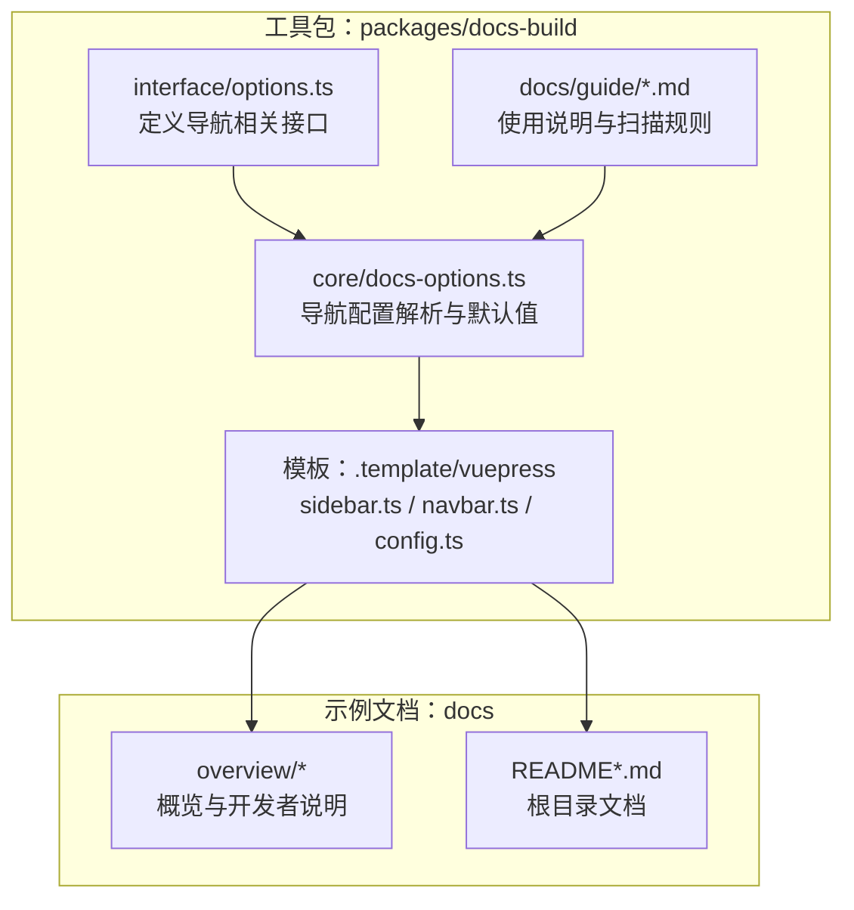
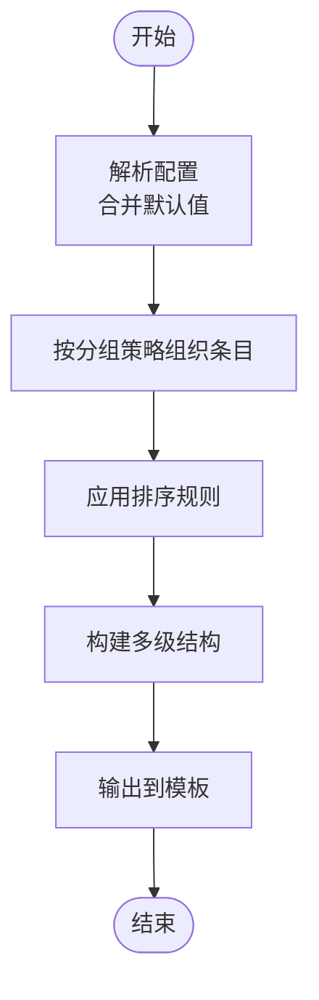
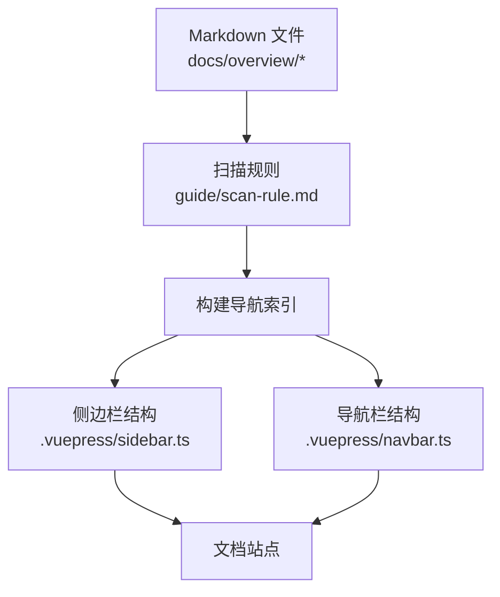
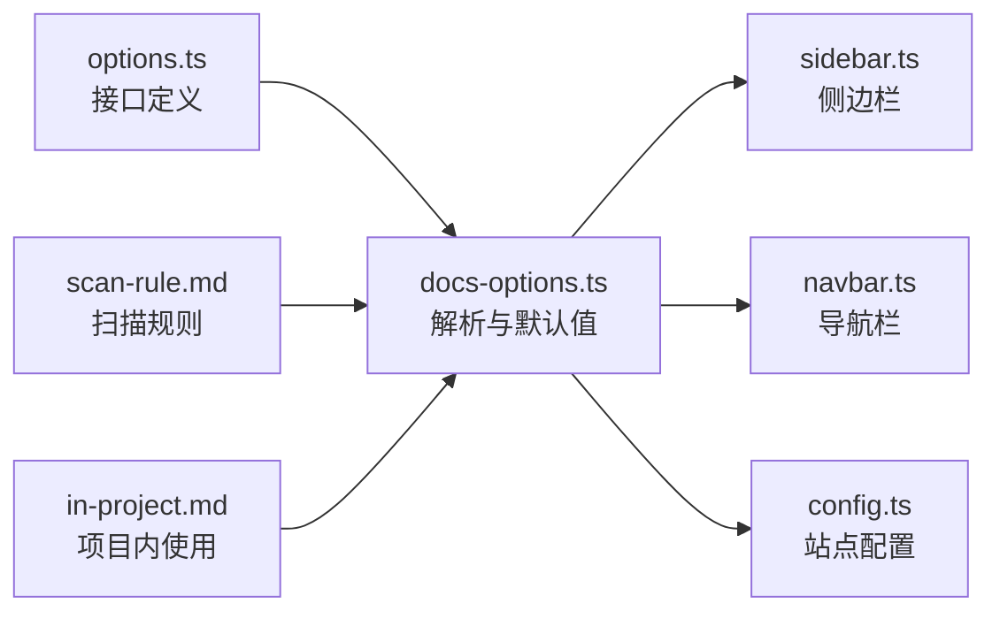

# 导航配置

<cite>
**本文引用的文件**
- [packages/docs-build/src/interface/options.ts](file://packages/docs-build/src/interface/options.ts)
- [packages/docs-build/src/core/docs-options.ts](file://packages/docs-build/src/core/docs-options.ts)
- [packages/docs-build/.template/vuepress/src/.vuepress/sidebar.ts](file://packages/docs-build/.template/vuepress/src/.vuepress/sidebar.ts)
- [packages/docs-build/.template/vuepress/src/.vuepress/navbar.ts](file://packages/docs-build/.template/vuepress/src/.vuepress/navbar.ts)
- [packages/docs-build/.template/vuepress/src/.vuepress/config.ts](file://packages/docs-build/.template/vuepress/src/.vuepress/config.ts)
- [packages/docs-build/docs/guide/scan-rule.md](file://packages/docs-build/docs/guide/scan-rule.md)
- [packages/docs-build/docs/guide/in-project.md](file://packages/docs-build/docs/guide/in-project.md)
- [docs/overview/README.md](file://docs/overview/README.md)
- [docs/README.md](file://docs/README.md)
- [docs/README.zh-CN.md](file://docs/README.zh-CN.md)
- [docs/overview/README.zh-CN.md](file://docs/overview/README.zh-CN.md)
- [docs/overview/to-developer.md](file://docs/overview/to-developer.md)
</cite>

## 目录
1. [简介](#简介)
2. [项目结构](#项目结构)
3. [核心组件](#核心组件)
4. [架构总览](#架构总览)
5. [详细组件分析](#详细组件分析)
6. [依赖关系分析](#依赖关系分析)
7. [性能考虑](#性能考虑)
8. [故障排查指南](#故障排查指南)
9. [结论](#结论)
10. [附录](#附录)

## 简介
本章节面向“文档构建工具”的导航配置，系统性阐述 NavigationOptions 接口的配置项与实践方法，涵盖侧边栏、导航栏、面包屑等关键能力；说明如何构建多级导航结构、配置导航分组与排序规则；给出不同导航布局的示例思路；解释导航配置与 Markdown 文件结构之间的映射关系；并总结导航优化技巧与用户体验最佳实践。

## 项目结构
该仓库包含一个用于文档构建的工具包（packages/docs-build），以及若干示例文档（docs）。工具包内提供了 VuePress 模板（.template/vuepress）及核心配置接口与实现，可作为导航配置的参考来源。



**图示来源**
- [packages/docs-build/src/interface/options.ts](file://packages/docs-build/src/interface/options.ts)
- [packages/docs-build/src/core/docs-options.ts](file://packages/docs-build/src/core/docs-options.ts)
- [packages/docs-build/.template/vuepress/src/.vuepress/sidebar.ts](file://packages/docs-build/.template/vuepress/src/.vuepress/sidebar.ts)
- [packages/docs-build/.template/vuepress/src/.vuepress/navbar.ts](file://packages/docs-build/.template/vuepress/src/.vuepress/navbar.ts)
- [packages/docs-build/.template/vuepress/src/.vuepress/config.ts](file://packages/docs-build/.template/vuepress/src/.vuepress/config.ts)
- [packages/docs-build/docs/guide/scan-rule.md](file://packages/docs-build/docs/guide/scan-rule.md)
- [packages/docs-build/docs/guide/in-project.md](file://packages/docs-build/docs/guide/in-project.md)
- [docs/overview/README.md](file://docs/overview/README.md)
- [docs/README.md](file://docs/README.md)
- [docs/README.zh-CN.md](file://docs/README.zh-CN.md)
- [docs/overview/README.zh-CN.md](file://docs/overview/README.zh-CN.md)
- [docs/overview/to-developer.md](file://docs/overview/to-developer.md)

**章节来源**
- [packages/docs-build/src/interface/options.ts](file://packages/docs-build/src/interface/options.ts)
- [packages/docs-build/src/core/docs-options.ts](file://packages/docs-build/src/core/docs-options.ts)
- [packages/docs-build/.template/vuepress/src/.vuepress/sidebar.ts](file://packages/docs-build/.template/vuepress/src/.vuepress/sidebar.ts)
- [packages/docs-build/.template/vuepress/src/.vuepress/navbar.ts](file://packages/docs-build/.template/vuepress/src/.vuepress/navbar.ts)
- [packages/docs-build/.template/vuepress/src/.vuepress/config.ts](file://packages/docs-build/.template/vuepress/src/.vuepress/config.ts)
- [packages/docs-build/docs/guide/scan-rule.md](file://packages/docs-build/docs/guide/scan-rule.md)
- [packages/docs-build/docs/guide/in-project.md](file://packages/docs-build/docs/guide/in-project.md)
- [docs/overview/README.md](file://docs/overview/README.md)
- [docs/README.md](file://docs/README.md)
- [docs/README.zh-CN.md](file://docs/README.zh-CN.md)
- [docs/overview/README.zh-CN.md](file://docs/overview/README.zh-CN.md)
- [docs/overview/to-developer.md](file://docs/overview/to-developer.md)

## 核心组件
- NavigationOptions 接口：定义导航相关的配置项，如侧边栏、导航栏、面包屑、分组与排序等。
- docs-options 解析器：负责将配置转换为实际可用的导航数据结构，并提供默认值与校验逻辑。
- VuePress 模板：提供 sidebar.ts、navbar.ts、config.ts 的示例，展示导航配置在实际主题中的落地方式。
- 使用指南：scan-rule 与 in-project 文档说明了扫描规则与项目内使用方式，间接影响导航生成策略。

**章节来源**
- [packages/docs-build/src/interface/options.ts](file://packages/docs-build/src/interface/options.ts)
- [packages/docs-build/src/core/docs-options.ts](file://packages/docs-build/src/core/docs-options.ts)
- [packages/docs-build/.template/vuepress/src/.vuepress/sidebar.ts](file://packages/docs-build/.template/vuepress/src/.vuepress/sidebar.ts)
- [packages/docs-build/.template/vuepress/src/.vuepress/navbar.ts](file://packages/docs-build/.template/vuepress/src/.vuepress/navbar.ts)
- [packages/docs-build/.template/vuepress/src/.vuepress/config.ts](file://packages/docs-build/.template/vuepress/src/.vuepress/config.ts)
- [packages/docs-build/docs/guide/scan-rule.md](file://packages/docs-build/docs/guide/scan-rule.md)
- [packages/docs-build/docs/guide/in-project.md](file://packages/docs-build/docs/guide/in-project.md)

## 架构总览
下图展示了从配置到渲染的关键流程：配置接口定义 → 配置解析与默认值处理 → 模板侧边栏/导航栏/面包屑生成 → 最终输出到文档站点。

```mermaid
sequenceDiagram
participant Dev as "开发者"
participant IF as "NavigationOptions 接口"
participant OPT as "docs-options 解析器"
participant TPL as "VuePress 模板"
participant Site as "文档站点"
Dev->>IF : 定义导航配置侧边栏/导航栏/面包屑
IF-->>OPT : 提供配置对象
OPT->>OPT : 解析/合并默认值/校验
OPT-->>TPL : 输出标准化导航数据
TPL->>Site : 渲染侧边栏/导航栏/面包屑
Site-->>Dev : 展示最终导航效果
```

**图示来源**
- [packages/docs-build/src/interface/options.ts](file://packages/docs-build/src/interface/options.ts)
- [packages/docs-build/src/core/docs-options.ts](file://packages/docs-build/src/core/docs-options.ts)
- [packages/docs-build/.template/vuepress/src/.vuepress/sidebar.ts](file://packages/docs-build/.template/vuepress/src/.vuepress/sidebar.ts)
- [packages/docs-build/.template/vuepress/src/.vuepress/navbar.ts](file://packages/docs-build/.template/vuepress/src/.vuepress/navbar.ts)
- [packages/docs-build/.template/vuepress/src/.vuepress/config.ts](file://packages/docs-build/.template/vuepress/src/.vuepress/config.ts)

## 详细组件分析

### NavigationOptions 接口与配置项
- 侧边栏（Sidebar）：支持多层级结构，允许按目录或文件进行分组；可设置分组标题、排序规则、折叠状态等。
- 导航栏（Navbar）：定义顶部导航项，支持多级菜单与外部链接；可设置图标、文字与跳转目标。
- 面包屑（Breadcrumb）：根据当前页面路径自动或手动生成层级导航，便于快速定位。
- 分组与排序：通过权重、优先级或自定义函数对条目进行排序；支持按语言或主题分组。
- 路径与匹配：支持通配符与正则匹配，确保导航与 Markdown 文件结构一致。

上述能力由接口定义与解析器共同实现，解析器负责将配置标准化并提供默认值，模板侧将其渲染为 VuePress 的 sidebar.ts/navbar.ts/config.ts。

**章节来源**
- [packages/docs-build/src/interface/options.ts](file://packages/docs-build/src/interface/options.ts)
- [packages/docs-build/src/core/docs-options.ts](file://packages/docs-build/src/core/docs-options.ts)

### 多级导航结构与分组
- 多级结构：通过嵌套数组或对象形式表达层级关系，子项可继续包含子项，形成树形导航。
- 分组策略：按目录分组时，可将同一目录下的多个 Markdown 文件归为一组；按功能或模块分组时，可跨目录聚合。
- 排序规则：可基于名称、权重、创建时间或自定义函数排序；解析器会统一处理排序逻辑。



**图示来源**
- [packages/docs-build/src/core/docs-options.ts](file://packages/docs-build/src/core/docs-options.ts)

**章节来源**
- [packages/docs-build/src/core/docs-options.ts](file://packages/docs-build/src/core/docs-options.ts)

### 导航配置与 Markdown 文件结构的关系
- 目录与文件对应：侧边栏通常与 docs 目录结构一一对应，文件名与标题决定导航显示文本。
- 命名规范：建议采用清晰的命名与层级，避免过深的嵌套；同级目录下避免重名。
- 扫描规则：工具会扫描指定目录，识别 Markdown 文件并生成导航；扫描规则可在指南中查阅。



**图示来源**
- [packages/docs-build/docs/guide/scan-rule.md](file://packages/docs-build/docs/guide/scan-rule.md)
- [packages/docs-build/.template/vuepress/src/.vuepress/sidebar.ts](file://packages/docs-build/.template/vuepress/src/.vuepress/sidebar.ts)
- [packages/docs-build/.template/vuepress/src/.vuepress/navbar.ts](file://packages/docs-build/.template/vuepress/src/.vuepress/navbar.ts)
- [docs/overview/README.md](file://docs/overview/README.md)
- [docs/README.md](file://docs/README.md)
- [docs/README.zh-CN.md](file://docs/README.zh-CN.md)
- [docs/overview/README.zh-CN.md](file://docs/overview/README.zh-CN.md)
- [docs/overview/to-developer.md](file://docs/overview/to-developer.md)

**章节来源**
- [packages/docs-build/docs/guide/scan-rule.md](file://packages/docs-build/docs/guide/scan-rule.md)
- [packages/docs-build/.template/vuepress/src/.vuepress/sidebar.ts](file://packages/docs-build/.template/vuepress/src/.vuepress/sidebar.ts)
- [packages/docs-build/.template/vuepress/src/.vuepress/navbar.ts](file://packages/docs-build/.template/vuepress/src/.vuepress/navbar.ts)
- [docs/overview/README.md](file://docs/overview/README.md)
- [docs/README.md](file://docs/README.md)
- [docs/README.zh-CN.md](file://docs/README.zh-CN.md)
- [docs/overview/README.zh-CN.md](file://docs/overview/README.zh-CN.md)
- [docs/overview/to-developer.md](file://docs/overview/to-developer.md)

### 不同类型的导航布局示例（思路）
- 左侧固定侧边栏：适合大型文档，提供全局导航；可通过分组与排序提升可发现性。
- 顶部主导航 + 二级侧边栏：顶部导航聚焦大类，侧边栏聚焦具体章节。
- 面包屑 + 右侧目录：移动端友好，结合右侧目录快速跳转。
- 多语言分栏：按语言分组，分别维护导航结构，保持一致性。

以上布局均以标准化的 NavigationOptions 为基础，通过模板渲染实现。

**章节来源**
- [packages/docs-build/src/interface/options.ts](file://packages/docs-build/src/interface/options.ts)
- [packages/docs-build/.template/vuepress/src/.vuepress/sidebar.ts](file://packages/docs-build/.template/vuepress/src/.vuepress/sidebar.ts)
- [packages/docs-build/.template/vuepress/src/.vuepress/navbar.ts](file://packages/docs-build/.template/vuepress/src/.vuepress/navbar.ts)

## 依赖关系分析
- 接口层（options.ts）定义配置契约，约束后续解析与渲染。
- 解析层（docs-options.ts）负责配置的合并、默认值注入与校验。
- 模板层（sidebar.ts/navbar.ts/config.ts）将解析后的数据渲染为 VuePress 主题所需的结构。
- 使用指南（scan-rule.md/in-project.md）指导扫描与集成方式，间接影响导航生成。



**图示来源**
- [packages/docs-build/src/interface/options.ts](file://packages/docs-build/src/interface/options.ts)
- [packages/docs-build/src/core/docs-options.ts](file://packages/docs-build/src/core/docs-options.ts)
- [packages/docs-build/.template/vuepress/src/.vuepress/sidebar.ts](file://packages/docs-build/.template/vuepress/src/.vuepress/sidebar.ts)
- [packages/docs-build/.template/vuepress/src/.vuepress/navbar.ts](file://packages/docs-build/.template/vuepress/src/.vuepress/navbar.ts)
- [packages/docs-build/.template/vuepress/src/.vuepress/config.ts](file://packages/docs-build/.template/vuepress/src/.vuepress/config.ts)
- [packages/docs-build/docs/guide/scan-rule.md](file://packages/docs-build/docs/guide/scan-rule.md)
- [packages/docs-build/docs/guide/in-project.md](file://packages/docs-build/docs/guide/in-project.md)

**章节来源**
- [packages/docs-build/src/interface/options.ts](file://packages/docs-build/src/interface/options.ts)
- [packages/docs-build/src/core/docs-options.ts](file://packages/docs-build/src/core/docs-options.ts)
- [packages/docs-build/.template/vuepress/src/.vuepress/sidebar.ts](file://packages/docs-build/.template/vuepress/src/.vuepress/sidebar.ts)
- [packages/docs-build/.template/vuepress/src/.vuepress/navbar.ts](file://packages/docs-build/.template/vuepress/src/.vuepress/navbar.ts)
- [packages/docs-build/.template/vuepress/src/.vuepress/config.ts](file://packages/docs-build/.template/vuepress/src/.vuepress/config.ts)
- [packages/docs-build/docs/guide/scan-rule.md](file://packages/docs-build/docs/guide/scan-rule.md)
- [packages/docs-build/docs/guide/in-project.md](file://packages/docs-build/docs/guide/in-project.md)

## 性能考虑
- 减少深度嵌套：层级过深会增加渲染与交互成本，建议控制在合理范围内。
- 合理分组：按业务域或功能域分组，避免单个分组包含过多条目。
- 缓存与懒加载：在站点层面启用缓存与懒加载策略，提升导航切换速度。
- 避免重复扫描：确保扫描规则只覆盖必要目录，减少不必要的文件遍历。

## 故障排查指南
- 导航缺失或错位：检查 Markdown 文件命名与目录结构是否符合扫描规则；确认配置中分组与排序是否正确。
- 多语言不一致：核对多语言配置与模板渲染逻辑，确保各语言版本的导航结构一致。
- 排序异常：检查排序字段或函数是否正确；确认默认值是否被意外覆盖。
- 模板未生效：确认解析器已输出标准化数据，且模板文件已正确引用。

**章节来源**
- [packages/docs-build/docs/guide/scan-rule.md](file://packages/docs-build/docs/guide/scan-rule.md)
- [packages/docs-build/src/core/docs-options.ts](file://packages/docs-build/src/core/docs-options.ts)
- [packages/docs-build/.template/vuepress/src/.vuepress/sidebar.ts](file://packages/docs-build/.template/vuepress/src/.vuepress/sidebar.ts)
- [packages/docs-build/.template/vuepress/src/.vuepress/navbar.ts](file://packages/docs-build/.template/vuepress/src/.vuepress/navbar.ts)

## 结论
通过标准化的 NavigationOptions 接口与解析器，结合 VuePress 模板，可以高效地构建多级、分组、排序合理的导航体系。配合清晰的 Markdown 文件结构与扫描规则，能够稳定输出高质量的导航体验。建议在实践中持续优化分组与排序策略，并关注性能与多语言一致性。

## 附录
- 项目内使用指南与扫描规则请参阅相应文档。
- 示例文档（docs/overview 与 docs 根目录）可用于验证导航生成效果。

**章节来源**
- [packages/docs-build/docs/guide/scan-rule.md](file://packages/docs-build/docs/guide/scan-rule.md)
- [packages/docs-build/docs/guide/in-project.md](file://packages/docs-build/docs/guide/in-project.md)
- [docs/overview/README.md](file://docs/overview/README.md)
- [docs/README.md](file://docs/README.md)
- [docs/README.zh-CN.md](file://docs/README.zh-CN.md)
- [docs/overview/README.zh-CN.md](file://docs/overview/README.zh-CN.md)
- [docs/overview/to-developer.md](file://docs/overview/to-developer.md)