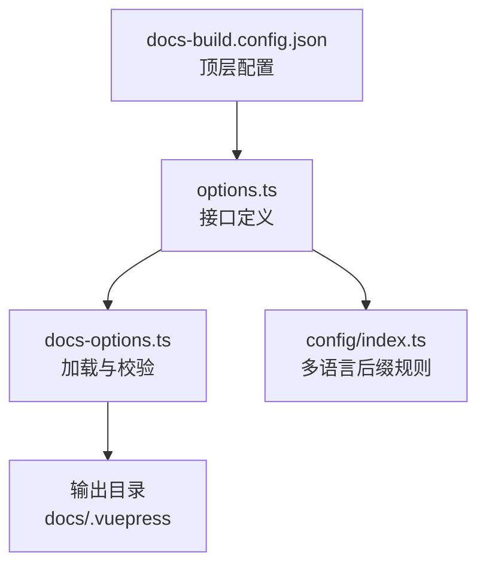
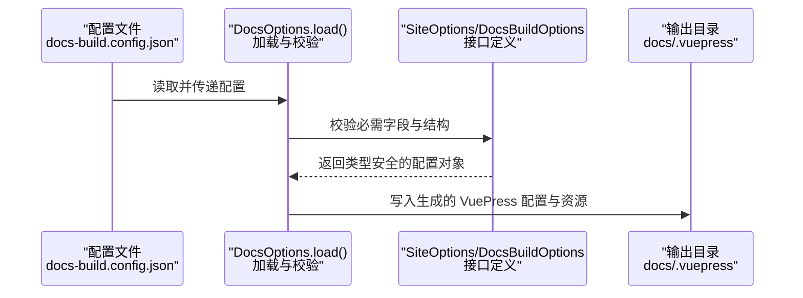

# 站点配置

<cite>
**本文引用的文件**
- [docs-build.config.json](file://docs-build.config.json)
- [options.ts](file://packages/docs-build/src/interface/options.ts)
- [docs-options.ts](file://packages/docs-build/src/core/docs-options.ts)
- [index.ts](file://packages/docs-build/src/config/index.ts)
</cite>

## 目录
1. [简介](#简介)
2. [项目结构](#项目结构)
3. [核心组件](#核心组件)
4. [架构总览](#架构总览)
5. [详细组件分析](#详细组件分析)
6. [依赖分析](#依赖分析)
7. [性能考虑](#性能考虑)
8. [故障排查指南](#故障排查指南)
9. [结论](#结论)
10. [附录](#附录)

## 简介
本章节面向使用文档构建工具的站点配置需求，系统性阐述 SiteOptions 接口及其相关配置项，涵盖站点基本信息、元数据、基础路径、主语言、仓库地址等，并结合项目中的真实配置示例，说明各配置项的数据类型、默认来源与实际作用。同时给出配置项之间的依赖关系、约束条件以及常见场景的最佳实践与优化建议。

## 项目结构
围绕“站点配置”的关键文件与职责如下：
- 文档构建配置：docs-build.config.json 提供站点元信息、导航与输出目录等顶层配置。
- 类型定义：packages/docs-build/src/interface/options.ts 定义了 SiteOptions、NavigationOptions、DocsBuildOptions 等核心接口。
- 配置加载与校验：packages/docs-build/src/core/docs-options.ts 实现配置文件的读取与强制校验逻辑。
- 多语言后缀：packages/docs-build/src/config/index.ts 提供单语言模式下的文件后缀匹配规则。

图表来源
- [docs-build.config.json:1-184](file://docs-build.config.json#L1-L184)
- [options.ts:16-84](file://packages/docs-build/src/interface/options.ts#L16-L84)
- [docs-options.ts:10-67](file://packages/docs-build/src/core/docs-options.ts#L10-L67)
- [index.ts:1-10](file://packages/docs-build/src/config/index.ts#L1-L10)

章节来源
- [docs-build.config.json:1-184](file://docs-build.config.json#L1-L184)
- [options.ts:16-84](file://packages/docs-build/src/interface/options.ts#L16-L84)
- [docs-options.ts:10-67](file://packages/docs-build/src/core/docs-options.ts#L10-L67)
- [index.ts:1-10](file://packages/docs-build/src/config/index.ts#L1-L10)

## 核心组件
本节聚焦 SiteOptions 接口的全部配置项，逐项说明其用途、数据类型、默认来源与实际作用，并结合项目示例进行说明。

- 字段：title
  - 类型：可选字符串
  - 默认来源：未在配置中提供时，将从 package.json 的 name 字段推断（由工具内部逻辑决定）
  - 作用：站点标题，通常用于页面标题、浏览器标签页、搜索引擎结果等
  - 示例参考：docs-build.config.json 中的站点标题字段
  - 章节来源
    - [options.ts:21-36](file://packages/docs-build/src/interface/options.ts#L21-L36)
    - [docs-build.config.json:6](file://docs-build.config.json#L6)

- 字段：description
  - 类型：可选字符串
  - 默认来源：未在配置中提供时，将从 package.json 的 description 字段推断（由工具内部逻辑决定）
  - 作用：站点描述，常用于 SEO 元描述、社交分享摘要等
  - 示例参考：docs-build.config.json 中的站点描述字段
  - 章节来源
    - [options.ts:21-36](file://packages/docs-build/src/interface/options.ts#L21-L36)
    - [docs-build.config.json:7](file://docs-build.config.json#L7)

- 字段：base
  - 类型：可选字符串
  - 默认值："/"
  - 作用：VuePress 的基础路径（base），用于部署在子路径或自定义域名时的路由前缀
  - 示例参考：docs-build.config.json 中的 base 字段
  - 章节来源
    - [options.ts:21-36](file://packages/docs-build/src/interface/options.ts#L21-L36)
    - [docs-build.config.json:4](file://docs-build.config.json#L4)

- 字段：lang
  - 类型：必填字符串
  - 默认值：未在接口中定义默认值，需显式提供
  - 作用：主语言标识，影响页面语言、多语言切换与内容组织
  - 示例参考：docs-build.config.json 中的 lang 字段
  - 章节来源
    - [options.ts:21-36](file://packages/docs-build/src/interface/options.ts#L21-L36)
    - [docs-build.config.json:5](file://docs-build.config.json#L5)

- 字段：repo
  - 类型：可选字符串
  - 默认来源：未在配置中提供时，将自动从 git remote 提取（由工具内部逻辑决定）
  - 作用：仓库地址，常用于主题中的“编辑此页”“前往仓库”等链接
  - 章节来源
    - [options.ts:21-36](file://packages/docs-build/src/interface/options.ts#L21-L36)
    - [docs-build.config.json:34](file://docs-build.config.json#L34)

- 字段：locales.languages
  - 类型：必填数组（字符串）
  - 作用：启用的语言列表，如 ["en-US", "zh-CN"]；未提供则视为单语言
  - 章节来源
    - [options.ts:53-56](file://packages/docs-build/src/interface/options.ts#L53-L56)
    - [docs-build.config.json:9-11](file://docs-build.config.json#L9-L11)

- 字段：output
  - 类型：可选字符串
  - 默认值：未在接口中定义默认值，但配置文件示例为 "./docs/.vuepress"
  - 作用：输出目录，用于存放生成的 VuePress 配置与静态资源
  - 章节来源
    - [options.ts:82-83](file://packages/docs-build/src/interface/options.ts#L82-L83)
    - [docs-build.config.json:12](file://docs-build.config.json#L12)

- 字段：baseSourceDir
  - 类型：必填字符串
  - 作用：源 Markdown 路径前缀，用于路径映射（例如 docs/guide/README.md 映射到 /guide/）
  - 章节来源
    - [options.ts:68](file://packages/docs-build/src/interface/options.ts#L68)
    - [docs-build.config.json:2](file://docs-build.config.json#L2)

- 字段：navigation.navbar
  - 类型：必填数组（导航项）
  - 作用：导航栏配置，支持文本、链接、图标与子菜单
  - 章节来源
    - [options.ts:8-14](file://packages/docs-build/src/interface/options.ts#L8-L14)
    - [docs-build.config.json:13-101](file://docs-build.config.json#L13-L101)

- 字段：navigation.sidebar
  - 类型：必填对象（键为路由路径前缀，值为侧边栏条目数组）
  - 作用：按路径前缀分组的侧边栏配置
  - 章节来源
    - [options.ts:8-14](file://packages/docs-build/src/interface/options.ts#L8-L14)
    - [docs-build.config.json:102-181](file://docs-build.config.json#L102-L181)

- 字段：appearance.styleDir
  - 类型：可选字符串
  - 作用：用户自定义样式目录，同名文件可覆盖内置默认样式
  - 章节来源
    - [options.ts:43-46](file://packages/docs-build/src/interface/options.ts#L43-L46)

## 架构总览
下图展示了从配置文件到最终输出的处理流程，以及 SiteOptions 在整体配置中的位置与依赖关系。

图表来源
- [docs-build.config.json:1-184](file://docs-build.config.json#L1-L184)
- [docs-options.ts:17-66](file://packages/docs-build/src/core/docs-options.ts#L17-L66)
- [options.ts:16-84](file://packages/docs-build/src/interface/options.ts#L16-L84)

章节来源
- [docs-build.config.json:1-184](file://docs-build.config.json#L1-L184)
- [docs-options.ts:17-66](file://packages/docs-build/src/core/docs-options.ts#L17-L66)
- [options.ts:16-84](file://packages/docs-build/src/interface/options.ts#L16-L84)

## 详细组件分析

### SiteOptions 字段详解与最佳实践
- 数据类型与默认来源
  - title/description/repo：若未在配置中提供，工具会尝试从 package.json 或 git remote 自动提取，以减少重复配置
  - base：默认为 "/"
  - lang：必须显式提供，建议与 locales.languages 对齐
  - locales.languages：未提供时视为单语言；提供后需与内容文件命名后缀一致（如 en-US、zh-CN）
  - output：未提供时可采用默认输出目录，便于与 CI/CD 流程集成
- 实际作用
  - title/description：直接影响页面标题与 SEO 元数据
  - base：影响所有路由与静态资源路径，部署在子路径时务必正确设置
  - lang：影响主题语言、日期格式、分词与搜索等
  - repo：为主题提供仓库入口，便于用户跳转与贡献
- 配置示例路径
  - 基础站点信息示例：参见 docs-build.config.json 中的 site 段落
  - 多语言与导航示例：参见 docs-build.config.json 中的 locales 与 navigation 段落
- 依赖关系与约束
  - baseSourceDir 必须存在且与导航/侧边栏的 link 路径保持一致
  - navigation.navbar 与 navigation.sidebar 必须同时提供，否则加载校验会失败
  - lang 与 locales.languages 应保持一致，避免运行时语言不匹配
- 最佳实践
  - 将 title/description/repo 等通用元信息集中维护，避免分散在多个地方
  - 使用明确的 base 值，确保静态资源与链接在不同部署环境下均能正确解析
  - 为多语言内容提供对应的文件命名后缀，并在 locales.languages 中声明
  - 将输出目录与 CI/CD 静态托管服务对接，确保自动化发布流程稳定

章节来源
- [options.ts:21-36](file://packages/docs-build/src/interface/options.ts#L21-L36)
- [options.ts:53-56](file://packages/docs-build/src/interface/options.ts#L53-L56)
- [options.ts:68](file://packages/docs-build/src/interface/options.ts#L68)
- [docs-build.config.json:2-12](file://docs-build.config.json#L2-L12)
- [docs-build.config.json:13-181](file://docs-build.config.json#L13-L181)

### 导航与侧边栏配置
- 导航栏（navbar）支持文本、链接、图标与子菜单，适合组织多层级内容
- 侧边栏（sidebar）以路径前缀为键，值为条目数组，便于按模块化组织文档
- 与 baseSourceDir 的映射关系：link 中的相对路径应与 baseSourceDir 配合，确保最终路由正确

章节来源
- [options.ts:8-14](file://packages/docs-build/src/interface/options.ts#L8-L14)
- [docs-build.config.json:13-181](file://docs-build.config.json#L13-L181)

### 多语言与文件后缀
- 单语言模式下，可通过 langFileSuffix 与 langFileSuffixes 进行后缀检测，辅助识别目标语言文件
- 多语言模式下，建议为每种语言提供独立的文件命名约定，并在 locales.languages 中声明

章节来源
- [index.ts:1-10](file://packages/docs-build/src/config/index.ts#L1-L10)
- [docs-build.config.json:9-11](file://docs-build.config.json#L9-L11)

## 依赖分析
- 组件耦合
  - DocsOptions.load 依赖 fs-extra 读取配置文件，并通过 validateConfig 强制校验关键字段
  - SiteOptions 作为 DocsBuildOptions 的一部分，被导航与外观配置所间接依赖
- 外部依赖
  - 配置文件格式为 JSON，需遵循严格的结构与字段要求
  - 语言与文件后缀规则依赖于配置中的 locales.languages 与文件命名约定
- 潜在循环依赖
  - 当前结构为单向依赖：配置文件 → 加载器 → 接口定义 → 输出，无循环依赖风险

图表来源
- [docs-options.ts:17-66](file://packages/docs-build/src/core/docs-options.ts#L17-L66)
- [options.ts:16-84](file://packages/docs-build/src/interface/options.ts#L16-L84)
- [docs-build.config.json:1-184](file://docs-build.config.json#L1-L184)

章节来源
- [docs-options.ts:17-66](file://packages/docs-build/src/core/docs-options.ts#L17-L66)
- [options.ts:16-84](file://packages/docs-build/src/interface/options.ts#L16-L84)
- [docs-build.config.json:1-184](file://docs-build.config.json#L1-L184)

## 性能考虑
- 减少不必要的多语言文件数量，避免生成体积过大
- 合理规划导航与侧边栏层级，降低页面渲染与路由切换开销
- 使用合适的 base 值，避免深层嵌套导致的路径解析复杂度上升
- 将输出目录与静态托管服务缓存策略配合，提升访问速度

## 故障排查指南
- 缺失必需字段
  - baseSourceDir、site、navigation.navbar、navigation.sidebar 为必需字段，缺失会导致加载失败
  - 章节来源
    - [docs-options.ts:39-65](file://packages/docs-build/src/core/docs-options.ts#L39-L65)
- 配置类型错误
  - 配置必须为 JSON 对象，且 site/navigation 为对象类型；否则抛出错误
  - 章节来源
    - [docs-options.ts:32-35](file://packages/docs-build/src/core/docs-options.ts#L32-L35)
- 路径映射不一致
  - baseSourceDir 与导航/侧边栏 link 不一致会导致路由无法正确解析
  - 章节来源
    - [options.ts:68](file://packages/docs-build/src/interface/options.ts#L68)
- 多语言不匹配
  - locales.languages 与文件命名后缀不一致会导致语言识别异常
  - 章节来源
    - [index.ts:4-7](file://packages/docs-build/src/config/index.ts#L4-L7)

## 结论
SiteOptions 是文档构建工具的核心配置入口，直接影响站点标题、描述、基础路径、语言与仓库地址等关键属性。结合导航与侧边栏配置，可形成完整的文档站点骨架。通过严格遵守字段约束、合理规划路径映射与多语言策略，并采用最佳实践优化输出与部署流程，可显著提升站点的可维护性与用户体验。

## 附录
- 完整配置示例路径
  - 站点基本信息与导航：参见 docs-build.config.json 的 site、locales、navigation 段落
  - 输出目录：参见 docs-build.config.json 的 output 字段
- 常见场景建议
  - 子路径部署：设置 base 为实际子路径，确保所有静态资源与链接正确解析
  - 多语言站点：在 locales.languages 中声明语言列表，并为每种语言提供对应的内容文件
  - 仓库入口：提供 repo 地址，便于主题显示“编辑此页”等交互功能

章节来源
- [docs-build.config.json:1-184](file://docs-build.config.json#L1-L184)
- [options.ts:16-84](file://packages/docs-build/src/interface/options.ts#L16-L84)
- [docs-options.ts:17-66](file://packages/docs-build/src/core/docs-options.ts#L17-L66)
- [index.ts:1-10](file://packages/docs-build/src/config/index.ts#L1-L10)