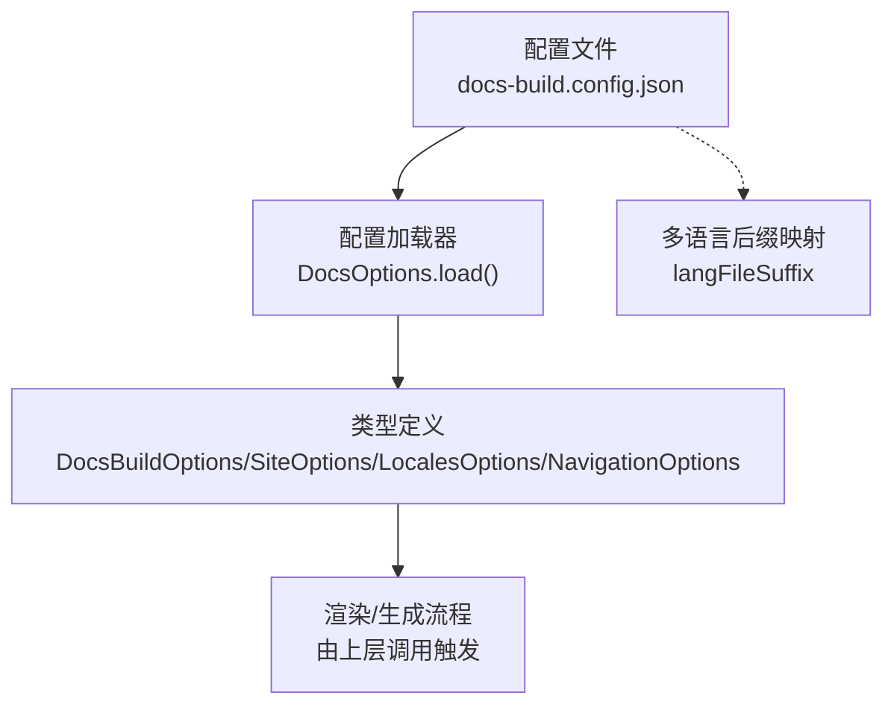
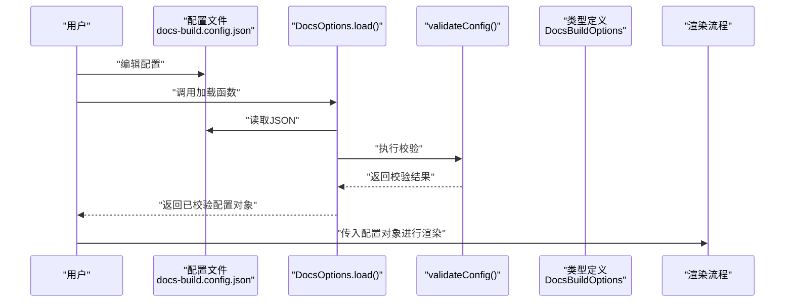
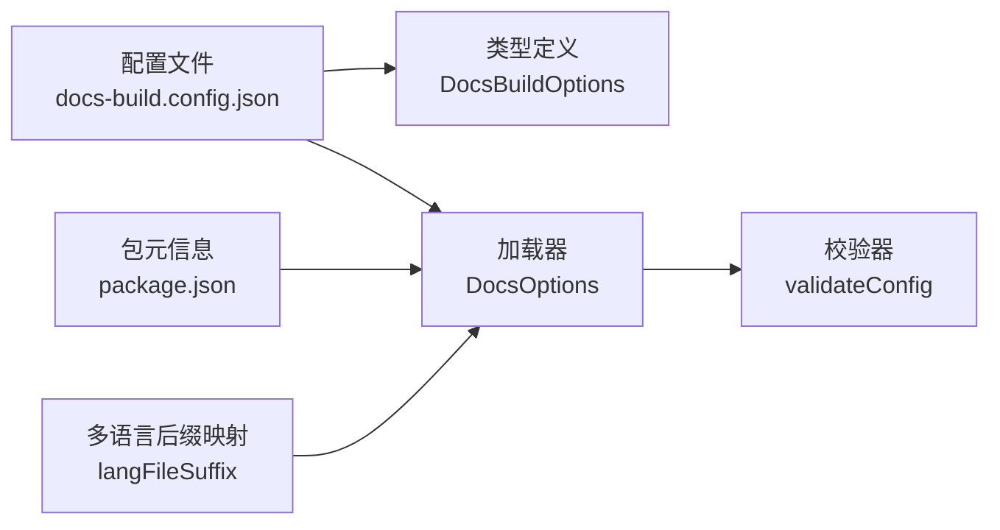

# 配置指南

<cite>
**本文引用的文件**
- [docs-build.config.json](file://docs-build.config.json)
- [options.ts](file://packages/docs-build/src/interface/options.ts)
- [vuepress-theme-hope.ts](file://packages/docs-build/src/interface/vuepress-theme-hope.ts)
- [docs-options.ts](file://packages/docs-build/src/core/docs-options.ts)
- [config/index.ts](file://packages/docs-build/src/config/index.ts)
- [package.json（文档构建包）](file://packages/docs-build/package.json)
- [package.json（算法包）](file://packages/algorithm/package.json)
</cite>

## 目录
1. [简介](#简介)
2. [项目结构](#项目结构)
3. [核心组件](#核心组件)
4. [架构总览](#架构总览)
5. [详细组件分析](#详细组件分析)
6. [依赖分析](#依赖分析)
7. [性能考虑](#性能考虑)
8. [故障排查指南](#故障排查指南)
9. [结论](#结论)
10. [附录](#附录)

## 简介
本指南面向使用文档构建工具的用户与维护者，系统性讲解配置文件结构、各配置项的含义与默认行为、优先级规则、典型使用场景与最佳实践。文档基于实际代码中的类型定义与配置加载逻辑进行说明，并结合仓库内的示例配置文件进行对照。

## 项目结构
该仓库采用多包结构，文档构建工具位于 packages/docs-build，核心配置入口为根目录的 docs-build.config.json。配置文件中定义了站点元信息、导航菜单、多语言支持、输出目录等关键参数；运行时通过配置加载器对配置进行校验，确保必要字段齐全且类型正确。

图表来源
- [docs-build.config.json:1-184](file://docs-build.config.json#L1-L184)
- [docs-options.ts:10-68](file://packages/docs-build/src/core/docs-options.ts#L10-L68)
- [options.ts:63-84](file://packages/docs-build/src/interface/options.ts#L63-L84)
- [config/index.ts:4-7](file://packages/docs-build/src/config/index.ts#L4-L7)

章节来源
- [docs-build.config.json:1-184](file://docs-build.config.json#L1-L184)
- [options.ts:63-84](file://packages/docs-build/src/interface/options.ts#L63-L84)
- [docs-options.ts:10-68](file://packages/docs-build/src/core/docs-options.ts#L10-L68)
- [config/index.ts:4-7](file://packages/docs-build/src/config/index.ts#L4-L7)

## 核心组件
- 配置文件：根目录的 docs-build.config.json，定义站点、导航、多语言、输出等。
- 类型定义：在 options.ts 中定义 DocsBuildOptions、SiteOptions、LocalesOptions、NavigationOptions、AppearanceOptions 等接口，明确字段语义与可选性。
- 配置加载与校验：DocsOptions.load() 与 validateConfig() 负责读取 JSON 并进行字段存在性与类型检查。
- 多语言辅助：config/index.ts 提供单语言模式下的语言文件后缀正则映射，用于识别 en-US/zh-CN 文件。

章节来源
- [options.ts:16-84](file://packages/docs-build/src/interface/options.ts#L16-L84)
- [docs-options.ts:10-68](file://packages/docs-build/src/core/docs-options.ts#L10-L68)
- [config/index.ts:4-7](file://packages/docs-build/src/config/index.ts#L4-L7)

## 架构总览
下图展示了配置从文件到运行时的流转过程，以及与类型定义的关系：

图表来源
- [docs-build.config.json:1-184](file://docs-build.config.json#L1-L184)
- [docs-options.ts:17-27](file://packages/docs-build/src/core/docs-options.ts#L17-L27)
- [docs-options.ts:32-66](file://packages/docs-build/src/core/docs-options.ts#L32-L66)
- [options.ts:63-84](file://packages/docs-build/src/interface/options.ts#L63-L84)

## 详细组件分析

### 站点配置（SiteOptions）
- 字段说明
  - title：站点标题，默认从包元信息中推断（见“最佳实践”），可在配置中显式覆盖。
  - description：站点描述，默认从包元信息中推断，可在配置中显式覆盖。
  - base：VuePress 的 base 路径，默认为 “/”，用于部署到子路径时的前缀设置。
  - lang：主语言标识符，默认 “en-US”，影响页面语言与多语言切换。
  - repo：仓库地址，默认从 git remote 自动提取，也可手动指定。
- 默认值与来源
  - 若未在配置中提供 title/description，工具会尝试从包元信息（如 package.json）读取，作为默认值来源。
  - base 默认 “/”，若部署在子路径（如 GitHub Pages 的 tool-nx 项目页），应设置为 “/tool-nx/”。
  - lang 默认 “en-US”，多语言启用时需与 locales.languages 对齐。
  - repo 默认自动提取，便于生成“编辑此页”等链接。
- 使用场景
  - 单语言站点：仅设置 lang、base、repo 等基础信息。
  - 多语言站点：配合 locales.languages 使用，确保语言标识一致。
- 示例参考
  - [docs-build.config.json:3-8](file://docs-build.config.json#L3-L8)

章节来源
- [options.ts:21-36](file://packages/docs-build/src/interface/options.ts#L21-L36)
- [docs-build.config.json:3-8](file://docs-build.config.json#L3-L8)

### 导航配置（NavigationOptions）
- 字段说明
  - navbar：导航栏数组，支持链接与分组，支持图标与多语言文本。
  - sidebar：侧边栏配置，支持按路径前缀映射到不同侧边栏条目，或使用结构化/标题模式。
- 数据模型要点
  - NavbarOptions 支持链接项与分组项，分组可嵌套，形成多级菜单。
  - SidebarOptions 支持数组、对象、结构化、标题模式或关闭模式，键为路由路径前缀（如 “/guide/”）。
- 使用场景
  - 顶部主导航：通过 navbar 定义“概览”、“指南”、“更新日志”、“API”等入口。
  - 分类与层级：通过 children 实现分组与子项，便于大型文档分类管理。
  - 路由级侧边栏：通过 sidebar 的键值对实现不同路径前缀下的专属侧边栏。
- 示例参考
  - [docs-build.config.json:13-182](file://docs-build.config.json#L13-L182)
  - [vuepress-theme-hope.ts:54-91](file://packages/docs-build/src/interface/vuepress-theme-hope.ts#L54-L91)

章节来源
- [options.ts:8-14](file://packages/docs-build/src/interface/options.ts#L8-L14)
- [docs-build.config.json:13-182](file://docs-build.config.json#L13-L182)
- [vuepress-theme-hope.ts:54-91](file://packages/docs-build/src/interface/vuepress-theme-hope.ts#L54-L91)

### 多语言配置（LocalesOptions）
- 字段说明
  - languages：启用的语言列表，如 [“en-US”, “zh-CN”]。
- 单语言模式下的文件识别
  - 在单语言模式下，工具会根据语言文件后缀正则匹配 .en-US.md 或 .zh-CN.md 文件，用于默认检测与命名规范。
- 使用场景
  - 多语言站点：在 languages 中声明支持的语言，配合 navbar/sidear 中的多语言文本实现国际化导航。
  - 单语言站点：仅提供一个语言标识，工具仍会使用后缀映射进行文件识别。
- 示例参考
  - [docs-build.config.json:9-11](file://docs-build.config.json#L9-L11)
  - [config/index.ts:4-7](file://packages/docs-build/src/config/index.ts#L4-L7)

章节来源
- [options.ts:52-56](file://packages/docs-build/src/interface/options.ts#L52-L56)
- [docs-build.config.json:9-11](file://docs-build.config.json#L9-L11)
- [config/index.ts:4-7](file://packages/docs-build/src/config/index.ts#L4-L7)

### 外观定制选项（AppearanceOptions）
- 字段说明
  - styleDir：用户自定义样式目录，同名文件可覆盖内置默认样式，便于主题风格统一与扩展。
- 使用场景
  - 品牌化定制：通过 styleDir 提供覆盖文件，统一颜色、字体、间距等视觉元素。
  - 组件级覆盖：针对特定组件或页面样式进行局部调整。
- 注意事项
  - 该字段为可选，未提供时使用默认样式。
  - 具体覆盖规则遵循目标主题的样式加载机制（由上层渲染流程处理）。

章节来源
- [options.ts:43-46](file://packages/docs-build/src/interface/options.ts#L43-L46)

### 完整配置结构与字段清单
- 根级字段
  - baseSourceDir：源 Markdown 路径前缀，用于路径映射与路由生成。
  - site：站点元信息，包含 title/description/base/lang/repo。
  - navigation：导航配置，包含 navbar/sidebar。
  - appearance：外观定制，包含 styleDir。
  - locales：多语言配置，包含 languages。
  - output：输出目录，默认 “./docs/.vuepress”。

章节来源
- [options.ts:63-84](file://packages/docs-build/src/interface/options.ts#L63-L84)
- [docs-build.config.json:1-184](file://docs-build.config.json#L1-L184)

## 依赖分析
- 配置文件与类型定义
  - 配置文件的结构与字段必须满足 DocsBuildOptions 接口约束，否则在加载阶段会被校验失败。
- 运行时依赖
  - DocsOptions.load() 依赖 fs-extra 读取 JSON。
  - 多语言后缀映射用于单语言模式下的文件识别。
- 包元信息来源
  - 工具可在未显式提供 title/description 时，从包元信息（如 package.json）推断默认值。

图表来源
- [docs-build.config.json:1-184](file://docs-build.config.json#L1-L184)
- [options.ts:63-84](file://packages/docs-build/src/interface/options.ts#L63-L84)
- [docs-options.ts:17-27](file://packages/docs-build/src/core/docs-options.ts#L17-L27)
- [docs-options.ts:32-66](file://packages/docs-build/src/core/docs-options.ts#L32-L66)
- [config/index.ts:4-7](file://packages/docs-build/src/config/index.ts#L4-L7)
- [package.json（文档构建包）:1-64](file://packages/docs-build/package.json#L1-L64)
- [package.json（算法包）:1-46](file://packages/algorithm/package.json#L1-L46)

章节来源
- [docs-options.ts:17-27](file://packages/docs-build/src/core/docs-options.ts#L17-L27)
- [docs-options.ts:32-66](file://packages/docs-build/src/core/docs-options.ts#L32-L66)
- [config/index.ts:4-7](file://packages/docs-build/src/config/index.ts#L4-L7)
- [package.json（文档构建包）:1-64](file://packages/docs-build/package.json#L1-L64)
- [package.json（算法包）:1-46](file://packages/algorithm/package.json#L1-L46)

## 性能考虑
- 配置加载与校验
  - 配置文件仅在启动时加载一次，校验逻辑轻量，不会对构建时间造成显著影响。
- 导航与侧边栏规模
  - 导航层级过深或侧边栏条目过多可能增加渲染复杂度，建议合理拆分模块与页面。
- 多语言文件数量
  - 多语言模式下文件数量翻倍，建议统一命名规范与后缀，减少扫描与匹配成本。
- 输出目录与缓存
  - 输出目录建议使用独立目录（默认 ./docs/.vuepress），避免与源文件混杂，便于清理与增量构建。

## 故障排查指南
- 常见错误与定位
  - 缺少必需字段：当缺少 baseSourceDir/site/navigation 等关键字段时，校验会抛出明确错误提示。
  - 字段类型不符：site.base 必须存在且非空，navigation.navbar 必须为数组，navigation.sidebar 必须为对象。
  - 配置文件不存在：加载器会直接报错，提示找不到配置文件。
- 解决步骤
  1. 检查配置文件是否存在且路径正确。
  2. 使用类型定义核对字段是否齐全、类型是否匹配。
  3. 根据错误信息逐项修正缺失或错误的字段。
- 相关实现参考
  - [docs-options.ts:17-27](file://packages/docs-build/src/core/docs-options.ts#L17-L27)
  - [docs-options.ts:32-66](file://packages/docs-build/src/core/docs-options.ts#L32-L66)

章节来源
- [docs-options.ts:17-27](file://packages/docs-build/src/core/docs-options.ts#L17-L27)
- [docs-options.ts:32-66](file://packages/docs-build/src/core/docs-options.ts#L32-L66)

## 结论
本指南梳理了文档构建工具的配置体系，明确了各配置项的职责、默认来源与使用场景，并结合示例配置文件与类型定义给出可操作的实践建议。遵循本文档的结构与最佳实践，可高效搭建单语言或多语言的文档站点，并在需要时进行外观定制与导航优化。

## 附录

### 配置文件结构与优先级规则
- 结构
  - 根级字段：baseSourceDir、site、navigation、appearance、locales、output。
  - site：包含 title、description、base、lang、repo。
  - navigation：包含 navbar、sidebar。
  - appearance：包含 styleDir。
  - locales：包含 languages。
- 优先级
  - 显式配置 > 默认值（来自包元信息或内置默认）。
  - 多语言模式下，语言标识需与 languages 列表一致，导航文本可为字符串或多语言字典。
- 示例参考
  - [docs-build.config.json:1-184](file://docs-build.config.json#L1-L184)
  - [options.ts:63-84](file://packages/docs-build/src/interface/options.ts#L63-L84)

章节来源
- [docs-build.config.json:1-184](file://docs-build.config.json#L1-L184)
- [options.ts:63-84](file://packages/docs-build/src/interface/options.ts#L63-L84)

### 最佳实践建议
- 站点元信息
  - 尽量显式提供 title/description，避免依赖默认推断。
  - base 应与部署路径一致；lang 与 locales.languages 保持一致。
- 导航与侧边栏
  - 导航层级控制在三层以内，避免用户认知负担。
  - 侧边栏按模块前缀组织，键值清晰，便于维护。
- 多语言
  - 统一文件命名后缀（.en-US.md/.zh-CN.md），提升识别与维护效率。
  - 导航文本使用多语言字典，保证不同语言下的一致体验。
- 外观定制
  - 使用 styleDir 提供覆盖文件，避免修改内置样式导致升级困难。
- 输出与缓存
  - 输出目录独立存放，便于版本控制与清理。