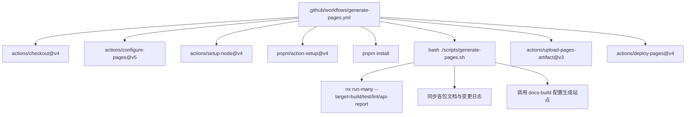
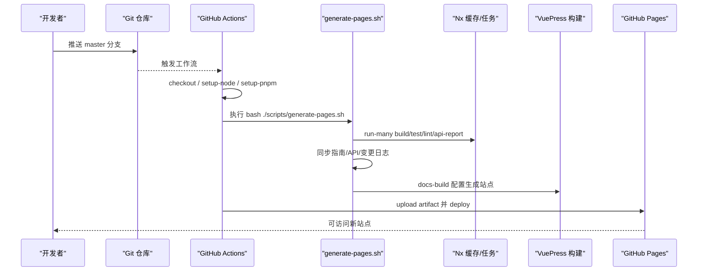
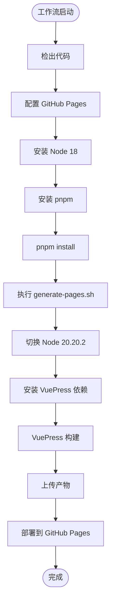
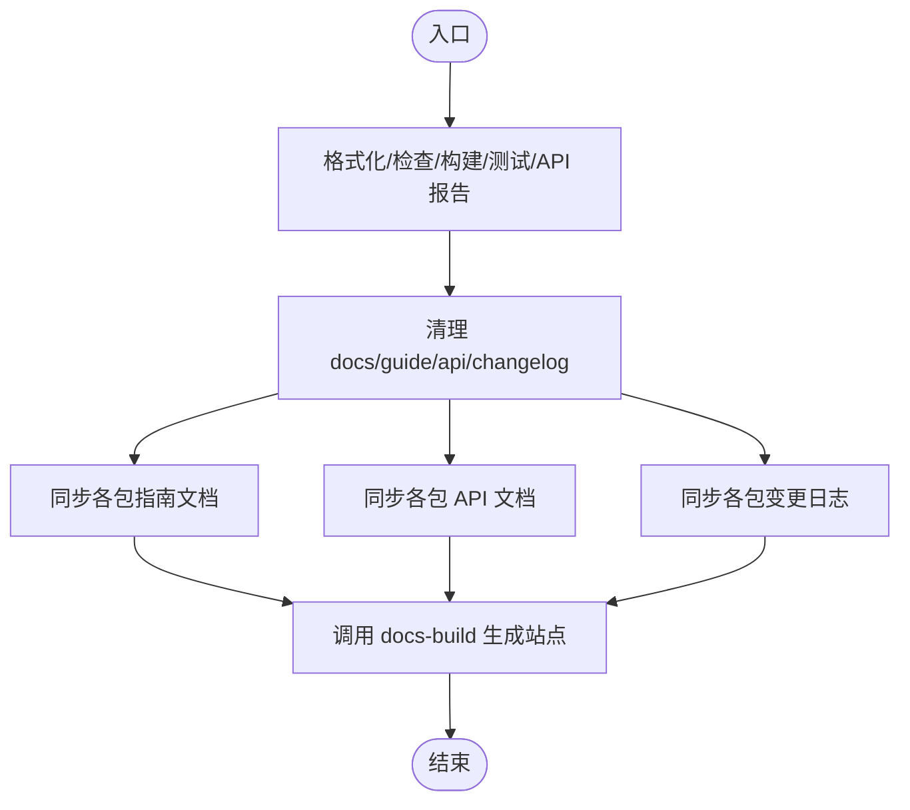
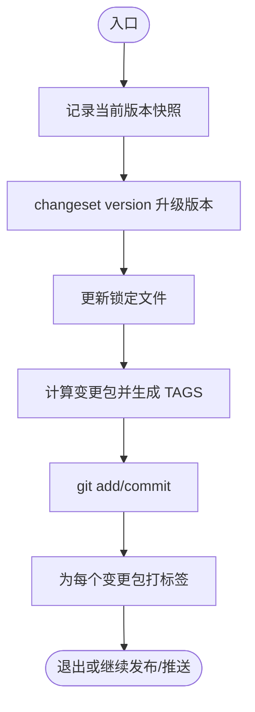
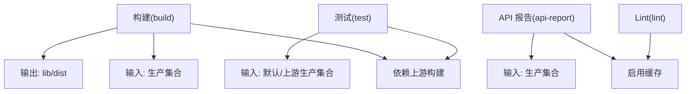
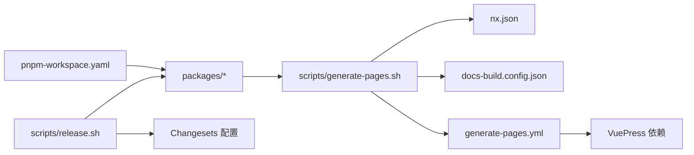

# CI/CD集成

<cite>
**本文引用的文件**
- [.github/workflows/generate-pages.yml](file://.github/workflows/generate-pages.yml)
- [scripts/generate-pages.sh](file://scripts/generate-pages.sh)
- [scripts/release.sh](file://scripts/release.sh)
- [package.json](file://package.json)
- [nx.json](file://nx.json)
- [docs-build.config.json](file://docs-build.config.json)
- [pnpm-workspace.yaml](file://pnpm-workspace.yaml)
- [.changeset/config.json](file://.changeset/config.json)
- [commitlint.config.js](file://commitlint.config.js)
</cite>

## 目录
1. [简介](#简介)
2. [项目结构](#项目结构)
3. [核心组件](#核心组件)
4. [架构总览](#架构总览)
5. [详细组件分析](#详细组件分析)
6. [依赖关系分析](#依赖关系分析)
7. [性能考虑](#性能考虑)
8. [故障排除指南](#故障排除指南)
9. [结论](#结论)
10. [附录](#附录)

## 简介
本文件面向CI/CD集成与自动化交付场景，基于仓库现有配置（GitHub Actions 工作流、生成站点脚本、发布流水线脚本、Nx 构建与缓存配置、变更集版本管理等），系统化梳理从“持续集成”到“持续部署”的最佳实践路径。内容涵盖：
- GitHub Actions 工作流配置与执行流程
- 多环境部署思路与版本管理策略
- 自动化测试与质量门禁建议
- 完整的构建与发布脚本说明
- 监控与日志记录的集成建议
- 常见问题排查与性能优化建议

## 项目结构
该仓库采用 Monorepo 结构，使用 pnpm workspace 管理多个包；通过 Nx 统一编排构建、测试、API 报告与缓存；借助 Changesets 实现多包版本管理与变更记录；GitHub Actions 负责在主分支推送时自动生成并部署文档站点。

图表来源
- [.github/workflows/generate-pages.yml:36-70](file://.github/workflows/generate-pages.yml#L36-L70)
- [scripts/generate-pages.sh:12-16](file://scripts/generate-pages.sh#L12-L16)
- [scripts/generate-pages.sh:25-74](file://scripts/generate-pages.sh#L25-L74)
- [docs-build.config.json:1-184](file://docs-build.config.json#L1-L184)

章节来源
- [.github/workflows/generate-pages.yml:1-71](file://.github/workflows/generate-pages.yml#L1-L71)
- [pnpm-workspace.yaml:1-3](file://pnpm-workspace.yaml#L1-L3)
- [nx.json:7-25](file://nx.json#L7-L25)

## 核心组件
- GitHub Actions 工作流：定义在主分支推送时触发的构建与部署流程，包含 Node 版本切换、pnpm 安装、文档生成与 VuePress 构建、产物上传与 GitHub Pages 部署。
- 文档生成脚本：统一执行格式化、检查、构建、测试、API 报告，清理旧产物，同步各包的指南、API 文档与变更日志，并通过 docs-build 配置生成最终站点。
- 发布流水线脚本：基于 Changesets 进行版本号升级、锁定文件更新、打标签、提交，支持后续发布到 npm 与推送至远端。
- Nx 缓存与输入输出定义：通过 targetDefaults 与 namedInputs 提升构建与测试缓存命中率，减少重复执行时间。
- Changesets 配置：控制变更集生成、变更记录与基线分支，支撑多包版本管理。
- 提交规范：Commitlint 规则限定 scope，确保变更可追踪。

章节来源
- [.github/workflows/generate-pages.yml:5-27](file://.github/workflows/generate-pages.yml#L5-L27)
- [scripts/generate-pages.sh:1-76](file://scripts/generate-pages.sh#L1-L76)
- [scripts/release.sh:1-73](file://scripts/release.sh#L1-L73)
- [nx.json:7-30](file://nx.json#L7-L30)
- [.changeset/config.json:1-11](file://.changeset/config.json#L1-L11)
- [commitlint.config.js:1-6](file://commitlint.config.js#L1-L6)

## 架构总览
下图展示从代码提交到文档站点上线的完整链路，以及与版本管理、质量门禁的关系。

图表来源
- [.github/workflows/generate-pages.yml:36-70](file://.github/workflows/generate-pages.yml#L36-L70)
- [scripts/generate-pages.sh:12-16](file://scripts/generate-pages.sh#L12-L16)
- [scripts/generate-pages.sh:25-74](file://scripts/generate-pages.sh#L25-L74)
- [docs-build.config.json:1-184](file://docs-build.config.json#L1-L184)

## 详细组件分析

### GitHub Actions 工作流（generate-pages.yml）
- 触发条件：推送到默认分支；支持手动触发；具备并发控制以避免破坏性并发部署。
- 权限：读取内容、写入 Pages、签发 ID Token。
- 步骤概览：
  - 检出代码
  - 配置 Pages
  - 安装 Node 18 与 pnpm
  - 安装依赖
  - 执行生成脚本
  - 切换 Node 20.20.2 安装 VuePress 依赖并构建
  - 上传产物并部署到 GitHub Pages

图表来源
- [.github/workflows/generate-pages.yml:36-70](file://.github/workflows/generate-pages.yml#L36-L70)

章节来源
- [.github/workflows/generate-pages.yml:5-27](file://.github/workflows/generate-pages.yml#L5-L27)
- [.github/workflows/generate-pages.yml:36-70](file://.github/workflows/generate-pages.yml#L36-L70)

### 文档生成脚本（generate-pages.sh）
- 预处理：格式化、检查、构建、测试、API 报告，确保质量门禁。
- 清理历史：删除旧的指南、API、变更日志目录，避免残留影响。
- 同步阶段：
  - 从各包复制指南文档到 docs/guide/<pkg>
  - 从各包复制 API Markdown 到 docs/api/<pkg>
  - 从各包复制 CHANGELOG.md 到 docs/changelog/<pkg>/README.md
- 构建阶段：调用 docs-build 配置生成最终站点。

图表来源
- [scripts/generate-pages.sh:12-16](file://scripts/generate-pages.sh#L12-L16)
- [scripts/generate-pages.sh:25-74](file://scripts/generate-pages.sh#L25-L74)
- [docs-build.config.json:1-184](file://docs-build.config.json#L1-L184)

章节来源
- [scripts/generate-pages.sh:1-76](file://scripts/generate-pages.sh#L1-L76)

### 发布流水线脚本（release.sh）
- 记录当前版本快照
- 使用 Changesets 升级版本
- 更新锁定文件
- 计算变更包并生成标签
- 提交版本变更
- 打标签（支持后续发布与推送）

图表来源
- [scripts/release.sh:12-58](file://scripts/release.sh#L12-L58)

章节来源
- [scripts/release.sh:1-73](file://scripts/release.sh#L1-L73)
- [.changeset/config.json:1-11](file://.changeset/config.json#L1-L11)

### Nx 缓存与输入输出定义（nx.json）
- 构建：按依赖顺序构建，输入为生产集合，输出为 lib 与 dist，提升缓存命中。
- 测试：依赖构建完成，输入为默认集合与上游生产集合。
- API 报告：缓存开启，输入为生产集合。
- Lint：缓存开启。
- namedInputs：default 与 production 均指向项目根通配。

图表来源
- [nx.json:7-25](file://nx.json#L7-L25)

章节来源
- [nx.json:1-32](file://nx.json#L1-L32)

### Changesets 配置（.changeset/config.json）
- 使用 Git 变更记录生成器
- 不强制提交信息
- 基于 master 分支
- 内部依赖更新策略为补丁
- 忽略列表为空

章节来源
- [.changeset/config.json:1-11](file://.changeset/config.json#L1-L11)

### 提交规范（commitlint.config.js）
- 扩展 conventional 规范
- 限定 scope 为指定范围，便于追踪与自动化处理

章节来源
- [commitlint.config.js:1-6](file://commitlint.config.js#L1-L6)

## 依赖关系分析
- 工作流依赖：
  - generate-pages.yml 依赖 generate-pages.sh 与 docs-build 配置
  - generate-pages.sh 依赖 Nx 的 run-many 任务与各包的文档源
- 版本管理依赖：
  - release.sh 依赖 Changesets CLI 与锁定文件
  - Changesets 配置决定版本升级策略与变更记录生成方式
- Monorepo 依赖：
  - pnpm-workspace.yaml 指定 packages/* 作为工作区
  - package.json 中的 nx 脚本与 changeset 脚本驱动整体流程

图表来源
- [pnpm-workspace.yaml:1-3](file://pnpm-workspace.yaml#L1-L3)
- [scripts/generate-pages.sh:12-16](file://scripts/generate-pages.sh#L12-L16)
- [nx.json:7-25](file://nx.json#L7-L25)
- [docs-build.config.json:1-184](file://docs-build.config.json#L1-L184)
- [.github/workflows/generate-pages.yml:36-70](file://.github/workflows/generate-pages.yml#L36-L70)
- [scripts/release.sh:22-26](file://scripts/release.sh#L22-L26)
- [.changeset/config.json:1-11](file://.changeset/config.json#L1-L11)

章节来源
- [pnpm-workspace.yaml:1-3](file://pnpm-workspace.yaml#L1-L3)
- [package.json:4-16](file://package.json#L4-L16)

## 性能考虑
- 利用 Nx 缓存：
  - 构建与 API 报告开启缓存，输入为生产集合，减少重复计算
  - namedInputs 将 default 与 production 统一，简化缓存键
- 依赖顺序与增量构建：
  - 构建任务按 ^build 顺序执行，避免不必要的重跑
- 并发控制：
  - GitHub Actions 使用 concurrency.group 控制并发，避免破坏性并发部署
- 依赖安装优化：
  - 使用 pnpm 与固定版本，提升安装速度与一致性
- 构建阶段分层：
  - 先 Node 18 执行格式化/检查/构建/测试/API 报告，再切换 Node 20.20.2 构建 VuePress，降低兼容性风险

章节来源
- [nx.json:7-30](file://nx.json#L7-L30)
- [.github/workflows/generate-pages.yml:25-27](file://.github/workflows/generate-pages.yml#L25-L27)
- [scripts/generate-pages.sh:12-16](file://scripts/generate-pages.sh#L12-L16)

## 故障排除指南
- 工作流失败（Node 版本不匹配）
  - 现象：构建或依赖安装阶段报错
  - 排查：确认工作流中 Node 版本与引擎要求一致；必要时在生成脚本前切换 Node 版本
  - 参考：工作流中的 Node 18 与 20.20.2 分段安装
- 依赖安装失败
  - 现象：pnpm install 报错
  - 排查：检查 pnpm 版本与 packageManager；确认网络与 registry；必要时清理缓存后重试
- 文档生成异常
  - 现象：同步指南/API/变更日志失败或站点空白
  - 排查：确认各包是否存在 docs/guide、docs/.markdowns、CHANGELOG.md；检查 generate-pages.sh 输出日志
- API 报告缺失
  - 现象：API 文档未生成
  - 排查：确认 API Extractor 已正确配置与运行；检查命名输入与缓存状态
- 发布脚本未打标签
  - 现象：无新标签
  - 排查：确认 Changesets 是否已生成变更；检查版本是否实际提升；核对 git 用户与权限
- 并发部署冲突
  - 现象：部署被取消或覆盖
  - 排查：确认 concurrency.group 设置；避免同时触发多个部署

章节来源
- [.github/workflows/generate-pages.yml:36-70](file://.github/workflows/generate-pages.yml#L36-L70)
- [scripts/generate-pages.sh:25-74](file://scripts/generate-pages.sh#L25-L74)
- [scripts/release.sh:30-58](file://scripts/release.sh#L30-L58)
- [nx.json:7-30](file://nx.json#L7-L30)

## 结论
本仓库已具备完善的 CI/CD 基础设施：通过 GitHub Actions 在主分支推送时自动构建与部署文档站点；通过 Nx 与 Changesets 实现多包构建、缓存与版本管理；通过 husky/commitlint 等工具保障提交质量。建议在此基础上进一步完善：
- 引入质量门禁（如覆盖率阈值、安全扫描）与多环境部署（开发/预发布/生产）
- 将发布脚本中的 npm 发布与远程推送步骤纳入工作流，实现一键发布
- 增加监控与日志记录（如构建耗时指标、部署状态上报）
- 对外暴露的文档站点增加健康检查与回滚策略

## 附录

### 持续集成与持续部署最佳实践
- 持续集成
  - 在 PR 或推送时运行格式化、检查、构建、测试与 API 报告
  - 使用 Nx 缓存加速重复任务
- 持续部署
  - 主分支推送自动部署到 GitHub Pages
  - 为不同环境（开发/预发布/生产）配置独立工作流与环境变量
- 多环境部署
  - 通过环境矩阵或分支策略区分环境
  - 为每个环境配置独立的输出与域名
- 版本管理与发布策略
  - 使用 Changesets 管理多包版本与变更记录
  - 采用语义化版本与变更集消息规范
- 自动化测试与质量门禁
  - 在 CI 中强制执行测试与覆盖率检查
  - 使用 Commitlint 与 Husky 限制提交质量
- 监控与日志记录
  - 记录构建时长、缓存命中率、部署成功率
  - 上报到可观测平台，设置告警阈值
- 回滚机制
  - 保留最近 N 个版本的产物与标签
  - 支持一键回滚到上一个稳定版本

### 完整CI/CD配置示例（步骤说明）
- 构建脚本
  - 在工作流中先安装 Node 与 pnpm，再执行 pnpm install
  - 运行 Nx 的 run-many 任务：build、test、lint、api-report
- 部署脚本
  - 生成静态站点后上传 artifact
  - 使用 GitHub Pages 动作部署
- 发布脚本
  - 使用 Changesets 升级版本并生成变更记录
  - 打标签并提交
  - 可选：发布到 npm 并推送标签

章节来源
- [.github/workflows/generate-pages.yml:36-70](file://.github/workflows/generate-pages.yml#L36-L70)
- [scripts/generate-pages.sh:12-16](file://scripts/generate-pages.sh#L12-L16)
- [scripts/release.sh:22-58](file://scripts/release.sh#L22-L58)
- [.changeset/config.json:1-11](file://.changeset/config.json#L1-L11)