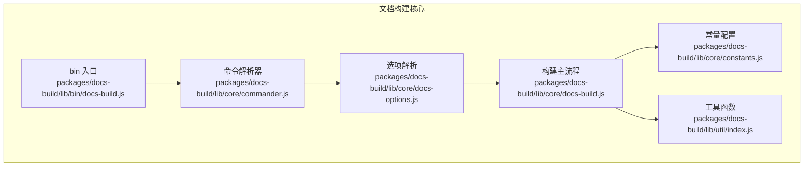
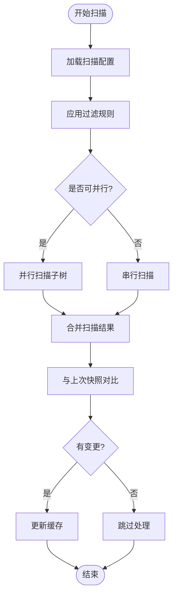
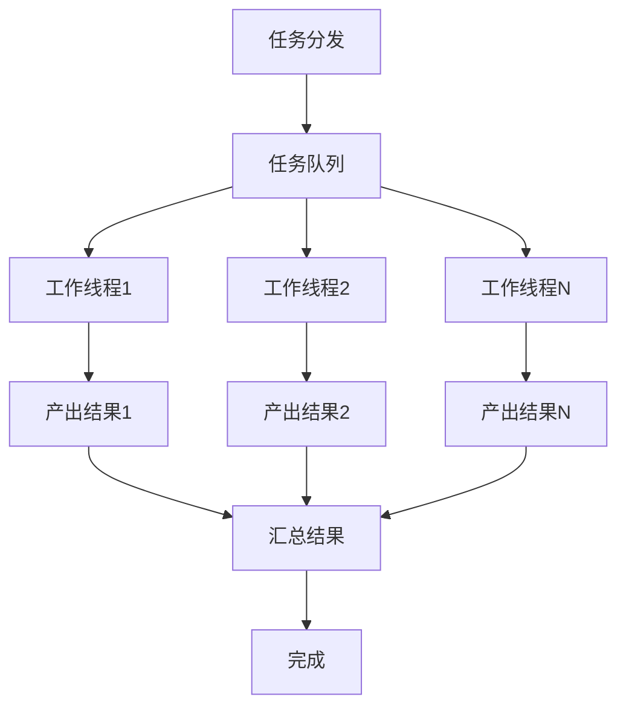
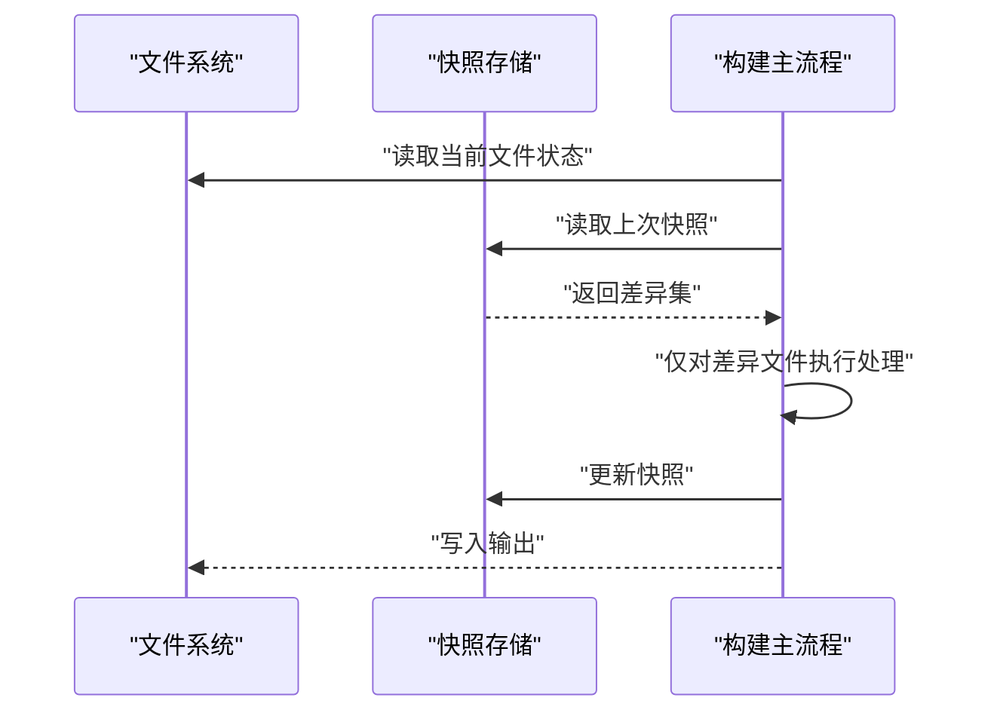
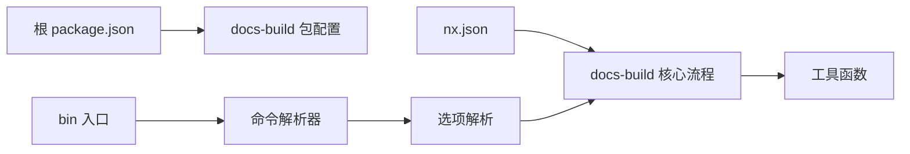

# 性能优化

<cite>
**本文引用的文件**
- [packages/docs-build/lib/core/docs-build.js](file://packages/docs-build/lib/core/docs-build.js)
- [packages/docs-build/lib/core/docs-options.js](file://packages/docs-build/lib/core/docs-options.js)
- [packages/docs-build/lib/core/constants.js](file://packages/docs-build/lib/core/constants.js)
- [packages/docs-build/lib/core/commander.js](file://packages/docs-build/lib/core/commander.js)
- [packages/docs-build/lib/bin/docs-build.js](file://packages/docs-build/lib/bin/docs-build.js)
- [packages/docs-build/lib/util/index.js](file://packages/docs-build/lib/util/index.js)
- [packages/docs-build/package.json](file://packages/docs-build/package.json)
- [package.json](file://package.json)
- [nx.json](file://nx.json)
- [docs-build.config.json](file://docs-build.config.json)
</cite>

## 目录
1. [引言](#引言)
2. [项目结构](#项目结构)
3. [核心组件](#核心组件)
4. [架构总览](#架构总览)
5. [详细组件分析](#详细组件分析)
6. [依赖关系分析](#依赖关系分析)
7. [性能考虑](#性能考虑)
8. [故障排查指南](#故障排查指南)
9. [结论](#结论)
10. [附录](#附录)

## 引言
本文件聚焦于文档构建系统的性能优化，系统性梳理在大型项目中可能遇到的性能瓶颈，并给出可落地的优化策略与实践建议。内容覆盖文件扫描优化、并发处理、内存管理、缓存与增量构建、性能监控与分析工具、构建时间优化（并行处理、资源压缩、网络优化）以及不同规模项目的性能基准与优化建议。

## 项目结构
该仓库采用多包工作区组织，其中与文档构建直接相关的核心模块位于 packages/docs-build。整体结构围绕命令入口、核心构建流程、选项解析、常量配置与工具函数展开，便于在不同规模项目中进行性能调优与扩展。



**图表来源**
- [packages/docs-build/lib/bin/docs-build.js](file://packages/docs-build/lib/bin/docs-build.js)
- [packages/docs-build/lib/core/commander.js](file://packages/docs-build/lib/core/commander.js)
- [packages/docs-build/lib/core/docs-options.js](file://packages/docs/docs-build/lib/core/docs-options.js)
- [packages/docs-build/lib/core/docs-build.js](file://packages/docs-build/lib/core/docs-build.js)
- [packages/docs-build/lib/core/constants.js](file://packages/docs-build/lib/core/constants.js)
- [packages/docs-build/lib/util/index.js](file://packages/docs-build/lib/util/index.js)

**章节来源**
- [packages/docs-build/lib/bin/docs-build.js](file://packages/docs-build/lib/bin/docs-build.js)
- [packages/docs-build/lib/core/commander.js](file://packages/docs-build/lib/core/commander.js)
- [packages/docs-build/lib/core/docs-options.js](file://packages/docs-build/lib/core/docs-options.js)
- [packages/docs-build/lib/core/docs-build.js](file://packages/docs-build/lib/core/docs-build.js)
- [packages/docs-build/lib/core/constants.js](file://packages/docs-build/lib/core/constants.js)
- [packages/docs-build/lib/util/index.js](file://packages/docs-build/lib/util/index.js)

## 核心组件
- 命令入口：负责接收用户输入、解析参数并触发后续流程。
- 命令解析器：将命令行参数映射到内部执行逻辑。
- 选项解析：从配置文件与命令行合并生成最终构建选项。
- 构建主流程：协调扫描、解析、转换、输出等阶段。
- 常量配置：集中定义路径、模式、阈值等关键参数。
- 工具函数：提供通用的文件操作、日志、统计等辅助能力。

这些组件共同构成文档构建的“性能基座”，后续优化策略将围绕它们展开。

**章节来源**
- [packages/docs-build/lib/bin/docs-build.js](file://packages/docs-build/lib/bin/docs-build.js)
- [packages/docs-build/lib/core/commander.js](file://packages/docs-build/lib/core/commander.js)
- [packages/docs-build/lib/core/docs-options.js](file://packages/docs-build/lib/core/docs-options.js)
- [packages/docs-build/lib/core/docs-build.js](file://packages/docs-build/lib/core/docs-build.js)
- [packages/docs-build/lib/core/constants.js](file://packages/docs-build/lib/core/constants.js)
- [packages/docs-build/lib/util/index.js](file://packages/docs-build/lib/util/index.js)

## 架构总览
下图展示从命令入口到构建完成的关键调用链路，有助于定位性能瓶颈与优化切入点。

```mermaid
sequenceDiagram
participant CLI as "命令行"
participant BIN as "bin 入口"
participant CMD as "命令解析器"
participant OPT as "选项解析"
participant CORE as "构建主流程"
participant UTIL as "工具函数"
CLI->>BIN : "执行构建命令"
BIN->>CMD : "解析命令与参数"
CMD->>OPT : "合并配置与参数"
OPT-->>CORE : "返回构建选项"
CORE->>UTIL : "文件扫描/统计/日志"
UTIL-->>CORE : "返回结果"
CORE-->>CLI : "输出构建结果"
```

**图表来源**
- [packages/docs-build/lib/bin/docs-build.js](file://packages/docs-build/lib/bin/docs-build.js)
- [packages/docs-build/lib/core/commander.js](file://packages/docs-build/lib/core/commander.js)
- [packages/docs-build/lib/core/docs-options.js](file://packages/docs-build/lib/core/docs-options.js)
- [packages/docs-build/lib/core/docs-build.js](file://packages/docs-build/lib/core/docs-build.js)
- [packages/docs-build/lib/util/index.js](file://packages/docs-build/lib/util/index.js)

## 详细组件分析

### 文件扫描与过滤优化
- 扫描范围控制：通过常量配置集中管理扫描路径、忽略规则与文件模式，避免不必要的遍历。
- 过滤策略：优先使用黑名单/白名单策略减少 IO；对大目录采用分层扫描或按模块拆分扫描任务。
- 并发扫描：对独立模块或子树并行扫描，结合队列与背压控制并发度，防止磁盘与 CPU 抖动。
- 结果缓存：将扫描结果与上次构建的快照对比，仅对变更文件重扫，降低重复 IO。



**图表来源**
- [packages/docs-build/lib/core/constants.js](file://packages/docs-build/lib/core/constants.js)
- [packages/docs-build/lib/util/index.js](file://packages/docs-build/lib/util/index.js)

**章节来源**
- [packages/docs-build/lib/core/constants.js](file://packages/docs-build/lib/core/constants.js)
- [packages/docs-build/lib/util/index.js](file://packages/docs-build/lib/util/index.js)

### 并发处理与资源调度
- 任务拆分：将文档构建划分为多个子任务（如解析、转换、输出），每个子任务独立并发。
- 调度策略：采用工作池或任务队列，动态分配 CPU 与 IO 资源，避免过度并发导致资源争用。
- 背压控制：根据系统负载（CPU 使用率、内存占用、磁盘吞吐）动态调整并发度。
- 失败隔离：单个任务失败不影响其他任务，支持重试与降级策略。



**图表来源**
- [packages/docs-build/lib/core/docs-build.js](file://packages/docs-build/lib/core/docs-build.js)
- [packages/docs-build/lib/util/index.js](file://packages/docs-build/lib/util/index.js)

**章节来源**
- [packages/docs-build/lib/core/docs-build.js](file://packages/docs-build/lib/core/docs-build.js)
- [packages/docs-build/lib/util/index.js](file://packages/docs-build/lib/util/index.js)

### 内存管理与流式处理
- 对象生命周期：避免在扫描与转换过程中创建大量临时对象；及时释放不再使用的中间数据。
- 流式处理：对大文件采用流式读取与写入，降低峰值内存占用。
- 分页与批处理：将长列表或大块数据分批处理，减少一次性内存压力。
- 垃圾回收：在关键阶段触发 GC 或调整堆大小，确保稳定运行。

**章节来源**
- [packages/docs-build/lib/core/docs-build.js](file://packages/docs-build/lib/core/docs-build.js)
- [packages/docs-build/lib/util/index.js](file://packages/docs-build/lib/util/index.js)

### 缓存机制与增量构建
- 快照缓存：记录上次构建的文件指纹与元信息，本次构建仅处理变更项。
- 模块级缓存：按模块或包粒度缓存中间产物，跨版本复用以加速增量构建。
- 依赖失效：当依赖版本或配置变化时自动失效缓存，保证正确性。
- 缓存清理：提供清理策略（如基于时间或大小阈值），避免缓存膨胀。



**图表来源**
- [packages/docs-build/lib/core/docs-build.js](file://packages/docs-build/lib/core/docs-build.js)
- [packages/docs-build/lib/util/index.js](file://packages/docs-build/lib/util/index.js)

**章节来源**
- [packages/docs-build/lib/core/docs-build.js](file://packages/docs-build/lib/core/docs-build.js)
- [packages/docs-build/lib/util/index.js](file://packages/docs-build/lib/util/index.js)

### 配置驱动的性能开关
- 可调参数：通过配置文件暴露关键性能参数（如并发度、缓存策略、扫描深度、忽略规则等）。
- 环境适配：针对不同规模项目提供默认配置模板，支持按需覆盖。
- 动态生效：在不重启进程的情况下支持部分参数热更新。

**章节来源**
- [packages/docs-build/lib/core/docs-options.js](file://packages/docs-build/lib/core/docs-options.js)
- [docs-build.config.json](file://docs-build.config.json)

## 依赖关系分析
- 包依赖：docs-build 作为核心包，被命令入口依赖；工具函数为各模块提供通用能力。
- 工作区配置：nx.json 定义了任务编排与缓存策略，可与构建流程协同提升整体性能。
- 版本与脚本：package.json 中的脚本与依赖版本影响构建工具链的性能表现。



**图表来源**
- [package.json](file://package.json)
- [nx.json](file://nx.json)
- [packages/docs-build/package.json](file://packages/docs-build/package.json)
- [packages/docs-build/lib/bin/docs-build.js](file://packages/docs-build/lib/bin/docs-build.js)
- [packages/docs-build/lib/core/commander.js](file://packages/docs-build/lib/core/commander.js)
- [packages/docs-build/lib/core/docs-options.js](file://packages/docs-build/lib/core/docs-options.js)
- [packages/docs-build/lib/core/docs-build.js](file://packages/docs-build/lib/core/docs-build.js)
- [packages/docs-build/lib/util/index.js](file://packages/docs-build/lib/util/index.js)

**章节来源**
- [package.json](file://package.json)
- [nx.json](file://nx.json)
- [packages/docs-build/package.json](file://packages/docs-build/package.json)

## 性能考虑
- 大型项目处理
  - 分层扫描：按模块或功能域拆分扫描任务，避免全量遍历。
  - 并行化：合理设置并发度，结合 CPU/IO 限制与系统负载动态调节。
  - 缓存优先：启用增量构建与模块级缓存，显著缩短二次构建时间。
- 并发与内存
  - 使用工作池与背压控制，避免资源争用与 OOM。
  - 对大文件采用流式处理与分页，降低内存峰值。
- 缓存与增量
  - 基于快照的差异计算，仅处理变更文件；失效策略要平衡正确性与性能。
- 监控与分析
  - 在关键节点埋点（扫描、解析、输出），输出耗时统计与资源使用指标。
  - 提供可视化报告与告警阈值，辅助定位瓶颈。
- 构建时间优化
  - 并行处理：将独立任务并行化，充分利用多核 CPU。
  - 资源压缩：对图片、CSS、JS 等静态资源进行压缩与去重。
  - 网络优化：缓存远程资源、限速与重试策略，避免网络成为瓶颈。
- 不同规模项目的基准与建议
  - 小型项目：默认并发度即可，重点在于合理的过滤与缓存。
  - 中型项目：适度提高并发度，启用模块级缓存与增量构建。
  - 大型项目：分层扫描+并行+缓存三位一体，配合监控与资源治理。

[本节为通用指导，无需列出具体文件来源]

## 故障排查指南
- 常见问题
  - 构建时间异常增长：检查扫描范围、过滤规则与并发度设置；确认缓存命中率。
  - 内存溢出：检查大文件处理策略与流式实现；适当降低并发度或增加堆上限。
  - 增量构建不生效：核对快照存储与失效策略；确保依赖版本与配置未发生无意变更。
- 排查步骤
  - 启用详细日志与性能埋点，定位耗时环节。
  - 对比不同并发度下的资源使用曲线，找到最优并发。
  - 清理缓存后重跑，验证缓存失效逻辑。
- 工具与指标
  - CPU/内存/IO 监控：用于判断瓶颈类型。
  - 构建耗时拆解：按阶段统计，识别最长尾部任务。
  - 日志与报告：保留历史数据，形成趋势分析。

**章节来源**
- [packages/docs-build/lib/core/docs-build.js](file://packages/docs-build/lib/core/docs-build.js)
- [packages/docs-build/lib/util/index.js](file://packages/docs-build/lib/util/index.js)

## 结论
通过在扫描、并发、内存、缓存与增量构建等方面的系统性优化，并结合监控与分析工具，可以在不同规模的项目中显著缩短构建时间、降低资源消耗并提升稳定性。建议以配置驱动的方式持续迭代性能参数，并建立完善的监控与回归测试体系。

## 附录
- 关键实现参考路径
  - [命令入口](file://packages/docs-build/lib/bin/docs-build.js)
  - [命令解析器](file://packages/docs-build/lib/core/commander.js)
  - [选项解析](file://packages/docs-build/lib/core/docs-options.js)
  - [构建主流程](file://packages/docs-build/lib/core/docs-build.js)
  - [常量配置](file://packages/docs-build/lib/core/constants.js)
  - [工具函数](file://packages/docs-build/lib/util/index.js)
  - [根配置](file://package.json)
  - [工作区配置](file://nx.json)
  - [构建配置示例](file://docs-build.config.json)

[本节为索引与补充，无需列出具体文件来源]