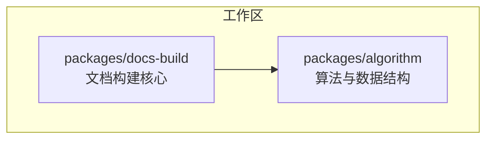
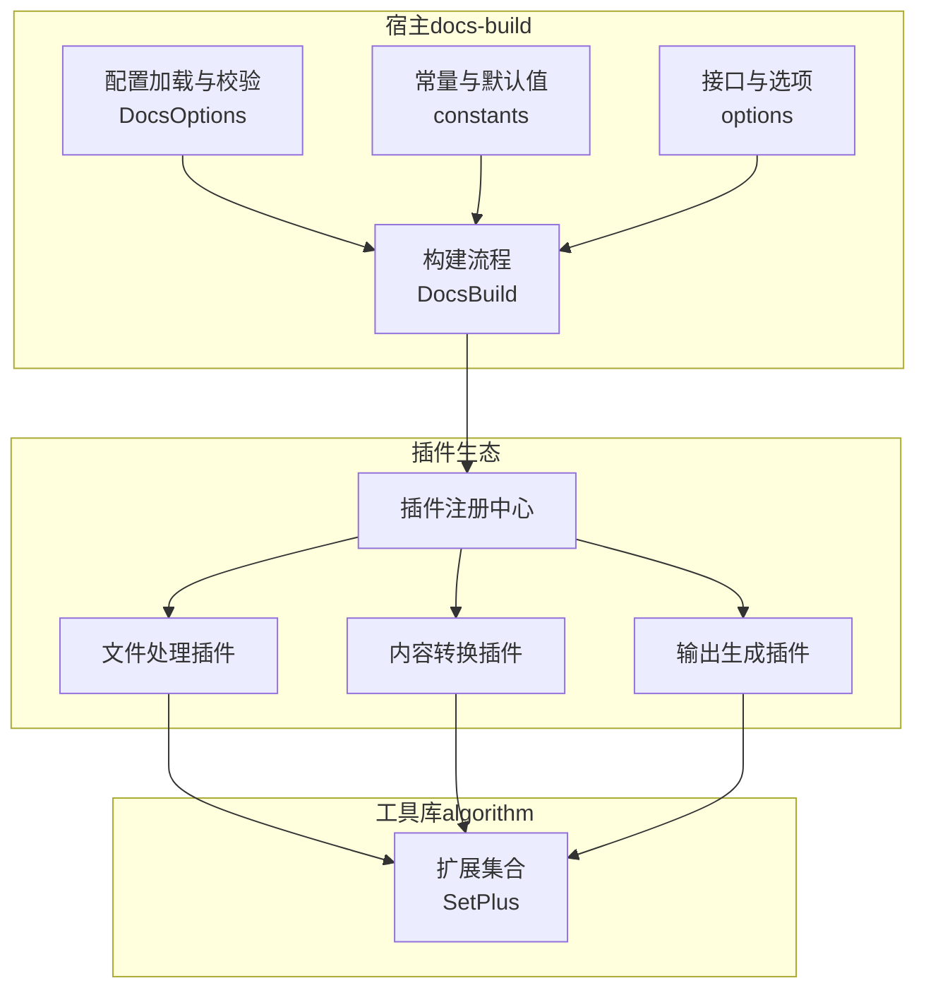
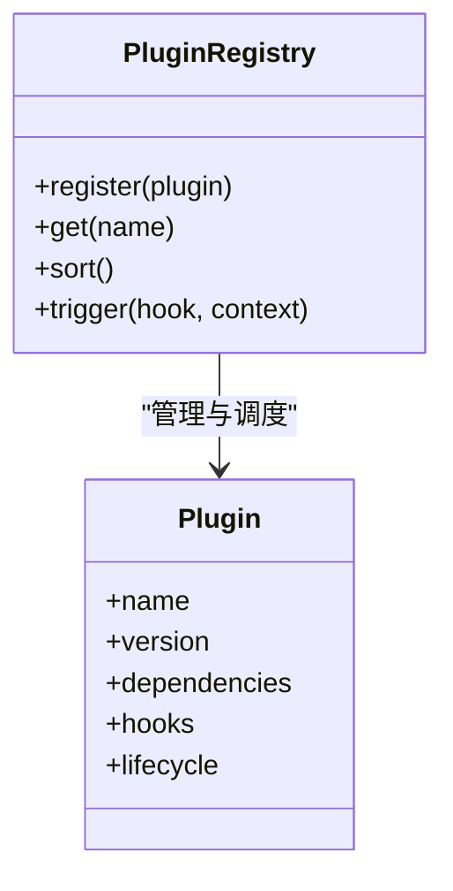
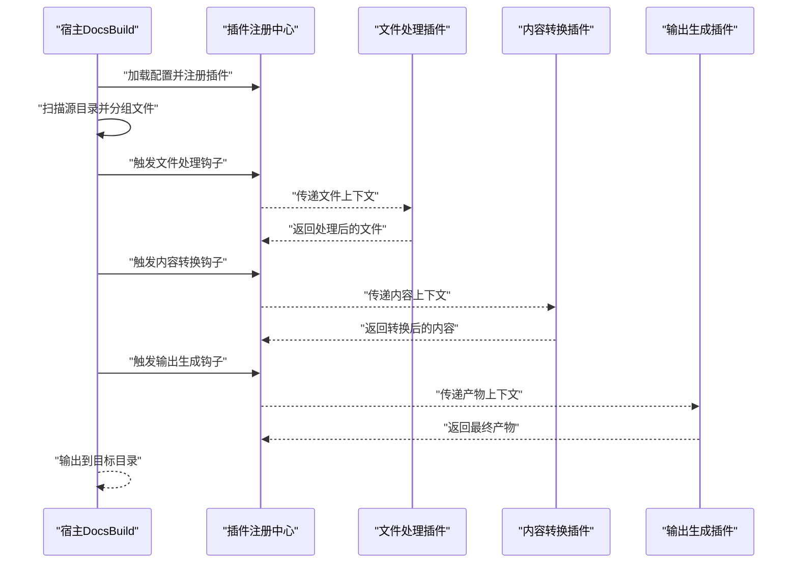
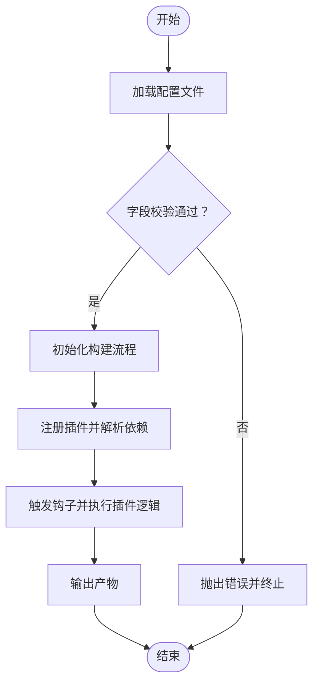
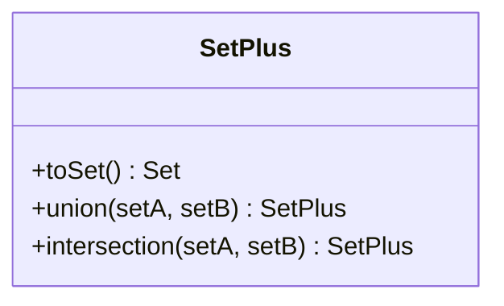
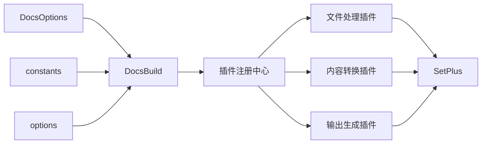

# 扩展插件

<cite>
**本文引用的文件**
- [packages/docs-build/src/core/docs-build.ts](file://packages/docs-build/src/core/docs-build.ts)
- [packages/docs-build/src/core/docs-options.ts](file://packages/docs-build/src/core/docs-options.ts)
- [packages/docs-build/src/core/constants.ts](file://packages/docs-build/src/core/constants.ts)
- [packages/docs-build/src/interface/options.ts](file://packages/docs-build/src/interface/options.ts)
- [packages/docs-build/vite.config.mts](file://packages/docs-build/vite.config.mts)
- [packages/docs-build/docs/api/index.api.json](file://packages/docs-build/docs/api/index.api.json)
- [packages/algorithm/src/set/set-plus.ts](file://packages/algorithm/src/set/set-plus.ts)
- [packages/algorithm/src/set/index.ts](file://packages/algorithm/src/set/index.ts)
- [README.md](file://README.md)
- [README.zh-CN.md](file://README.zh-CN.md)
</cite>

## 目录
1. [引言](#引言)
2. [项目结构](#项目结构)
3. [核心组件](#核心组件)
4. [架构总览](#架构总览)
5. [详细组件分析](#详细组件分析)
6. [依赖分析](#依赖分析)
7. [性能考虑](#性能考虑)
8. [故障排查指南](#故障排查指南)
9. [结论](#结论)
10. [附录](#附录)

## 引言
本文件面向“扩展插件系统”的目标，结合仓库现有能力，给出可落地的插件化架构设计与实现建议。当前仓库包含两块关键能力：
- 文档构建核心（docs-build）：负责扫描、分组、复制与输出，具备配置加载与校验、多语言支持等能力，适合作为插件系统的“宿主”。
- 算法工具库（algorithm）：提供扩展集合类型等基础数据结构，可作为插件内部的数据处理工具。

在不改变现有实现的前提下，本文提出以“配置驱动 + 生命周期钩子 + 插件注册中心”的方式，将“文件处理插件、内容转换插件、输出生成插件”纳入统一的构建流程中，形成可扩展、可测试、可维护的插件体系。

## 项目结构
仓库采用多包工作区组织，核心与算法分别位于 packages/docs-build 与 packages/algorithm 下。docs-build 提供文档构建能力，algorithm 提供通用数据结构支持。

**章节来源**
- [README.md](file://README.md)
- [README.zh-CN.md](file://README.zh-CN.md)

## 核心组件
围绕插件系统，建议在 docs-build 中新增以下核心组件，并复用现有配置与常量模块：

- 配置加载与校验（DocsOptions）
  - 职责：从文件加载配置并进行字段校验，确保插件注册表、钩子清单、输出路径等关键项合法。
  - 关联文件：[packages/docs-build/src/core/docs-options.ts](file://packages/docs-build/src/core/docs-options.ts)，[packages/docs-build/docs/api/index.api.json](file://packages/docs-build/docs/api/index.api.json)

- 构建流程（DocsBuild）
  - 职责：扫描源目录、按语言分组、复制文件、调用插件钩子、输出结果。
  - 关联文件：[packages/docs-build/src/core/docs-build.ts](file://packages/docs-build/src/core/docs-build.ts)

- 常量与默认值（constants）
  - 职责：定义忽略模式、默认语言、站点元信息等常量。
  - 关联文件：[packages/docs-build/src/core/constants.ts](file://packages/docs-build/src/core/constants.ts)

- 接口与选项（options）
  - 职责：定义插件注册表、钩子类型、多语言配置、站点配置等接口契约。
  - 关联文件：[packages/docs-build/src/interface/options.ts](file://packages/docs-build/src/interface/options.ts)，[packages/docs-build/docs/api/index.api.json](file://packages/docs-build/docs/api/index.api.json)

- 工具库（algorithm）
  - 职责：提供扩展集合等数据结构，辅助插件在内存中高效组织与转换数据。
  - 关联文件：[packages/algorithm/src/set/set-plus.ts](file://packages/algorithm/src/set/set-plus.ts)，[packages/algorithm/src/set/index.ts](file://packages/algorithm/src/set/index.ts)

**章节来源**
- [packages/docs-build/src/core/docs-options.ts](file://packages/docs-build/src/core/docs-options.ts)
- [packages/docs-build/src/core/docs-build.ts](file://packages/docs-build/src/core/docs-build.ts)
- [packages/docs-build/src/core/constants.ts](file://packages/docs-build/src/core/constants.ts)
- [packages/docs-build/src/interface/options.ts](file://packages/docs-build/src/interface/options.ts)
- [packages/docs-build/docs/api/index.api.json](file://packages/docs-build/docs/api/index.api.json)
- [packages/algorithm/src/set/set-plus.ts](file://packages/algorithm/src/set/set-plus.ts)
- [packages/algorithm/src/set/index.ts](file://packages/algorithm/src/set/index.ts)

## 架构总览
下图展示“插件系统”在现有文档构建流程中的位置与交互关系。插件注册中心负责收集与排序插件；构建流程在不同阶段触发钩子；插件通过钩子对输入文件、内容与输出进行扩展。

**图表来源**
- [packages/docs-build/src/core/docs-build.ts](file://packages/docs-build/src/core/docs-build.ts)
- [packages/docs-build/src/core/docs-options.ts](file://packages/docs-build/src/core/docs-options.ts)
- [packages/docs-build/src/core/constants.ts](file://packages/docs-build/src/core/constants.ts)
- [packages/docs-build/src/interface/options.ts](file://packages/docs-build/src/interface/options.ts)
- [packages/algorithm/src/set/set-plus.ts](file://packages/algorithm/src/set/set-plus.ts)

## 详细组件分析

### 组件一：插件注册中心（Plugin Registry）
职责
- 收集插件清单，按优先级排序，建立依赖解析与冲突检测。
- 在构建流程的关键节点触发钩子，传递上下文对象（输入文件、内容、输出路径等）。

设计要点
- 插件接口：每个插件导出名称、版本、依赖声明、钩子清单与生命周期回调。
- 注册方式：支持静态配置注册与动态发现注册（如扫描特定目录下的插件入口）。
- 依赖管理：基于依赖声明进行拓扑排序，保证前置插件先于后置插件执行。

**图表来源**
- [packages/docs-build/src/interface/options.ts](file://packages/docs-build/src/interface/options.ts)

**章节来源**
- [packages/docs-build/src/interface/options.ts](file://packages/docs-build/src/interface/options.ts)

### 组件二：构建流程与钩子（DocsBuild + Hooks）
职责
- 扫描源目录，按语言分组文件。
- 触发“文件处理”“内容转换”“输出生成”等钩子。
- 输出到目标目录，遵循忽略规则与多语言策略。

钩子设计
- 文件处理钩子：对扫描到的文件进行预处理（如提取元信息、标记语言、分类）。
- 内容转换钩子：对文件内容进行转换（如 Markdown 渲染、资源内联、链接重写）。
- 输出生成钩子：对最终产物进行二次加工（如生成索引、注入脚本、压缩）。

**图表来源**
- [packages/docs-build/src/core/docs-build.ts](file://packages/docs-build/src/core/docs-build.ts)
- [packages/docs-build/src/interface/options.ts](file://packages/docs-build/src/interface/options.ts)

**章节来源**
- [packages/docs-build/src/core/docs-build.ts](file://packages/docs-build/src/core/docs-build.ts)

### 组件三：配置扩展（DocsOptions + Options）
职责
- 加载用户配置文件，校验必填字段与类型。
- 定义插件注册表、钩子清单、多语言与站点元信息等接口。

配置项建议
- 插件注册表：数组形式，包含插件名称、版本、参数与依赖。
- 钩子清单：声明可用钩子与触发时机。
- 多语言与站点配置：languages、defaultLanguage、site、locales 等。

**图表来源**
- [packages/docs-build/src/core/docs-options.ts](file://packages/docs-build/src/core/docs-options.ts)
- [packages/docs-build/src/interface/options.ts](file://packages/docs-build/src/interface/options.ts)

**章节来源**
- [packages/docs-build/src/core/docs-options.ts](file://packages/docs-build/src/core/docs-options.ts)
- [packages/docs-build/src/interface/options.ts](file://packages/docs-build/src/interface/options.ts)
- [packages/docs-build/docs/api/index.api.json](file://packages/docs-build/docs/api/index.api.json)

### 组件四：工具库（SetPlus）
职责
- 提供扩展集合操作（并集、交集、转 Set），辅助插件在内存中高效组织与过滤数据。

使用场景
- 文件处理插件：按语言或标签聚合文件集合。
- 内容转换插件：合并多个来源的内容集合，去重与排序。
- 输出生成插件：根据集合生成索引或导航。

**图表来源**
- [packages/algorithm/src/set/set-plus.ts](file://packages/algorithm/src/set/set-plus.ts)

**章节来源**
- [packages/algorithm/src/set/set-plus.ts](file://packages/algorithm/src/set/set-plus.ts)
- [packages/algorithm/src/set/index.ts](file://packages/algorithm/src/set/index.ts)

## 依赖分析
- 组件耦合
  - DocsBuild 依赖 DocsOptions、constants、options，形成“配置—流程—接口”的清晰边界。
  - 插件注册中心与各插件之间为弱耦合，通过钩子与接口契约通信。
- 外部依赖
  - 构建与测试配置位于 vite.config.mts，用于类型生成与单元测试。
- 可能的循环依赖
  - 当前结构以“配置—流程—插件”单向依赖为主，避免循环依赖风险。

**图表来源**
- [packages/docs-build/src/core/docs-build.ts](file://packages/docs-build/src/core/docs-build.ts)
- [packages/docs-build/src/core/docs-options.ts](file://packages/docs-build/src/core/docs-options.ts)
- [packages/docs-build/src/core/constants.ts](file://packages/docs-build/src/core/constants.ts)
- [packages/docs-build/src/interface/options.ts](file://packages/docs-build/src/interface/options.ts)
- [packages/algorithm/src/set/set-plus.ts](file://packages/algorithm/src/set/set-plus.ts)

**章节来源**
- [packages/docs-build/vite.config.mts](file://packages/docs-build/vite.config.mts)

## 性能考虑
- 扫描与分组
  - 使用忽略模式减少 IO 开销；对大目录采用流式处理与并发限制。
- 钩子执行
  - 并行执行无状态钩子；对有状态钩子采用队列或锁保障一致性。
- 输出优化
  - 仅在必要时复制文件；对重复内容进行缓存与增量更新。
- 工具库
  - 利用 SetPlus 的高效集合操作降低时间复杂度。

## 故障排查指南
- 配置错误
  - 症状：启动即报错或构建失败。
  - 排查：检查配置文件字段是否齐全、类型是否正确；参考配置加载与校验逻辑。
  - 参考文件：[packages/docs-build/src/core/docs-options.ts](file://packages/docs-build/src/core/docs-options.ts)
- 插件未生效
  - 症状：钩子未被触发或产物异常。
  - 排查：确认插件已注册、依赖已满足、钩子名称与时机匹配；检查插件日志与断点。
  - 参考文件：[packages/docs-build/src/interface/options.ts](file://packages/docs-build/src/interface/options.ts)
- 文件未输出
  - 症状：目标目录为空或缺少语言版本。
  - 排查：核对忽略模式、语言配置与输出路径；验证分组逻辑与复制流程。
  - 参考文件：[packages/docs-build/src/core/docs-build.ts](file://packages/docs-build/src/core/docs-build.ts)，[packages/docs-build/src/core/constants.ts](file://packages/docs-build/src/core/constants.ts)
- 测试与调试
  - 使用 Vite Test 配置运行单元测试；为插件编写独立测试用例，覆盖钩子执行路径与边界条件。
  - 参考文件：[packages/docs-build/vite.config.mts](file://packages/docs-build/vite.config.mts)

**章节来源**
- [packages/docs-build/src/core/docs-options.ts](file://packages/docs-build/src/core/docs-options.ts)
- [packages/docs-build/src/core/docs-build.ts](file://packages/docs-build/src/core/docs-build.ts)
- [packages/docs-build/src/core/constants.ts](file://packages/docs-build/src/core/constants.ts)
- [packages/docs-build/src/interface/options.ts](file://packages/docs-build/src/interface/options.ts)
- [packages/docs-build/vite.config.mts](file://packages/docs-build/vite.config.mts)

## 结论
通过在现有文档构建核心上引入“插件注册中心 + 钩子机制 + 配置扩展”，可以将文件处理、内容转换与输出生成三大类插件有机整合进统一的构建流程。配合算法工具库的高效数据结构与完善的测试配置，能够实现高扩展性、强健壮性的插件系统。后续可在保持现有模块职责不变的前提下，逐步演进为完整的插件生态。

## 附录
- 常用插件功能实现思路
  - 文件处理插件：基于分组逻辑对文件进行分类、打标与元信息提取。
  - 内容转换插件：对 Markdown 或其他格式进行渲染、内联与重写。
  - 输出生成插件：生成索引、注入脚本、压缩与缓存头设置。
- 最佳实践
  - 插件应尽量无副作用，通过钩子传递上下文，避免全局状态。
  - 明确钩子顺序与依赖，防止竞态与覆盖。
  - 为插件提供详尽的单元测试与集成测试，覆盖正常与异常分支。