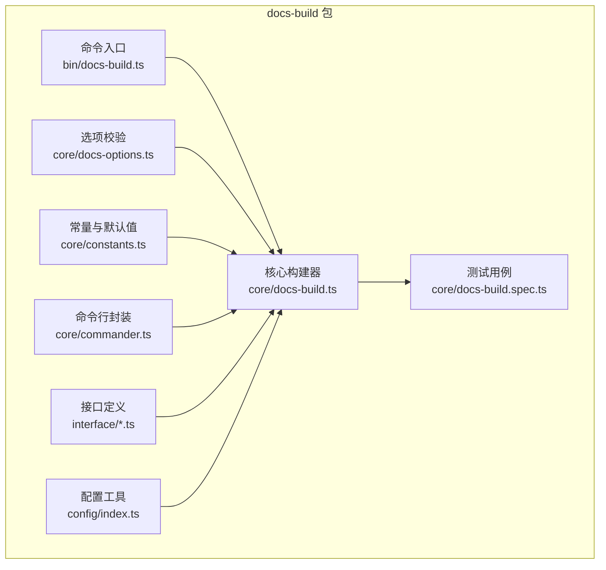
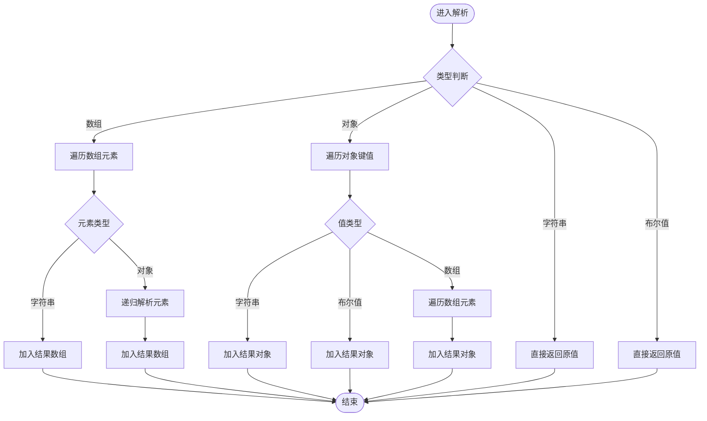
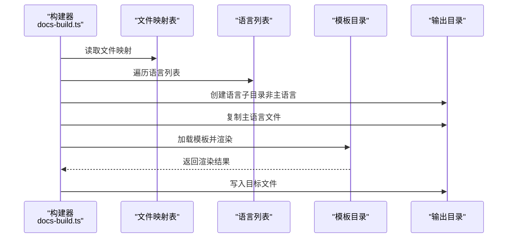
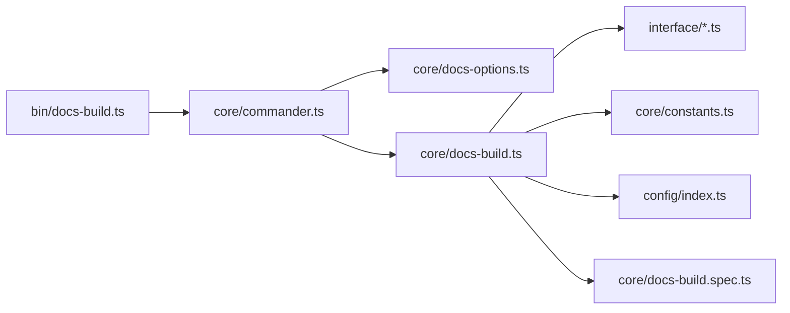

# 自定义模板

<cite>
**本文引用的文件**
- [packages/docs-build/src/core/docs-build.ts](file://packages/docs-build/src/core/docs-build.ts)
- [packages/docs-build/src/interface/render-options.ts](file://packages/docs-build/src/interface/render-options.ts)
- [packages/docs-build/src/core/docs-options.ts](file://packages/docs-build/src/core/docs-options.ts)
- [packages/docs-build/src/config/index.ts](file://packages/docs-build/src/config/index.ts)
- [packages/docs-build/src/core/docs-build.spec.ts](file://packages/docs-build/src/core/docs-build.spec.ts)
- [packages/docs-build/src/bin/docs-build.ts](file://packages/docs-build/src/bin/docs-build.ts)
- [packages/docs-build/src/core/constants.ts](file://packages/docs-build/src/core/constants.ts)
- [packages/docs-build/src/core/commander.ts](file://packages/docs-build/src/core/commander.ts)
- [packages/docs-build/src/interface/vuepress-theme-hope.d.ts](file://packages/docs-build/src/interface/vuepress-theme-hope.d.ts)
- [packages/docs-build/src/util/index.d.ts](file://packages/docs-build/src/util/index.d.ts)
- [packages/docs-build/lib/core/docs-build.d.ts](file://packages/docs-build/lib/core/docs-build.d.ts)
- [packages/docs-build/lib/interface/render-options.d.ts](file://packages/docs-build/lib/interface/render-options.d.ts)
- [packages/docs-build/lib/interface/vuepress-theme-hope.d.ts](file://packages/docs-build/lib/interface/vuepress-theme-hope.d.ts)
- [packages/docs-build/lib/core/constants.d.ts](file://packages/docs-build/lib/core/constants.d.ts)
- [packages/docs-build/lib/core/commander.d.ts](file://packages/docs-build/lib/core/commander.d.ts)
- [packages/docs-build/lib/bin/docs-build.d.ts](file://packages/docs-build/lib/bin/docs-build.d.ts)
- [packages/docs-build/lib/util/index.d.ts](file://packages/docs-build/lib/util/index.d.ts)
- [docs-build.config.json](file://docs-build.config.json)
</cite>

## 目录
1. [简介](#简介)
2. [项目结构](#项目结构)
3. [核心组件](#核心组件)
4. [架构总览](#架构总览)
5. [详细组件分析](#详细组件分析)
6. [依赖关系分析](#依赖关系分析)
7. [性能考虑](#性能考虑)
8. [故障排查指南](#故障排查指南)
9. [结论](#结论)
10. [附录](#附录)

## 简介
本文件围绕“自定义模板”能力进行系统化说明，重点覆盖模板系统的架构与工作原理、模板结构设计、变量替换机制、模板继承规则、模板文件组织方式、变量占位符使用、动态内容生成流程、模板渲染过程以及性能优化技巧，并提供可落地的开发示例与调试方法。该能力基于 VuePress 主题（vuepress-theme-hope）的配置体系，通过统一的数据模型对导航栏、侧边栏等组件进行多语言文本解析与结构化转换，最终渲染出可定制的静态站点页面。

## 项目结构
本仓库采用多包管理（Nx Workspace），与“自定义模板”直接相关的核心位于 docs-build 包。其主要职责是：
- 解析构建配置与用户输入参数
- 统一处理导航与侧边栏的多语言文本解析与结构转换
- 调用模板引擎渲染 VuePress 页面
- 支持多语言目录输出与文件映射复制



图表来源
- [packages/docs-build/src/bin/docs-build.ts](file://packages/docs-build/src/bin/docs-build.ts)
- [packages/docs-build/src/core/docs-build.ts](file://packages/docs-build/src/core/docs-build.ts)
- [packages/docs-build/src/core/docs-options.ts](file://packages/docs-build/src/core/docs-options.ts)
- [packages/docs-build/src/core/constants.ts](file://packages/docs-build/src/core/constants.ts)
- [packages/docs-build/src/core/commander.ts](file://packages/docs-build/src/core/commander.ts)
- [packages/docs-build/src/interface/render-options.ts](file://packages/docs-build/src/interface/render-options.ts)
- [packages/docs-build/src/config/index.ts](file://packages/docs-build/src/config/index.ts)
- [packages/docs-build/src/core/docs-build.spec.ts](file://packages/docs-build/src/core/docs-build.spec.ts)

章节来源
- [packages/docs-build/src/bin/docs-build.ts](file://packages/docs-build/src/bin/docs-build.ts)
- [packages/docs-build/src/core/docs-build.ts](file://packages/docs-build/src/core/docs-build.ts)
- [packages/docs-build/src/core/docs-options.ts](file://packages/docs-build/src/core/docs-options.ts)
- [packages/docs-build/src/core/constants.ts](file://packages/docs-build/src/core/constants.ts)
- [packages/docs-build/src/core/commander.ts](file://packages/docs-build/src/core/commander.ts)
- [packages/docs-build/src/interface/render-options.ts](file://packages/docs-build/src/interface/render-options.ts)
- [packages/docs-build/src/config/index.ts](file://packages/docs-build/src/config/index.ts)
- [packages/docs-build/src/core/docs-build.spec.ts](file://packages/docs-build/src/core/docs-build.spec.ts)

## 核心组件
- 渲染数据模型：RenderTemplatesOptions 定义了站点基础信息与导航配置（包含多语言映射），用于驱动模板渲染。
- 导航与侧边栏转换器：提供多语言文本解析与嵌套结构转换，支持字符串、数组与对象三类配置形态。
- 模板渲染器：负责定位模板目录并执行渲染，生成目标语言的页面与资源。
- 配置与校验：对用户输入进行校验，确保 navigation.navbar 与 navigation.sidebar 的结构正确性。
- 多语言文件后缀：提供默认语言文件后缀匹配规则，辅助单语言模式下的文件识别。

章节来源
- [packages/docs-build/src/interface/render-options.ts](file://packages/docs-build/src/interface/render-options.ts)
- [packages/docs-build/src/core/docs-build.ts](file://packages/docs-build/src/core/docs-build.ts)
- [packages/docs-build/src/core/docs-options.ts](file://packages/docs-build/src/core/docs-options.ts)
- [packages/docs-build/src/config/index.ts](file://packages/docs-build/src/config/index.ts)

## 架构总览
下图展示了从命令入口到模板渲染的关键调用链路，以及多语言文本解析与模板渲染的协作关系。

```mermaid
sequenceDiagram
participant CLI as "命令入口<br/>bin/docs-build.ts"
participant CMD as "命令封装<br/>core/commander.ts"
participant OPT as "选项校验<br/>core/docs-options.ts"
participant CORE as "构建器<br/>core/docs-build.ts"
participant TPL as "模板引擎<br/>renderTemplates(...)"
participant FS as "文件系统"
CLI->>CMD : 解析命令行参数
CMD->>OPT : 校验配置
OPT-->>CMD : 返回合法配置
CMD->>CORE : 初始化构建器并传入配置
CORE->>CORE : 处理多语言文本解析与导航/侧边栏转换
CORE->>TPL : 调用渲染函数并传入渲染数据
TPL->>FS : 写入渲染结果到目标目录
FS-->>CORE : 输出完成
CORE-->>CMD : 返回构建结果
CMD-->>CLI : 打印日志/状态
```

图表来源
- [packages/docs-build/src/bin/docs-build.ts](file://packages/docs-build/src/bin/docs-build.ts)
- [packages/docs-build/src/core/commander.ts](file://packages/docs-build/src/core/commander.ts)
- [packages/docs-build/src/core/docs-options.ts](file://packages/docs-build/src/core/docs-options.ts)
- [packages/docs-build/src/core/docs-build.ts](file://packages/docs-build/src/core/docs-build.ts)

## 详细组件分析

### 渲染数据模型与模板继承规则
- RenderTemplatesOptions 提供站点基础信息（如 base、title、description、repo、locales）与导航配置（navbar、sidebar）。其中 locales 用于多语言环境切换；navigation 下的 navbar 与 sidebar 支持字符串、布尔值、数组或对象等多种形态，以满足不同复杂度的导航需求。
- 模板继承规则体现在对 navigation.sidebar 的对象形态支持：当 sidebar 为对象时，键名通常代表路径前缀（如 “/guide/”），值可以是字符串（如 “structure”、“heading”）或数组（具体条目）。构建器会针对对象形态进行逐键遍历与转换，保证每一条目在目标语言下具备正确的文本与链接。

章节来源
- [packages/docs-build/src/interface/render-options.ts](file://packages/docs-build/src/interface/render-options.ts)
- [packages/docs-build/src/core/docs-build.ts](file://packages/docs-build/src/core/docs-build.ts)

### 导航与侧边栏的多语言文本解析
- 导航项解析（transformNavItem）：支持字符串与对象两种形态。当为对象且存在 children 时，递归解析子项；无论何种形态，均通过 resolveLangText 获取目标语言的文本值。
- 侧边栏解析（transformSidebarOptions/transformSidebarElement）：同样支持字符串、布尔值、数组与对象。对于对象形态，逐键遍历；对于数组与嵌套对象，递归解析 children，确保每个条目的 text 与 link 在目标语言下正确解析。



图表来源
- [packages/docs-build/src/core/docs-build.ts](file://packages/docs-build/src/core/docs-build.ts)

章节来源
- [packages/docs-build/src/core/docs-build.ts](file://packages/docs-build/src/core/docs-build.ts)
- [packages/docs-build/src/core/docs-build.spec.ts](file://packages/docs-build/src/core/docs-build.spec.ts)

### 模板渲染流程与文件组织
- 文件复制与映射：构建器根据文件映射表与语言列表，将源文件复制到目标目录；主语言与非主语言分别处理，非主语言会在目标目录下创建对应语言子目录。
- 模板渲染：构建器定位内置模板目录（例如 .template/vuepress），并以渲染数据（RenderTemplatesOptions）为上下文进行渲染，生成最终页面与资源。
- 多语言输出：通过 languages 列表与 langMain 控制主语言，结合文件映射与目录结构，实现多语言站点的分目录输出。



图表来源
- [packages/docs-build/src/core/docs-build.ts](file://packages/docs-build/src/core/docs-build.ts)

章节来源
- [packages/docs-build/src/core/docs-build.ts](file://packages/docs-build/src/core/docs-build.ts)

### 变量替换机制与占位符使用
- 多语言文本替换：通过 resolveLangText 对导航与侧边栏中的 text 字段进行目标语言解析，确保显示文本随语言切换而变化。
- 占位符使用：渲染数据（RenderTemplatesOptions）中包含站点基础信息与导航配置，这些字段在模板中作为上下文变量被渲染引擎消费，从而实现动态内容生成。

章节来源
- [packages/docs-build/src/core/docs-build.ts](file://packages/docs-build/src/core/docs-build.ts)
- [packages/docs-build/src/interface/render-options.ts](file://packages/docs-build/src/interface/render-options.ts)

### 模板文件组织与自定义实现示例
以下为可参考的模板文件组织方式与组件自定义思路（不展示具体代码内容）：
- 头部导航（Navbar）：在 navigation.navbar 中定义条目，支持字符串（文件路径）与对象（含 text、link、children）。对象形态可嵌套，构建器会递归解析并按目标语言替换文本。
- 侧边栏（Sidebar）：支持字符串（如 “structure”、“heading”）、布尔值（false 表示禁用）、数组（条目集合）与对象（键为路径前缀，值为上述形态）。对象形态下，构建器会逐键解析并转换。
- 页脚（Footer）：可在模板层通过渲染数据中的站点信息（title、description、repo 等）进行拼装，实现跨语言的页脚文案与链接。
- 动态内容生成：利用渲染数据中的 locales 与 navigation 的多语言映射，结合构建器的文本解析逻辑，实现标题、描述、导航文本等的动态替换。

章节来源
- [packages/docs-build/src/interface/render-options.ts](file://packages/docs-build/src/interface/render-options.ts)
- [packages/docs-build/src/core/docs-build.ts](file://packages/docs-build/src/core/docs-build.ts)
- [packages/docs-build/src/core/docs-build.spec.ts](file://packages/docs-build/src/core/docs-build.spec.ts)

## 依赖关系分析
- 命令入口依赖命令封装与选项校验模块，后者负责对 navigation 的必需字段进行校验。
- 核心构建器依赖接口定义（渲染数据模型）、常量与默认值、配置工具（语言文件后缀）、以及命令封装。
- 测试用例覆盖导航与侧边栏的多语言解析逻辑，验证字符串、布尔值、数组与对象等形态的行为一致性。



图表来源
- [packages/docs-build/src/bin/docs-build.ts](file://packages/docs-build/src/bin/docs-build.ts)
- [packages/docs-build/src/core/commander.ts](file://packages/docs-build/src/core/commander.ts)
- [packages/docs-build/src/core/docs-options.ts](file://packages/docs-build/src/core/docs-options.ts)
- [packages/docs-build/src/core/docs-build.ts](file://packages/docs-build/src/core/docs-build.ts)
- [packages/docs-build/src/interface/render-options.ts](file://packages/docs-build/src/interface/render-options.ts)
- [packages/docs-build/src/core/constants.ts](file://packages/docs-build/src/core/constants.ts)
- [packages/docs-build/src/config/index.ts](file://packages/docs-build/src/config/index.ts)
- [packages/docs-build/src/core/docs-build.spec.ts](file://packages/docs-build/src/core/docs-build.spec.ts)

章节来源
- [packages/docs-build/src/bin/docs-build.ts](file://packages/docs-build/src/bin/docs-build.ts)
- [packages/docs-build/src/core/commander.ts](file://packages/docs-build/src/core/commander.ts)
- [packages/docs-build/src/core/docs-options.ts](file://packages/docs-build/src/core/docs-options.ts)
- [packages/docs-build/src/core/docs-build.ts](file://packages/docs-build/src/core/docs-build.ts)
- [packages/docs-build/src/interface/render-options.ts](file://packages/docs-build/src/interface/render-options.ts)
- [packages/docs-build/src/core/constants.ts](file://packages/docs-build/src/core/constants.ts)
- [packages/docs-build/src/config/index.ts](file://packages/docs-build/src/config/index.ts)
- [packages/docs-build/src/core/docs-build.spec.ts](file://packages/docs-build/src/core/docs-build.spec.ts)

## 性能考虑
- 减少不必要的文件复制：在文件映射与语言列表的处理上，优先选择存在对应语言文件的路径进行复制，避免无意义的拷贝。
- 递归解析的边界控制：在导航与侧边栏的解析过程中，确保字符串与布尔值分支尽早返回，减少对象与数组的遍历开销。
- 模板渲染缓存：若模板引擎支持，建议对相同上下文的渲染结果进行缓存，避免重复渲染同一页面。
- 多语言输出的批量处理：在非主语言场景下，尽量合并目录创建与文件写入操作，降低 I/O 次数。

## 故障排查指南
- 缺失 navigation 配置：当 navigation 或 navigation.navbar、navigation.sidebar 缺失或类型不正确时，会抛出明确错误。请检查配置文件中的 navigation 结构是否符合要求。
- 文本未按预期解析：若导航或侧边栏的 text 未按目标语言显示，请确认 locales 映射与 resolveLangText 的调用路径是否正确。
- 模板渲染失败：若渲染阶段出现异常，检查模板目录是否存在、模板文件是否完整，以及渲染数据中的字段是否齐全。
- 多语言输出异常：若非主语言目录未生成或内容缺失，请核对 languages 列表与文件映射表，确保存在对应语言文件。

章节来源
- [packages/docs-build/src/core/docs-options.ts](file://packages/docs-build/src/core/docs-options.ts)
- [packages/docs-build/src/core/docs-build.ts](file://packages/docs-build/src/core/docs-build.ts)

## 结论
本模板系统以统一的数据模型与多语言文本解析为核心，结合灵活的导航与侧边栏配置形态，实现了高度可定制的静态站点生成能力。通过合理的模板文件组织、变量占位符使用与动态内容生成策略，开发者可以快速实现头部导航、侧边栏、页脚等组件的自定义。配合性能优化与完善的故障排查流程，可稳定支撑多语言文档站点的构建与发布。

## 附录
- 配置文件示例位置：docs-build.config.json（用于定义构建配置与模板参数）
- 接口与类型定义：位于 packages/docs-build/src/interface/ 与 lib/interface/ 下，涵盖渲染数据模型与主题配置类型
- 常量与默认值：位于 packages/docs-build/src/core/constants.ts 与 lib/core/constants.d.ts
- 命令行封装：位于 packages/docs-build/src/core/commander.ts 与 lib/core/commander.d.ts
- 工具函数：位于 packages/docs-build/src/util/index.d.ts 与 lib/util/index.d.ts

章节来源
- [docs-build.config.json](file://docs-build.config.json)
- [packages/docs-build/src/interface/vuepress-theme-hope.d.ts](file://packages/docs-build/src/interface/vuepress-theme-hope.d.ts)
- [packages/docs-build/lib/interface/vuepress-theme-hope.d.ts](file://packages/docs-build/lib/interface/vuepress-theme-hope.d.ts)
- [packages/docs-build/src/core/constants.ts](file://packages/docs-build/src/core/constants.ts)
- [packages/docs-build/lib/core/constants.d.ts](file://packages/docs-build/lib/core/constants.d.ts)
- [packages/docs-build/src/core/commander.ts](file://packages/docs-build/src/core/commander.ts)
- [packages/docs-build/lib/core/commander.d.ts](file://packages/docs-build/lib/core/commander.d.ts)
- [packages/docs-build/src/util/index.d.ts](file://packages/docs-build/src/util/index.d.ts)
- [packages/docs-build/lib/util/index.d.ts](file://packages/docs-build/lib/util/index.d.ts)