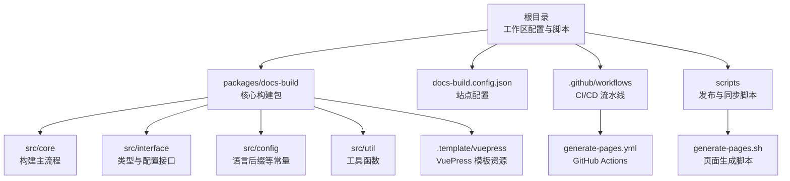
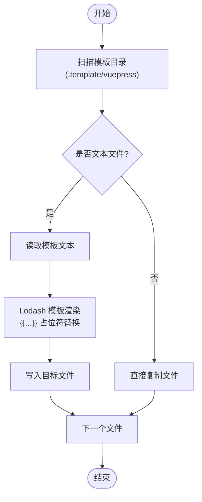
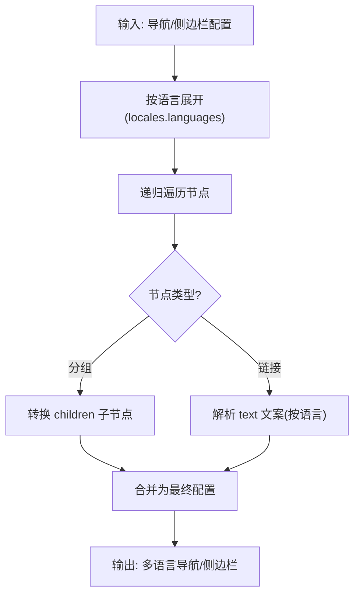
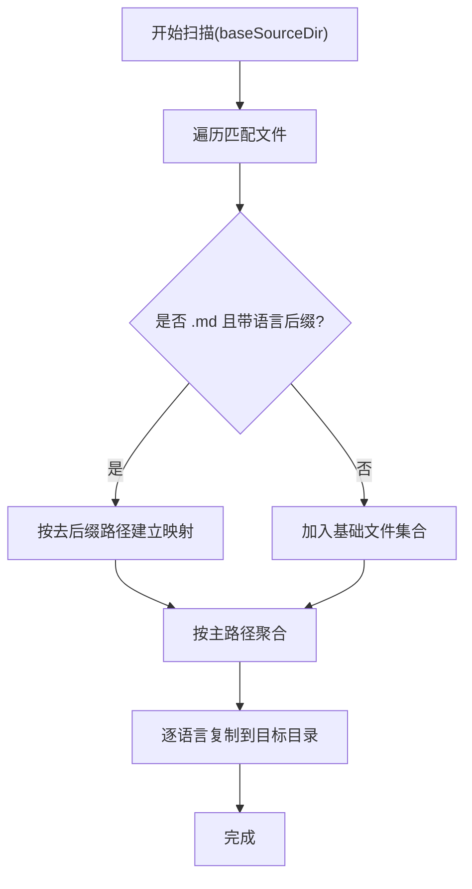
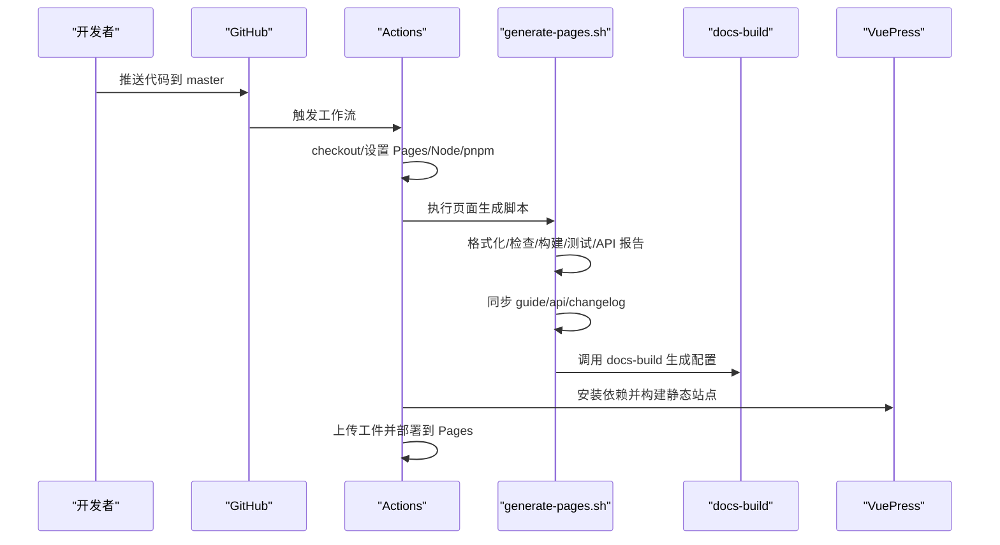
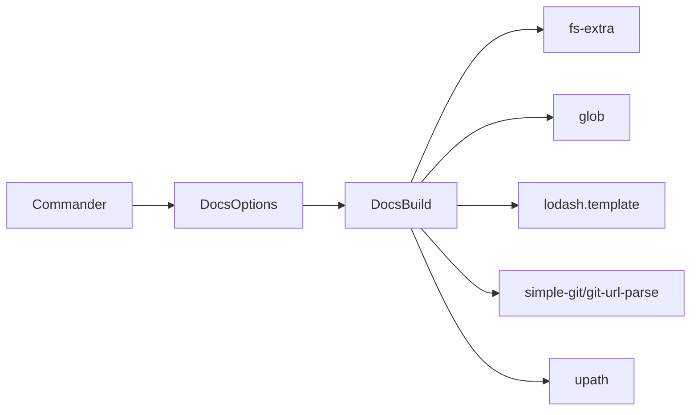

# 高级功能

<cite>
**本文引用的文件**
- [packages/docs-build/package.json](file://packages/docs-build/package.json)
- [packages/docs-build/src/index.ts](file://packages/docs-build/src/index.ts)
- [packages/docs-build/src/core/docs-build.ts](file://packages/docs-build/src/core/docs-build.ts)
- [packages/docs-build/src/core/commander.ts](file://packages/docs-build/src/core/commander.ts)
- [packages/docs-build/src/core/docs-options.ts](file://packages/docs-build/src/core/docs-options.ts)
- [packages/docs-build/src/interface/options.ts](file://packages/docs-build/src/interface/options.ts)
- [packages/docs-build/src/config/index.ts](file://packages/docs-build/src/config/index.ts)
- [packages/docs-build/src/util/index.ts](file://packages/docs-build/src/util/index.ts)
- [docs-build.config.json](file://docs-build.config.json)
- [.github/workflows/generate-pages.yml](file://.github/workflows/generate-pages.yml)
- [scripts/generate-pages.sh](file://scripts/generate-pages.sh)
- [nx.json](file://nx.json)
</cite>

## 目录
1. [简介](#简介)
2. [项目结构](#项目结构)
3. [核心组件](#核心组件)
4. [架构总览](#架构总览)
5. [详细组件分析](#详细组件分析)
6. [依赖分析](#依赖分析)
7. [性能考虑](#性能考虑)
8. [故障排查指南](#故障排查指南)
9. [结论](#结论)
10. [附录](#附录)

## 简介
本章节面向需要深度定制与规模化运维的用户，系统讲解文档构建工具的高级能力：自定义模板系统、变量替换与渲染机制、扩展插件的开发与集成思路、CI/CD 最佳实践（含 GitHub Actions）、文件扫描规则与自定义扫描逻辑、性能优化与大型项目策略，以及若干真实场景下的解决方案与落地建议。

## 项目结构
该仓库采用多包工作区组织，核心构建工具位于 packages/docs-build，配套模板资源位于 .template/vuepress，站点配置位于 docs-build.config.json，CI/CD 使用 GitHub Actions 与脚本配合完成自动化发布。



图示来源
- [packages/docs-build/package.json:1-64](file://packages/docs-build/package.json#L1-L64)
- [docs-build.config.json:1-184](file://docs-build.config.json#L1-L184)
- [.github/workflows/generate-pages.yml:1-71](file://.github/workflows/generate-pages.yml#L1-L71)
- [scripts/generate-pages.sh:1-76](file://scripts/generate-pages.sh#L1-L76)

章节来源
- [packages/docs-build/package.json:1-64](file://packages/docs-build/package.json#L1-L64)
- [docs-build.config.json:1-184](file://docs-build.config.json#L1-L184)
- [.github/workflows/generate-pages.yml:1-71](file://.github/workflows/generate-pages.yml#L1-L71)
- [scripts/generate-pages.sh:1-76](file://scripts/generate-pages.sh#L1-L76)

## 核心组件
- 构建器 DocsBuild：负责解析配置、扫描源文件、复制与多语言映射、渲染模板、注入导航与站点元信息。
- 配置加载器 DocsOptions：负责加载并校验配置文件，确保必要字段存在且格式正确。
- 命令行解析器 Commander：提供 CLI 参数解析，支持指定配置路径与输出目录覆盖。
- 接口与类型：统一约束配置结构，保证类型安全与可维护性。
- 工具模块：读取 package.json、语言后缀匹配等辅助能力。
- 模板系统：内置 .template/vuepress，使用 Lodash 模板引擎进行变量替换与渲染。

章节来源
- [packages/docs-build/src/core/docs-build.ts:1-361](file://packages/docs-build/src/core/docs-build.ts#L1-L361)
- [packages/docs-build/src/core/docs-options.ts:1-68](file://packages/docs-build/src/core/docs-options.ts#L1-L68)
- [packages/docs-build/src/core/commander.ts:1-40](file://packages/docs-build/src/core/commander.ts#L1-L40)
- [packages/docs-build/src/interface/options.ts:1-98](file://packages/docs-build/src/interface/options.ts#L1-L98)
- [packages/docs-build/src/util/index.ts:1-30](file://packages/docs-build/src/util/index.ts#L1-L30)
- [packages/docs-build/src/config/index.ts:1-10](file://packages/docs-build/src/config/index.ts#L1-L10)

## 架构总览
下图展示从命令行到模板渲染与输出的端到端流程，涵盖配置加载、文件扫描与复制、导航与侧边栏多语言转换、模板渲染与最终产物定位。

```mermaid
sequenceDiagram
participant CLI as "命令行"
participant Cmd as "Commander"
participant Opt as "DocsOptions"
participant DB as "DocsBuild"
participant FS as "文件系统"
participant TPL as "模板引擎(Lodash)"
participant OUT as "输出目录"
CLI->>Cmd : 解析参数(-c/--config, -o/--output)
Cmd-->>CLI : 返回配置路径与输出覆盖
CLI->>Opt : 加载并校验配置
Opt-->>CLI : 返回有效配置
CLI->>DB : 初始化构建器并执行(resolve)
DB->>FS : 扫描源目录并按语言映射复制
DB->>DB : 多语言导航/侧边栏转换
DB->>TPL : 读取模板并渲染变量
TPL-->>DB : 渲染后的文件内容
DB->>OUT : 写入输出目录
DB-->>CLI : 返回输出路径与配置文件路径
```

图示来源
- [packages/docs-build/src/core/commander.ts:23-39](file://packages/docs-build/src/core/commander.ts#L23-L39)
- [packages/docs-build/src/core/docs-options.ts:17-27](file://packages/docs-build/src/core/docs-options.ts#L17-L27)
- [packages/docs-build/src/core/docs-build.ts:39-107](file://packages/docs-build/src/core/docs-build.ts#L39-L107)
- [packages/docs-build/src/core/docs-build.ts:310-333](file://packages/docs-build/src/core/docs-build.ts#L310-L333)

章节来源
- [packages/docs-build/src/core/commander.ts:1-40](file://packages/docs-build/src/core/commander.ts#L1-L40)
- [packages/docs-build/src/core/docs-options.ts:1-68](file://packages/docs-build/src/core/docs-options.ts#L1-L68)
- [packages/docs-build/src/core/docs-build.ts:1-361](file://packages/docs-build/src/core/docs-build.ts#L1-L361)

## 详细组件分析

### 自定义模板系统与变量替换
- 模板位置与结构：模板位于 .template/vuepress，构建时通过 glob 遍历模板目录，对 JS/TS/JSON/YAML/MD 等文本文件执行变量替换，其余二进制文件直接复制。
- 变量替换机制：使用 Lodash 模板引擎，占位符语法为双花括号 {{...}}，渲染数据来自站点元信息、导航与侧边栏的多语言转换结果。
- 渲染数据结构：包含 site（title/description/base/repo/locales）与 navigation（navbar/sidebar），均支持多语言键值映射与递归转换。
- 输出产物：最终写入到输出目录的 src/.vuepress 下，供后续 VuePress 构建使用。



图示来源
- [packages/docs-build/src/core/docs-build.ts:310-333](file://packages/docs-build/src/core/docs-build.ts#L310-L333)

章节来源
- [packages/docs-build/src/core/docs-build.ts:310-333](file://packages/docs-build/src/core/docs-build.ts#L310-L333)

### 多语言与导航/侧边栏转换
- 多语言展开：根据 locales.languages 列表为每个语言生成对应导航与侧边栏配置；主语言与非主语言路径与键值不同。
- 文本解析：导航项 text 支持字符串或字典，按当前语言选择对应文案；若无对应语言则回退到第一个可用值。
- 递归转换：导航与侧边栏支持分组与子项，递归遍历并转换每层的 text 与 link 字段。
- 语言后缀匹配：在复制阶段，依据语言后缀（如 .zh-CN.md）进行文件映射与覆盖，主语言基础文件优先。



图示来源
- [packages/docs-build/src/core/docs-build.ts:109-120](file://packages/docs-build/src/core/docs-build.ts#L109-L120)
- [packages/docs-build/src/core/docs-build.ts:226-248](file://packages/docs-build/src/core/docs-build.ts#L226-L248)
- [packages/docs-build/src/core/docs-build.ts:252-305](file://packages/docs-build/src/core/docs-build.ts#L252-L305)
- [packages/docs-build/src/config/index.ts:4-10](file://packages/docs-build/src/config/index.ts#L4-L10)

章节来源
- [packages/docs-build/src/core/docs-build.ts:109-120](file://packages/docs-build/src/core/docs-build.ts#L109-L120)
- [packages/docs-build/src/core/docs-build.ts:226-248](file://packages/docs-build/src/core/docs-build.ts#L226-L248)
- [packages/docs-build/src/core/docs-build.ts:252-305](file://packages/docs-build/src/core/docs-build.ts#L252-L305)
- [packages/docs-build/src/config/index.ts:1-10](file://packages/docs-build/src/config/index.ts#L1-L10)

### 文件扫描规则与自定义扫描逻辑
- 扫描范围：以 baseSourceDir 为根，使用 glob 同步扫描所有文件，忽略常量中定义的模式（如隐藏文件/目录）。
- 语言映射：识别 .md 文件的语言后缀（如 .zh-CN.md），将带后缀文件与基础文件映射到同一目标路径；主语言优先覆盖。
- 复制策略：对每个主路径，按语言分别复制文件，非 md 或无后缀文件按原样复制。
- 自定义扩展：可通过修改 IGNORE_PATTERNS 常量或调整扫描逻辑，实现更细粒度的过滤与重命名策略。



图示来源
- [packages/docs-build/src/core/docs-build.ts:140-205](file://packages/docs-build/src/core/docs-build.ts#L140-L205)

章节来源
- [packages/docs-build/src/core/docs-build.ts:140-205](file://packages/docs-build/src/core/docs-build.ts#L140-L205)

### 扩展插件的开发与集成
- 插件形态：当前工具以“模板渲染 + 配置驱动”的方式工作，未内置插件系统。推荐通过以下方式扩展：
  - 在模板中新增自定义组件或样式，利用渲染数据注入运行时行为。
  - 在构建前后增加自定义脚本（如 API 报告、格式化、测试），在 CI 中串联执行。
  - 通过配置扩展导航与侧边栏，间接引入外部资源或自定义页面。
- 集成建议：将扩展逻辑封装为独立任务，复用现有 CLI 与配置加载流程，避免侵入核心构建器。

章节来源
- [packages/docs-build/src/core/commander.ts:23-39](file://packages/docs-build/src/core/commander.ts#L23-L39)
- [packages/docs-build/src/core/docs-options.ts:17-27](file://packages/docs-build/src/core/docs-options.ts#L17-L27)
- [scripts/generate-pages.sh:12-16](file://scripts/generate-pages.sh#L12-L16)

### CI/CD 集成最佳实践（GitHub Actions）
- 触发条件：监听 master 分支推送与手动触发；并发控制保证部署串行。
- 步骤拆分：准备环境 → 安装依赖 → 运行格式化/检查/构建/测试/API 报告 → 同步各包文档 → 使用 docs-build 生成 VuePress 配置 → 安装并构建 VuePress → 上传工件 → 部署到 Pages。
- 版本与缓存：固定 Node 与 pnpm 版本，确保可重复构建；Nx 的 targetDefaults 与 namedInputs 提升增量构建效率。
- 发布流程：Actions 生成静态站点工件并部署至 GitHub Pages，结合配置中的 site.base 与 repo 信息完善站点元数据。



图示来源
- [.github/workflows/generate-pages.yml:29-71](file://.github/workflows/generate-pages.yml#L29-L71)
- [scripts/generate-pages.sh:12-75](file://scripts/generate-pages.sh#L12-L75)
- [packages/docs-build/src/core/docs-build.ts:39-107](file://packages/docs-build/src/core/docs-build.ts#L39-L107)

章节来源
- [.github/workflows/generate-pages.yml:1-71](file://.github/workflows/generate-pages.yml#L1-L71)
- [scripts/generate-pages.sh:1-76](file://scripts/generate-pages.sh#L1-L76)
- [nx.json:1-32](file://nx.json#L1-L32)

### 高级使用场景与解决方案
- 场景一：多包文档统一生成
  - 方案：在脚本中遍历 packages 目录，将各包的 docs/guide、docs/.markdowns、CHANGELOG.md 同步到 docs/guide、docs/api、docs/changelog，再调用 docs-build。
  - 优势：集中管理、统一输出、便于 CI 统一处理。
- 场景二：多语言站点
  - 方案：在配置中声明 locales.languages，模板中使用渲染数据的 locales 键，导航/侧边栏自动按语言展开。
  - 优势：无需手写多语言版本，减少维护成本。
- 场景三：自定义导航与侧边栏
  - 方案：在 navigation.navbar 与 navigation.sidebar 中定义树形结构，支持 children 与 icon 等属性，工具自动转换语言文本。
  - 优势：灵活表达层级关系，提升用户体验。
- 场景四：模板扩展与组件化
  - 方案：在 .template/vuepress 中新增组件或样式文件，利用渲染数据注入运行时行为；或通过脚本在构建前后插入自定义逻辑。
  - 优势：保持模板一致性的同时实现差异化定制。

章节来源
- [scripts/generate-pages.sh:25-70](file://scripts/generate-pages.sh#L25-L70)
- [docs-build.config.json:9-182](file://docs-build.config.json#L9-L182)
- [packages/docs-build/src/core/docs-build.ts:84-107](file://packages/docs-build/src/core/docs-build.ts#L84-L107)

## 依赖分析
- 内部依赖关系
  - Commander 依赖 util/readPkg 读取包信息，解析 CLI 参数。
  - DocsOptions 依赖 fs-extra 读取与解析配置文件，并进行字段校验。
  - DocsBuild 依赖 DocsOptions 与 Commander 的结果，负责扫描、复制、转换与渲染。
  - 模板渲染依赖 Lodash 模板引擎与 upath 路径处理。
- 外部依赖
  - commander：命令行参数解析。
  - fs-extra：文件系统操作。
  - glob：文件扫描。
  - lodash：模板渲染与深拷贝等工具。
  - simple-git/git-url-parse：从 Git 获取仓库信息。
  - upath：跨平台路径处理。



图示来源
- [packages/docs-build/src/core/commander.ts:1-40](file://packages/docs-build/src/core/commander.ts#L1-L40)
- [packages/docs-build/src/core/docs-options.ts:1-68](file://packages/docs-build/src/core/docs-options.ts#L1-L68)
- [packages/docs-build/src/core/docs-build.ts:1-361](file://packages/docs-build/src/core/docs-build.ts#L1-L361)

章节来源
- [packages/docs-build/src/core/commander.ts:1-40](file://packages/docs-build/src/core/commander.ts#L1-L40)
- [packages/docs-build/src/core/docs-options.ts:1-68](file://packages/docs-build/src/core/docs-options.ts#L1-L68)
- [packages/docs-build/src/core/docs-build.ts:1-361](file://packages/docs-build/src/core/docs-build.ts#L1-L361)

## 性能考虑
- 增量构建与缓存
  - 利用 Nx 的 targetDefaults 与 namedInputs，构建、测试、API 报告等任务具备缓存能力，减少重复执行时间。
  - 通过 dependsOn 与 inputs 控制任务依赖，避免不必要的重建。
- 文件扫描与复制
  - 使用 glob 同步扫描并按语言映射复制，避免重复 IO；忽略模式减少无关文件处理。
- 模板渲染
  - 仅对文本文件执行模板渲染，二进制文件直接复制，降低 CPU 开销。
- CI 并行与串行
  - Actions 中将格式化/检查/构建/测试/API 报告与 VuePress 构建分离，充分利用缓存与并行能力。
- 大型项目策略
  - 将各包文档拆分管理，统一在脚本中同步，减少单次扫描范围。
  - 对于超大仓库，建议在 CI 中启用缓存与增量构建，合理划分任务并行度。

章节来源
- [nx.json:7-25](file://nx.json#L7-L25)
- [packages/docs-build/src/core/docs-build.ts:140-205](file://packages/docs-build/src/core/docs-build.ts#L140-L205)
- [.github/workflows/generate-pages.yml:48-63](file://.github/workflows/generate-pages.yml#L48-L63)

## 故障排查指南
- 配置文件缺失或格式错误
  - 现象：启动时报错提示找不到配置文件或缺少必填字段。
  - 处理：确认配置路径正确，检查 baseSourceDir、site.base、navigation.navbar、navigation.sidebar 是否存在且类型正确。
- Git 信息不可用
  - 现象：站点仓库链接为空。
  - 处理：确保本地存在有效远程仓库配置，或在配置中显式提供 site.repo。
- 多语言文案缺失
  - 现象：导航/侧边栏显示回退文案或空值。
  - 处理：在配置中为每种语言提供完整 text 文案，或确保至少包含一种语言的映射。
- 模板渲染异常
  - 现象：生成的 VuePress 配置文件语法错误。
  - 处理：检查渲染数据结构与模板占位符是否一致，确保渲染数据包含 site 与 navigation 字段。
- CI 构建失败
  - 现象：Actions 中安装依赖或构建阶段报错。
  - 处理：核对 Node 与 pnpm 版本，确保依赖安装顺序与脚本步骤正确；检查输出目录权限与路径。

章节来源
- [packages/docs-build/src/core/docs-options.ts:17-66](file://packages/docs-build/src/core/docs-options.ts#L17-L66)
- [packages/docs-build/src/core/docs-build.ts:338-359](file://packages/docs-build/src/core/docs-build.ts#L338-L359)
- [packages/docs-build/src/core/docs-build.ts:310-333](file://packages/docs-build/src/core/docs-build.ts#L310-L333)
- [.github/workflows/generate-pages.yml:48-63](file://.github/workflows/generate-pages.yml#L48-L63)

## 结论
该工具通过“配置驱动 + 模板渲染”的方式，提供了强大的多语言站点生成能力。结合 Nx 缓存与 Actions 流水线，可在大型项目中实现高效、稳定的文档发布。对于高级用户，建议围绕模板扩展、脚本编排与配置治理来实现更复杂的定制需求。

## 附录
- 关键配置项速览
  - baseSourceDir：源文档根目录
  - site：站点标题、描述、base、语言、仓库
  - locales：启用语言列表
  - navigation.navbar/sidebar：导航与侧边栏结构
  - output：输出目录（可被 CLI 覆盖）

章节来源
- [docs-build.config.json:2-182](file://docs-build.config.json#L2-L182)
- [packages/docs-build/src/interface/options.ts:63-84](file://packages/docs-build/src/interface/options.ts#L63-L84)