# 算法库(@hz-9/algorithm)

<cite>
**本文引用的文件**
- [packages/algorithm/src/index.ts](file://packages/algorithm/src/index.ts)
- [packages/algorithm/src/_base/index.ts](file://packages/algorithm/src/_base/index.ts)
- [packages/algorithm/src/types/index.ts](file://packages/algorithm/src/types/index.ts)
- [packages/algorithm/src/array/array.ts](file://packages/algorithm/src/array/array.ts)
- [packages/algorithm/src/linked-list/_base.linked-list.ts](file://packages/algorithm/src/linked-list/_base.linked-list.ts)
- [packages/algorithm/src/linked-list/singly.linked-list.ts](file://packages/algorithm/src/linked-list/singly.linked-list.ts)
- [packages/algorithm/src/linked-list/doubly.linked-list.ts](file://packages/algorithm/src/linked-list/doubly.linked-list.ts)
- [packages/algorithm/src/stack/_base.stack.ts](file://packages/algorithm/src/stack/_base.stack.ts)
- [packages/algorithm/src/stack/array.stack.ts](file://packages/algorithm/src/stack/array.stack.ts)
- [packages/algorithm/src/stack/linked-list.stack.ts](file://packages/algorithm/src/stack/linked-list.stack.ts)
- [packages/algorithm/src/queue/_base.queue.ts](file://packages/algorithm/src/queue/_base.queue.ts)
- [packages/algorithm/src/queue/_base.deque.ts](file://packages/algorithm/src/queue/_base.deque.ts)
- [packages/algorithm/src/queue/array.queue.ts](file://packages/algorithm/src/queue/array.queue.ts)
- [packages/algorithm/src/queue/linked-list.queue.ts](file://packages/algorithm/src/queue/linked-list.queue.ts)
- [packages/algorithm/src/queue/array.deque.ts](file://packages/algorithm/src/queue/array.deque.ts)
- [packages/algorithm/src/queue/linked-list.deque.ts](file://packages/algorithm/src/queue/linked-list.deque.ts)
- [packages/algorithm/src/binary-tree/_base.tree.ts](file://packages/algorithm/src/binary-tree/_base.tree.ts)
- [packages/algorithm/src/binary-tree/binary-search.tree.ts](file://packages/algorithm/src/binary-tree/binary-search.tree.ts)
- [packages/algorithm/src/binary-tree/adelson-velskii-landi.tree.ts](file://packages/algorithm/src/binary-tree/adelson-velskii-landi.tree.ts)
- [packages/algorithm/src/binary-tree/red-black.tree.ts](file://packages/algorithm/src/binary-tree/red-black.tree.ts)
- [packages/algorithm/src/hashmap/_base.hashmap.ts](file://packages/algorithm/src/hashmap/_base.hashmap.ts)
- [packages/algorithm/src/hashmap/simple.hashmap.ts](file://packages/algorithm/src/hashmap/simple.hashmap.ts)
- [packages/algorithm/src/hashmap/linear-probing.hashmap.ts](file://packages/algorithm/src/hashmap/linear-probing.hashmap.ts)
- [packages/algorithm/src/hashmap/square-probing.hashmap.ts](file://packages/algorithm/src/hashmap/square-probing.hashmap.ts)
- [packages/algorithm/src/hashmap/linked-list.hashmap.ts](file://packages/algorithm/src/hashmap/linked-list.hashmap.ts)
- [packages/algorithm/src/hashmap/better.hashmap.ts](file://packages/algorithm/src/hashmap/better.hashmap.ts)
- [packages/algorithm/src/hashmap/hash-code.ts](file://packages/algorithm/src/hashmap/hash-code.ts)
- [packages/algorithm/src/heap/_base.heap.ts](file://packages/algorithm/src/heap/_base.heap.ts)
- [packages/algorithm/src/heap/max.heap.ts](file://packages/algorithm/src/heap/max.heap.ts)
- [packages/algorithm/src/heap/min.heap.ts](file://packages/algorithm/src/heap/min.heap.ts)
- [packages/algorithm/src/graph/graph.ts](file://packages/algorithm/src/graph/graph.ts)
- [packages/algorithm/src/graph/bfs.graph-walker.ts](file://packages/algorithm/src/graph/bfs.graph-walker.ts)
- [packages/algorithm/src/graph/dfs.graph-walker.ts](file://packages/algorithm/src/graph/dfs.graph-walker.ts)
- [packages/algorithm/src/graph/bfs.shortest-path.ts](file://packages/algorithm/src/graph/bfs.shortest-path.ts)
- [packages/algorithm/src/graph/dfs.shortest-path.ts](file://packages/algorithm/src/graph/dfs.shortest-path.ts)
- [packages/algorithm/src/search/binary.search.ts](file://packages/algorithm/src/search/binary.search.ts)
- [packages/algorithm/src/search/sequential.search.ts](file://packages/algorithm/src/search/sequential.search.ts)
- [packages/algorithm/src/search/interpolation.search.ts](file://packages/algorithm/src/search/interpolation.search.ts)
- [packages/algorithm/src/search/hash.search.ts](file://packages/algorithm/src/search/hash.search.ts)
- [packages/algorithm/src/search/binary-tree.search.ts](file://packages/algorithm/src/search/binary-tree.search.ts)
- [packages/algorithm/src/sort/bubble.sort.ts](file://packages/algorithm/src/sort/bubble.sort.ts)
- [packages/algorithm/src/sort/insertion.sort.ts](file://packages/algorithm/src/sort/insertion.sort.ts)
- [packages/algorithm/src/sort/selection.sort.ts](file://packages/algorithm/src/sort/selection.sort.ts)
- [packages/algorithm/src/sort/merge.sort.ts](file://packages/algorithm/src/sort/merge.sort.ts)
- [packages/algorithm/src/sort/quick.sort.ts](file://packages/algorithm/src/sort/quick.sort.ts)
- [packages/algorithm/src/sort/heap.sort.ts](file://packages/algorithm/src/sort/heap.sort.ts)
- [packages/algorithm/src/sort/counting.sort.ts](file://packages/algorithm/src/sort/counting.sort.ts)
- [packages/algorithm/src/sort/radix.sort.ts](file://packages/algorithm/src/sort/radix.sort.ts)
- [packages/algorithm/src/sort/bucket.sort.ts](file://packages/algorithm/src/sort/bucket.sort.ts)
- [packages/algorithm/src/random/shuffle.random.ts](file://packages/algorithm/src/random/shuffle.random.ts)
- [packages/algorithm/src/set/set-plus.ts](file://packages/algorithm/src/set/set-plus.ts)
- [packages/algorithm/src/test/binary-tree.spec.ts](file://packages/algorithm/src/test/binary-tree.spec.ts)
- [packages/algorithm/src/test/graph.spec.ts](file://packages/algorithm/src/test/graph.spec.ts)
- [packages/algorithm/src/test/hashmap.spec.ts](file://packages/algorithm/src/test/hashmap.spec.ts)
- [packages/algorithm/src/test/heap.spec.ts](file://packages/algorithm/src/test/heap.spec.ts)
- [packages/algorithm/src/test/queue.spec.ts](file://packages/algorithm/src/test/queue.spec.ts)
- [packages/algorithm/src/test/search.spec.ts](file://packages/algorithm/src/test/search.spec.ts)
- [packages/algorithm/src/test/sort.spec.ts](file://packages/algorithm/src/test/sort.spec.ts)
- [packages/algorithm/src/test/stack.spec.ts](file://packages/algorithm/src/test/stack.spec.ts)
- [packages/algorithm/docs/guide/README.md](file://packages/algorithm/docs/guide/README.md)
- [packages/algorithm/docs/guide/README.zh-CN.md](file://packages/algorithm/docs/guide/README.zh-CN.md)
- [packages/algorithm/docs/api/index.api.md](file://packages/algorithm/docs/api/index.api.md)
- [packages/algorithm/package.json](file://packages/algorithm/package.json)
- [packages/algorithm/project.json](file://packages/algorithm/project.json)
- [packages/algorithm/tsconfig.json](file://packages/algorithm/tsconfig.json)
- [packages/algorithm/vite.config.mts](file://packages/algorithm/vite.config.mts)
</cite>

## 目录
1. [引言](#引言)
2. [项目结构](#项目结构)
3. [核心组件](#核心组件)
4. [架构总览](#架构总览)
5. [详细组件分析](#详细组件分析)
6. [依赖关系分析](#依赖关系分析)
7. [性能考虑](#性能考虑)
8. [故障排查指南](#故障排查指南)
9. [结论](#结论)
10. [附录](#附录)

## 引言
本库是一个基于 TypeScript 的 JavaScript 算法与数据结构基础类库，覆盖从基础线性结构（数组、链表、栈、队列）到高级结构（二叉树、哈希表、堆、图），以及排序与搜索算法。库强调模块化设计、清晰的类型约束与可扩展的实现，便于教学与工程实践。本文档旨在帮助不同层次的开发者快速理解设计理念、掌握使用方法，并建立从入门到进阶的学习路径。

## 项目结构
算法库采用按功能域划分的目录组织方式：src 下以“领域/子模块”形式组织，如 array、linked-list、stack、queue、binary-tree、hashmap、heap、graph、search、sort、random、set 等；test 目录下对应单元测试；docs 提供指南与 API 文档；根目录包含构建与配置文件。

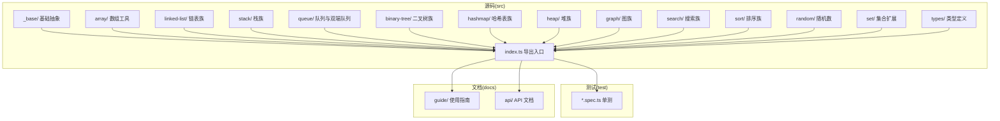

图表来源
- [packages/algorithm/src/index.ts](file://packages/algorithm/src/index.ts)
- [packages/algorithm/src/_base/index.ts](file://packages/algorithm/src/_base/index.ts)
- [packages/algorithm/src/types/index.ts](file://packages/algorithm/src/types/index.ts)

章节来源
- [packages/algorithm/src/index.ts](file://packages/algorithm/src/index.ts)
- [packages/algorithm/src/_base/index.ts](file://packages/algorithm/src/_base/index.ts)
- [packages/algorithm/src/types/index.ts](file://packages/algorithm/src/types/index.ts)

## 核心组件
- 入口导出：通过统一入口导出各模块能力，便于按需引入或整体导入。
- 基础抽象层：为链表、栈、队列、堆、树等提供通用接口与约定，确保实现一致性与可替换性。
- 类型系统：集中定义公共类型，保证跨模块的数据契约一致。
- 测试体系：覆盖所有核心模块，验证正确性与边界条件。

章节来源
- [packages/algorithm/src/index.ts](file://packages/algorithm/src/index.ts)
- [packages/algorithm/src/_base/index.ts](file://packages/algorithm/src/_base/index.ts)
- [packages/algorithm/src/types/index.ts](file://packages/algorithm/src/types/index.ts)

## 架构总览
库采用“领域模块 + 抽象基类 + 统一导出”的分层架构。上层模块通过组合与继承复用抽象基类，降低重复实现成本；测试与文档分别在独立目录维护，保证开发与交付质量。

```mermaid
graph TB
subgraph "抽象层(_base)"
B1["_base.linked-list.ts"]
B2["_base.stack.ts"]
B3["_base.queue.ts"]
B4["_base.heap.ts"]
B5["_base.tree.ts"]
B6["_base.hashmap.ts"]
end
subgraph "具体实现"
L1["singly.linked-list.ts"]
L2["doubly.linked-list.ts"]
S1["array.stack.ts"]
S2["linked-list.stack.ts"]
Q1["array.queue.ts"]
Q2["linked-list.queue.ts"]
Q3["array.deque.ts"]
Q4["linked-list.deque.ts"]
H1["max.heap.ts"]
H2["min.heap.ts"]
T1["binary-search.tree.ts"]
T2["avl.tree.ts"]
T3["red-black.tree.ts"]
HM1["simple.hashmap.ts"]
HM2["linear-probing.hashmap.ts"]
HM3["square-probing.hashmap.ts"]
HM4["linked-list.hashmap.ts"]
HM5["better.hashmap.ts"]
end
B1 --> L1
B1 --> L2
B2 --> S1
B2 --> S2
B3 --> Q1
B3 --> Q2
B3 --> Q3
B3 --> Q4
B4 --> H1
B4 --> H2
B5 --> T1
B5 --> T2
B5 --> T3
B6 --> HM1
B6 --> HM2
B6 --> HM3
B6 --> HM4
B6 --> HM5
```

图表来源
- [packages/algorithm/src/linked-list/_base.linked-list.ts](file://packages/algorithm/src/linked-list/_base.linked-list.ts)
- [packages/algorithm/src/stack/_base.stack.ts](file://packages/algorithm/src/stack/_base.stack.ts)
- [packages/algorithm/src/queue/_base.queue.ts](file://packages/algorithm/src/queue/_base.queue.ts)
- [packages/algorithm/src/queue/_base.deque.ts](file://packages/algorithm/src/queue/_base.deque.ts)
- [packages/algorithm/src/heap/_base.heap.ts](file://packages/algorithm/src/heap/_base.heap.ts)
- [packages/algorithm/src/binary-tree/_base.tree.ts](file://packages/algorithm/src/binary-tree/_base.tree.ts)
- [packages/algorithm/src/hashmap/_base.hashmap.ts](file://packages/algorithm/src/hashmap/_base.hashmap.ts)

## 详细组件分析

### 数组(Array)
- 能力概览：提供数组相关工具函数与常见操作封装，便于与其它模块协作。
- 复杂度特性：视具体操作而定，典型为 O(1)/O(n)。
- 使用建议：结合排序/搜索模块进行组合使用，注意边界检查与空数组处理。

章节来源
- [packages/algorithm/src/array/array.ts](file://packages/algorithm/src/array/array.ts)

### 链表(Linked List)
- 基类与实现：
  - 基类：定义节点结构、遍历、插入、删除等通用行为。
  - 实现：单向链表与双向链表，支持排序链表扩展。
- 复杂度特性：
  - 插入/删除：O(1)（已知节点）
  - 查找/访问：O(n)
- 最佳实践：
  - 优先使用双向链表以支持回溯场景；
  - 注意循环引用与内存释放；
  - 与排序/搜索模块配合时，确保比较器一致。

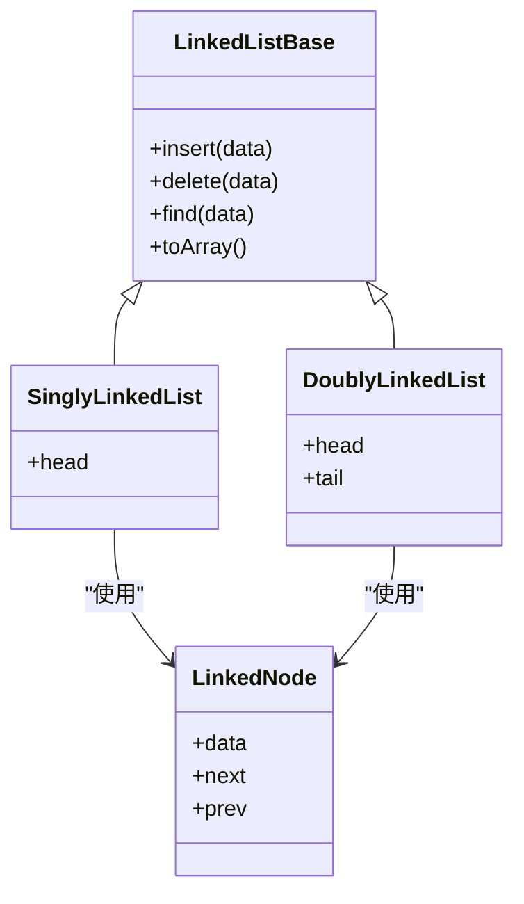

图表来源
- [packages/algorithm/src/linked-list/_base.linked-list.ts](file://packages/algorithm/src/linked-list/_base.linked-list.ts)
- [packages/algorithm/src/linked-list/singly.linked-list.ts](file://packages/algorithm/src/linked-list/singly.linked-list.ts)
- [packages/algorithm/src/linked-list/doubly.linked-list.ts](file://packages/algorithm/src/linked-list/doubly.linked-list.ts)

章节来源
- [packages/algorithm/src/linked-list/_base.linked-list.ts](file://packages/algorithm/src/linked-list/_base.linked-list.ts)
- [packages/algorithm/src/linked-list/singly.linked-list.ts](file://packages/algorithm/src/linked-list/singly.linked-list.ts)
- [packages/algorithm/src/linked-list/doubly.linked-list.ts](file://packages/algorithm/src/linked-list/doubly.linked-list.ts)

### 栈(Stack)
- 基类与实现：
  - 基类：定义 push/pop/top/clear 等标准接口。
  - 实现：数组栈与链表栈，满足不同内存与性能需求。
- 复杂度特性：push/pop/top 均为 O(1)。
- 最佳实践：避免栈溢出；在表达式求值、DFS 等场景中选择合适实现。

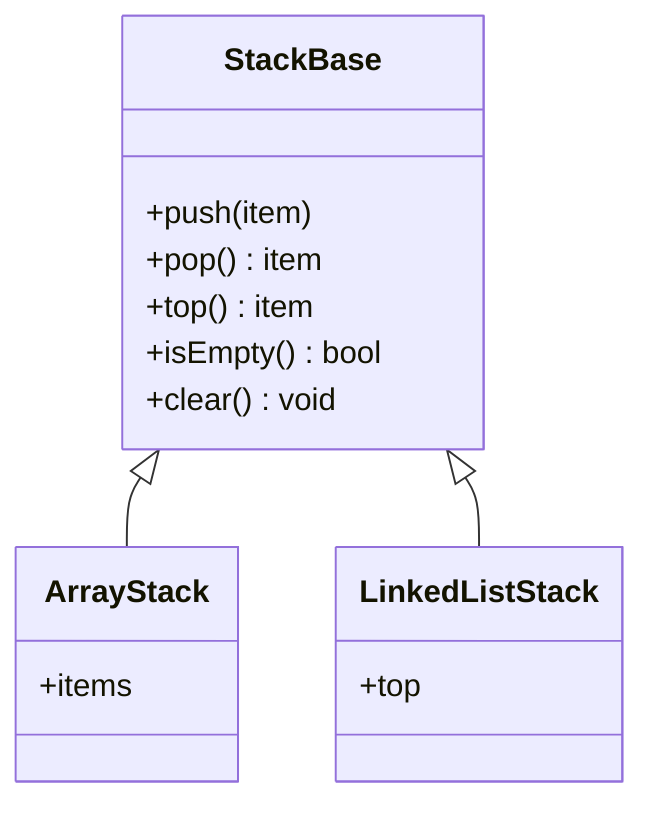

图表来源
- [packages/algorithm/src/stack/_base.stack.ts](file://packages/algorithm/src/stack/_base.stack.ts)
- [packages/algorithm/src/stack/array.stack.ts](file://packages/algorithm/src/stack/array.stack.ts)
- [packages/algorithm/src/stack/linked-list.stack.ts](file://packages/algorithm/src/stack/linked-list.stack.ts)

章节来源
- [packages/algorithm/src/stack/_base.stack.ts](file://packages/algorithm/src/stack/_base.stack.ts)
- [packages/algorithm/src/stack/array.stack.ts](file://packages/algorithm/src/stack/array.stack.ts)
- [packages/algorithm/src/stack/linked-list.stack.ts](file://packages/algorithm/src/stack/linked-list.stack.ts)

### 队列与双端队列(Queue & Deque)
- 基类与实现：
  - 基类：定义 enqueue/dequeue/front/rear 等接口。
  - 实现：数组队列、链表队列、数组双端队列、链表双端队列。
- 复杂度特性：队列操作 O(1)，双端队列两端操作 O(1)。
- 最佳实践：BFS、滑动窗口、任务调度等场景优先考虑双端队列。

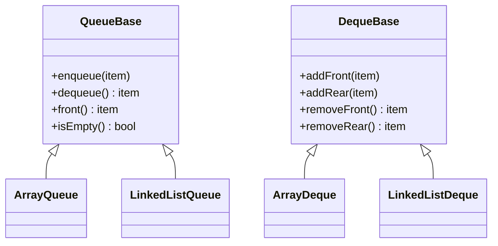

图表来源
- [packages/algorithm/src/queue/_base.queue.ts](file://packages/algorithm/src/queue/_base.queue.ts)
- [packages/algorithm/src/queue/_base.deque.ts](file://packages/algorithm/src/queue/_base.deque.ts)
- [packages/algorithm/src/queue/array.queue.ts](file://packages/algorithm/src/queue/array.queue.ts)
- [packages/algorithm/src/queue/linked-list.queue.ts](file://packages/algorithm/src/queue/linked-list.queue.ts)
- [packages/algorithm/src/queue/array.deque.ts](file://packages/algorithm/src/queue/array.deque.ts)
- [packages/algorithm/src/queue/linked-list.deque.ts](file://packages/algorithm/src/queue/linked-list.deque.ts)

章节来源
- [packages/algorithm/src/queue/_base.queue.ts](file://packages/algorithm/src/queue/_base.queue.ts)
- [packages/algorithm/src/queue/_base.deque.ts](file://packages/algorithm/src/queue/_base.deque.ts)
- [packages/algorithm/src/queue/array.queue.ts](file://packages/algorithm/src/queue/array.queue.ts)
- [packages/algorithm/src/queue/linked-list.queue.ts](file://packages/algorithm/src/queue/linked-list.queue.ts)
- [packages/algorithm/src/queue/array.deque.ts](file://packages/algorithm/src/queue/array.deque.ts)
- [packages/algorithm/src/queue/linked-list.deque.ts](file://packages/algorithm/src/queue/linked-list.deque.ts)

### 二叉树(Binary Tree)
- 基类与实现：
  - 基类：定义节点、遍历、插入、查找、删除等通用逻辑。
  - 实现：二叉搜索树、AVL（自平衡）、红黑树等。
- 复杂度特性：
  - 平衡树：查找/插入/删除 O(log n)
  - 退化树：最坏 O(n)
- 最佳实践：根据数据分布选择自平衡树；注意旋转与颜色标记规则。

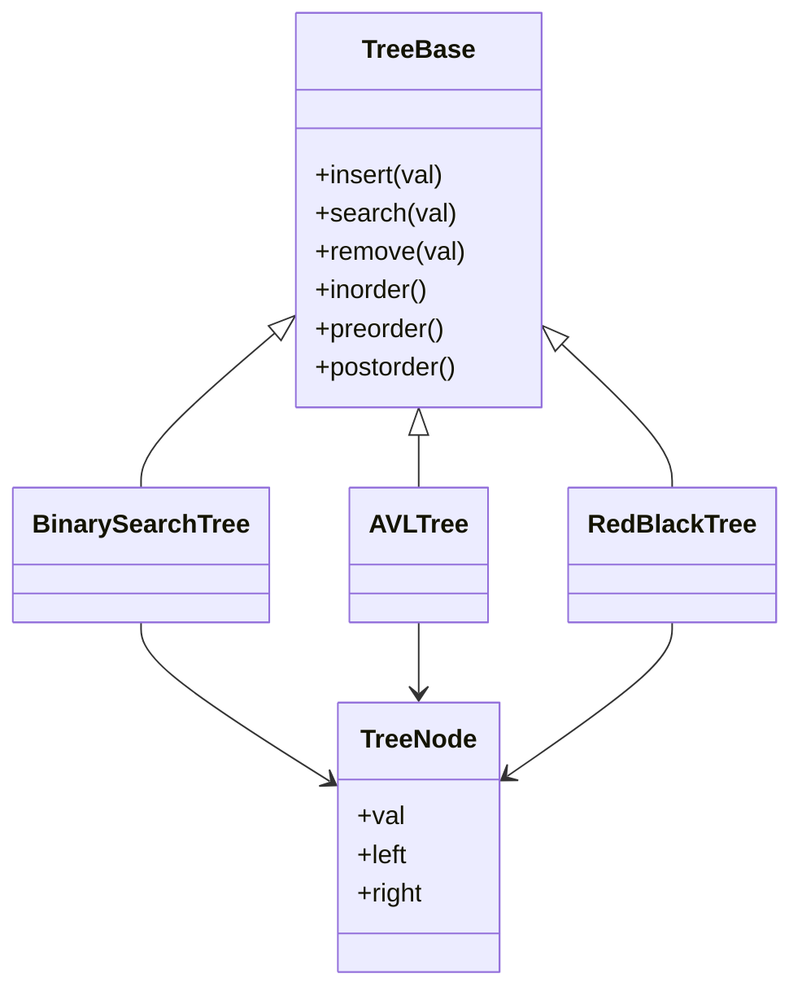

图表来源
- [packages/algorithm/src/binary-tree/_base.tree.ts](file://packages/algorithm/src/binary-tree/_base.tree.ts)
- [packages/algorithm/src/binary-tree/binary-search.tree.ts](file://packages/algorithm/src/binary-tree/binary-search.tree.ts)
- [packages/algorithm/src/binary-tree/adelson-velskii-landi.tree.ts](file://packages/algorithm/src/binary-tree/adelson-velskii-landi.tree.ts)
- [packages/algorithm/src/binary-tree/red-black.tree.ts](file://packages/algorithm/src/binary-tree/red-black.tree.ts)

章节来源
- [packages/algorithm/src/binary-tree/_base.tree.ts](file://packages/algorithm/src/binary-tree/_base.tree.ts)
- [packages/algorithm/src/binary-tree/binary-search.tree.ts](file://packages/algorithm/src/binary-tree/binary-search.tree.ts)
- [packages/algorithm/src/binary-tree/adelson-velskii-landi.tree.ts](file://packages/algorithm/src/binary-tree/adelson-velskii-landi.tree.ts)
- [packages/algorithm/src/binary-tree/red-black.tree.ts](file://packages/algorithm/src/binary-tree/red-black.tree.ts)

### 哈希表(Hash Map)
- 基类与实现：
  - 基类：定义 put/get/remove/keys/values 等接口。
  - 实现：简单散列表、线性探测、平方探测、链式冲突解决、优化版本。
- 复杂度特性：
  - 平均 O(1)，最坏 O(n)
  - 冲突解决策略影响实际性能
- 最佳实践：合理设置容量与装载因子；选择合适冲突解决策略；自定义稳定哈希函数。

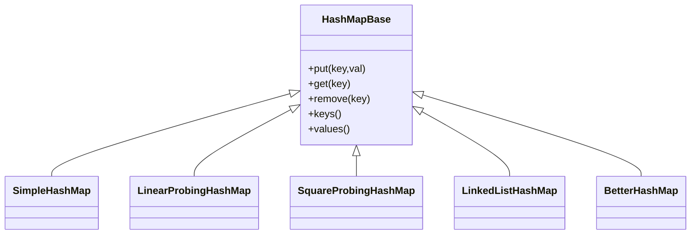

图表来源
- [packages/algorithm/src/hashmap/_base.hashmap.ts](file://packages/algorithm/src/hashmap/_base.hashmap.ts)
- [packages/algorithm/src/hashmap/simple.hashmap.ts](file://packages/algorithm/src/hashmap/simple.hashmap.ts)
- [packages/algorithm/src/hashmap/linear-probing.hashmap.ts](file://packages/algorithm/src/hashmap/linear-probing.hashmap.ts)
- [packages/algorithm/src/hashmap/square-probing.hashmap.ts](file://packages/algorithm/src/hashmap/square-probing.hashmap.ts)
- [packages/algorithm/src/hashmap/linked-list.hashmap.ts](file://packages/algorithm/src/hashmap/linked-list.hashmap.ts)
- [packages/algorithm/src/hashmap/better.hashmap.ts](file://packages/algorithm/src/hashmap/better.hashmap.ts)

章节来源
- [packages/algorithm/src/hashmap/_base.hashmap.ts](file://packages/algorithm/src/hashmap/_base.hashmap.ts)
- [packages/algorithm/src/hashmap/simple.hashmap.ts](file://packages/algorithm/src/hashmap/simple.hashmap.ts)
- [packages/algorithm/src/hashmap/linear-probing.hashmap.ts](file://packages/algorithm/src/hashmap/linear-probing.hashmap.ts)
- [packages/algorithm/src/hashmap/square-probing.hashmap.ts](file://packages/algorithm/src/hashmap/square-probing.hashmap.ts)
- [packages/algorithm/src/hashmap/linked-list.hashmap.ts](file://packages/algorithm/src/hashmap/linked-list.hashmap.ts)
- [packages/algorithm/src/hashmap/better.hashmap.ts](file://packages/algorithm/src/hashmap/better.hashmap.ts)

### 堆(Heap)
- 基类与实现：
  - 基类：定义堆化、插入、弹出、peek 等接口。
  - 实现：最大堆与最小堆。
- 复杂度特性：插入/删除 O(log n)，peek O(1)。
- 最佳实践：用于优先队列、Top-K、调度等场景；注意堆序维护。

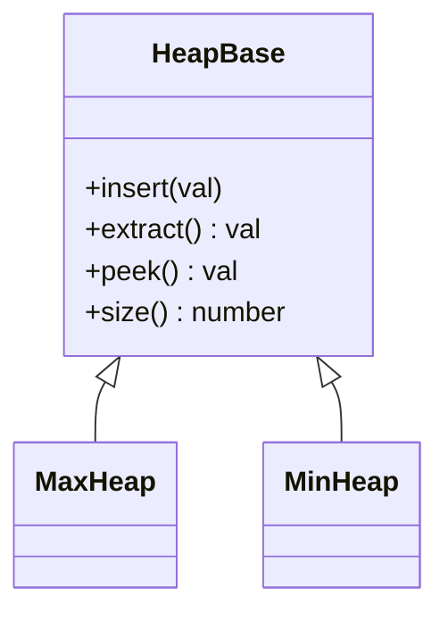

图表来源
- [packages/algorithm/src/heap/_base.heap.ts](file://packages/algorithm/src/heap/_base.heap.ts)
- [packages/algorithm/src/heap/max.heap.ts](file://packages/algorithm/src/heap/max.heap.ts)
- [packages/algorithm/src/heap/min.heap.ts](file://packages/algorithm/src/heap/min.heap.ts)

章节来源
- [packages/algorithm/src/heap/_base.heap.ts](file://packages/algorithm/src/heap/_base.heap.ts)
- [packages/algorithm/src/heap/max.heap.ts](file://packages/algorithm/src/heap/max.heap.ts)
- [packages/algorithm/src/heap/min.heap.ts](file://packages/algorithm/src/heap/min.heap.ts)

### 图(Graph)
- 组件与实现：
  - 图结构：邻接表/邻接矩阵表示。
  - 遍历：广度优先、深度优先。
  - 最短路：BFS/DFS 最短路（无权图）。
- 复杂度特性：遍历 O(V+E)，最短路 O(V+E)。
- 最佳实践：根据边稀疏性选择邻接表；注意访问标记与重置。

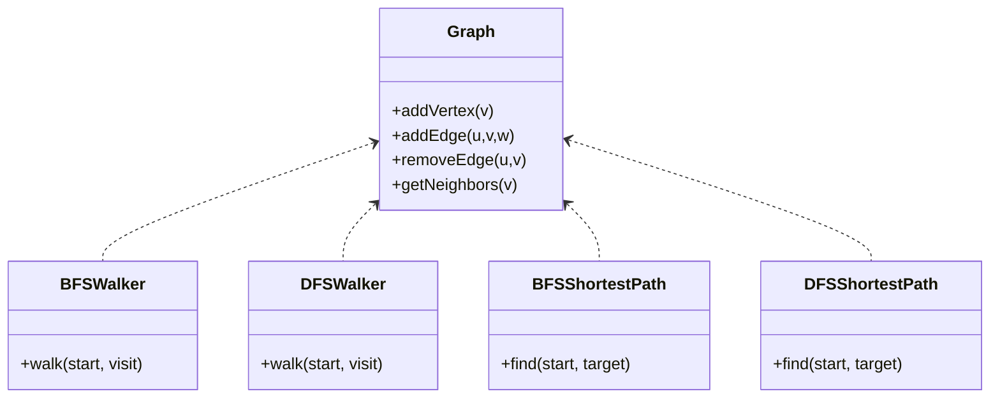

图表来源
- [packages/algorithm/src/graph/graph.ts](file://packages/algorithm/src/graph/graph.ts)
- [packages/algorithm/src/graph/bfs.graph-walker.ts](file://packages/algorithm/src/graph/bfs.graph-walker.ts)
- [packages/algorithm/src/graph/dfs.graph-walker.ts](file://packages/algorithm/src/graph/dfs.graph-walker.ts)
- [packages/algorithm/src/graph/bfs.shortest-path.ts](file://packages/algorithm/src/graph/bfs.shortest-path.ts)
- [packages/algorithm/src/graph/dfs.shortest-path.ts](file://packages/algorithm/src/graph/dfs.shortest-path.ts)

章节来源
- [packages/algorithm/src/graph/graph.ts](file://packages/algorithm/src/graph/graph.ts)
- [packages/algorithm/src/graph/bfs.graph-walker.ts](file://packages/algorithm/src/graph/bfs.graph-walker.ts)
- [packages/algorithm/src/graph/dfs.graph-walker.ts](file://packages/algorithm/src/graph/dfs.graph-walker.ts)
- [packages/algorithm/src/graph/bfs.shortest-path.ts](file://packages/algorithm/src/graph/bfs.shortest-path.ts)
- [packages/algorithm/src/graph/dfs.shortest-path.ts](file://packages/algorithm/src/graph/dfs.shortest-path.ts)

### 搜索(Search)
- 实现：顺序搜索、二分搜索、插值搜索、哈希搜索、二叉树搜索。
- 复杂度特性：
  - 顺序：O(n)
  - 二分/插值：有序前提下 O(log n)
  - 哈希：平均 O(1)
  - 二叉搜索树：平衡 O(log n)，退化 O(n)
- 最佳实践：数据有序时优先二分/插值；树搜索需保证树平衡。

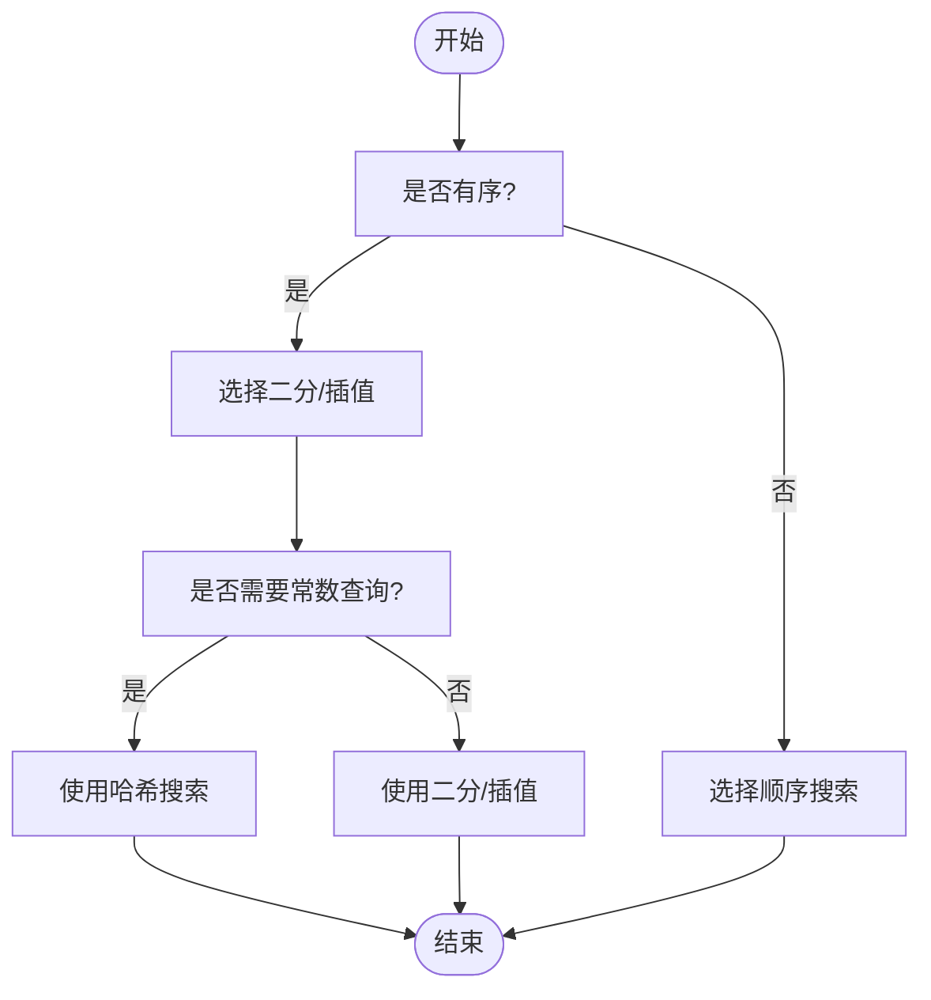

图表来源
- [packages/algorithm/src/search/binary.search.ts](file://packages/algorithm/src/search/binary.search.ts)
- [packages/algorithm/src/search/sequential.search.ts](file://packages/algorithm/src/search/sequential.search.ts)
- [packages/algorithm/src/search/interpolation.search.ts](file://packages/algorithm/src/search/interpolation.search.ts)
- [packages/algorithm/src/search/hash.search.ts](file://packages/algorithm/src/search/hash.search.ts)
- [packages/algorithm/src/search/binary-tree.search.ts](file://packages/algorithm/src/search/binary-tree.search.ts)

章节来源
- [packages/algorithm/src/search/binary.search.ts](file://packages/algorithm/src/search/binary.search.ts)
- [packages/algorithm/src/search/sequential.search.ts](file://packages/algorithm/src/search/sequential.search.ts)
- [packages/algorithm/src/search/interpolation.search.ts](file://packages/algorithm/src/search/interpolation.search.ts)
- [packages/algorithm/src/search/hash.search.ts](file://packages/algorithm/src/search/hash.search.ts)
- [packages/algorithm/src/search/binary-tree.search.ts](file://packages/algorithm/src/search/binary-tree.search.ts)

### 排序(Sort)
- 实现：冒泡、插入、选择、归并、快排、堆排、计数、基数、桶排。
- 复杂度特性：
  - 比较排序：O(n log n) 或 O(n^2)
  - 非比较排序：计数/基数/桶排 O(n+k)
- 最佳实践：小规模用插入；大规模随机用快排；稳定需求用归并；非负整数范围有限用计数/基数。

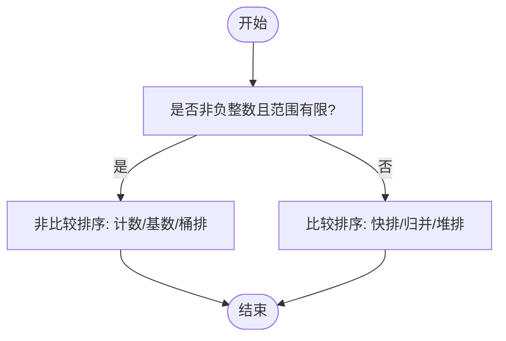

图表来源
- [packages/algorithm/src/sort/bubble.sort.ts](file://packages/algorithm/src/sort/bubble.sort.ts)
- [packages/algorithm/src/sort/insertion.sort.ts](file://packages/algorithm/src/sort/insertion.sort.ts)
- [packages/algorithm/src/sort/selection.sort.ts](file://packages/algorithm/src/sort/selection.sort.ts)
- [packages/algorithm/src/sort/merge.sort.ts](file://packages/algorithm/src/sort/merge.sort.ts)
- [packages/algorithm/src/sort/quick.sort.ts](file://packages/algorithm/src/sort/quick.sort.ts)
- [packages/algorithm/src/sort/heap.sort.ts](file://packages/algorithm/src/sort/heap.sort.ts)
- [packages/algorithm/src/sort/counting.sort.ts](file://packages/algorithm/src/sort/counting.sort.ts)
- [packages/algorithm/src/sort/radix.sort.ts](file://packages/algorithm/src/sort/radix.sort.ts)
- [packages/algorithm/src/sort/bucket.sort.ts](file://packages/algorithm/src/sort/bucket.sort.ts)

章节来源
- [packages/algorithm/src/sort/bubble.sort.ts](file://packages/algorithm/src/sort/bubble.sort.ts)
- [packages/algorithm/src/sort/insertion.sort.ts](file://packages/algorithm/src/sort/insertion.sort.ts)
- [packages/algorithm/src/sort/selection.sort.ts](file://packages/algorithm/src/sort/selection.sort.ts)
- [packages/algorithm/src/sort/merge.sort.ts](file://packages/algorithm/src/sort/merge.sort.ts)
- [packages/algorithm/src/sort/quick.sort.ts](file://packages/algorithm/src/sort/quick.sort.ts)
- [packages/algorithm/src/sort/heap.sort.ts](file://packages/algorithm/src/sort/heap.sort.ts)
- [packages/algorithm/src/sort/counting.sort.ts](file://packages/algorithm/src/sort/counting.sort.ts)
- [packages/algorithm/src/sort/radix.sort.ts](file://packages/algorithm/src/sort/radix.sort.ts)
- [packages/algorithm/src/sort/bucket.sort.ts](file://packages/algorithm/src/sort/bucket.sort.ts)

### 随机(Random)
- 能力概览：提供洗牌等随机化工具，保障随机性与性能。
- 复杂度特性：通常 O(n)。
- 最佳实践：使用高质量随机源；避免偏见。

章节来源
- [packages/algorithm/src/random/shuffle.random.ts](file://packages/algorithm/src/random/shuffle.random.ts)

### 集合(Set)
- 能力概览：集合运算扩展，便于与哈希表/树结合使用。
- 复杂度特性：依赖底层实现，一般 O(1)/O(log n)。
- 最佳实践：根据数据规模与查询模式选择合适容器。

章节来源
- [packages/algorithm/src/set/set-plus.ts](file://packages/algorithm/src/set/set-plus.ts)

## 依赖关系分析
- 模块内聚：各领域模块内部高内聚，通过基类抽象共享行为。
- 模块耦合：低耦合，仅在类型层面存在弱耦合；运行时通过统一入口导出。
- 外部依赖：无运行时外部依赖，构建与测试工具由根工程统一管理。

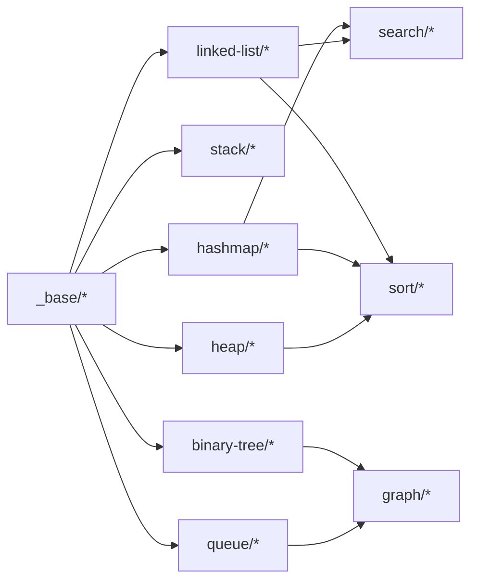

图表来源
- [packages/algorithm/src/_base/index.ts](file://packages/algorithm/src/_base/index.ts)
- [packages/algorithm/src/linked-list/_base.linked-list.ts](file://packages/algorithm/src/linked-list/_base.linked-list.ts)
- [packages/algorithm/src/stack/_base.stack.ts](file://packages/algorithm/src/stack/_base.stack.ts)
- [packages/algorithm/src/queue/_base.queue.ts](file://packages/algorithm/src/queue/_base.queue.ts)
- [packages/algorithm/src/queue/_base.deque.ts](file://packages/algorithm/src/queue/_base.deque.ts)
- [packages/algorithm/src/hashmap/_base.hashmap.ts](file://packages/algorithm/src/hashmap/_base.hashmap.ts)
- [packages/algorithm/src/heap/_base.heap.ts](file://packages/algorithm/src/heap/_base.heap.ts)
- [packages/algorithm/src/binary-tree/_base.tree.ts](file://packages/algorithm/src/binary-tree/_base.tree.ts)
- [packages/algorithm/src/graph/graph.ts](file://packages/algorithm/src/graph/graph.ts)
- [packages/algorithm/src/search/binary-tree.search.ts](file://packages/algorithm/src/search/binary-tree.search.ts)
- [packages/algorithm/src/sort/quick.sort.ts](file://packages/algorithm/src/sort/quick.sort.ts)

章节来源
- [packages/algorithm/src/index.ts](file://packages/algorithm/src/index.ts)
- [packages/algorithm/src/_base/index.ts](file://packages/algorithm/src/_base/index.ts)

## 性能考虑
- 时间复杂度：各模块在文件头部注释或类型定义中明确标注；使用时应结合数据规模与访问模式选择合适实现。
- 空间复杂度：链表/树/图等结构的空间开销与节点数量成正比；哈希表需关注装载因子与冲突策略。
- 优化建议：
  - 优先使用自平衡树或哈希表以获得更稳定的性能。
  - 在高频调用场景中，尽量避免频繁扩容与重建。
  - 对于大规模数据，优先采用非比较排序（计数/基数/桶排）。

## 故障排查指南
- 常见问题：
  - 空指针/越界：检查链表/数组边界与空节点判断。
  - 树不平衡：确认自平衡策略是否启用或手动旋转。
  - 哈希冲突：调整容量与装载因子，或更换冲突解决策略。
  - 图遍历死循环：确保访问标记正确设置与重置。
- 调试建议：
  - 使用单元测试定位问题；
  - 打印中间状态（如树的中序序列、图的邻接关系）；
  - 分模块隔离验证（先验证基础结构再组合使用）。

章节来源
- [packages/algorithm/src/test/binary-tree.spec.ts](file://packages/algorithm/src/test/binary-tree.spec.ts)
- [packages/algorithm/src/test/graph.spec.ts](file://packages/algorithm/src/test/graph.spec.ts)
- [packages/algorithm/src/test/hashmap.spec.ts](file://packages/algorithm/src/test/hashmap.spec.ts)
- [packages/algorithm/src/test/heap.spec.ts](file://packages/algorithm/src/test/heap.spec.ts)
- [packages/algorithm/src/test/queue.spec.ts](file://packages/algorithm/src/test/queue.spec.ts)
- [packages/algorithm/src/test/search.spec.ts](file://packages/algorithm/src/test/search.spec.ts)
- [packages/algorithm/src/test/sort.spec.ts](file://packages/algorithm/src/test/sort.spec.ts)
- [packages/algorithm/src/test/stack.spec.ts](file://packages/algorithm/src/test/stack.spec.ts)

## 结论
该算法库以模块化与抽象化为核心设计思想，覆盖主流数据结构与算法，具备良好的可读性、可扩展性与工程适用性。建议初学者从基础结构入手，逐步过渡到高级结构与算法；工程实践中应结合性能与业务特征选择合适实现，并通过完善的测试保障质量。

## 附录
- 使用指南与 API 文档：参见 docs/guide 与 docs/api。
- 构建与配置：参考根工程的构建脚本与配置文件。

章节来源
- [packages/algorithm/docs/guide/README.md](file://packages/algorithm/docs/guide/README.md)
- [packages/algorithm/docs/guide/README.zh-CN.md](file://packages/algorithm/docs/guide/README.zh-CN.md)
- [packages/algorithm/docs/api/index.api.md](file://packages/algorithm/docs/api/index.api.md)
- [packages/algorithm/package.json](file://packages/algorithm/package.json)
- [packages/algorithm/project.json](file://packages/algorithm/project.json)
- [packages/algorithm/tsconfig.json](file://packages/algorithm/tsconfig.json)
- [packages/algorithm/vite.config.mts](file://packages/algorithm/vite.config.mts)