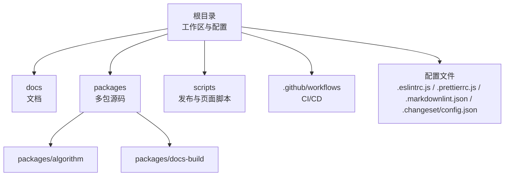
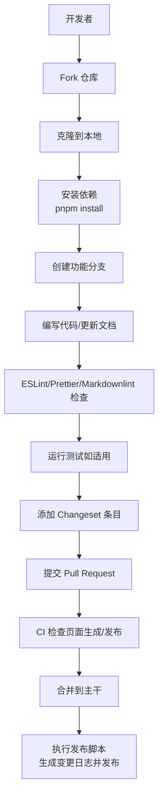
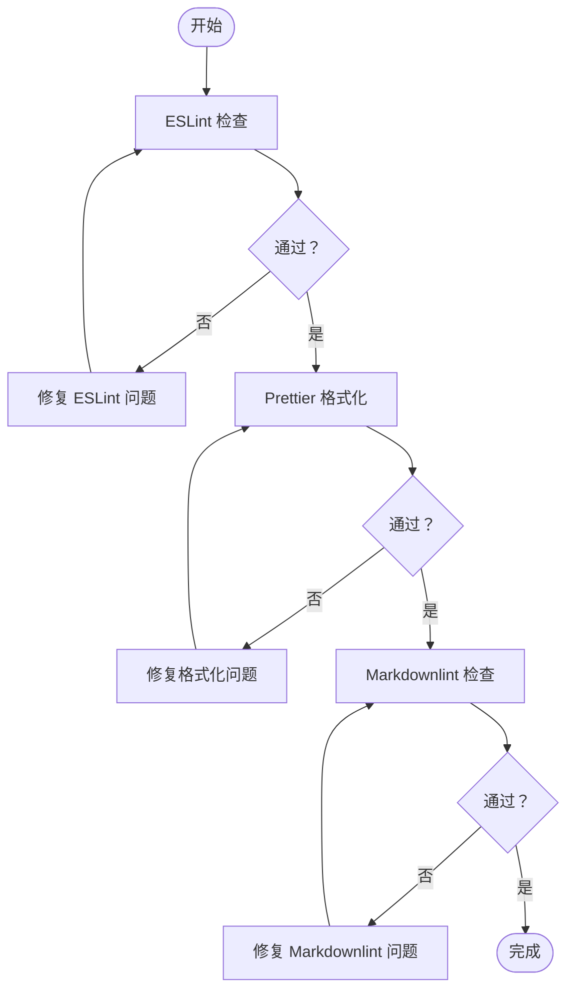
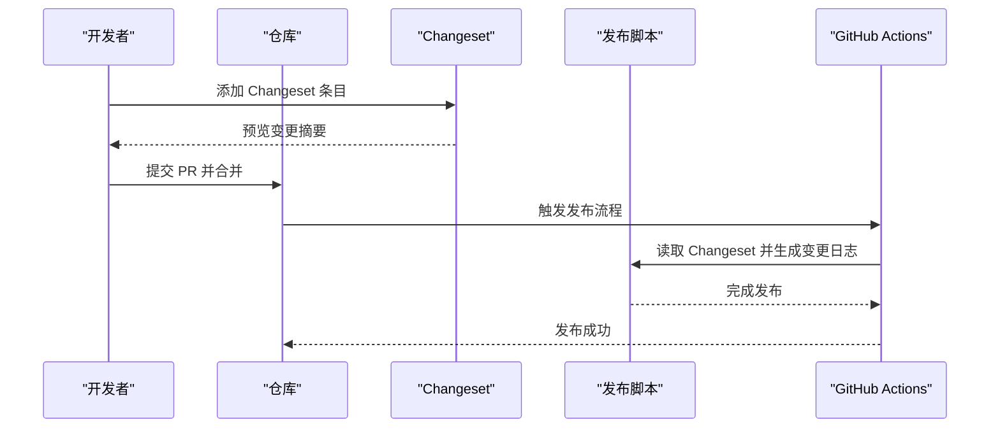
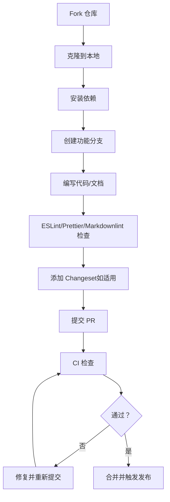
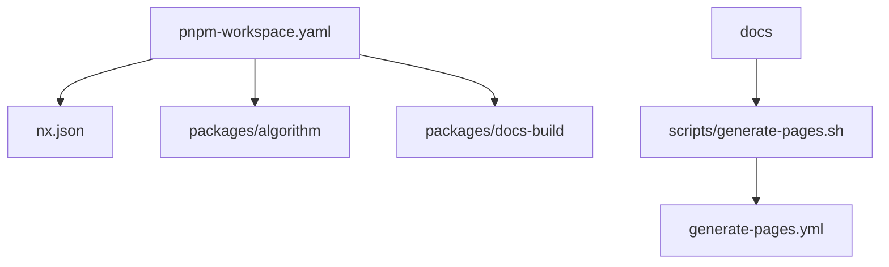

# 贡献指南

<cite>
**本文引用的文件**
- [README.md](file://README.md)
- [README.zh-CN.md](file://README.zh-CN.md)
- [.eslintrc.js](file://.eslintrc.js)
- [.eslintignore](file://.eslintignore)
- [.prettierrc.js](file://.prettierrc.js)
- [.prettierignore](file://.prettierignore)
- [.markdownlint.json](file://.markdownlint.json)
- [.changeset/config.json](file://.changeset/config.json)
- [scripts/release.sh](file://scripts/release.sh)
- [scripts/generate-pages.sh](file://scripts/generate-pages.sh)
- [.github/workflows/generate-pages.yml](file://.github/workflows/generate-pages.yml)
- [commitlint.config.js](file://commitlint.config.js)
- [nx.json](file://nx.json)
- [pnpm-workspace.yaml](file://pnpm-workspace.yaml)
- [package.json](file://package.json)
</cite>

## 目录
1. [简介](#简介)
2. [项目结构](#项目结构)
3. [核心组件](#核心组件)
4. [架构总览](#架构总览)
5. [详细组件分析](#详细组件分析)
6. [依赖分析](#依赖分析)
7. [性能考虑](#性能考虑)
8. [故障排除指南](#故障排除指南)
9. [结论](#结论)
10. [附录](#附录)

## 简介
本贡献指南面向HZ 9 Tool项目的开发者与维护者，旨在帮助新贡献者快速上手、规范协作并高质量交付代码。内容涵盖：
- 开发流程：从 Fork 到提交 Pull Request 的完整步骤
- 代码规范与质量标准：ESLint、Prettier、Markdownlint
- 测试与覆盖率要求（如适用）
- 变更集（Changeset）与版本发布流程
- 问题报告模板与最佳实践
- 社区行为准则与沟通指南
- 常见问题解答

## 项目结构
HZ 9 Tool采用多包工作区（monorepo）组织方式，使用 pnpm 工作区与 Nx 进行统一管理。关键目录与文件：
- 根目录配置：ESLint、Prettier、Markdownlint、Changeset、Commitlint、Nx、工作区定义等
- 包目录：packages 下包含算法与文档构建工具等子包
- 文档：docs 目录包含面向开发者与概览的文档
- 脚本：scripts 提供发布与页面生成脚本
- GitHub Actions：自动化页面生成与发布流程

**图表来源**
- [pnpm-workspace.yaml](file://pnpm-workspace.yaml)
- [nx.json](file://nx.json)
- [packages/algorithm](file://packages/algorithm)
- [packages/docs-build](file://packages/docs-build)
- [scripts/release.sh](file://scripts/release.sh)
- [scripts/generate-pages.sh](file://scripts/generate-pages.sh)
- [.github/workflows/generate-pages.yml](file://.github/workflows/generate-pages.yml)
- [.eslintrc.js](file://.eslintrc.js)
- [.prettierrc.js](file://.prettierrc.js)
- [.markdownlint.json](file://.markdownlint.json)
- [.changeset/config.json](file://.changeset/config.json)

**章节来源**
- [pnpm-workspace.yaml](file://pnpm-workspace.yaml)
- [nx.json](file://nx.json)
- [README.md](file://README.md)
- [README.zh-CN.md](file://README.zh-CN.md)

## 核心组件
- 代码质量工具链
  - ESLint：统一 JavaScript/TypeScript 规范，确保团队一致的编码风格与静态检查
  - Prettier：自动格式化，减少代码风格分歧
  - Markdownlint：保证文档一致性与可读性
- 版本与变更管理
  - Changeset：在合并前记录用户可见的变更摘要，驱动语义化版本与发布
- 自动化与发布
  - Release 脚本：根据 Changeset 生成变更日志并执行发布
  - 页面生成脚本：用于文档站点的构建与部署
  - GitHub Actions：自动化页面生成与发布流程
- 提交规范
  - Commitlint：约束提交信息格式，便于自动生成变更日志与版本号

**章节来源**
- [.eslintrc.js](file://.eslintrc.js)
- [.eslintignore](file://.eslintignore)
- [.prettierrc.js](file://.prettierrc.js)
- [.prettierignore](file://.prettierignore)
- [.markdownlint.json](file://.markdownlint.json)
- [.changeset/config.json](file://.changeset/config.json)
- [scripts/release.sh](file://scripts/release.sh)
- [scripts/generate-pages.sh](file://scripts/generate-pages.sh)
- [.github/workflows/generate-pages.yml](file://.github/workflows/generate-pages.yml)
- [commitlint.config.js](file://commitlint.config.js)

## 架构总览
下图展示了贡献流程的关键节点与自动化流程：

**图表来源**
- [.changeset/config.json](file://.changeset/config.json)
- [scripts/release.sh](file://scripts/release.sh)
- [.github/workflows/generate-pages.yml](file://.github/workflows/generate-pages.yml)

## 详细组件分析

### 代码规范与质量标准
- ESLint
  - 作用：统一代码风格、发现潜在问题
  - 忽略规则：通过忽略文件控制不参与检查的文件或目录
  - 建议：在提交前运行检查命令，修复所有警告与错误
- Prettier
  - 作用：自动格式化，统一缩进、引号、换行等
  - 忽略规则：通过忽略文件控制特定类型或目录不被格式化
  - 建议：在 IDE 中启用保存时自动格式化，或在提交前统一格式化
- Markdownlint
  - 作用：校验文档格式与一致性
  - 配置：通过配置文件定义规则与例外
  - 建议：在提交文档类更改前运行检查，避免 CI 失败

**图表来源**
- [.eslintrc.js](file://.eslintrc.js)
- [.eslintignore](file://.eslintignore)
- [.prettierrc.js](file://.prettierrc.js)
- [.prettierignore](file://.prettierignore)
- [.markdownlint.json](file://.markdownlint.json)

**章节来源**
- [.eslintrc.js](file://.eslintrc.js)
- [.eslintignore](file://.eslintignore)
- [.prettierrc.js](file://.prettierrc.js)
- [.prettierignore](file://.prettierignore)
- [.markdownlint.json](file://.markdownlint.json)

### 变更集（Changeset）与版本发布流程
- Changeset 用途
  - 记录面向用户的变更摘要，驱动语义化版本与发布
  - 在合并前由贡献者添加，避免遗漏重要信息
- 发布流程
  - 合并后由自动化流程读取 Changeset，生成变更日志
  - 执行发布脚本，完成版本号提升与发布
- 最佳实践
  - 每个功能或修复只对应一个 Changeset
  - 使用清晰、简洁的语言描述变更影响面与迁移提示（如适用）

**图表来源**
- [.changeset/config.json](file://.changeset/config.json)
- [scripts/release.sh](file://scripts/release.sh)
- [.github/workflows/generate-pages.yml](file://.github/workflows/generate-pages.yml)

**章节来源**
- [.changeset/config.json](file://.changeset/config.json)
- [scripts/release.sh](file://scripts/release.sh)
- [.github/workflows/generate-pages.yml](file://.github/workflows/generate-pages.yml)

### 提交信息规范（Commitlint）
- 目的：统一提交信息格式，便于自动生成变更日志与追踪
- 建议：遵循约定式提交风格，包含类型、范围与简要描述
- 工具：通过 Commitlint 配置进行校验

**章节来源**
- [commitlint.config.js](file://commitlint.config.js)

### 开发流程（从 Fork 到 PR）
- Fork 仓库并克隆到本地
- 安装依赖（使用 pnpm）
- 创建功能分支
- 编写代码与文档，遵守 ESLint、Prettier、Markdownlint 规范
- 如有需要，添加 Changeset 条目
- 提交 PR，等待 CI 检查与审查
- 合并后由自动化流程执行发布

**图表来源**
- [.eslintrc.js](file://.eslintrc.js)
- [.prettierrc.js](file://.prettierrc.js)
- [.markdownlint.json](file://.markdownlint.json)
- [.changeset/config.json](file://.changeset/config.json)
- [.github/workflows/generate-pages.yml](file://.github/workflows/generate-pages.yml)

## 依赖分析
- 工作区与包管理
  - pnpm 工作区：统一管理多包依赖与脚本
  - Nx：统一构建、测试与任务编排
- 包结构
  - packages/algorithm：核心算法实现
  - packages/docs-build：文档构建工具
- 文档与站点
  - docs：开发者与概览文档
  - generate-pages.sh：页面生成脚本
  - generate-pages.yml：页面生成与部署的自动化流程

**图表来源**
- [pnpm-workspace.yaml](file://pnpm-workspace.yaml)
- [nx.json](file://nx.json)
- [packages/algorithm](file://packages/algorithm)
- [packages/docs-build](file://packages/docs-build)
- [scripts/generate-pages.sh](file://scripts/generate-pages.sh)
- [.github/workflows/generate-pages.yml](file://.github/workflows/generate-pages.yml)

**章节来源**
- [pnpm-workspace.yaml](file://pnpm-workspace.yaml)
- [nx.json](file://nx.json)
- [README.md](file://README.md)
- [README.zh-CN.md](file://README.zh-CN.md)

## 性能考虑
- 在本地运行 ESLint、Prettier、Markdownlint 时，优先使用增量检查与缓存策略，减少等待时间
- 对大型文档或复杂包，建议分模块提交，降低单次检查与 CI 时间
- 合理使用 Changeset，避免一次性堆积过多条目导致发布流程耗时

## 故障排除指南
- ESLint/Prettier/Markdownlint 失败
  - 检查是否已按配置运行工具
  - 查看忽略文件，确认未误排除必要文件
- Changeset 未生效
  - 确认已正确添加 Changeset 条目
  - 检查发布脚本与自动化流程是否正常
- CI 失败
  - 查看工作流日志，定位失败阶段
  - 确认本地已复现并修复问题

**章节来源**
- [.eslintrc.js](file://.eslintrc.js)
- [.prettierrc.js](file://.prettierrc.js)
- [.markdownlint.json](file://.markdownlint.json)
- [.changeset/config.json](file://.changeset/config.json)
- [.github/workflows/generate-pages.yml](file://.github/workflows/generate-pages.yml)

## 结论
通过遵循本贡献指南，您可以高效地参与 HZ 9 Tool 项目的开发与维护。请始终关注代码质量、文档一致性与变更透明度，并配合 Changeset 与自动化流程，确保每次改动都能被清晰记录与安全发布。

## 附录

### 问题报告模板与最佳实践
- 模板建议
  - 标题：简明扼要描述问题
  - 环境：操作系统、Node 版本、包版本
  - 复现步骤：最小可复现步骤
  - 预期结果：期望的行为
  - 实际结果：实际出现的问题
  - 日志与截图：有助于定位问题的信息
- 最佳实践
  - 先搜索历史 issue，避免重复
  - 提供最小可复现示例
  - 描述问题对业务的影响与紧急程度

### 社区行为准则与沟通指南
- 行为准则
  - 尊重与包容：尊重不同背景与观点
  - 建设性反馈：提出具体、可操作的建议
  - 积极协作：主动协助他人解决问题
- 沟通渠道
  - 使用 GitHub Issues/PR 进行技术讨论
  - 遵循礼貌用语与清晰表达

### 常见问题解答（FAQ）
- 如何安装与运行项目？
  - 使用 pnpm 安装依赖并运行相应脚本
- 如何添加新的包或修改工作区？
  - 在 pnpm-workspace.yaml 中声明新包，必要时调整 Nx 配置
- 如何生成页面或文档站点？
  - 使用页面生成脚本并结合 GitHub Actions 流程
- 如何处理大文件或复杂变更？
  - 分拆为多个小变更，分别添加 Changeset，逐步推进

**章节来源**
- [README.md](file://README.md)
- [README.zh-CN.md](file://README.zh-CN.md)
- [pnpm-workspace.yaml](file://pnpm-workspace.yaml)
- [nx.json](file://nx.json)
- [scripts/generate-pages.sh](file://scripts/generate-pages.sh)
- [.github/workflows/generate-pages.yml](file://.github/workflows/generate-pages.yml)