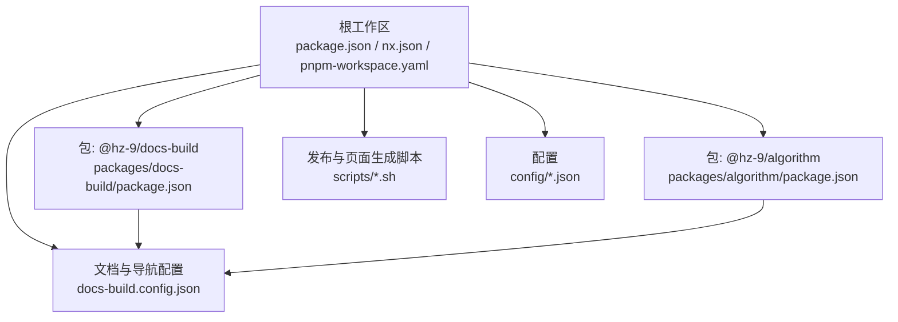
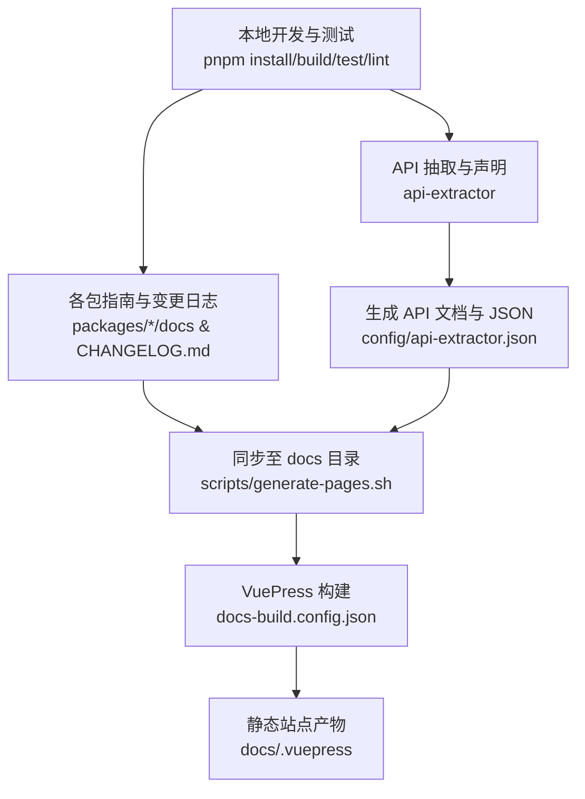
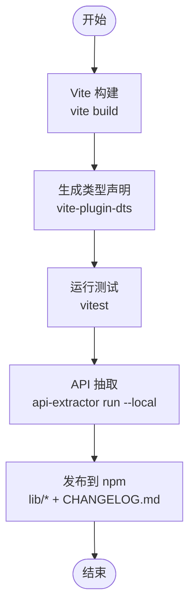
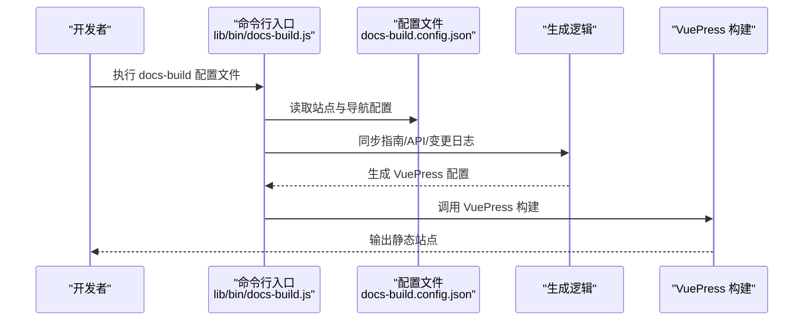
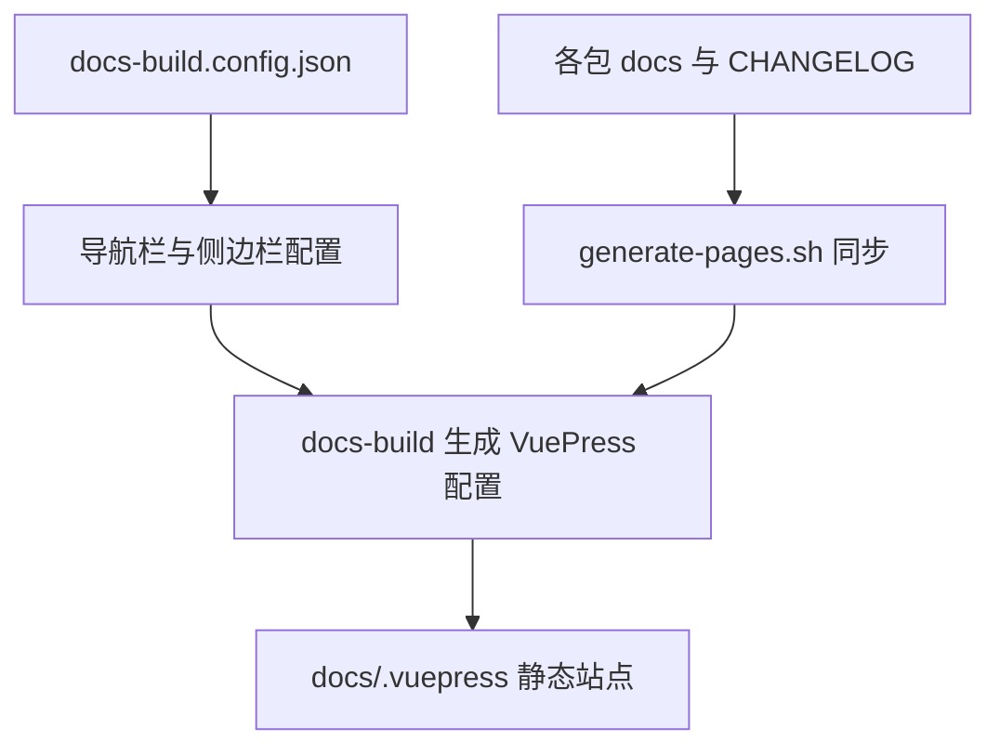
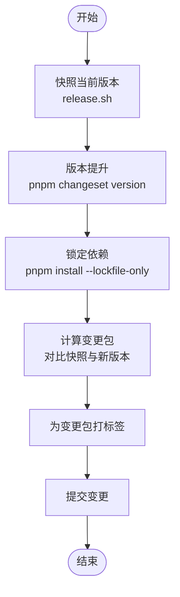
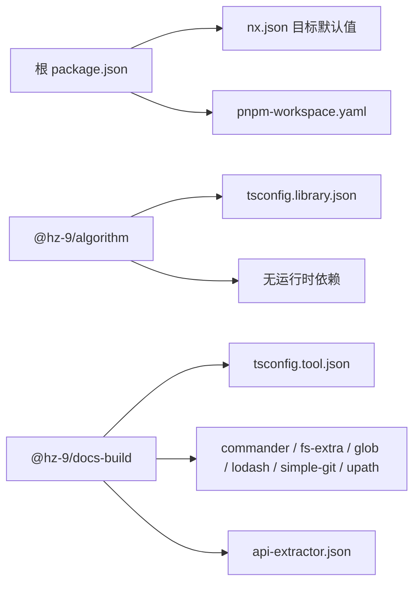

# 项目概览

<cite>
**本文引用的文件**
- [package.json](file://package.json)
- [nx.json](file://nx.json)
- [pnpm-workspace.yaml](file://pnpm-workspace.yaml)
- [README.md](file://README.md)
- [docs/README.md](file://docs/README.md)
- [docs/README.zh-CN.md](file://docs/README.zh-CN.md)
- [docs/overview/README.md](file://docs/overview/README.md)
- [docs/overview/README.zh-CN.md](file://docs/overview/README.zh-CN.md)
- [docs/overview/to-developer.md](file://docs/overview/to-developer.md)
- [packages/algorithm/package.json](file://packages/algorithm/package.json)
- [packages/docs-build/package.json](file://packages/docs-build/package.json)
- [docs-build.config.json](file://docs-build.config.json)
- [config/tsconfig.library.json](file://config/tsconfig.library.json)
- [config/tsconfig.tool.json](file://config/tsconfig.tool.json)
- [config/api-extractor.json](file://config/api-extractor.json)
- [scripts/generate-pages.sh](file://scripts/generate-pages.sh)
- [scripts/release.sh](file://scripts/release.sh)
</cite>

## 目录
1. [简介](#简介)
2. [项目结构](#项目结构)
3. [核心组件](#核心组件)
4. [架构总览](#架构总览)
5. [详细组件分析](#详细组件分析)
6. [依赖关系分析](#依赖关系分析)
7. [性能考虑](#性能考虑)
8. [故障排查指南](#故障排查指南)
9. [结论](#结论)
10. [附录](#附录)

## 简介
HZ 9 Tool 是一个基于 Nx 工作区的 monorepo，采用 pnpm 进行包管理，目标是提供一组高质量的 Node.js 工具库与文档构建能力。项目包含两大核心包：
- @hz-9/algorithm：JavaScript 算法与数据结构基础库，覆盖常见排序、搜索与多种数据结构。
- @hz-9/docs-build：从 Markdown 文档自动生成 vuepress-theme-hope 文档站点的工具。

项目通过 Nx 统一管理构建、测试、类型声明与发布流程，并结合 Changesets 实现版本与变更日志管理；文档侧通过 docs-build 将各包的指南、API 与更新日志聚合到统一的 VuePress 站点中。

## 项目结构
仓库采用标准的 Nx monorepo 结构，根目录包含工作区配置、脚本与文档；核心包位于 packages 目录下，文档配置位于 docs-build.config.json，类型与 API 抽取配置位于 config 目录。

图表来源
- [package.json:1-42](file://package.json#L1-L42)
- [nx.json:1-32](file://nx.json#L1-L32)
- [pnpm-workspace.yaml:1-3](file://pnpm-workspace.yaml#L1-L3)
- [packages/algorithm/package.json:1-46](file://packages/algorithm/package.json#L1-L46)
- [packages/docs-build/package.json:1-64](file://packages/docs-build/package.json#L1-L64)
- [docs-build.config.json:1-184](file://docs-build.config.json#L1-L184)
- [scripts/generate-pages.sh:1-76](file://scripts/generate-pages.sh#L1-L76)
- [scripts/release.sh:1-73](file://scripts/release.sh#L1-L73)

章节来源
- [package.json:1-42](file://package.json#L1-L42)
- [nx.json:1-32](file://nx.json#L1-L32)
- [pnpm-workspace.yaml:1-3](file://pnpm-workspace.yaml#L1-L3)
- [README.md:1-53](file://README.md#L1-L53)
- [docs/README.md:1-31](file://docs/README.md#L1-L31)
- [docs/README.zh-CN.md:1-31](file://docs/README.zh-CN.md#L1-L31)

## 核心组件
- @hz-9/algorithm：提供基础算法与数据结构实现，适合作为教学与工程实践的参考库。
- @hz-9/docs-build：扫描 Markdown 并生成 VuePress 主题站点，支持多语言、自动 Git 仓库识别与自定义样式，内置命令行入口。
- 文档与导航：通过 docs-build.config.json 统一配置站点基础信息、语言、导航栏与侧边栏，实现跨包内容聚合。

章节来源
- [packages/algorithm/package.json:1-46](file://packages/algorithm/package.json#L1-L46)
- [packages/docs-build/package.json:1-64](file://packages/docs-build/package.json#L1-L64)
- [docs-build.config.json:1-184](file://docs-build.config.json#L1-L184)

## 架构总览
下图展示了从本地开发到文档站点发布的端到端流程：本地开发与测试、API 声明生成、文档内容同步、VuePress 构建与页面生成脚本执行。

图表来源
- [scripts/generate-pages.sh:1-76](file://scripts/generate-pages.sh#L1-L76)
- [config/api-extractor.json:1-52](file://config/api-extractor.json#L1-L52)
- [docs-build.config.json:1-184](file://docs-build.config.json#L1-L184)

## 详细组件分析

### @hz-9/algorithm 组件
- 角色定位：算法与数据结构基础库，覆盖排序、搜索与多种数据结构。
- 技术要点：使用 Vite 构建、TypeScript 类型声明、Vitest 测试；通过 api-extractor 生成 API 报告与声明文件。
- 输出形态：lib 目录下的构建产物与类型声明，支持 npm 发布。

图表来源
- [packages/algorithm/package.json:25-31](file://packages/algorithm/package.json#L25-L31)

章节来源
- [packages/algorithm/package.json:1-46](file://packages/algorithm/package.json#L1-L46)

### @hz-9/docs-build 组件
- 角色定位：将 Markdown 文档转换为 VuePress 主题站点的工具，提供命令行入口与模板系统。
- 技术要点：依赖 commander 解析 CLI、fs-extra 与 glob 处理文件、simple-git 与 git-url-parse 获取仓库信息、lodash 与 upath 辅助处理路径。
- 输出形态：可执行命令 docs-build，生成 VuePress 配置与站点产物。

图表来源
- [packages/docs-build/package.json:23-25](file://packages/docs-build/package.json#L23-L25)
- [docs-build.config.json:1-184](file://docs-build.config.json#L1-L184)
- [scripts/generate-pages.sh:74-74](file://scripts/generate-pages.sh#L74-L74)

章节来源
- [packages/docs-build/package.json:1-64](file://packages/docs-build/package.json#L1-L64)
- [docs-build.config.json:1-184](file://docs-build.config.json#L1-L184)

### 文档与导航配置
- 站点基础信息：标题、描述、语言与基础路径。
- 导航与侧边栏：多语言支持，按模块划分“概览”“指南”“更新日志”“API”等区域。
- 内容聚合：通过 generate-pages.sh 将各包的指南、API 与变更日志同步到 docs 目录，再由 docs-build 生成站点。

图表来源
- [docs-build.config.json:1-184](file://docs-build.config.json#L1-L184)
- [scripts/generate-pages.sh:25-70](file://scripts/generate-pages.sh#L25-L70)

章节来源
- [docs-build.config.json:1-184](file://docs-build.config.json#L1-L184)
- [scripts/generate-pages.sh:1-76](file://scripts/generate-pages.sh#L1-L76)

### 版本与发布流水线
- Changesets：用于版本号提升与变更日志生成。
- release.sh：记录当前版本、执行版本提升、锁定依赖、打标签、准备提交与推送（脚本中已注释发布与推送步骤）。
- 产物：每个包独立打 tag，便于精确发布。

图表来源
- [scripts/release.sh:1-73](file://scripts/release.sh#L1-L73)

章节来源
- [scripts/release.sh:1-73](file://scripts/release.sh#L1-L73)

## 依赖关系分析
- 工作区与包管理：pnpm-workspace.yaml 指定 packages/* 为工作区范围；package.json 定义 Nx、ESLint、Prettier、Changesets 等开发工具。
- Nx 目标默认值：统一构建、测试、lint 与 API 报告的输入输出与缓存策略，确保增量构建与受影响项目检测。
- 包内依赖：docs-build 使用 commander、fs-extra、glob、lodash、simple-git、upath 等；algorithm 无运行时依赖，专注算法实现。
- 类型与 API：tsconfig.library.json/tsconfig.tool.json 统一 TypeScript 编译选项；api-extractor.json 控制 API 报告与声明生成。

图表来源
- [package.json:17-36](file://package.json#L17-L36)
- [nx.json:7-25](file://nx.json#L7-L25)
- [pnpm-workspace.yaml:1-3](file://pnpm-workspace.yaml#L1-L3)
- [config/tsconfig.library.json:1-27](file://config/tsconfig.library.json#L1-L27)
- [config/tsconfig.tool.json:1-27](file://config/tsconfig.tool.json#L1-L27)
- [config/api-extractor.json:1-52](file://config/api-extractor.json#L1-L52)
- [packages/algorithm/package.json:32-38](file://packages/algorithm/package.json#L32-L38)
- [packages/docs-build/package.json:37-45](file://packages/docs-build/package.json#L37-L45)

章节来源
- [package.json:1-42](file://package.json#L1-L42)
- [nx.json:1-32](file://nx.json#L1-L32)
- [pnpm-workspace.yaml:1-3](file://pnpm-workspace.yaml#L1-L3)
- [config/tsconfig.library.json:1-27](file://config/tsconfig.library.json#L1-L27)
- [config/tsconfig.tool.json:1-27](file://config/tsconfig.tool.json#L1-L27)
- [config/api-extractor.json:1-52](file://config/api-extractor.json#L1-L52)

## 性能考虑
- 增量构建与缓存：Nx targetDefaults 对 build/test/api-report/lint 设置了缓存与输入输出，减少重复工作。
- 受影响项目检测：通过 affected 命令仅对变更相关项目执行 lint 等任务，缩短开发循环。
- 类型与声明：统一的 tsconfig 与 api-extractor 避免类型冲突，提升 IDE 体验与构建稳定性。
- 文档生成：generate-pages.sh 在本地先执行格式化、检查、构建、测试与 API 报告，再进行内容同步与站点构建，避免无效重跑。

章节来源
- [nx.json:7-25](file://nx.json#L7-L25)
- [README.md:34-35](file://README.md#L34-L35)
- [scripts/generate-pages.sh:12-16](file://scripts/generate-pages.sh#L12-L16)

## 故障排查指南
- Node 版本不匹配
  - 现象：安装或运行时报错。
  - 排查：检查根 package.json 的 engines 字段与当前 Node 版本是否满足范围；algorithm 的 engines 要求较低版本，docs-build 要求较新版本。
  - 参考
    - [package.json 引擎要求:37-39](file://package.json#L37-L39)
    - [packages/algorithm/package.json 引擎要求:39-41](file://packages/algorithm/package.json#L39-L41)
    - [packages/docs-build/package.json 引擎要求:57-59](file://packages/docs-build/package.json#L57-L59)
- 构建失败
  - 现象：vite 构建或 api-extractor 报错。
  - 排查：确认 TypeScript 版本与配置一致；检查 api-extractor 的入口与输出路径；查看包内脚本是否正确。
  - 参考
    - [config/api-extractor.json:4-25](file://config/api-extractor.json#L4-L25)
    - [packages/algorithm/package.json 脚本:25-31](file://packages/algorithm/package.json#L25-L31)
    - [packages/docs-build/package.json 脚本:31-36](file://packages/docs-build/package.json#L31-L36)
- 文档未更新
  - 现象：docs/.vuepress 未反映最新内容。
  - 排查：执行 generate-pages.sh 同步指南/API/变更日志；确认 docs-build.config.json 导航与输出路径；重新运行 docs-build。
  - 参考
    - [scripts/generate-pages.sh:25-74](file://scripts/generate-pages.sh#L25-L74)
    - [docs-build.config.json:2-13](file://docs-build.config.json#L2-L13)
- 发布问题
  - 现象：版本提升后未发布或标签缺失。
  - 排查：执行 release.sh 完整流程；确认 Changesets 步骤已完成；检查注释掉的发布与推送步骤。
  - 参考
    - [scripts/release.sh:22-68](file://scripts/release.sh#L22-L68)

章节来源
- [package.json:37-39](file://package.json#L37-L39)
- [packages/algorithm/package.json:39-41](file://packages/algorithm/package.json#L39-L41)
- [packages/docs-build/package.json:57-59](file://packages/docs-build/package.json#L57-L59)
- [config/api-extractor.json:4-25](file://config/api-extractor.json#L4-L25)
- [scripts/generate-pages.sh:25-74](file://scripts/generate-pages.sh#L25-L74)
- [docs-build.config.json:2-13](file://docs-build.config.json#L2-L13)
- [scripts/release.sh:22-68](file://scripts/release.sh#L22-L68)

## 结论
HZ 9 Tool 以 Nx 与 pnpm 为核心，构建了清晰的 monorepo 工作流：算法库专注于实现与测试，文档工具负责内容聚合与站点生成。通过统一的类型与 API 抽取配置，以及完善的脚本与发布流程，项目在可维护性与可扩展性上具备良好基础。建议在团队协作中遵循 Changesets 与 affected 命令，持续优化文档与示例，提升使用者体验。

## 附录

### 快速开始
- 环境要求
  - Node.js 版本需满足根工作区与各包的 engines 要求。
  - 参考
    - [package.json 引擎要求:37-39](file://package.json#L37-L39)
    - [packages/algorithm/package.json 引擎要求:39-41](file://packages/algorithm/package.json#L39-L41)
    - [packages/docs-build/package.json 引擎要求:57-59](file://packages/docs-build/package.json#L57-L59)
- 安装与构建
  - 安装依赖、构建、测试、代码检查、生成 API 报告、格式化与查看依赖图。
  - 参考
    - [README.md 快速开始:7-32](file://README.md#L7-L32)
    - [docs/README.md 快速开始:16-30](file://docs/README.md#L16-L30)
- 文档生成
  - 同步指南/API/变更日志并生成 VuePress 站点。
  - 参考
    - [scripts/generate-pages.sh:1-76](file://scripts/generate-pages.sh#L1-L76)
    - [docs-build.config.json:1-184](file://docs-build.config.json#L1-L184)

### 设计理念与技术栈
- 技术栈
  - 开发工具：Nx、ESLint、Prettier、Changesets、Vite、TypeScript。
  - 文档工具：VuePress + vuepress-theme-hope，配合 docs-build。
- 设计原则
  - 单包职责单一：算法库专注实现，文档工具专注生成。
  - 可观测性：通过 API 抽取与 affected 命令提升可见性。
  - 可复用性：统一的 tsconfig 与插件配置降低重复成本。

章节来源
- [README.md:7-32](file://README.md#L7-L32)
- [docs/README.md:16-30](file://docs/README.md#L16-L30)
- [docs/overview/README.md:1-21](file://docs/overview/README.md#L1-L21)
- [docs/overview/README.zh-CN.md:1-21](file://docs/overview/README.zh-CN.md#L1-L21)
- [docs/overview/to-developer.md:11-26](file://docs/overview/to-developer.md#L11-L26)